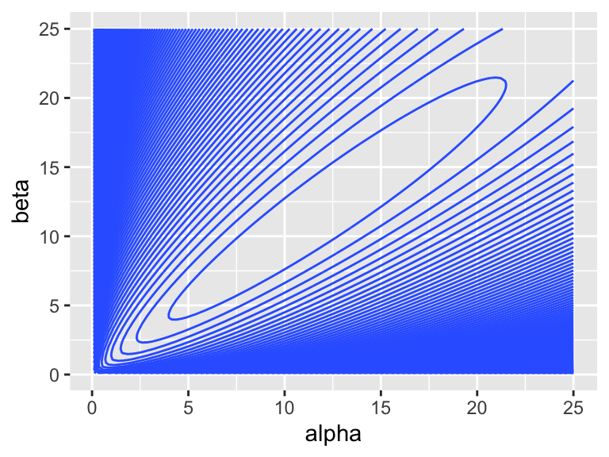

---
output:
  pdf_document: default
  html_document: default
---


As I see it, "regression modeling" in political science is a several-step process:

You begin with a substantive understanding of the way the world works.

1. Choose a regression model. I introduce many.
1. Fit a regression model. Maximum likelihood and Markov chain Monte Carlo methods are powerful and general.
1. Evaluate the fit. What are the properties of the procedure? How well does the model match the data?
1. Interpret the model. I emphasize quantities of interest and confidence intervals, but also discuss hypothesis tests.

You then update your understanding of the world.

This week, I introduce our first "engine": maximum likelihood. As a starting point, we use ML to estimate the parameters of Bernoulli, Poisson, and beta distributions (without covariates). I introduce the parametric bootstrap as a tool to obtain confidence intervals. I introduce the invariance property and show how we can use the invariance property to transform the estimated parameters into other quantities of interest. To evaluate the models, we use the predictive distribution.

## Maximum Likelihood

Suppose we have a random sample from a distribution $f(x; \theta)$. We find the maximum likelihood (ML) estimator $\hat{\theta}$ of $\theta$ by maximizing the likelihood of the observed data with respect to $\theta$.

In short, we take the likelihood of the data (given the model and a particular $\theta$) and find the parameter $\theta$ that maximizes it. 

In practice, to make the math and/or computation a bit easier, we manipulate the likelihood function in two ways:

1. Relabel the likelihood function $f(x; \theta) = L(\theta)$, since it's weird to maximize with respect to a "conditioning variable"fixed" variable. (The notation $f(x; \theta)$ suggests $x$ varies for a particular $\theta$.)
1. Work with $\log L(\theta)$ rather than $L(\theta)$. Because $\log()$ is a monotonically increasing function, the $\theta$ that maximizes $L(\theta)$ also maximizes $\log L(\theta)$. 

Suppose we have samples $x_1, x_2, ..., x_N$ from $f(x; \theta)$. Then the joint density/probability is $f(x; \theta) = \prod_{n = 1}^N f(x_n; \theta)$ and $\log L(\theta) = \sum_{n = 1}^N \log \left[ f(x_n; \theta) \right]$. The ML estimator $\hat{\theta}$ of $\theta$ is $\arg \max \log L(\theta)$.

In applied problems, we might be able to simplify $\log L$ substantially. Occasionally, we can find a nice analytical maximum. In many cases, we have a computer find the parameter that maximizes $\log L$.

### Example: Bernoulli Distribution

As a running example, we use the **toothpaste cap problem**:

> We have a toothpaste cap--one with a wide bottom and a narrow top. We're going to toss the toothpaste cap. It can either end up lying on its side, its (wide) bottom, or its (narrow) top. 

> We want to estimate the probability of the toothpaste cap landing on its top.

> We can model each toss as a Bernoulli trial, thinking of each toss as a random variable $X$ where $X \sim \text{Bernoulli}(\pi)$. If the cap lands on its top, we think of the outcome as 1. If not, as 0. 

Suppose we toss the cap $N$ times and observe $k$ tops. What is the ML estimate $\hat{\pi}$ of $\pi$?

According to the model $f(x_i; \pi) = \pi^{x_i} (1 - \pi)^{(1 - x_i)}$. Because the samples are iid, we can find the *joint* distribution $f(x) = f(x_1) \times ... \times f(x_N) = \prod_{i = 1}^N f(x_i)$. We're just multiplying $k$ $\pi$s (i.e., each of the $k$ ones has probability $\pi$) and $(N - k)$ $(1 - \pi)$s (i.e., each of the $N - k$ zeros has probability $1 - \pi$), so that the $f(x; \pi) = \pi^{k} (1 - \pi)^{(N - k)}$.
$$
\text{the likelihood:  } f(x; \pi) =  \pi^{k} (1 - \pi)^{(N - k)}, \text{where } k = \sum_{n = 1}^N x_n \\
$$
Then, we relabel. 
$$
\text{the likelihood:  } L(\pi) = \pi^{k} (1 - \pi)^{(N - k)}\\
$$
Then, we take the log and simplify. 
$$
\text{the log-likelihood:  } \log L(\pi) = k \log (\pi) + (N - k) \log(1 - \pi)\\
$$
To find the ML estimator, we find $\hat{\pi}$ that maximizes $\log L$. 

The code below plots the log-likelihood function using the 8/150 data.


```r
pi <- seq(0.01, 0.99, length.out = 1000)
data <- tibble(pi = pi) %>%
  mutate(log_lik = 18*log(pi) + (150 - 8)*log(1 - pi))
ggplot(data, aes(x = pi, y = log_lik)) + 
  geom_vline(xintercept = 8/150, color = "green") + 
  geom_line() + 
  theme_minimal()
```


In this case, the analytical optimum is easy.

$$
\begin{aligned}
\frac{d \log L}{d\hat{\pi}} = k \left( \frac{1}{\hat{\pi}}\right) + (N - k) \left( \frac{1}{1 - \hat{\pi}}\right)(-1) &= 0\\
\frac{k}{\hat{\pi}} - \frac{N - y}{1 - \hat{\pi}} &= 0 \\
\frac{k}{\hat{\pi}} &= \frac{N - y}{1 - \hat{\pi}} \\
k(1 - \hat{\pi}) &= (N - y)\hat{\pi} \\
k - y\hat{\pi} &= N\hat{\pi} - y\hat{\pi} \\
k  &= N\hat{\pi} \\
\hat{\pi} &= \frac{k}{N} = \text{avg}(x)\\
\end{aligned}
$$
The ML estimator of $\pi$ is the average of the $N$ Bernoulli trials, or, equivalently, the fraction of successes. 

The collected data consist of 150 trials and 8 successes, so the ML estimate of $\pi$ is $\frac{8}{150} \approx 0.053$.

### Example: Poisson Distribution

Suppose we collect $N$ random samples $x = \{x_1, x_2, ..., x_N\}$ and model each draw as a random variable $X \sim \text{Poisson}(\lambda)$. Find the ML estimator of $\lambda$.

$$
\begin{aligned}
\text{Poisson likelihood: } f(x; \lambda) &= \prod_{n = 1}^N \frac{\lambda^{x_n} e^{-\lambda}}{x_n!} \\
L(\lambda) &= \prod_{n = 1}^N \frac{\lambda^{x_n} e^{-\lambda}}{x_n!} \\
\log L(\lambda) &= \sum_{n = 1}^N \log \left[ \frac{\lambda^{x_n} e^{-\lambda}}{x_n!} \right]\\
&= \sum_{n = 1}^N \left[ x_n \log \lambda + (-\lambda) \log e - \log x_n! \right]\\
&= \log \lambda \left[ \sum_{n = 1}^N x_n \right]  -N\lambda + \sum_{n = 1}^N \log (x_n!) \\
\end{aligned}
$$

To find the ML estimator, we find $\hat{\lambda}$ that maximizes $\log L$. In this case, the analytical optimum is easy.

$$
\begin{aligned}
\frac{d \log L}{d\hat{\lambda}} = \frac{1}{\hat{\lambda}} \left[ \sum_{n = 1}^N x_n \right] - N &= 0\\
\frac{1}{\hat{\lambda}} \left[ \sum_{n = 1}^N x_n \right] &= N \\
\left[ \sum_{n = 1}^N x_n \right] &= N \hat{\lambda} \\
\hat{\lambda} &= \frac{ \sum_{n = 1}^N x_n }{N} = \text{avg}(x)  \\
\end{aligned}
$$
The ML estimator for the Poisson distribution is just the average of the samples. 

### Remarks

The ML estimator is extremely common in political science because they are general, fast, and work extremely well. Lots of models that you've heard of, such as logistic regression, are estimated with ML.

We can even obtain ML estimates for the linear regression model. We assume that the observed data are samples from a normal distribution with mean $\mu_n = \alpha + \beta x_n$ and variance $\sigma^2$. For this model, the least-squares estimate that we learned earlier is also the ML estimate. 

### Example: Beta Distribution

Questions:

1.  What is the \textit{support} of the beta distribution? $[0, 1]$
1. Is $y$ a discrete random variable or a continuous random variable? Continuous.
1. What is the pdf/pmf? $f(y_i; \alpha, \beta) = \dfrac{y_i^{\alpha - 1}(1 - y_i)^{\beta - 1}}{B(\alpha, \beta)}$, where $B(\alpha, \beta) = \displaystyle \int_0^1 t^{\alpha - 1}(1 - t)^{\beta - 1}dt$.

With the beta distribution, we add two complications that typically occur when using ML.

1. multiple parameters
1. an intractable log-likelihood

Start with the probability model $Y_i \sim f(y_i; \theta)$. In the case of the beta model, we have $Y_i \sim \text{beta}(y_i; \alpha, \beta)$. The $\alpha$ and $\beta$ here don't have a convenient interpretation. They are "shape" parameters. You can think of $\alpha$ as pushing the distribution to the right and $\beta$ as pushing the distribution to the left.


```r
alphas <- c(0.8, 1, 2, 5, 25)
betas <- c(0.8, 1, 2, 5, 25)

x <- seq(0, 1, length.out = 100)

pdfs <- crossing(alpha = alphas, 
                 beta = betas, 
                 x = x) %>%
  mutate(pdf = dbeta(x, alpha, beta)) %>%
  mutate(alpha_lbl = paste0("alpha == ", alpha),
         beta_lbl = paste0("beta == ", beta)) 

ggplot(pdfs, aes(x = x, y = pdf)) + 
  facet_grid(rows = vars(beta_lbl), cols = vars(alpha_lbl), 
             labeller = "label_parsed", scales = "free") + 
  geom_line()
```


We now have two parameters to estimate and we're going to assume that we have multiple observations, so that $y = [y_1, y_2, ,..., y_n]$.

In general, this is how we do ML:

**Step 1** Write down the likelihood function. Recall that we can obtain the joint density of $y_1$ AND $y_2$ AND ... AND $y_n$ by multiplying the probabilities of each (assuming independence).
$$
\begin{aligned}
L(\alpha, \beta) = \displaystyle\prod_{i = 1}^n \overbrace{f(y_i;\alpha, \beta)}^{\text{density}} = \displaystyle\prod_{i = 1}^n \dfrac{y_i^{\alpha - 1}(1 - y_i)^{\beta - 1}}{B(\alpha, \beta)}
\end{aligned}
$$
We see again, as will be usual, that we have this complicated product that will make our lives difficult.

**Step 2** Take the log and simplify.
$$
\begin{aligned}
L(\alpha, \beta) &= \displaystyle\prod_{i = 1}^n \dfrac{y_i^{\alpha - 1}(1 - y_i)^{\beta - 1}}{B(\alpha, \beta)}\\
\log L(\alpha, \beta) &= \displaystyle\sum_{i = 1}^n \log \dfrac{y_i^{\alpha - 1}(1 - y_i)^{\beta - 1}}{B(\alpha, \beta)}\\
&= \displaystyle\sum_{i = 1}^n \left[ \log y_i^{\alpha - 1} + \log (1 - y_i)^{\beta - 1} - \log B(\alpha, \beta)\right]\\
&= \displaystyle\sum_{i = 1}^n \left[ (\alpha - 1)\log y_i + (\beta - 1)\log (1 - y_i) - \log B(\alpha, \beta)\right]\\
&= \displaystyle\sum_{i = 1}^n \left[ (\alpha - 1)\log y_i + (\beta - 1)\log (1 - y_i)\right] - n \log B(\alpha, \beta)\\
\log L(\alpha, \beta) &= (\alpha - 1) \sum_{i = 1}^n \log y_i + (\beta - 1) \sum_{i = 1}^n \log (1 - y_i) - n \log B(\alpha, \beta)
\end{aligned}
$$
**Step 3** Maximize

If we wanted, we could work on this one analytically. 

1. Take the derivative w.r.t. $\alpha$.
1. Take the derivative w.r.t. $\beta$.
1. Set both equal to zero and solve. (Two equations and two unknowns.)

But the last term $B(\alpha, \beta) = \int_0^1 t^{\alpha - 1}(1 - t)^{\beta - 1}dt$ is tricky! So let's do it numerically.

To perform the optimization, we need a data set. For now, let's simulate a fake data set with known parameters


```r
y <- rbeta(1000, shape1 = 10, shape2 = 10)
```

Let's plot the log-likelihood function to see what we're dealing with.


```r
library(plotly)

alpha <- seq(0.1, 25, length.out = 100)
beta  <- seq(0.1, 25, length.out = 100)
data <- crossing(alpha, beta) %>%
  mutate(log_lik = alpha*sum(log(y)) + beta*sum(log(1 - y)) - 
           length(y)*log(beta(alpha, beta)))

plot_ly(x = ~alpha, y = ~beta, z = ~log_lik, data = data) %>%
  add_mesh(labels = c("alpha", "beta", "log-likelihood"))
```

```{=html}
<div id="htmlwidget-83c8ae35c2da7d21f229" style="width:672px;height:480px;" class="plotly html-widget"></div>
<script type="application/json" data-for="htmlwidget-83c8ae35c2da7d21f229">{"x":{"visdat":{"41a056797615":["function () ","plotlyVisDat"]},"cur_data":"41a056797615","attrs":{"41a056797615":{"x":{},"y":{},"z":{},"alpha_stroke":1,"sizes":[10,100],"spans":[1,20],"type":"mesh3d","labels":["alpha","beta","log-likelihood"],"inherit":true}},"layout":{"margin":{"b":40,"l":60,"t":25,"r":10},"scene":{"xaxis":{"title":"alpha"},"yaxis":{"title":"beta"},"zaxis":{"title":"log_lik"}},"hovermode":"closest","showlegend":false,"legend":{"yanchor":"top","y":0.5}},"source":"A","config":{"modeBarButtonsToAdd":["hoverclosest","hovercompare"],"showSendToCloud":false},"data":[{"colorbar":{"title":"log_lik","ticklen":2,"len":0.5,"lenmode":"fraction","y":1,"yanchor":"top"},"colorscale":[["0","rgba(68,1,84,1)"],["0.0416666666666667","rgba(70,19,97,1)"],["0.0833333333333334","rgba(72,32,111,1)"],["0.125","rgba(71,45,122,1)"],["0.166666666666667","rgba(68,58,128,1)"],["0.208333333333333","rgba(64,70,135,1)"],["0.25","rgba(60,82,138,1)"],["0.291666666666667","rgba(56,93,140,1)"],["0.333333333333333","rgba(49,104,142,1)"],["0.375","rgba(46,114,142,1)"],["0.416666666666667","rgba(42,123,142,1)"],["0.458333333333333","rgba(38,133,141,1)"],["0.5","rgba(37,144,140,1)"],["0.541666666666667","rgba(33,154,138,1)"],["0.583333333333333","rgba(39,164,133,1)"],["0.625","rgba(47,174,127,1)"],["0.666666666666667","rgba(53,183,121,1)"],["0.708333333333333","rgba(79,191,110,1)"],["0.75","rgba(98,199,98,1)"],["0.791666666666667","rgba(119,207,85,1)"],["0.833333333333333","rgba(147,214,70,1)"],["0.875","rgba(172,220,52,1)"],["0.916666666666667","rgba(199,225,42,1)"],["0.958333333333333","rgba(226,228,40,1)"],["1","rgba(253,231,37,1)"]],"showscale":true,"x":[0.1,0.1,0.1,0.1,0.1,0.1,0.1,0.1,0.1,0.1,0.1,0.1,0.1,0.1,0.1,0.1,0.1,0.1,0.1,0.1,0.1,0.1,0.1,0.1,0.1,0.1,0.1,0.1,0.1,0.1,0.1,0.1,0.1,0.1,0.1,0.1,0.1,0.1,0.1,0.1,0.1,0.1,0.1,0.1,0.1,0.1,0.1,0.1,0.1,0.1,0.1,0.1,0.1,0.1,0.1,0.1,0.1,0.1,0.1,0.1,0.1,0.1,0.1,0.1,0.1,0.1,0.1,0.1,0.1,0.1,0.1,0.1,0.1,0.1,0.1,0.1,0.1,0.1,0.1,0.1,0.1,0.1,0.1,0.1,0.1,0.1,0.1,0.1,0.1,0.1,0.1,0.1,0.1,0.1,0.1,0.1,0.1,0.1,0.1,0.1,0.351515151515152,0.351515151515152,0.351515151515152,0.351515151515152,0.351515151515152,0.351515151515152,0.351515151515152,0.351515151515152,0.351515151515152,0.351515151515152,0.351515151515152,0.351515151515152,0.351515151515152,0.351515151515152,0.351515151515152,0.351515151515152,0.351515151515152,0.351515151515152,0.351515151515152,0.351515151515152,0.351515151515152,0.351515151515152,0.351515151515152,0.351515151515152,0.351515151515152,0.351515151515152,0.351515151515152,0.351515151515152,0.351515151515152,0.351515151515152,0.351515151515152,0.351515151515152,0.351515151515152,0.351515151515152,0.351515151515152,0.351515151515152,0.351515151515152,0.351515151515152,0.351515151515152,0.351515151515152,0.351515151515152,0.351515151515152,0.351515151515152,0.351515151515152,0.351515151515152,0.351515151515152,0.351515151515152,0.351515151515152,0.351515151515152,0.351515151515152,0.351515151515152,0.351515151515152,0.351515151515152,0.351515151515152,0.351515151515152,0.351515151515152,0.351515151515152,0.351515151515152,0.351515151515152,0.351515151515152,0.351515151515152,0.351515151515152,0.351515151515152,0.351515151515152,0.351515151515152,0.351515151515152,0.351515151515152,0.351515151515152,0.351515151515152,0.351515151515152,0.351515151515152,0.351515151515152,0.351515151515152,0.351515151515152,0.351515151515152,0.351515151515152,0.351515151515152,0.351515151515152,0.351515151515152,0.351515151515152,0.351515151515152,0.351515151515152,0.351515151515152,0.351515151515152,0.351515151515152,0.351515151515152,0.351515151515152,0.351515151515152,0.351515151515152,0.351515151515152,0.351515151515152,0.351515151515152,0.351515151515152,0.351515151515152,0.351515151515152,0.351515151515152,0.351515151515152,0.351515151515152,0.351515151515152,0.351515151515152,0.603030303030303,0.603030303030303,0.603030303030303,0.603030303030303,0.603030303030303,0.603030303030303,0.603030303030303,0.603030303030303,0.603030303030303,0.603030303030303,0.603030303030303,0.603030303030303,0.603030303030303,0.603030303030303,0.603030303030303,0.603030303030303,0.603030303030303,0.603030303030303,0.603030303030303,0.603030303030303,0.603030303030303,0.603030303030303,0.603030303030303,0.603030303030303,0.603030303030303,0.603030303030303,0.603030303030303,0.603030303030303,0.603030303030303,0.603030303030303,0.603030303030303,0.603030303030303,0.603030303030303,0.603030303030303,0.603030303030303,0.603030303030303,0.603030303030303,0.603030303030303,0.603030303030303,0.603030303030303,0.603030303030303,0.603030303030303,0.603030303030303,0.603030303030303,0.603030303030303,0.603030303030303,0.603030303030303,0.603030303030303,0.603030303030303,0.603030303030303,0.603030303030303,0.603030303030303,0.603030303030303,0.603030303030303,0.603030303030303,0.603030303030303,0.603030303030303,0.603030303030303,0.603030303030303,0.603030303030303,0.603030303030303,0.603030303030303,0.603030303030303,0.603030303030303,0.603030303030303,0.603030303030303,0.603030303030303,0.603030303030303,0.603030303030303,0.603030303030303,0.603030303030303,0.603030303030303,0.603030303030303,0.603030303030303,0.603030303030303,0.603030303030303,0.603030303030303,0.603030303030303,0.603030303030303,0.603030303030303,0.603030303030303,0.603030303030303,0.603030303030303,0.603030303030303,0.603030303030303,0.603030303030303,0.603030303030303,0.603030303030303,0.603030303030303,0.603030303030303,0.603030303030303,0.603030303030303,0.603030303030303,0.603030303030303,0.603030303030303,0.603030303030303,0.603030303030303,0.603030303030303,0.603030303030303,0.603030303030303,0.854545454545455,0.854545454545455,0.854545454545455,0.854545454545455,0.854545454545455,0.854545454545455,0.854545454545455,0.854545454545455,0.854545454545455,0.854545454545455,0.854545454545455,0.854545454545455,0.854545454545455,0.854545454545455,0.854545454545455,0.854545454545455,0.854545454545455,0.854545454545455,0.854545454545455,0.854545454545455,0.854545454545455,0.854545454545455,0.854545454545455,0.854545454545455,0.854545454545455,0.854545454545455,0.854545454545455,0.854545454545455,0.854545454545455,0.854545454545455,0.854545454545455,0.854545454545455,0.854545454545455,0.854545454545455,0.854545454545455,0.854545454545455,0.854545454545455,0.854545454545455,0.854545454545455,0.854545454545455,0.854545454545455,0.854545454545455,0.854545454545455,0.854545454545455,0.854545454545455,0.854545454545455,0.854545454545455,0.854545454545455,0.854545454545455,0.854545454545455,0.854545454545455,0.854545454545455,0.854545454545455,0.854545454545455,0.854545454545455,0.854545454545455,0.854545454545455,0.854545454545455,0.854545454545455,0.854545454545455,0.854545454545455,0.854545454545455,0.854545454545455,0.854545454545455,0.854545454545455,0.854545454545455,0.854545454545455,0.854545454545455,0.854545454545455,0.854545454545455,0.854545454545455,0.854545454545455,0.854545454545455,0.854545454545455,0.854545454545455,0.854545454545455,0.854545454545455,0.854545454545455,0.854545454545455,0.854545454545455,0.854545454545455,0.854545454545455,0.854545454545455,0.854545454545455,0.854545454545455,0.854545454545455,0.854545454545455,0.854545454545455,0.854545454545455,0.854545454545455,0.854545454545455,0.854545454545455,0.854545454545455,0.854545454545455,0.854545454545455,0.854545454545455,0.854545454545455,0.854545454545455,0.854545454545455,0.854545454545455,1.10606060606061,1.10606060606061,1.10606060606061,1.10606060606061,1.10606060606061,1.10606060606061,1.10606060606061,1.10606060606061,1.10606060606061,1.10606060606061,1.10606060606061,1.10606060606061,1.10606060606061,1.10606060606061,1.10606060606061,1.10606060606061,1.10606060606061,1.10606060606061,1.10606060606061,1.10606060606061,1.10606060606061,1.10606060606061,1.10606060606061,1.10606060606061,1.10606060606061,1.10606060606061,1.10606060606061,1.10606060606061,1.10606060606061,1.10606060606061,1.10606060606061,1.10606060606061,1.10606060606061,1.10606060606061,1.10606060606061,1.10606060606061,1.10606060606061,1.10606060606061,1.10606060606061,1.10606060606061,1.10606060606061,1.10606060606061,1.10606060606061,1.10606060606061,1.10606060606061,1.10606060606061,1.10606060606061,1.10606060606061,1.10606060606061,1.10606060606061,1.10606060606061,1.10606060606061,1.10606060606061,1.10606060606061,1.10606060606061,1.10606060606061,1.10606060606061,1.10606060606061,1.10606060606061,1.10606060606061,1.10606060606061,1.10606060606061,1.10606060606061,1.10606060606061,1.10606060606061,1.10606060606061,1.10606060606061,1.10606060606061,1.10606060606061,1.10606060606061,1.10606060606061,1.10606060606061,1.10606060606061,1.10606060606061,1.10606060606061,1.10606060606061,1.10606060606061,1.10606060606061,1.10606060606061,1.10606060606061,1.10606060606061,1.10606060606061,1.10606060606061,1.10606060606061,1.10606060606061,1.10606060606061,1.10606060606061,1.10606060606061,1.10606060606061,1.10606060606061,1.10606060606061,1.10606060606061,1.10606060606061,1.10606060606061,1.10606060606061,1.10606060606061,1.10606060606061,1.10606060606061,1.10606060606061,1.10606060606061,1.35757575757576,1.35757575757576,1.35757575757576,1.35757575757576,1.35757575757576,1.35757575757576,1.35757575757576,1.35757575757576,1.35757575757576,1.35757575757576,1.35757575757576,1.35757575757576,1.35757575757576,1.35757575757576,1.35757575757576,1.35757575757576,1.35757575757576,1.35757575757576,1.35757575757576,1.35757575757576,1.35757575757576,1.35757575757576,1.35757575757576,1.35757575757576,1.35757575757576,1.35757575757576,1.35757575757576,1.35757575757576,1.35757575757576,1.35757575757576,1.35757575757576,1.35757575757576,1.35757575757576,1.35757575757576,1.35757575757576,1.35757575757576,1.35757575757576,1.35757575757576,1.35757575757576,1.35757575757576,1.35757575757576,1.35757575757576,1.35757575757576,1.35757575757576,1.35757575757576,1.35757575757576,1.35757575757576,1.35757575757576,1.35757575757576,1.35757575757576,1.35757575757576,1.35757575757576,1.35757575757576,1.35757575757576,1.35757575757576,1.35757575757576,1.35757575757576,1.35757575757576,1.35757575757576,1.35757575757576,1.35757575757576,1.35757575757576,1.35757575757576,1.35757575757576,1.35757575757576,1.35757575757576,1.35757575757576,1.35757575757576,1.35757575757576,1.35757575757576,1.35757575757576,1.35757575757576,1.35757575757576,1.35757575757576,1.35757575757576,1.35757575757576,1.35757575757576,1.35757575757576,1.35757575757576,1.35757575757576,1.35757575757576,1.35757575757576,1.35757575757576,1.35757575757576,1.35757575757576,1.35757575757576,1.35757575757576,1.35757575757576,1.35757575757576,1.35757575757576,1.35757575757576,1.35757575757576,1.35757575757576,1.35757575757576,1.35757575757576,1.35757575757576,1.35757575757576,1.35757575757576,1.35757575757576,1.35757575757576,1.60909090909091,1.60909090909091,1.60909090909091,1.60909090909091,1.60909090909091,1.60909090909091,1.60909090909091,1.60909090909091,1.60909090909091,1.60909090909091,1.60909090909091,1.60909090909091,1.60909090909091,1.60909090909091,1.60909090909091,1.60909090909091,1.60909090909091,1.60909090909091,1.60909090909091,1.60909090909091,1.60909090909091,1.60909090909091,1.60909090909091,1.60909090909091,1.60909090909091,1.60909090909091,1.60909090909091,1.60909090909091,1.60909090909091,1.60909090909091,1.60909090909091,1.60909090909091,1.60909090909091,1.60909090909091,1.60909090909091,1.60909090909091,1.60909090909091,1.60909090909091,1.60909090909091,1.60909090909091,1.60909090909091,1.60909090909091,1.60909090909091,1.60909090909091,1.60909090909091,1.60909090909091,1.60909090909091,1.60909090909091,1.60909090909091,1.60909090909091,1.60909090909091,1.60909090909091,1.60909090909091,1.60909090909091,1.60909090909091,1.60909090909091,1.60909090909091,1.60909090909091,1.60909090909091,1.60909090909091,1.60909090909091,1.60909090909091,1.60909090909091,1.60909090909091,1.60909090909091,1.60909090909091,1.60909090909091,1.60909090909091,1.60909090909091,1.60909090909091,1.60909090909091,1.60909090909091,1.60909090909091,1.60909090909091,1.60909090909091,1.60909090909091,1.60909090909091,1.60909090909091,1.60909090909091,1.60909090909091,1.60909090909091,1.60909090909091,1.60909090909091,1.60909090909091,1.60909090909091,1.60909090909091,1.60909090909091,1.60909090909091,1.60909090909091,1.60909090909091,1.60909090909091,1.60909090909091,1.60909090909091,1.60909090909091,1.60909090909091,1.60909090909091,1.60909090909091,1.60909090909091,1.60909090909091,1.60909090909091,1.86060606060606,1.86060606060606,1.86060606060606,1.86060606060606,1.86060606060606,1.86060606060606,1.86060606060606,1.86060606060606,1.86060606060606,1.86060606060606,1.86060606060606,1.86060606060606,1.86060606060606,1.86060606060606,1.86060606060606,1.86060606060606,1.86060606060606,1.86060606060606,1.86060606060606,1.86060606060606,1.86060606060606,1.86060606060606,1.86060606060606,1.86060606060606,1.86060606060606,1.86060606060606,1.86060606060606,1.86060606060606,1.86060606060606,1.86060606060606,1.86060606060606,1.86060606060606,1.86060606060606,1.86060606060606,1.86060606060606,1.86060606060606,1.86060606060606,1.86060606060606,1.86060606060606,1.86060606060606,1.86060606060606,1.86060606060606,1.86060606060606,1.86060606060606,1.86060606060606,1.86060606060606,1.86060606060606,1.86060606060606,1.86060606060606,1.86060606060606,1.86060606060606,1.86060606060606,1.86060606060606,1.86060606060606,1.86060606060606,1.86060606060606,1.86060606060606,1.86060606060606,1.86060606060606,1.86060606060606,1.86060606060606,1.86060606060606,1.86060606060606,1.86060606060606,1.86060606060606,1.86060606060606,1.86060606060606,1.86060606060606,1.86060606060606,1.86060606060606,1.86060606060606,1.86060606060606,1.86060606060606,1.86060606060606,1.86060606060606,1.86060606060606,1.86060606060606,1.86060606060606,1.86060606060606,1.86060606060606,1.86060606060606,1.86060606060606,1.86060606060606,1.86060606060606,1.86060606060606,1.86060606060606,1.86060606060606,1.86060606060606,1.86060606060606,1.86060606060606,1.86060606060606,1.86060606060606,1.86060606060606,1.86060606060606,1.86060606060606,1.86060606060606,1.86060606060606,1.86060606060606,1.86060606060606,1.86060606060606,2.11212121212121,2.11212121212121,2.11212121212121,2.11212121212121,2.11212121212121,2.11212121212121,2.11212121212121,2.11212121212121,2.11212121212121,2.11212121212121,2.11212121212121,2.11212121212121,2.11212121212121,2.11212121212121,2.11212121212121,2.11212121212121,2.11212121212121,2.11212121212121,2.11212121212121,2.11212121212121,2.11212121212121,2.11212121212121,2.11212121212121,2.11212121212121,2.11212121212121,2.11212121212121,2.11212121212121,2.11212121212121,2.11212121212121,2.11212121212121,2.11212121212121,2.11212121212121,2.11212121212121,2.11212121212121,2.11212121212121,2.11212121212121,2.11212121212121,2.11212121212121,2.11212121212121,2.11212121212121,2.11212121212121,2.11212121212121,2.11212121212121,2.11212121212121,2.11212121212121,2.11212121212121,2.11212121212121,2.11212121212121,2.11212121212121,2.11212121212121,2.11212121212121,2.11212121212121,2.11212121212121,2.11212121212121,2.11212121212121,2.11212121212121,2.11212121212121,2.11212121212121,2.11212121212121,2.11212121212121,2.11212121212121,2.11212121212121,2.11212121212121,2.11212121212121,2.11212121212121,2.11212121212121,2.11212121212121,2.11212121212121,2.11212121212121,2.11212121212121,2.11212121212121,2.11212121212121,2.11212121212121,2.11212121212121,2.11212121212121,2.11212121212121,2.11212121212121,2.11212121212121,2.11212121212121,2.11212121212121,2.11212121212121,2.11212121212121,2.11212121212121,2.11212121212121,2.11212121212121,2.11212121212121,2.11212121212121,2.11212121212121,2.11212121212121,2.11212121212121,2.11212121212121,2.11212121212121,2.11212121212121,2.11212121212121,2.11212121212121,2.11212121212121,2.11212121212121,2.11212121212121,2.11212121212121,2.11212121212121,2.36363636363636,2.36363636363636,2.36363636363636,2.36363636363636,2.36363636363636,2.36363636363636,2.36363636363636,2.36363636363636,2.36363636363636,2.36363636363636,2.36363636363636,2.36363636363636,2.36363636363636,2.36363636363636,2.36363636363636,2.36363636363636,2.36363636363636,2.36363636363636,2.36363636363636,2.36363636363636,2.36363636363636,2.36363636363636,2.36363636363636,2.36363636363636,2.36363636363636,2.36363636363636,2.36363636363636,2.36363636363636,2.36363636363636,2.36363636363636,2.36363636363636,2.36363636363636,2.36363636363636,2.36363636363636,2.36363636363636,2.36363636363636,2.36363636363636,2.36363636363636,2.36363636363636,2.36363636363636,2.36363636363636,2.36363636363636,2.36363636363636,2.36363636363636,2.36363636363636,2.36363636363636,2.36363636363636,2.36363636363636,2.36363636363636,2.36363636363636,2.36363636363636,2.36363636363636,2.36363636363636,2.36363636363636,2.36363636363636,2.36363636363636,2.36363636363636,2.36363636363636,2.36363636363636,2.36363636363636,2.36363636363636,2.36363636363636,2.36363636363636,2.36363636363636,2.36363636363636,2.36363636363636,2.36363636363636,2.36363636363636,2.36363636363636,2.36363636363636,2.36363636363636,2.36363636363636,2.36363636363636,2.36363636363636,2.36363636363636,2.36363636363636,2.36363636363636,2.36363636363636,2.36363636363636,2.36363636363636,2.36363636363636,2.36363636363636,2.36363636363636,2.36363636363636,2.36363636363636,2.36363636363636,2.36363636363636,2.36363636363636,2.36363636363636,2.36363636363636,2.36363636363636,2.36363636363636,2.36363636363636,2.36363636363636,2.36363636363636,2.36363636363636,2.36363636363636,2.36363636363636,2.36363636363636,2.36363636363636,2.61515151515152,2.61515151515152,2.61515151515152,2.61515151515152,2.61515151515152,2.61515151515152,2.61515151515152,2.61515151515152,2.61515151515152,2.61515151515152,2.61515151515152,2.61515151515152,2.61515151515152,2.61515151515152,2.61515151515152,2.61515151515152,2.61515151515152,2.61515151515152,2.61515151515152,2.61515151515152,2.61515151515152,2.61515151515152,2.61515151515152,2.61515151515152,2.61515151515152,2.61515151515152,2.61515151515152,2.61515151515152,2.61515151515152,2.61515151515152,2.61515151515152,2.61515151515152,2.61515151515152,2.61515151515152,2.61515151515152,2.61515151515152,2.61515151515152,2.61515151515152,2.61515151515152,2.61515151515152,2.61515151515152,2.61515151515152,2.61515151515152,2.61515151515152,2.61515151515152,2.61515151515152,2.61515151515152,2.61515151515152,2.61515151515152,2.61515151515152,2.61515151515152,2.61515151515152,2.61515151515152,2.61515151515152,2.61515151515152,2.61515151515152,2.61515151515152,2.61515151515152,2.61515151515152,2.61515151515152,2.61515151515152,2.61515151515152,2.61515151515152,2.61515151515152,2.61515151515152,2.61515151515152,2.61515151515152,2.61515151515152,2.61515151515152,2.61515151515152,2.61515151515152,2.61515151515152,2.61515151515152,2.61515151515152,2.61515151515152,2.61515151515152,2.61515151515152,2.61515151515152,2.61515151515152,2.61515151515152,2.61515151515152,2.61515151515152,2.61515151515152,2.61515151515152,2.61515151515152,2.61515151515152,2.61515151515152,2.61515151515152,2.61515151515152,2.61515151515152,2.61515151515152,2.61515151515152,2.61515151515152,2.61515151515152,2.61515151515152,2.61515151515152,2.61515151515152,2.61515151515152,2.61515151515152,2.61515151515152,2.86666666666667,2.86666666666667,2.86666666666667,2.86666666666667,2.86666666666667,2.86666666666667,2.86666666666667,2.86666666666667,2.86666666666667,2.86666666666667,2.86666666666667,2.86666666666667,2.86666666666667,2.86666666666667,2.86666666666667,2.86666666666667,2.86666666666667,2.86666666666667,2.86666666666667,2.86666666666667,2.86666666666667,2.86666666666667,2.86666666666667,2.86666666666667,2.86666666666667,2.86666666666667,2.86666666666667,2.86666666666667,2.86666666666667,2.86666666666667,2.86666666666667,2.86666666666667,2.86666666666667,2.86666666666667,2.86666666666667,2.86666666666667,2.86666666666667,2.86666666666667,2.86666666666667,2.86666666666667,2.86666666666667,2.86666666666667,2.86666666666667,2.86666666666667,2.86666666666667,2.86666666666667,2.86666666666667,2.86666666666667,2.86666666666667,2.86666666666667,2.86666666666667,2.86666666666667,2.86666666666667,2.86666666666667,2.86666666666667,2.86666666666667,2.86666666666667,2.86666666666667,2.86666666666667,2.86666666666667,2.86666666666667,2.86666666666667,2.86666666666667,2.86666666666667,2.86666666666667,2.86666666666667,2.86666666666667,2.86666666666667,2.86666666666667,2.86666666666667,2.86666666666667,2.86666666666667,2.86666666666667,2.86666666666667,2.86666666666667,2.86666666666667,2.86666666666667,2.86666666666667,2.86666666666667,2.86666666666667,2.86666666666667,2.86666666666667,2.86666666666667,2.86666666666667,2.86666666666667,2.86666666666667,2.86666666666667,2.86666666666667,2.86666666666667,2.86666666666667,2.86666666666667,2.86666666666667,2.86666666666667,2.86666666666667,2.86666666666667,2.86666666666667,2.86666666666667,2.86666666666667,2.86666666666667,2.86666666666667,3.11818181818182,3.11818181818182,3.11818181818182,3.11818181818182,3.11818181818182,3.11818181818182,3.11818181818182,3.11818181818182,3.11818181818182,3.11818181818182,3.11818181818182,3.11818181818182,3.11818181818182,3.11818181818182,3.11818181818182,3.11818181818182,3.11818181818182,3.11818181818182,3.11818181818182,3.11818181818182,3.11818181818182,3.11818181818182,3.11818181818182,3.11818181818182,3.11818181818182,3.11818181818182,3.11818181818182,3.11818181818182,3.11818181818182,3.11818181818182,3.11818181818182,3.11818181818182,3.11818181818182,3.11818181818182,3.11818181818182,3.11818181818182,3.11818181818182,3.11818181818182,3.11818181818182,3.11818181818182,3.11818181818182,3.11818181818182,3.11818181818182,3.11818181818182,3.11818181818182,3.11818181818182,3.11818181818182,3.11818181818182,3.11818181818182,3.11818181818182,3.11818181818182,3.11818181818182,3.11818181818182,3.11818181818182,3.11818181818182,3.11818181818182,3.11818181818182,3.11818181818182,3.11818181818182,3.11818181818182,3.11818181818182,3.11818181818182,3.11818181818182,3.11818181818182,3.11818181818182,3.11818181818182,3.11818181818182,3.11818181818182,3.11818181818182,3.11818181818182,3.11818181818182,3.11818181818182,3.11818181818182,3.11818181818182,3.11818181818182,3.11818181818182,3.11818181818182,3.11818181818182,3.11818181818182,3.11818181818182,3.11818181818182,3.11818181818182,3.11818181818182,3.11818181818182,3.11818181818182,3.11818181818182,3.11818181818182,3.11818181818182,3.11818181818182,3.11818181818182,3.11818181818182,3.11818181818182,3.11818181818182,3.11818181818182,3.11818181818182,3.11818181818182,3.11818181818182,3.11818181818182,3.11818181818182,3.11818181818182,3.36969696969697,3.36969696969697,3.36969696969697,3.36969696969697,3.36969696969697,3.36969696969697,3.36969696969697,3.36969696969697,3.36969696969697,3.36969696969697,3.36969696969697,3.36969696969697,3.36969696969697,3.36969696969697,3.36969696969697,3.36969696969697,3.36969696969697,3.36969696969697,3.36969696969697,3.36969696969697,3.36969696969697,3.36969696969697,3.36969696969697,3.36969696969697,3.36969696969697,3.36969696969697,3.36969696969697,3.36969696969697,3.36969696969697,3.36969696969697,3.36969696969697,3.36969696969697,3.36969696969697,3.36969696969697,3.36969696969697,3.36969696969697,3.36969696969697,3.36969696969697,3.36969696969697,3.36969696969697,3.36969696969697,3.36969696969697,3.36969696969697,3.36969696969697,3.36969696969697,3.36969696969697,3.36969696969697,3.36969696969697,3.36969696969697,3.36969696969697,3.36969696969697,3.36969696969697,3.36969696969697,3.36969696969697,3.36969696969697,3.36969696969697,3.36969696969697,3.36969696969697,3.36969696969697,3.36969696969697,3.36969696969697,3.36969696969697,3.36969696969697,3.36969696969697,3.36969696969697,3.36969696969697,3.36969696969697,3.36969696969697,3.36969696969697,3.36969696969697,3.36969696969697,3.36969696969697,3.36969696969697,3.36969696969697,3.36969696969697,3.36969696969697,3.36969696969697,3.36969696969697,3.36969696969697,3.36969696969697,3.36969696969697,3.36969696969697,3.36969696969697,3.36969696969697,3.36969696969697,3.36969696969697,3.36969696969697,3.36969696969697,3.36969696969697,3.36969696969697,3.36969696969697,3.36969696969697,3.36969696969697,3.36969696969697,3.36969696969697,3.36969696969697,3.36969696969697,3.36969696969697,3.36969696969697,3.36969696969697,3.62121212121212,3.62121212121212,3.62121212121212,3.62121212121212,3.62121212121212,3.62121212121212,3.62121212121212,3.62121212121212,3.62121212121212,3.62121212121212,3.62121212121212,3.62121212121212,3.62121212121212,3.62121212121212,3.62121212121212,3.62121212121212,3.62121212121212,3.62121212121212,3.62121212121212,3.62121212121212,3.62121212121212,3.62121212121212,3.62121212121212,3.62121212121212,3.62121212121212,3.62121212121212,3.62121212121212,3.62121212121212,3.62121212121212,3.62121212121212,3.62121212121212,3.62121212121212,3.62121212121212,3.62121212121212,3.62121212121212,3.62121212121212,3.62121212121212,3.62121212121212,3.62121212121212,3.62121212121212,3.62121212121212,3.62121212121212,3.62121212121212,3.62121212121212,3.62121212121212,3.62121212121212,3.62121212121212,3.62121212121212,3.62121212121212,3.62121212121212,3.62121212121212,3.62121212121212,3.62121212121212,3.62121212121212,3.62121212121212,3.62121212121212,3.62121212121212,3.62121212121212,3.62121212121212,3.62121212121212,3.62121212121212,3.62121212121212,3.62121212121212,3.62121212121212,3.62121212121212,3.62121212121212,3.62121212121212,3.62121212121212,3.62121212121212,3.62121212121212,3.62121212121212,3.62121212121212,3.62121212121212,3.62121212121212,3.62121212121212,3.62121212121212,3.62121212121212,3.62121212121212,3.62121212121212,3.62121212121212,3.62121212121212,3.62121212121212,3.62121212121212,3.62121212121212,3.62121212121212,3.62121212121212,3.62121212121212,3.62121212121212,3.62121212121212,3.62121212121212,3.62121212121212,3.62121212121212,3.62121212121212,3.62121212121212,3.62121212121212,3.62121212121212,3.62121212121212,3.62121212121212,3.62121212121212,3.62121212121212,3.87272727272727,3.87272727272727,3.87272727272727,3.87272727272727,3.87272727272727,3.87272727272727,3.87272727272727,3.87272727272727,3.87272727272727,3.87272727272727,3.87272727272727,3.87272727272727,3.87272727272727,3.87272727272727,3.87272727272727,3.87272727272727,3.87272727272727,3.87272727272727,3.87272727272727,3.87272727272727,3.87272727272727,3.87272727272727,3.87272727272727,3.87272727272727,3.87272727272727,3.87272727272727,3.87272727272727,3.87272727272727,3.87272727272727,3.87272727272727,3.87272727272727,3.87272727272727,3.87272727272727,3.87272727272727,3.87272727272727,3.87272727272727,3.87272727272727,3.87272727272727,3.87272727272727,3.87272727272727,3.87272727272727,3.87272727272727,3.87272727272727,3.87272727272727,3.87272727272727,3.87272727272727,3.87272727272727,3.87272727272727,3.87272727272727,3.87272727272727,3.87272727272727,3.87272727272727,3.87272727272727,3.87272727272727,3.87272727272727,3.87272727272727,3.87272727272727,3.87272727272727,3.87272727272727,3.87272727272727,3.87272727272727,3.87272727272727,3.87272727272727,3.87272727272727,3.87272727272727,3.87272727272727,3.87272727272727,3.87272727272727,3.87272727272727,3.87272727272727,3.87272727272727,3.87272727272727,3.87272727272727,3.87272727272727,3.87272727272727,3.87272727272727,3.87272727272727,3.87272727272727,3.87272727272727,3.87272727272727,3.87272727272727,3.87272727272727,3.87272727272727,3.87272727272727,3.87272727272727,3.87272727272727,3.87272727272727,3.87272727272727,3.87272727272727,3.87272727272727,3.87272727272727,3.87272727272727,3.87272727272727,3.87272727272727,3.87272727272727,3.87272727272727,3.87272727272727,3.87272727272727,3.87272727272727,3.87272727272727,4.12424242424242,4.12424242424242,4.12424242424242,4.12424242424242,4.12424242424242,4.12424242424242,4.12424242424242,4.12424242424242,4.12424242424242,4.12424242424242,4.12424242424242,4.12424242424242,4.12424242424242,4.12424242424242,4.12424242424242,4.12424242424242,4.12424242424242,4.12424242424242,4.12424242424242,4.12424242424242,4.12424242424242,4.12424242424242,4.12424242424242,4.12424242424242,4.12424242424242,4.12424242424242,4.12424242424242,4.12424242424242,4.12424242424242,4.12424242424242,4.12424242424242,4.12424242424242,4.12424242424242,4.12424242424242,4.12424242424242,4.12424242424242,4.12424242424242,4.12424242424242,4.12424242424242,4.12424242424242,4.12424242424242,4.12424242424242,4.12424242424242,4.12424242424242,4.12424242424242,4.12424242424242,4.12424242424242,4.12424242424242,4.12424242424242,4.12424242424242,4.12424242424242,4.12424242424242,4.12424242424242,4.12424242424242,4.12424242424242,4.12424242424242,4.12424242424242,4.12424242424242,4.12424242424242,4.12424242424242,4.12424242424242,4.12424242424242,4.12424242424242,4.12424242424242,4.12424242424242,4.12424242424242,4.12424242424242,4.12424242424242,4.12424242424242,4.12424242424242,4.12424242424242,4.12424242424242,4.12424242424242,4.12424242424242,4.12424242424242,4.12424242424242,4.12424242424242,4.12424242424242,4.12424242424242,4.12424242424242,4.12424242424242,4.12424242424242,4.12424242424242,4.12424242424242,4.12424242424242,4.12424242424242,4.12424242424242,4.12424242424242,4.12424242424242,4.12424242424242,4.12424242424242,4.12424242424242,4.12424242424242,4.12424242424242,4.12424242424242,4.12424242424242,4.12424242424242,4.12424242424242,4.12424242424242,4.12424242424242,4.37575757575758,4.37575757575758,4.37575757575758,4.37575757575758,4.37575757575758,4.37575757575758,4.37575757575758,4.37575757575758,4.37575757575758,4.37575757575758,4.37575757575758,4.37575757575758,4.37575757575758,4.37575757575758,4.37575757575758,4.37575757575758,4.37575757575758,4.37575757575758,4.37575757575758,4.37575757575758,4.37575757575758,4.37575757575758,4.37575757575758,4.37575757575758,4.37575757575758,4.37575757575758,4.37575757575758,4.37575757575758,4.37575757575758,4.37575757575758,4.37575757575758,4.37575757575758,4.37575757575758,4.37575757575758,4.37575757575758,4.37575757575758,4.37575757575758,4.37575757575758,4.37575757575758,4.37575757575758,4.37575757575758,4.37575757575758,4.37575757575758,4.37575757575758,4.37575757575758,4.37575757575758,4.37575757575758,4.37575757575758,4.37575757575758,4.37575757575758,4.37575757575758,4.37575757575758,4.37575757575758,4.37575757575758,4.37575757575758,4.37575757575758,4.37575757575758,4.37575757575758,4.37575757575758,4.37575757575758,4.37575757575758,4.37575757575758,4.37575757575758,4.37575757575758,4.37575757575758,4.37575757575758,4.37575757575758,4.37575757575758,4.37575757575758,4.37575757575758,4.37575757575758,4.37575757575758,4.37575757575758,4.37575757575758,4.37575757575758,4.37575757575758,4.37575757575758,4.37575757575758,4.37575757575758,4.37575757575758,4.37575757575758,4.37575757575758,4.37575757575758,4.37575757575758,4.37575757575758,4.37575757575758,4.37575757575758,4.37575757575758,4.37575757575758,4.37575757575758,4.37575757575758,4.37575757575758,4.37575757575758,4.37575757575758,4.37575757575758,4.37575757575758,4.37575757575758,4.37575757575758,4.37575757575758,4.37575757575758,4.62727272727273,4.62727272727273,4.62727272727273,4.62727272727273,4.62727272727273,4.62727272727273,4.62727272727273,4.62727272727273,4.62727272727273,4.62727272727273,4.62727272727273,4.62727272727273,4.62727272727273,4.62727272727273,4.62727272727273,4.62727272727273,4.62727272727273,4.62727272727273,4.62727272727273,4.62727272727273,4.62727272727273,4.62727272727273,4.62727272727273,4.62727272727273,4.62727272727273,4.62727272727273,4.62727272727273,4.62727272727273,4.62727272727273,4.62727272727273,4.62727272727273,4.62727272727273,4.62727272727273,4.62727272727273,4.62727272727273,4.62727272727273,4.62727272727273,4.62727272727273,4.62727272727273,4.62727272727273,4.62727272727273,4.62727272727273,4.62727272727273,4.62727272727273,4.62727272727273,4.62727272727273,4.62727272727273,4.62727272727273,4.62727272727273,4.62727272727273,4.62727272727273,4.62727272727273,4.62727272727273,4.62727272727273,4.62727272727273,4.62727272727273,4.62727272727273,4.62727272727273,4.62727272727273,4.62727272727273,4.62727272727273,4.62727272727273,4.62727272727273,4.62727272727273,4.62727272727273,4.62727272727273,4.62727272727273,4.62727272727273,4.62727272727273,4.62727272727273,4.62727272727273,4.62727272727273,4.62727272727273,4.62727272727273,4.62727272727273,4.62727272727273,4.62727272727273,4.62727272727273,4.62727272727273,4.62727272727273,4.62727272727273,4.62727272727273,4.62727272727273,4.62727272727273,4.62727272727273,4.62727272727273,4.62727272727273,4.62727272727273,4.62727272727273,4.62727272727273,4.62727272727273,4.62727272727273,4.62727272727273,4.62727272727273,4.62727272727273,4.62727272727273,4.62727272727273,4.62727272727273,4.62727272727273,4.62727272727273,4.87878787878788,4.87878787878788,4.87878787878788,4.87878787878788,4.87878787878788,4.87878787878788,4.87878787878788,4.87878787878788,4.87878787878788,4.87878787878788,4.87878787878788,4.87878787878788,4.87878787878788,4.87878787878788,4.87878787878788,4.87878787878788,4.87878787878788,4.87878787878788,4.87878787878788,4.87878787878788,4.87878787878788,4.87878787878788,4.87878787878788,4.87878787878788,4.87878787878788,4.87878787878788,4.87878787878788,4.87878787878788,4.87878787878788,4.87878787878788,4.87878787878788,4.87878787878788,4.87878787878788,4.87878787878788,4.87878787878788,4.87878787878788,4.87878787878788,4.87878787878788,4.87878787878788,4.87878787878788,4.87878787878788,4.87878787878788,4.87878787878788,4.87878787878788,4.87878787878788,4.87878787878788,4.87878787878788,4.87878787878788,4.87878787878788,4.87878787878788,4.87878787878788,4.87878787878788,4.87878787878788,4.87878787878788,4.87878787878788,4.87878787878788,4.87878787878788,4.87878787878788,4.87878787878788,4.87878787878788,4.87878787878788,4.87878787878788,4.87878787878788,4.87878787878788,4.87878787878788,4.87878787878788,4.87878787878788,4.87878787878788,4.87878787878788,4.87878787878788,4.87878787878788,4.87878787878788,4.87878787878788,4.87878787878788,4.87878787878788,4.87878787878788,4.87878787878788,4.87878787878788,4.87878787878788,4.87878787878788,4.87878787878788,4.87878787878788,4.87878787878788,4.87878787878788,4.87878787878788,4.87878787878788,4.87878787878788,4.87878787878788,4.87878787878788,4.87878787878788,4.87878787878788,4.87878787878788,4.87878787878788,4.87878787878788,4.87878787878788,4.87878787878788,4.87878787878788,4.87878787878788,4.87878787878788,4.87878787878788,5.13030303030303,5.13030303030303,5.13030303030303,5.13030303030303,5.13030303030303,5.13030303030303,5.13030303030303,5.13030303030303,5.13030303030303,5.13030303030303,5.13030303030303,5.13030303030303,5.13030303030303,5.13030303030303,5.13030303030303,5.13030303030303,5.13030303030303,5.13030303030303,5.13030303030303,5.13030303030303,5.13030303030303,5.13030303030303,5.13030303030303,5.13030303030303,5.13030303030303,5.13030303030303,5.13030303030303,5.13030303030303,5.13030303030303,5.13030303030303,5.13030303030303,5.13030303030303,5.13030303030303,5.13030303030303,5.13030303030303,5.13030303030303,5.13030303030303,5.13030303030303,5.13030303030303,5.13030303030303,5.13030303030303,5.13030303030303,5.13030303030303,5.13030303030303,5.13030303030303,5.13030303030303,5.13030303030303,5.13030303030303,5.13030303030303,5.13030303030303,5.13030303030303,5.13030303030303,5.13030303030303,5.13030303030303,5.13030303030303,5.13030303030303,5.13030303030303,5.13030303030303,5.13030303030303,5.13030303030303,5.13030303030303,5.13030303030303,5.13030303030303,5.13030303030303,5.13030303030303,5.13030303030303,5.13030303030303,5.13030303030303,5.13030303030303,5.13030303030303,5.13030303030303,5.13030303030303,5.13030303030303,5.13030303030303,5.13030303030303,5.13030303030303,5.13030303030303,5.13030303030303,5.13030303030303,5.13030303030303,5.13030303030303,5.13030303030303,5.13030303030303,5.13030303030303,5.13030303030303,5.13030303030303,5.13030303030303,5.13030303030303,5.13030303030303,5.13030303030303,5.13030303030303,5.13030303030303,5.13030303030303,5.13030303030303,5.13030303030303,5.13030303030303,5.13030303030303,5.13030303030303,5.13030303030303,5.13030303030303,5.38181818181818,5.38181818181818,5.38181818181818,5.38181818181818,5.38181818181818,5.38181818181818,5.38181818181818,5.38181818181818,5.38181818181818,5.38181818181818,5.38181818181818,5.38181818181818,5.38181818181818,5.38181818181818,5.38181818181818,5.38181818181818,5.38181818181818,5.38181818181818,5.38181818181818,5.38181818181818,5.38181818181818,5.38181818181818,5.38181818181818,5.38181818181818,5.38181818181818,5.38181818181818,5.38181818181818,5.38181818181818,5.38181818181818,5.38181818181818,5.38181818181818,5.38181818181818,5.38181818181818,5.38181818181818,5.38181818181818,5.38181818181818,5.38181818181818,5.38181818181818,5.38181818181818,5.38181818181818,5.38181818181818,5.38181818181818,5.38181818181818,5.38181818181818,5.38181818181818,5.38181818181818,5.38181818181818,5.38181818181818,5.38181818181818,5.38181818181818,5.38181818181818,5.38181818181818,5.38181818181818,5.38181818181818,5.38181818181818,5.38181818181818,5.38181818181818,5.38181818181818,5.38181818181818,5.38181818181818,5.38181818181818,5.38181818181818,5.38181818181818,5.38181818181818,5.38181818181818,5.38181818181818,5.38181818181818,5.38181818181818,5.38181818181818,5.38181818181818,5.38181818181818,5.38181818181818,5.38181818181818,5.38181818181818,5.38181818181818,5.38181818181818,5.38181818181818,5.38181818181818,5.38181818181818,5.38181818181818,5.38181818181818,5.38181818181818,5.38181818181818,5.38181818181818,5.38181818181818,5.38181818181818,5.38181818181818,5.38181818181818,5.38181818181818,5.38181818181818,5.38181818181818,5.38181818181818,5.38181818181818,5.38181818181818,5.38181818181818,5.38181818181818,5.38181818181818,5.38181818181818,5.38181818181818,5.38181818181818,5.63333333333333,5.63333333333333,5.63333333333333,5.63333333333333,5.63333333333333,5.63333333333333,5.63333333333333,5.63333333333333,5.63333333333333,5.63333333333333,5.63333333333333,5.63333333333333,5.63333333333333,5.63333333333333,5.63333333333333,5.63333333333333,5.63333333333333,5.63333333333333,5.63333333333333,5.63333333333333,5.63333333333333,5.63333333333333,5.63333333333333,5.63333333333333,5.63333333333333,5.63333333333333,5.63333333333333,5.63333333333333,5.63333333333333,5.63333333333333,5.63333333333333,5.63333333333333,5.63333333333333,5.63333333333333,5.63333333333333,5.63333333333333,5.63333333333333,5.63333333333333,5.63333333333333,5.63333333333333,5.63333333333333,5.63333333333333,5.63333333333333,5.63333333333333,5.63333333333333,5.63333333333333,5.63333333333333,5.63333333333333,5.63333333333333,5.63333333333333,5.63333333333333,5.63333333333333,5.63333333333333,5.63333333333333,5.63333333333333,5.63333333333333,5.63333333333333,5.63333333333333,5.63333333333333,5.63333333333333,5.63333333333333,5.63333333333333,5.63333333333333,5.63333333333333,5.63333333333333,5.63333333333333,5.63333333333333,5.63333333333333,5.63333333333333,5.63333333333333,5.63333333333333,5.63333333333333,5.63333333333333,5.63333333333333,5.63333333333333,5.63333333333333,5.63333333333333,5.63333333333333,5.63333333333333,5.63333333333333,5.63333333333333,5.63333333333333,5.63333333333333,5.63333333333333,5.63333333333333,5.63333333333333,5.63333333333333,5.63333333333333,5.63333333333333,5.63333333333333,5.63333333333333,5.63333333333333,5.63333333333333,5.63333333333333,5.63333333333333,5.63333333333333,5.63333333333333,5.63333333333333,5.63333333333333,5.63333333333333,5.88484848484848,5.88484848484848,5.88484848484848,5.88484848484848,5.88484848484848,5.88484848484848,5.88484848484848,5.88484848484848,5.88484848484848,5.88484848484848,5.88484848484848,5.88484848484848,5.88484848484848,5.88484848484848,5.88484848484848,5.88484848484848,5.88484848484848,5.88484848484848,5.88484848484848,5.88484848484848,5.88484848484848,5.88484848484848,5.88484848484848,5.88484848484848,5.88484848484848,5.88484848484848,5.88484848484848,5.88484848484848,5.88484848484848,5.88484848484848,5.88484848484848,5.88484848484848,5.88484848484848,5.88484848484848,5.88484848484848,5.88484848484848,5.88484848484848,5.88484848484848,5.88484848484848,5.88484848484848,5.88484848484848,5.88484848484848,5.88484848484848,5.88484848484848,5.88484848484848,5.88484848484848,5.88484848484848,5.88484848484848,5.88484848484848,5.88484848484848,5.88484848484848,5.88484848484848,5.88484848484848,5.88484848484848,5.88484848484848,5.88484848484848,5.88484848484848,5.88484848484848,5.88484848484848,5.88484848484848,5.88484848484848,5.88484848484848,5.88484848484848,5.88484848484848,5.88484848484848,5.88484848484848,5.88484848484848,5.88484848484848,5.88484848484848,5.88484848484848,5.88484848484848,5.88484848484848,5.88484848484848,5.88484848484848,5.88484848484848,5.88484848484848,5.88484848484848,5.88484848484848,5.88484848484848,5.88484848484848,5.88484848484848,5.88484848484848,5.88484848484848,5.88484848484848,5.88484848484848,5.88484848484848,5.88484848484848,5.88484848484848,5.88484848484848,5.88484848484848,5.88484848484848,5.88484848484848,5.88484848484848,5.88484848484848,5.88484848484848,5.88484848484848,5.88484848484848,5.88484848484848,5.88484848484848,5.88484848484848,6.13636363636364,6.13636363636364,6.13636363636364,6.13636363636364,6.13636363636364,6.13636363636364,6.13636363636364,6.13636363636364,6.13636363636364,6.13636363636364,6.13636363636364,6.13636363636364,6.13636363636364,6.13636363636364,6.13636363636364,6.13636363636364,6.13636363636364,6.13636363636364,6.13636363636364,6.13636363636364,6.13636363636364,6.13636363636364,6.13636363636364,6.13636363636364,6.13636363636364,6.13636363636364,6.13636363636364,6.13636363636364,6.13636363636364,6.13636363636364,6.13636363636364,6.13636363636364,6.13636363636364,6.13636363636364,6.13636363636364,6.13636363636364,6.13636363636364,6.13636363636364,6.13636363636364,6.13636363636364,6.13636363636364,6.13636363636364,6.13636363636364,6.13636363636364,6.13636363636364,6.13636363636364,6.13636363636364,6.13636363636364,6.13636363636364,6.13636363636364,6.13636363636364,6.13636363636364,6.13636363636364,6.13636363636364,6.13636363636364,6.13636363636364,6.13636363636364,6.13636363636364,6.13636363636364,6.13636363636364,6.13636363636364,6.13636363636364,6.13636363636364,6.13636363636364,6.13636363636364,6.13636363636364,6.13636363636364,6.13636363636364,6.13636363636364,6.13636363636364,6.13636363636364,6.13636363636364,6.13636363636364,6.13636363636364,6.13636363636364,6.13636363636364,6.13636363636364,6.13636363636364,6.13636363636364,6.13636363636364,6.13636363636364,6.13636363636364,6.13636363636364,6.13636363636364,6.13636363636364,6.13636363636364,6.13636363636364,6.13636363636364,6.13636363636364,6.13636363636364,6.13636363636364,6.13636363636364,6.13636363636364,6.13636363636364,6.13636363636364,6.13636363636364,6.13636363636364,6.13636363636364,6.13636363636364,6.13636363636364,6.38787878787879,6.38787878787879,6.38787878787879,6.38787878787879,6.38787878787879,6.38787878787879,6.38787878787879,6.38787878787879,6.38787878787879,6.38787878787879,6.38787878787879,6.38787878787879,6.38787878787879,6.38787878787879,6.38787878787879,6.38787878787879,6.38787878787879,6.38787878787879,6.38787878787879,6.38787878787879,6.38787878787879,6.38787878787879,6.38787878787879,6.38787878787879,6.38787878787879,6.38787878787879,6.38787878787879,6.38787878787879,6.38787878787879,6.38787878787879,6.38787878787879,6.38787878787879,6.38787878787879,6.38787878787879,6.38787878787879,6.38787878787879,6.38787878787879,6.38787878787879,6.38787878787879,6.38787878787879,6.38787878787879,6.38787878787879,6.38787878787879,6.38787878787879,6.38787878787879,6.38787878787879,6.38787878787879,6.38787878787879,6.38787878787879,6.38787878787879,6.38787878787879,6.38787878787879,6.38787878787879,6.38787878787879,6.38787878787879,6.38787878787879,6.38787878787879,6.38787878787879,6.38787878787879,6.38787878787879,6.38787878787879,6.38787878787879,6.38787878787879,6.38787878787879,6.38787878787879,6.38787878787879,6.38787878787879,6.38787878787879,6.38787878787879,6.38787878787879,6.38787878787879,6.38787878787879,6.38787878787879,6.38787878787879,6.38787878787879,6.38787878787879,6.38787878787879,6.38787878787879,6.38787878787879,6.38787878787879,6.38787878787879,6.38787878787879,6.38787878787879,6.38787878787879,6.38787878787879,6.38787878787879,6.38787878787879,6.38787878787879,6.38787878787879,6.38787878787879,6.38787878787879,6.38787878787879,6.38787878787879,6.38787878787879,6.38787878787879,6.38787878787879,6.38787878787879,6.38787878787879,6.38787878787879,6.38787878787879,6.63939393939394,6.63939393939394,6.63939393939394,6.63939393939394,6.63939393939394,6.63939393939394,6.63939393939394,6.63939393939394,6.63939393939394,6.63939393939394,6.63939393939394,6.63939393939394,6.63939393939394,6.63939393939394,6.63939393939394,6.63939393939394,6.63939393939394,6.63939393939394,6.63939393939394,6.63939393939394,6.63939393939394,6.63939393939394,6.63939393939394,6.63939393939394,6.63939393939394,6.63939393939394,6.63939393939394,6.63939393939394,6.63939393939394,6.63939393939394,6.63939393939394,6.63939393939394,6.63939393939394,6.63939393939394,6.63939393939394,6.63939393939394,6.63939393939394,6.63939393939394,6.63939393939394,6.63939393939394,6.63939393939394,6.63939393939394,6.63939393939394,6.63939393939394,6.63939393939394,6.63939393939394,6.63939393939394,6.63939393939394,6.63939393939394,6.63939393939394,6.63939393939394,6.63939393939394,6.63939393939394,6.63939393939394,6.63939393939394,6.63939393939394,6.63939393939394,6.63939393939394,6.63939393939394,6.63939393939394,6.63939393939394,6.63939393939394,6.63939393939394,6.63939393939394,6.63939393939394,6.63939393939394,6.63939393939394,6.63939393939394,6.63939393939394,6.63939393939394,6.63939393939394,6.63939393939394,6.63939393939394,6.63939393939394,6.63939393939394,6.63939393939394,6.63939393939394,6.63939393939394,6.63939393939394,6.63939393939394,6.63939393939394,6.63939393939394,6.63939393939394,6.63939393939394,6.63939393939394,6.63939393939394,6.63939393939394,6.63939393939394,6.63939393939394,6.63939393939394,6.63939393939394,6.63939393939394,6.63939393939394,6.63939393939394,6.63939393939394,6.63939393939394,6.63939393939394,6.63939393939394,6.63939393939394,6.63939393939394,6.89090909090909,6.89090909090909,6.89090909090909,6.89090909090909,6.89090909090909,6.89090909090909,6.89090909090909,6.89090909090909,6.89090909090909,6.89090909090909,6.89090909090909,6.89090909090909,6.89090909090909,6.89090909090909,6.89090909090909,6.89090909090909,6.89090909090909,6.89090909090909,6.89090909090909,6.89090909090909,6.89090909090909,6.89090909090909,6.89090909090909,6.89090909090909,6.89090909090909,6.89090909090909,6.89090909090909,6.89090909090909,6.89090909090909,6.89090909090909,6.89090909090909,6.89090909090909,6.89090909090909,6.89090909090909,6.89090909090909,6.89090909090909,6.89090909090909,6.89090909090909,6.89090909090909,6.89090909090909,6.89090909090909,6.89090909090909,6.89090909090909,6.89090909090909,6.89090909090909,6.89090909090909,6.89090909090909,6.89090909090909,6.89090909090909,6.89090909090909,6.89090909090909,6.89090909090909,6.89090909090909,6.89090909090909,6.89090909090909,6.89090909090909,6.89090909090909,6.89090909090909,6.89090909090909,6.89090909090909,6.89090909090909,6.89090909090909,6.89090909090909,6.89090909090909,6.89090909090909,6.89090909090909,6.89090909090909,6.89090909090909,6.89090909090909,6.89090909090909,6.89090909090909,6.89090909090909,6.89090909090909,6.89090909090909,6.89090909090909,6.89090909090909,6.89090909090909,6.89090909090909,6.89090909090909,6.89090909090909,6.89090909090909,6.89090909090909,6.89090909090909,6.89090909090909,6.89090909090909,6.89090909090909,6.89090909090909,6.89090909090909,6.89090909090909,6.89090909090909,6.89090909090909,6.89090909090909,6.89090909090909,6.89090909090909,6.89090909090909,6.89090909090909,6.89090909090909,6.89090909090909,6.89090909090909,6.89090909090909,7.14242424242424,7.14242424242424,7.14242424242424,7.14242424242424,7.14242424242424,7.14242424242424,7.14242424242424,7.14242424242424,7.14242424242424,7.14242424242424,7.14242424242424,7.14242424242424,7.14242424242424,7.14242424242424,7.14242424242424,7.14242424242424,7.14242424242424,7.14242424242424,7.14242424242424,7.14242424242424,7.14242424242424,7.14242424242424,7.14242424242424,7.14242424242424,7.14242424242424,7.14242424242424,7.14242424242424,7.14242424242424,7.14242424242424,7.14242424242424,7.14242424242424,7.14242424242424,7.14242424242424,7.14242424242424,7.14242424242424,7.14242424242424,7.14242424242424,7.14242424242424,7.14242424242424,7.14242424242424,7.14242424242424,7.14242424242424,7.14242424242424,7.14242424242424,7.14242424242424,7.14242424242424,7.14242424242424,7.14242424242424,7.14242424242424,7.14242424242424,7.14242424242424,7.14242424242424,7.14242424242424,7.14242424242424,7.14242424242424,7.14242424242424,7.14242424242424,7.14242424242424,7.14242424242424,7.14242424242424,7.14242424242424,7.14242424242424,7.14242424242424,7.14242424242424,7.14242424242424,7.14242424242424,7.14242424242424,7.14242424242424,7.14242424242424,7.14242424242424,7.14242424242424,7.14242424242424,7.14242424242424,7.14242424242424,7.14242424242424,7.14242424242424,7.14242424242424,7.14242424242424,7.14242424242424,7.14242424242424,7.14242424242424,7.14242424242424,7.14242424242424,7.14242424242424,7.14242424242424,7.14242424242424,7.14242424242424,7.14242424242424,7.14242424242424,7.14242424242424,7.14242424242424,7.14242424242424,7.14242424242424,7.14242424242424,7.14242424242424,7.14242424242424,7.14242424242424,7.14242424242424,7.14242424242424,7.14242424242424,7.39393939393939,7.39393939393939,7.39393939393939,7.39393939393939,7.39393939393939,7.39393939393939,7.39393939393939,7.39393939393939,7.39393939393939,7.39393939393939,7.39393939393939,7.39393939393939,7.39393939393939,7.39393939393939,7.39393939393939,7.39393939393939,7.39393939393939,7.39393939393939,7.39393939393939,7.39393939393939,7.39393939393939,7.39393939393939,7.39393939393939,7.39393939393939,7.39393939393939,7.39393939393939,7.39393939393939,7.39393939393939,7.39393939393939,7.39393939393939,7.39393939393939,7.39393939393939,7.39393939393939,7.39393939393939,7.39393939393939,7.39393939393939,7.39393939393939,7.39393939393939,7.39393939393939,7.39393939393939,7.39393939393939,7.39393939393939,7.39393939393939,7.39393939393939,7.39393939393939,7.39393939393939,7.39393939393939,7.39393939393939,7.39393939393939,7.39393939393939,7.39393939393939,7.39393939393939,7.39393939393939,7.39393939393939,7.39393939393939,7.39393939393939,7.39393939393939,7.39393939393939,7.39393939393939,7.39393939393939,7.39393939393939,7.39393939393939,7.39393939393939,7.39393939393939,7.39393939393939,7.39393939393939,7.39393939393939,7.39393939393939,7.39393939393939,7.39393939393939,7.39393939393939,7.39393939393939,7.39393939393939,7.39393939393939,7.39393939393939,7.39393939393939,7.39393939393939,7.39393939393939,7.39393939393939,7.39393939393939,7.39393939393939,7.39393939393939,7.39393939393939,7.39393939393939,7.39393939393939,7.39393939393939,7.39393939393939,7.39393939393939,7.39393939393939,7.39393939393939,7.39393939393939,7.39393939393939,7.39393939393939,7.39393939393939,7.39393939393939,7.39393939393939,7.39393939393939,7.39393939393939,7.39393939393939,7.39393939393939,7.64545454545455,7.64545454545455,7.64545454545455,7.64545454545455,7.64545454545455,7.64545454545455,7.64545454545455,7.64545454545455,7.64545454545455,7.64545454545455,7.64545454545455,7.64545454545455,7.64545454545455,7.64545454545455,7.64545454545455,7.64545454545455,7.64545454545455,7.64545454545455,7.64545454545455,7.64545454545455,7.64545454545455,7.64545454545455,7.64545454545455,7.64545454545455,7.64545454545455,7.64545454545455,7.64545454545455,7.64545454545455,7.64545454545455,7.64545454545455,7.64545454545455,7.64545454545455,7.64545454545455,7.64545454545455,7.64545454545455,7.64545454545455,7.64545454545455,7.64545454545455,7.64545454545455,7.64545454545455,7.64545454545455,7.64545454545455,7.64545454545455,7.64545454545455,7.64545454545455,7.64545454545455,7.64545454545455,7.64545454545455,7.64545454545455,7.64545454545455,7.64545454545455,7.64545454545455,7.64545454545455,7.64545454545455,7.64545454545455,7.64545454545455,7.64545454545455,7.64545454545455,7.64545454545455,7.64545454545455,7.64545454545455,7.64545454545455,7.64545454545455,7.64545454545455,7.64545454545455,7.64545454545455,7.64545454545455,7.64545454545455,7.64545454545455,7.64545454545455,7.64545454545455,7.64545454545455,7.64545454545455,7.64545454545455,7.64545454545455,7.64545454545455,7.64545454545455,7.64545454545455,7.64545454545455,7.64545454545455,7.64545454545455,7.64545454545455,7.64545454545455,7.64545454545455,7.64545454545455,7.64545454545455,7.64545454545455,7.64545454545455,7.64545454545455,7.64545454545455,7.64545454545455,7.64545454545455,7.64545454545455,7.64545454545455,7.64545454545455,7.64545454545455,7.64545454545455,7.64545454545455,7.64545454545455,7.64545454545455,7.8969696969697,7.8969696969697,7.8969696969697,7.8969696969697,7.8969696969697,7.8969696969697,7.8969696969697,7.8969696969697,7.8969696969697,7.8969696969697,7.8969696969697,7.8969696969697,7.8969696969697,7.8969696969697,7.8969696969697,7.8969696969697,7.8969696969697,7.8969696969697,7.8969696969697,7.8969696969697,7.8969696969697,7.8969696969697,7.8969696969697,7.8969696969697,7.8969696969697,7.8969696969697,7.8969696969697,7.8969696969697,7.8969696969697,7.8969696969697,7.8969696969697,7.8969696969697,7.8969696969697,7.8969696969697,7.8969696969697,7.8969696969697,7.8969696969697,7.8969696969697,7.8969696969697,7.8969696969697,7.8969696969697,7.8969696969697,7.8969696969697,7.8969696969697,7.8969696969697,7.8969696969697,7.8969696969697,7.8969696969697,7.8969696969697,7.8969696969697,7.8969696969697,7.8969696969697,7.8969696969697,7.8969696969697,7.8969696969697,7.8969696969697,7.8969696969697,7.8969696969697,7.8969696969697,7.8969696969697,7.8969696969697,7.8969696969697,7.8969696969697,7.8969696969697,7.8969696969697,7.8969696969697,7.8969696969697,7.8969696969697,7.8969696969697,7.8969696969697,7.8969696969697,7.8969696969697,7.8969696969697,7.8969696969697,7.8969696969697,7.8969696969697,7.8969696969697,7.8969696969697,7.8969696969697,7.8969696969697,7.8969696969697,7.8969696969697,7.8969696969697,7.8969696969697,7.8969696969697,7.8969696969697,7.8969696969697,7.8969696969697,7.8969696969697,7.8969696969697,7.8969696969697,7.8969696969697,7.8969696969697,7.8969696969697,7.8969696969697,7.8969696969697,7.8969696969697,7.8969696969697,7.8969696969697,7.8969696969697,8.14848484848485,8.14848484848485,8.14848484848485,8.14848484848485,8.14848484848485,8.14848484848485,8.14848484848485,8.14848484848485,8.14848484848485,8.14848484848485,8.14848484848485,8.14848484848485,8.14848484848485,8.14848484848485,8.14848484848485,8.14848484848485,8.14848484848485,8.14848484848485,8.14848484848485,8.14848484848485,8.14848484848485,8.14848484848485,8.14848484848485,8.14848484848485,8.14848484848485,8.14848484848485,8.14848484848485,8.14848484848485,8.14848484848485,8.14848484848485,8.14848484848485,8.14848484848485,8.14848484848485,8.14848484848485,8.14848484848485,8.14848484848485,8.14848484848485,8.14848484848485,8.14848484848485,8.14848484848485,8.14848484848485,8.14848484848485,8.14848484848485,8.14848484848485,8.14848484848485,8.14848484848485,8.14848484848485,8.14848484848485,8.14848484848485,8.14848484848485,8.14848484848485,8.14848484848485,8.14848484848485,8.14848484848485,8.14848484848485,8.14848484848485,8.14848484848485,8.14848484848485,8.14848484848485,8.14848484848485,8.14848484848485,8.14848484848485,8.14848484848485,8.14848484848485,8.14848484848485,8.14848484848485,8.14848484848485,8.14848484848485,8.14848484848485,8.14848484848485,8.14848484848485,8.14848484848485,8.14848484848485,8.14848484848485,8.14848484848485,8.14848484848485,8.14848484848485,8.14848484848485,8.14848484848485,8.14848484848485,8.14848484848485,8.14848484848485,8.14848484848485,8.14848484848485,8.14848484848485,8.14848484848485,8.14848484848485,8.14848484848485,8.14848484848485,8.14848484848485,8.14848484848485,8.14848484848485,8.14848484848485,8.14848484848485,8.14848484848485,8.14848484848485,8.14848484848485,8.14848484848485,8.14848484848485,8.14848484848485,8.4,8.4,8.4,8.4,8.4,8.4,8.4,8.4,8.4,8.4,8.4,8.4,8.4,8.4,8.4,8.4,8.4,8.4,8.4,8.4,8.4,8.4,8.4,8.4,8.4,8.4,8.4,8.4,8.4,8.4,8.4,8.4,8.4,8.4,8.4,8.4,8.4,8.4,8.4,8.4,8.4,8.4,8.4,8.4,8.4,8.4,8.4,8.4,8.4,8.4,8.4,8.4,8.4,8.4,8.4,8.4,8.4,8.4,8.4,8.4,8.4,8.4,8.4,8.4,8.4,8.4,8.4,8.4,8.4,8.4,8.4,8.4,8.4,8.4,8.4,8.4,8.4,8.4,8.4,8.4,8.4,8.4,8.4,8.4,8.4,8.4,8.4,8.4,8.4,8.4,8.4,8.4,8.4,8.4,8.4,8.4,8.4,8.4,8.4,8.4,8.65151515151515,8.65151515151515,8.65151515151515,8.65151515151515,8.65151515151515,8.65151515151515,8.65151515151515,8.65151515151515,8.65151515151515,8.65151515151515,8.65151515151515,8.65151515151515,8.65151515151515,8.65151515151515,8.65151515151515,8.65151515151515,8.65151515151515,8.65151515151515,8.65151515151515,8.65151515151515,8.65151515151515,8.65151515151515,8.65151515151515,8.65151515151515,8.65151515151515,8.65151515151515,8.65151515151515,8.65151515151515,8.65151515151515,8.65151515151515,8.65151515151515,8.65151515151515,8.65151515151515,8.65151515151515,8.65151515151515,8.65151515151515,8.65151515151515,8.65151515151515,8.65151515151515,8.65151515151515,8.65151515151515,8.65151515151515,8.65151515151515,8.65151515151515,8.65151515151515,8.65151515151515,8.65151515151515,8.65151515151515,8.65151515151515,8.65151515151515,8.65151515151515,8.65151515151515,8.65151515151515,8.65151515151515,8.65151515151515,8.65151515151515,8.65151515151515,8.65151515151515,8.65151515151515,8.65151515151515,8.65151515151515,8.65151515151515,8.65151515151515,8.65151515151515,8.65151515151515,8.65151515151515,8.65151515151515,8.65151515151515,8.65151515151515,8.65151515151515,8.65151515151515,8.65151515151515,8.65151515151515,8.65151515151515,8.65151515151515,8.65151515151515,8.65151515151515,8.65151515151515,8.65151515151515,8.65151515151515,8.65151515151515,8.65151515151515,8.65151515151515,8.65151515151515,8.65151515151515,8.65151515151515,8.65151515151515,8.65151515151515,8.65151515151515,8.65151515151515,8.65151515151515,8.65151515151515,8.65151515151515,8.65151515151515,8.65151515151515,8.65151515151515,8.65151515151515,8.65151515151515,8.65151515151515,8.65151515151515,8.9030303030303,8.9030303030303,8.9030303030303,8.9030303030303,8.9030303030303,8.9030303030303,8.9030303030303,8.9030303030303,8.9030303030303,8.9030303030303,8.9030303030303,8.9030303030303,8.9030303030303,8.9030303030303,8.9030303030303,8.9030303030303,8.9030303030303,8.9030303030303,8.9030303030303,8.9030303030303,8.9030303030303,8.9030303030303,8.9030303030303,8.9030303030303,8.9030303030303,8.9030303030303,8.9030303030303,8.9030303030303,8.9030303030303,8.9030303030303,8.9030303030303,8.9030303030303,8.9030303030303,8.9030303030303,8.9030303030303,8.9030303030303,8.9030303030303,8.9030303030303,8.9030303030303,8.9030303030303,8.9030303030303,8.9030303030303,8.9030303030303,8.9030303030303,8.9030303030303,8.9030303030303,8.9030303030303,8.9030303030303,8.9030303030303,8.9030303030303,8.9030303030303,8.9030303030303,8.9030303030303,8.9030303030303,8.9030303030303,8.9030303030303,8.9030303030303,8.9030303030303,8.9030303030303,8.9030303030303,8.9030303030303,8.9030303030303,8.9030303030303,8.9030303030303,8.9030303030303,8.9030303030303,8.9030303030303,8.9030303030303,8.9030303030303,8.9030303030303,8.9030303030303,8.9030303030303,8.9030303030303,8.9030303030303,8.9030303030303,8.9030303030303,8.9030303030303,8.9030303030303,8.9030303030303,8.9030303030303,8.9030303030303,8.9030303030303,8.9030303030303,8.9030303030303,8.9030303030303,8.9030303030303,8.9030303030303,8.9030303030303,8.9030303030303,8.9030303030303,8.9030303030303,8.9030303030303,8.9030303030303,8.9030303030303,8.9030303030303,8.9030303030303,8.9030303030303,8.9030303030303,8.9030303030303,8.9030303030303,9.15454545454545,9.15454545454545,9.15454545454545,9.15454545454545,9.15454545454545,9.15454545454545,9.15454545454545,9.15454545454545,9.15454545454545,9.15454545454545,9.15454545454545,9.15454545454545,9.15454545454545,9.15454545454545,9.15454545454545,9.15454545454545,9.15454545454545,9.15454545454545,9.15454545454545,9.15454545454545,9.15454545454545,9.15454545454545,9.15454545454545,9.15454545454545,9.15454545454545,9.15454545454545,9.15454545454545,9.15454545454545,9.15454545454545,9.15454545454545,9.15454545454545,9.15454545454545,9.15454545454545,9.15454545454545,9.15454545454545,9.15454545454545,9.15454545454545,9.15454545454545,9.15454545454545,9.15454545454545,9.15454545454545,9.15454545454545,9.15454545454545,9.15454545454545,9.15454545454545,9.15454545454545,9.15454545454545,9.15454545454545,9.15454545454545,9.15454545454545,9.15454545454545,9.15454545454545,9.15454545454545,9.15454545454545,9.15454545454545,9.15454545454545,9.15454545454545,9.15454545454545,9.15454545454545,9.15454545454545,9.15454545454545,9.15454545454545,9.15454545454545,9.15454545454545,9.15454545454545,9.15454545454545,9.15454545454545,9.15454545454545,9.15454545454545,9.15454545454545,9.15454545454545,9.15454545454545,9.15454545454545,9.15454545454545,9.15454545454545,9.15454545454545,9.15454545454545,9.15454545454545,9.15454545454545,9.15454545454545,9.15454545454545,9.15454545454545,9.15454545454545,9.15454545454545,9.15454545454545,9.15454545454545,9.15454545454545,9.15454545454545,9.15454545454545,9.15454545454545,9.15454545454545,9.15454545454545,9.15454545454545,9.15454545454545,9.15454545454545,9.15454545454545,9.15454545454545,9.15454545454545,9.15454545454545,9.15454545454545,9.40606060606061,9.40606060606061,9.40606060606061,9.40606060606061,9.40606060606061,9.40606060606061,9.40606060606061,9.40606060606061,9.40606060606061,9.40606060606061,9.40606060606061,9.40606060606061,9.40606060606061,9.40606060606061,9.40606060606061,9.40606060606061,9.40606060606061,9.40606060606061,9.40606060606061,9.40606060606061,9.40606060606061,9.40606060606061,9.40606060606061,9.40606060606061,9.40606060606061,9.40606060606061,9.40606060606061,9.40606060606061,9.40606060606061,9.40606060606061,9.40606060606061,9.40606060606061,9.40606060606061,9.40606060606061,9.40606060606061,9.40606060606061,9.40606060606061,9.40606060606061,9.40606060606061,9.40606060606061,9.40606060606061,9.40606060606061,9.40606060606061,9.40606060606061,9.40606060606061,9.40606060606061,9.40606060606061,9.40606060606061,9.40606060606061,9.40606060606061,9.40606060606061,9.40606060606061,9.40606060606061,9.40606060606061,9.40606060606061,9.40606060606061,9.40606060606061,9.40606060606061,9.40606060606061,9.40606060606061,9.40606060606061,9.40606060606061,9.40606060606061,9.40606060606061,9.40606060606061,9.40606060606061,9.40606060606061,9.40606060606061,9.40606060606061,9.40606060606061,9.40606060606061,9.40606060606061,9.40606060606061,9.40606060606061,9.40606060606061,9.40606060606061,9.40606060606061,9.40606060606061,9.40606060606061,9.40606060606061,9.40606060606061,9.40606060606061,9.40606060606061,9.40606060606061,9.40606060606061,9.40606060606061,9.40606060606061,9.40606060606061,9.40606060606061,9.40606060606061,9.40606060606061,9.40606060606061,9.40606060606061,9.40606060606061,9.40606060606061,9.40606060606061,9.40606060606061,9.40606060606061,9.40606060606061,9.40606060606061,9.65757575757576,9.65757575757576,9.65757575757576,9.65757575757576,9.65757575757576,9.65757575757576,9.65757575757576,9.65757575757576,9.65757575757576,9.65757575757576,9.65757575757576,9.65757575757576,9.65757575757576,9.65757575757576,9.65757575757576,9.65757575757576,9.65757575757576,9.65757575757576,9.65757575757576,9.65757575757576,9.65757575757576,9.65757575757576,9.65757575757576,9.65757575757576,9.65757575757576,9.65757575757576,9.65757575757576,9.65757575757576,9.65757575757576,9.65757575757576,9.65757575757576,9.65757575757576,9.65757575757576,9.65757575757576,9.65757575757576,9.65757575757576,9.65757575757576,9.65757575757576,9.65757575757576,9.65757575757576,9.65757575757576,9.65757575757576,9.65757575757576,9.65757575757576,9.65757575757576,9.65757575757576,9.65757575757576,9.65757575757576,9.65757575757576,9.65757575757576,9.65757575757576,9.65757575757576,9.65757575757576,9.65757575757576,9.65757575757576,9.65757575757576,9.65757575757576,9.65757575757576,9.65757575757576,9.65757575757576,9.65757575757576,9.65757575757576,9.65757575757576,9.65757575757576,9.65757575757576,9.65757575757576,9.65757575757576,9.65757575757576,9.65757575757576,9.65757575757576,9.65757575757576,9.65757575757576,9.65757575757576,9.65757575757576,9.65757575757576,9.65757575757576,9.65757575757576,9.65757575757576,9.65757575757576,9.65757575757576,9.65757575757576,9.65757575757576,9.65757575757576,9.65757575757576,9.65757575757576,9.65757575757576,9.65757575757576,9.65757575757576,9.65757575757576,9.65757575757576,9.65757575757576,9.65757575757576,9.65757575757576,9.65757575757576,9.65757575757576,9.65757575757576,9.65757575757576,9.65757575757576,9.65757575757576,9.65757575757576,9.90909090909091,9.90909090909091,9.90909090909091,9.90909090909091,9.90909090909091,9.90909090909091,9.90909090909091,9.90909090909091,9.90909090909091,9.90909090909091,9.90909090909091,9.90909090909091,9.90909090909091,9.90909090909091,9.90909090909091,9.90909090909091,9.90909090909091,9.90909090909091,9.90909090909091,9.90909090909091,9.90909090909091,9.90909090909091,9.90909090909091,9.90909090909091,9.90909090909091,9.90909090909091,9.90909090909091,9.90909090909091,9.90909090909091,9.90909090909091,9.90909090909091,9.90909090909091,9.90909090909091,9.90909090909091,9.90909090909091,9.90909090909091,9.90909090909091,9.90909090909091,9.90909090909091,9.90909090909091,9.90909090909091,9.90909090909091,9.90909090909091,9.90909090909091,9.90909090909091,9.90909090909091,9.90909090909091,9.90909090909091,9.90909090909091,9.90909090909091,9.90909090909091,9.90909090909091,9.90909090909091,9.90909090909091,9.90909090909091,9.90909090909091,9.90909090909091,9.90909090909091,9.90909090909091,9.90909090909091,9.90909090909091,9.90909090909091,9.90909090909091,9.90909090909091,9.90909090909091,9.90909090909091,9.90909090909091,9.90909090909091,9.90909090909091,9.90909090909091,9.90909090909091,9.90909090909091,9.90909090909091,9.90909090909091,9.90909090909091,9.90909090909091,9.90909090909091,9.90909090909091,9.90909090909091,9.90909090909091,9.90909090909091,9.90909090909091,9.90909090909091,9.90909090909091,9.90909090909091,9.90909090909091,9.90909090909091,9.90909090909091,9.90909090909091,9.90909090909091,9.90909090909091,9.90909090909091,9.90909090909091,9.90909090909091,9.90909090909091,9.90909090909091,9.90909090909091,9.90909090909091,9.90909090909091,9.90909090909091,10.1606060606061,10.1606060606061,10.1606060606061,10.1606060606061,10.1606060606061,10.1606060606061,10.1606060606061,10.1606060606061,10.1606060606061,10.1606060606061,10.1606060606061,10.1606060606061,10.1606060606061,10.1606060606061,10.1606060606061,10.1606060606061,10.1606060606061,10.1606060606061,10.1606060606061,10.1606060606061,10.1606060606061,10.1606060606061,10.1606060606061,10.1606060606061,10.1606060606061,10.1606060606061,10.1606060606061,10.1606060606061,10.1606060606061,10.1606060606061,10.1606060606061,10.1606060606061,10.1606060606061,10.1606060606061,10.1606060606061,10.1606060606061,10.1606060606061,10.1606060606061,10.1606060606061,10.1606060606061,10.1606060606061,10.1606060606061,10.1606060606061,10.1606060606061,10.1606060606061,10.1606060606061,10.1606060606061,10.1606060606061,10.1606060606061,10.1606060606061,10.1606060606061,10.1606060606061,10.1606060606061,10.1606060606061,10.1606060606061,10.1606060606061,10.1606060606061,10.1606060606061,10.1606060606061,10.1606060606061,10.1606060606061,10.1606060606061,10.1606060606061,10.1606060606061,10.1606060606061,10.1606060606061,10.1606060606061,10.1606060606061,10.1606060606061,10.1606060606061,10.1606060606061,10.1606060606061,10.1606060606061,10.1606060606061,10.1606060606061,10.1606060606061,10.1606060606061,10.1606060606061,10.1606060606061,10.1606060606061,10.1606060606061,10.1606060606061,10.1606060606061,10.1606060606061,10.1606060606061,10.1606060606061,10.1606060606061,10.1606060606061,10.1606060606061,10.1606060606061,10.1606060606061,10.1606060606061,10.1606060606061,10.1606060606061,10.1606060606061,10.1606060606061,10.1606060606061,10.1606060606061,10.1606060606061,10.1606060606061,10.4121212121212,10.4121212121212,10.4121212121212,10.4121212121212,10.4121212121212,10.4121212121212,10.4121212121212,10.4121212121212,10.4121212121212,10.4121212121212,10.4121212121212,10.4121212121212,10.4121212121212,10.4121212121212,10.4121212121212,10.4121212121212,10.4121212121212,10.4121212121212,10.4121212121212,10.4121212121212,10.4121212121212,10.4121212121212,10.4121212121212,10.4121212121212,10.4121212121212,10.4121212121212,10.4121212121212,10.4121212121212,10.4121212121212,10.4121212121212,10.4121212121212,10.4121212121212,10.4121212121212,10.4121212121212,10.4121212121212,10.4121212121212,10.4121212121212,10.4121212121212,10.4121212121212,10.4121212121212,10.4121212121212,10.4121212121212,10.4121212121212,10.4121212121212,10.4121212121212,10.4121212121212,10.4121212121212,10.4121212121212,10.4121212121212,10.4121212121212,10.4121212121212,10.4121212121212,10.4121212121212,10.4121212121212,10.4121212121212,10.4121212121212,10.4121212121212,10.4121212121212,10.4121212121212,10.4121212121212,10.4121212121212,10.4121212121212,10.4121212121212,10.4121212121212,10.4121212121212,10.4121212121212,10.4121212121212,10.4121212121212,10.4121212121212,10.4121212121212,10.4121212121212,10.4121212121212,10.4121212121212,10.4121212121212,10.4121212121212,10.4121212121212,10.4121212121212,10.4121212121212,10.4121212121212,10.4121212121212,10.4121212121212,10.4121212121212,10.4121212121212,10.4121212121212,10.4121212121212,10.4121212121212,10.4121212121212,10.4121212121212,10.4121212121212,10.4121212121212,10.4121212121212,10.4121212121212,10.4121212121212,10.4121212121212,10.4121212121212,10.4121212121212,10.4121212121212,10.4121212121212,10.4121212121212,10.4121212121212,10.6636363636364,10.6636363636364,10.6636363636364,10.6636363636364,10.6636363636364,10.6636363636364,10.6636363636364,10.6636363636364,10.6636363636364,10.6636363636364,10.6636363636364,10.6636363636364,10.6636363636364,10.6636363636364,10.6636363636364,10.6636363636364,10.6636363636364,10.6636363636364,10.6636363636364,10.6636363636364,10.6636363636364,10.6636363636364,10.6636363636364,10.6636363636364,10.6636363636364,10.6636363636364,10.6636363636364,10.6636363636364,10.6636363636364,10.6636363636364,10.6636363636364,10.6636363636364,10.6636363636364,10.6636363636364,10.6636363636364,10.6636363636364,10.6636363636364,10.6636363636364,10.6636363636364,10.6636363636364,10.6636363636364,10.6636363636364,10.6636363636364,10.6636363636364,10.6636363636364,10.6636363636364,10.6636363636364,10.6636363636364,10.6636363636364,10.6636363636364,10.6636363636364,10.6636363636364,10.6636363636364,10.6636363636364,10.6636363636364,10.6636363636364,10.6636363636364,10.6636363636364,10.6636363636364,10.6636363636364,10.6636363636364,10.6636363636364,10.6636363636364,10.6636363636364,10.6636363636364,10.6636363636364,10.6636363636364,10.6636363636364,10.6636363636364,10.6636363636364,10.6636363636364,10.6636363636364,10.6636363636364,10.6636363636364,10.6636363636364,10.6636363636364,10.6636363636364,10.6636363636364,10.6636363636364,10.6636363636364,10.6636363636364,10.6636363636364,10.6636363636364,10.6636363636364,10.6636363636364,10.6636363636364,10.6636363636364,10.6636363636364,10.6636363636364,10.6636363636364,10.6636363636364,10.6636363636364,10.6636363636364,10.6636363636364,10.6636363636364,10.6636363636364,10.6636363636364,10.6636363636364,10.6636363636364,10.6636363636364,10.9151515151515,10.9151515151515,10.9151515151515,10.9151515151515,10.9151515151515,10.9151515151515,10.9151515151515,10.9151515151515,10.9151515151515,10.9151515151515,10.9151515151515,10.9151515151515,10.9151515151515,10.9151515151515,10.9151515151515,10.9151515151515,10.9151515151515,10.9151515151515,10.9151515151515,10.9151515151515,10.9151515151515,10.9151515151515,10.9151515151515,10.9151515151515,10.9151515151515,10.9151515151515,10.9151515151515,10.9151515151515,10.9151515151515,10.9151515151515,10.9151515151515,10.9151515151515,10.9151515151515,10.9151515151515,10.9151515151515,10.9151515151515,10.9151515151515,10.9151515151515,10.9151515151515,10.9151515151515,10.9151515151515,10.9151515151515,10.9151515151515,10.9151515151515,10.9151515151515,10.9151515151515,10.9151515151515,10.9151515151515,10.9151515151515,10.9151515151515,10.9151515151515,10.9151515151515,10.9151515151515,10.9151515151515,10.9151515151515,10.9151515151515,10.9151515151515,10.9151515151515,10.9151515151515,10.9151515151515,10.9151515151515,10.9151515151515,10.9151515151515,10.9151515151515,10.9151515151515,10.9151515151515,10.9151515151515,10.9151515151515,10.9151515151515,10.9151515151515,10.9151515151515,10.9151515151515,10.9151515151515,10.9151515151515,10.9151515151515,10.9151515151515,10.9151515151515,10.9151515151515,10.9151515151515,10.9151515151515,10.9151515151515,10.9151515151515,10.9151515151515,10.9151515151515,10.9151515151515,10.9151515151515,10.9151515151515,10.9151515151515,10.9151515151515,10.9151515151515,10.9151515151515,10.9151515151515,10.9151515151515,10.9151515151515,10.9151515151515,10.9151515151515,10.9151515151515,10.9151515151515,10.9151515151515,10.9151515151515,11.1666666666667,11.1666666666667,11.1666666666667,11.1666666666667,11.1666666666667,11.1666666666667,11.1666666666667,11.1666666666667,11.1666666666667,11.1666666666667,11.1666666666667,11.1666666666667,11.1666666666667,11.1666666666667,11.1666666666667,11.1666666666667,11.1666666666667,11.1666666666667,11.1666666666667,11.1666666666667,11.1666666666667,11.1666666666667,11.1666666666667,11.1666666666667,11.1666666666667,11.1666666666667,11.1666666666667,11.1666666666667,11.1666666666667,11.1666666666667,11.1666666666667,11.1666666666667,11.1666666666667,11.1666666666667,11.1666666666667,11.1666666666667,11.1666666666667,11.1666666666667,11.1666666666667,11.1666666666667,11.1666666666667,11.1666666666667,11.1666666666667,11.1666666666667,11.1666666666667,11.1666666666667,11.1666666666667,11.1666666666667,11.1666666666667,11.1666666666667,11.1666666666667,11.1666666666667,11.1666666666667,11.1666666666667,11.1666666666667,11.1666666666667,11.1666666666667,11.1666666666667,11.1666666666667,11.1666666666667,11.1666666666667,11.1666666666667,11.1666666666667,11.1666666666667,11.1666666666667,11.1666666666667,11.1666666666667,11.1666666666667,11.1666666666667,11.1666666666667,11.1666666666667,11.1666666666667,11.1666666666667,11.1666666666667,11.1666666666667,11.1666666666667,11.1666666666667,11.1666666666667,11.1666666666667,11.1666666666667,11.1666666666667,11.1666666666667,11.1666666666667,11.1666666666667,11.1666666666667,11.1666666666667,11.1666666666667,11.1666666666667,11.1666666666667,11.1666666666667,11.1666666666667,11.1666666666667,11.1666666666667,11.1666666666667,11.1666666666667,11.1666666666667,11.1666666666667,11.1666666666667,11.1666666666667,11.1666666666667,11.4181818181818,11.4181818181818,11.4181818181818,11.4181818181818,11.4181818181818,11.4181818181818,11.4181818181818,11.4181818181818,11.4181818181818,11.4181818181818,11.4181818181818,11.4181818181818,11.4181818181818,11.4181818181818,11.4181818181818,11.4181818181818,11.4181818181818,11.4181818181818,11.4181818181818,11.4181818181818,11.4181818181818,11.4181818181818,11.4181818181818,11.4181818181818,11.4181818181818,11.4181818181818,11.4181818181818,11.4181818181818,11.4181818181818,11.4181818181818,11.4181818181818,11.4181818181818,11.4181818181818,11.4181818181818,11.4181818181818,11.4181818181818,11.4181818181818,11.4181818181818,11.4181818181818,11.4181818181818,11.4181818181818,11.4181818181818,11.4181818181818,11.4181818181818,11.4181818181818,11.4181818181818,11.4181818181818,11.4181818181818,11.4181818181818,11.4181818181818,11.4181818181818,11.4181818181818,11.4181818181818,11.4181818181818,11.4181818181818,11.4181818181818,11.4181818181818,11.4181818181818,11.4181818181818,11.4181818181818,11.4181818181818,11.4181818181818,11.4181818181818,11.4181818181818,11.4181818181818,11.4181818181818,11.4181818181818,11.4181818181818,11.4181818181818,11.4181818181818,11.4181818181818,11.4181818181818,11.4181818181818,11.4181818181818,11.4181818181818,11.4181818181818,11.4181818181818,11.4181818181818,11.4181818181818,11.4181818181818,11.4181818181818,11.4181818181818,11.4181818181818,11.4181818181818,11.4181818181818,11.4181818181818,11.4181818181818,11.4181818181818,11.4181818181818,11.4181818181818,11.4181818181818,11.4181818181818,11.4181818181818,11.4181818181818,11.4181818181818,11.4181818181818,11.4181818181818,11.4181818181818,11.4181818181818,11.4181818181818,11.669696969697,11.669696969697,11.669696969697,11.669696969697,11.669696969697,11.669696969697,11.669696969697,11.669696969697,11.669696969697,11.669696969697,11.669696969697,11.669696969697,11.669696969697,11.669696969697,11.669696969697,11.669696969697,11.669696969697,11.669696969697,11.669696969697,11.669696969697,11.669696969697,11.669696969697,11.669696969697,11.669696969697,11.669696969697,11.669696969697,11.669696969697,11.669696969697,11.669696969697,11.669696969697,11.669696969697,11.669696969697,11.669696969697,11.669696969697,11.669696969697,11.669696969697,11.669696969697,11.669696969697,11.669696969697,11.669696969697,11.669696969697,11.669696969697,11.669696969697,11.669696969697,11.669696969697,11.669696969697,11.669696969697,11.669696969697,11.669696969697,11.669696969697,11.669696969697,11.669696969697,11.669696969697,11.669696969697,11.669696969697,11.669696969697,11.669696969697,11.669696969697,11.669696969697,11.669696969697,11.669696969697,11.669696969697,11.669696969697,11.669696969697,11.669696969697,11.669696969697,11.669696969697,11.669696969697,11.669696969697,11.669696969697,11.669696969697,11.669696969697,11.669696969697,11.669696969697,11.669696969697,11.669696969697,11.669696969697,11.669696969697,11.669696969697,11.669696969697,11.669696969697,11.669696969697,11.669696969697,11.669696969697,11.669696969697,11.669696969697,11.669696969697,11.669696969697,11.669696969697,11.669696969697,11.669696969697,11.669696969697,11.669696969697,11.669696969697,11.669696969697,11.669696969697,11.669696969697,11.669696969697,11.669696969697,11.669696969697,11.9212121212121,11.9212121212121,11.9212121212121,11.9212121212121,11.9212121212121,11.9212121212121,11.9212121212121,11.9212121212121,11.9212121212121,11.9212121212121,11.9212121212121,11.9212121212121,11.9212121212121,11.9212121212121,11.9212121212121,11.9212121212121,11.9212121212121,11.9212121212121,11.9212121212121,11.9212121212121,11.9212121212121,11.9212121212121,11.9212121212121,11.9212121212121,11.9212121212121,11.9212121212121,11.9212121212121,11.9212121212121,11.9212121212121,11.9212121212121,11.9212121212121,11.9212121212121,11.9212121212121,11.9212121212121,11.9212121212121,11.9212121212121,11.9212121212121,11.9212121212121,11.9212121212121,11.9212121212121,11.9212121212121,11.9212121212121,11.9212121212121,11.9212121212121,11.9212121212121,11.9212121212121,11.9212121212121,11.9212121212121,11.9212121212121,11.9212121212121,11.9212121212121,11.9212121212121,11.9212121212121,11.9212121212121,11.9212121212121,11.9212121212121,11.9212121212121,11.9212121212121,11.9212121212121,11.9212121212121,11.9212121212121,11.9212121212121,11.9212121212121,11.9212121212121,11.9212121212121,11.9212121212121,11.9212121212121,11.9212121212121,11.9212121212121,11.9212121212121,11.9212121212121,11.9212121212121,11.9212121212121,11.9212121212121,11.9212121212121,11.9212121212121,11.9212121212121,11.9212121212121,11.9212121212121,11.9212121212121,11.9212121212121,11.9212121212121,11.9212121212121,11.9212121212121,11.9212121212121,11.9212121212121,11.9212121212121,11.9212121212121,11.9212121212121,11.9212121212121,11.9212121212121,11.9212121212121,11.9212121212121,11.9212121212121,11.9212121212121,11.9212121212121,11.9212121212121,11.9212121212121,11.9212121212121,11.9212121212121,12.1727272727273,12.1727272727273,12.1727272727273,12.1727272727273,12.1727272727273,12.1727272727273,12.1727272727273,12.1727272727273,12.1727272727273,12.1727272727273,12.1727272727273,12.1727272727273,12.1727272727273,12.1727272727273,12.1727272727273,12.1727272727273,12.1727272727273,12.1727272727273,12.1727272727273,12.1727272727273,12.1727272727273,12.1727272727273,12.1727272727273,12.1727272727273,12.1727272727273,12.1727272727273,12.1727272727273,12.1727272727273,12.1727272727273,12.1727272727273,12.1727272727273,12.1727272727273,12.1727272727273,12.1727272727273,12.1727272727273,12.1727272727273,12.1727272727273,12.1727272727273,12.1727272727273,12.1727272727273,12.1727272727273,12.1727272727273,12.1727272727273,12.1727272727273,12.1727272727273,12.1727272727273,12.1727272727273,12.1727272727273,12.1727272727273,12.1727272727273,12.1727272727273,12.1727272727273,12.1727272727273,12.1727272727273,12.1727272727273,12.1727272727273,12.1727272727273,12.1727272727273,12.1727272727273,12.1727272727273,12.1727272727273,12.1727272727273,12.1727272727273,12.1727272727273,12.1727272727273,12.1727272727273,12.1727272727273,12.1727272727273,12.1727272727273,12.1727272727273,12.1727272727273,12.1727272727273,12.1727272727273,12.1727272727273,12.1727272727273,12.1727272727273,12.1727272727273,12.1727272727273,12.1727272727273,12.1727272727273,12.1727272727273,12.1727272727273,12.1727272727273,12.1727272727273,12.1727272727273,12.1727272727273,12.1727272727273,12.1727272727273,12.1727272727273,12.1727272727273,12.1727272727273,12.1727272727273,12.1727272727273,12.1727272727273,12.1727272727273,12.1727272727273,12.1727272727273,12.1727272727273,12.1727272727273,12.1727272727273,12.4242424242424,12.4242424242424,12.4242424242424,12.4242424242424,12.4242424242424,12.4242424242424,12.4242424242424,12.4242424242424,12.4242424242424,12.4242424242424,12.4242424242424,12.4242424242424,12.4242424242424,12.4242424242424,12.4242424242424,12.4242424242424,12.4242424242424,12.4242424242424,12.4242424242424,12.4242424242424,12.4242424242424,12.4242424242424,12.4242424242424,12.4242424242424,12.4242424242424,12.4242424242424,12.4242424242424,12.4242424242424,12.4242424242424,12.4242424242424,12.4242424242424,12.4242424242424,12.4242424242424,12.4242424242424,12.4242424242424,12.4242424242424,12.4242424242424,12.4242424242424,12.4242424242424,12.4242424242424,12.4242424242424,12.4242424242424,12.4242424242424,12.4242424242424,12.4242424242424,12.4242424242424,12.4242424242424,12.4242424242424,12.4242424242424,12.4242424242424,12.4242424242424,12.4242424242424,12.4242424242424,12.4242424242424,12.4242424242424,12.4242424242424,12.4242424242424,12.4242424242424,12.4242424242424,12.4242424242424,12.4242424242424,12.4242424242424,12.4242424242424,12.4242424242424,12.4242424242424,12.4242424242424,12.4242424242424,12.4242424242424,12.4242424242424,12.4242424242424,12.4242424242424,12.4242424242424,12.4242424242424,12.4242424242424,12.4242424242424,12.4242424242424,12.4242424242424,12.4242424242424,12.4242424242424,12.4242424242424,12.4242424242424,12.4242424242424,12.4242424242424,12.4242424242424,12.4242424242424,12.4242424242424,12.4242424242424,12.4242424242424,12.4242424242424,12.4242424242424,12.4242424242424,12.4242424242424,12.4242424242424,12.4242424242424,12.4242424242424,12.4242424242424,12.4242424242424,12.4242424242424,12.4242424242424,12.4242424242424,12.6757575757576,12.6757575757576,12.6757575757576,12.6757575757576,12.6757575757576,12.6757575757576,12.6757575757576,12.6757575757576,12.6757575757576,12.6757575757576,12.6757575757576,12.6757575757576,12.6757575757576,12.6757575757576,12.6757575757576,12.6757575757576,12.6757575757576,12.6757575757576,12.6757575757576,12.6757575757576,12.6757575757576,12.6757575757576,12.6757575757576,12.6757575757576,12.6757575757576,12.6757575757576,12.6757575757576,12.6757575757576,12.6757575757576,12.6757575757576,12.6757575757576,12.6757575757576,12.6757575757576,12.6757575757576,12.6757575757576,12.6757575757576,12.6757575757576,12.6757575757576,12.6757575757576,12.6757575757576,12.6757575757576,12.6757575757576,12.6757575757576,12.6757575757576,12.6757575757576,12.6757575757576,12.6757575757576,12.6757575757576,12.6757575757576,12.6757575757576,12.6757575757576,12.6757575757576,12.6757575757576,12.6757575757576,12.6757575757576,12.6757575757576,12.6757575757576,12.6757575757576,12.6757575757576,12.6757575757576,12.6757575757576,12.6757575757576,12.6757575757576,12.6757575757576,12.6757575757576,12.6757575757576,12.6757575757576,12.6757575757576,12.6757575757576,12.6757575757576,12.6757575757576,12.6757575757576,12.6757575757576,12.6757575757576,12.6757575757576,12.6757575757576,12.6757575757576,12.6757575757576,12.6757575757576,12.6757575757576,12.6757575757576,12.6757575757576,12.6757575757576,12.6757575757576,12.6757575757576,12.6757575757576,12.6757575757576,12.6757575757576,12.6757575757576,12.6757575757576,12.6757575757576,12.6757575757576,12.6757575757576,12.6757575757576,12.6757575757576,12.6757575757576,12.6757575757576,12.6757575757576,12.6757575757576,12.6757575757576,12.9272727272727,12.9272727272727,12.9272727272727,12.9272727272727,12.9272727272727,12.9272727272727,12.9272727272727,12.9272727272727,12.9272727272727,12.9272727272727,12.9272727272727,12.9272727272727,12.9272727272727,12.9272727272727,12.9272727272727,12.9272727272727,12.9272727272727,12.9272727272727,12.9272727272727,12.9272727272727,12.9272727272727,12.9272727272727,12.9272727272727,12.9272727272727,12.9272727272727,12.9272727272727,12.9272727272727,12.9272727272727,12.9272727272727,12.9272727272727,12.9272727272727,12.9272727272727,12.9272727272727,12.9272727272727,12.9272727272727,12.9272727272727,12.9272727272727,12.9272727272727,12.9272727272727,12.9272727272727,12.9272727272727,12.9272727272727,12.9272727272727,12.9272727272727,12.9272727272727,12.9272727272727,12.9272727272727,12.9272727272727,12.9272727272727,12.9272727272727,12.9272727272727,12.9272727272727,12.9272727272727,12.9272727272727,12.9272727272727,12.9272727272727,12.9272727272727,12.9272727272727,12.9272727272727,12.9272727272727,12.9272727272727,12.9272727272727,12.9272727272727,12.9272727272727,12.9272727272727,12.9272727272727,12.9272727272727,12.9272727272727,12.9272727272727,12.9272727272727,12.9272727272727,12.9272727272727,12.9272727272727,12.9272727272727,12.9272727272727,12.9272727272727,12.9272727272727,12.9272727272727,12.9272727272727,12.9272727272727,12.9272727272727,12.9272727272727,12.9272727272727,12.9272727272727,12.9272727272727,12.9272727272727,12.9272727272727,12.9272727272727,12.9272727272727,12.9272727272727,12.9272727272727,12.9272727272727,12.9272727272727,12.9272727272727,12.9272727272727,12.9272727272727,12.9272727272727,12.9272727272727,12.9272727272727,12.9272727272727,13.1787878787879,13.1787878787879,13.1787878787879,13.1787878787879,13.1787878787879,13.1787878787879,13.1787878787879,13.1787878787879,13.1787878787879,13.1787878787879,13.1787878787879,13.1787878787879,13.1787878787879,13.1787878787879,13.1787878787879,13.1787878787879,13.1787878787879,13.1787878787879,13.1787878787879,13.1787878787879,13.1787878787879,13.1787878787879,13.1787878787879,13.1787878787879,13.1787878787879,13.1787878787879,13.1787878787879,13.1787878787879,13.1787878787879,13.1787878787879,13.1787878787879,13.1787878787879,13.1787878787879,13.1787878787879,13.1787878787879,13.1787878787879,13.1787878787879,13.1787878787879,13.1787878787879,13.1787878787879,13.1787878787879,13.1787878787879,13.1787878787879,13.1787878787879,13.1787878787879,13.1787878787879,13.1787878787879,13.1787878787879,13.1787878787879,13.1787878787879,13.1787878787879,13.1787878787879,13.1787878787879,13.1787878787879,13.1787878787879,13.1787878787879,13.1787878787879,13.1787878787879,13.1787878787879,13.1787878787879,13.1787878787879,13.1787878787879,13.1787878787879,13.1787878787879,13.1787878787879,13.1787878787879,13.1787878787879,13.1787878787879,13.1787878787879,13.1787878787879,13.1787878787879,13.1787878787879,13.1787878787879,13.1787878787879,13.1787878787879,13.1787878787879,13.1787878787879,13.1787878787879,13.1787878787879,13.1787878787879,13.1787878787879,13.1787878787879,13.1787878787879,13.1787878787879,13.1787878787879,13.1787878787879,13.1787878787879,13.1787878787879,13.1787878787879,13.1787878787879,13.1787878787879,13.1787878787879,13.1787878787879,13.1787878787879,13.1787878787879,13.1787878787879,13.1787878787879,13.1787878787879,13.1787878787879,13.1787878787879,13.430303030303,13.430303030303,13.430303030303,13.430303030303,13.430303030303,13.430303030303,13.430303030303,13.430303030303,13.430303030303,13.430303030303,13.430303030303,13.430303030303,13.430303030303,13.430303030303,13.430303030303,13.430303030303,13.430303030303,13.430303030303,13.430303030303,13.430303030303,13.430303030303,13.430303030303,13.430303030303,13.430303030303,13.430303030303,13.430303030303,13.430303030303,13.430303030303,13.430303030303,13.430303030303,13.430303030303,13.430303030303,13.430303030303,13.430303030303,13.430303030303,13.430303030303,13.430303030303,13.430303030303,13.430303030303,13.430303030303,13.430303030303,13.430303030303,13.430303030303,13.430303030303,13.430303030303,13.430303030303,13.430303030303,13.430303030303,13.430303030303,13.430303030303,13.430303030303,13.430303030303,13.430303030303,13.430303030303,13.430303030303,13.430303030303,13.430303030303,13.430303030303,13.430303030303,13.430303030303,13.430303030303,13.430303030303,13.430303030303,13.430303030303,13.430303030303,13.430303030303,13.430303030303,13.430303030303,13.430303030303,13.430303030303,13.430303030303,13.430303030303,13.430303030303,13.430303030303,13.430303030303,13.430303030303,13.430303030303,13.430303030303,13.430303030303,13.430303030303,13.430303030303,13.430303030303,13.430303030303,13.430303030303,13.430303030303,13.430303030303,13.430303030303,13.430303030303,13.430303030303,13.430303030303,13.430303030303,13.430303030303,13.430303030303,13.430303030303,13.430303030303,13.430303030303,13.430303030303,13.430303030303,13.430303030303,13.430303030303,13.6818181818182,13.6818181818182,13.6818181818182,13.6818181818182,13.6818181818182,13.6818181818182,13.6818181818182,13.6818181818182,13.6818181818182,13.6818181818182,13.6818181818182,13.6818181818182,13.6818181818182,13.6818181818182,13.6818181818182,13.6818181818182,13.6818181818182,13.6818181818182,13.6818181818182,13.6818181818182,13.6818181818182,13.6818181818182,13.6818181818182,13.6818181818182,13.6818181818182,13.6818181818182,13.6818181818182,13.6818181818182,13.6818181818182,13.6818181818182,13.6818181818182,13.6818181818182,13.6818181818182,13.6818181818182,13.6818181818182,13.6818181818182,13.6818181818182,13.6818181818182,13.6818181818182,13.6818181818182,13.6818181818182,13.6818181818182,13.6818181818182,13.6818181818182,13.6818181818182,13.6818181818182,13.6818181818182,13.6818181818182,13.6818181818182,13.6818181818182,13.6818181818182,13.6818181818182,13.6818181818182,13.6818181818182,13.6818181818182,13.6818181818182,13.6818181818182,13.6818181818182,13.6818181818182,13.6818181818182,13.6818181818182,13.6818181818182,13.6818181818182,13.6818181818182,13.6818181818182,13.6818181818182,13.6818181818182,13.6818181818182,13.6818181818182,13.6818181818182,13.6818181818182,13.6818181818182,13.6818181818182,13.6818181818182,13.6818181818182,13.6818181818182,13.6818181818182,13.6818181818182,13.6818181818182,13.6818181818182,13.6818181818182,13.6818181818182,13.6818181818182,13.6818181818182,13.6818181818182,13.6818181818182,13.6818181818182,13.6818181818182,13.6818181818182,13.6818181818182,13.6818181818182,13.6818181818182,13.6818181818182,13.6818181818182,13.6818181818182,13.6818181818182,13.6818181818182,13.6818181818182,13.6818181818182,13.6818181818182,13.9333333333333,13.9333333333333,13.9333333333333,13.9333333333333,13.9333333333333,13.9333333333333,13.9333333333333,13.9333333333333,13.9333333333333,13.9333333333333,13.9333333333333,13.9333333333333,13.9333333333333,13.9333333333333,13.9333333333333,13.9333333333333,13.9333333333333,13.9333333333333,13.9333333333333,13.9333333333333,13.9333333333333,13.9333333333333,13.9333333333333,13.9333333333333,13.9333333333333,13.9333333333333,13.9333333333333,13.9333333333333,13.9333333333333,13.9333333333333,13.9333333333333,13.9333333333333,13.9333333333333,13.9333333333333,13.9333333333333,13.9333333333333,13.9333333333333,13.9333333333333,13.9333333333333,13.9333333333333,13.9333333333333,13.9333333333333,13.9333333333333,13.9333333333333,13.9333333333333,13.9333333333333,13.9333333333333,13.9333333333333,13.9333333333333,13.9333333333333,13.9333333333333,13.9333333333333,13.9333333333333,13.9333333333333,13.9333333333333,13.9333333333333,13.9333333333333,13.9333333333333,13.9333333333333,13.9333333333333,13.9333333333333,13.9333333333333,13.9333333333333,13.9333333333333,13.9333333333333,13.9333333333333,13.9333333333333,13.9333333333333,13.9333333333333,13.9333333333333,13.9333333333333,13.9333333333333,13.9333333333333,13.9333333333333,13.9333333333333,13.9333333333333,13.9333333333333,13.9333333333333,13.9333333333333,13.9333333333333,13.9333333333333,13.9333333333333,13.9333333333333,13.9333333333333,13.9333333333333,13.9333333333333,13.9333333333333,13.9333333333333,13.9333333333333,13.9333333333333,13.9333333333333,13.9333333333333,13.9333333333333,13.9333333333333,13.9333333333333,13.9333333333333,13.9333333333333,13.9333333333333,13.9333333333333,13.9333333333333,14.1848484848485,14.1848484848485,14.1848484848485,14.1848484848485,14.1848484848485,14.1848484848485,14.1848484848485,14.1848484848485,14.1848484848485,14.1848484848485,14.1848484848485,14.1848484848485,14.1848484848485,14.1848484848485,14.1848484848485,14.1848484848485,14.1848484848485,14.1848484848485,14.1848484848485,14.1848484848485,14.1848484848485,14.1848484848485,14.1848484848485,14.1848484848485,14.1848484848485,14.1848484848485,14.1848484848485,14.1848484848485,14.1848484848485,14.1848484848485,14.1848484848485,14.1848484848485,14.1848484848485,14.1848484848485,14.1848484848485,14.1848484848485,14.1848484848485,14.1848484848485,14.1848484848485,14.1848484848485,14.1848484848485,14.1848484848485,14.1848484848485,14.1848484848485,14.1848484848485,14.1848484848485,14.1848484848485,14.1848484848485,14.1848484848485,14.1848484848485,14.1848484848485,14.1848484848485,14.1848484848485,14.1848484848485,14.1848484848485,14.1848484848485,14.1848484848485,14.1848484848485,14.1848484848485,14.1848484848485,14.1848484848485,14.1848484848485,14.1848484848485,14.1848484848485,14.1848484848485,14.1848484848485,14.1848484848485,14.1848484848485,14.1848484848485,14.1848484848485,14.1848484848485,14.1848484848485,14.1848484848485,14.1848484848485,14.1848484848485,14.1848484848485,14.1848484848485,14.1848484848485,14.1848484848485,14.1848484848485,14.1848484848485,14.1848484848485,14.1848484848485,14.1848484848485,14.1848484848485,14.1848484848485,14.1848484848485,14.1848484848485,14.1848484848485,14.1848484848485,14.1848484848485,14.1848484848485,14.1848484848485,14.1848484848485,14.1848484848485,14.1848484848485,14.1848484848485,14.1848484848485,14.1848484848485,14.1848484848485,14.4363636363636,14.4363636363636,14.4363636363636,14.4363636363636,14.4363636363636,14.4363636363636,14.4363636363636,14.4363636363636,14.4363636363636,14.4363636363636,14.4363636363636,14.4363636363636,14.4363636363636,14.4363636363636,14.4363636363636,14.4363636363636,14.4363636363636,14.4363636363636,14.4363636363636,14.4363636363636,14.4363636363636,14.4363636363636,14.4363636363636,14.4363636363636,14.4363636363636,14.4363636363636,14.4363636363636,14.4363636363636,14.4363636363636,14.4363636363636,14.4363636363636,14.4363636363636,14.4363636363636,14.4363636363636,14.4363636363636,14.4363636363636,14.4363636363636,14.4363636363636,14.4363636363636,14.4363636363636,14.4363636363636,14.4363636363636,14.4363636363636,14.4363636363636,14.4363636363636,14.4363636363636,14.4363636363636,14.4363636363636,14.4363636363636,14.4363636363636,14.4363636363636,14.4363636363636,14.4363636363636,14.4363636363636,14.4363636363636,14.4363636363636,14.4363636363636,14.4363636363636,14.4363636363636,14.4363636363636,14.4363636363636,14.4363636363636,14.4363636363636,14.4363636363636,14.4363636363636,14.4363636363636,14.4363636363636,14.4363636363636,14.4363636363636,14.4363636363636,14.4363636363636,14.4363636363636,14.4363636363636,14.4363636363636,14.4363636363636,14.4363636363636,14.4363636363636,14.4363636363636,14.4363636363636,14.4363636363636,14.4363636363636,14.4363636363636,14.4363636363636,14.4363636363636,14.4363636363636,14.4363636363636,14.4363636363636,14.4363636363636,14.4363636363636,14.4363636363636,14.4363636363636,14.4363636363636,14.4363636363636,14.4363636363636,14.4363636363636,14.4363636363636,14.4363636363636,14.4363636363636,14.4363636363636,14.4363636363636,14.6878787878788,14.6878787878788,14.6878787878788,14.6878787878788,14.6878787878788,14.6878787878788,14.6878787878788,14.6878787878788,14.6878787878788,14.6878787878788,14.6878787878788,14.6878787878788,14.6878787878788,14.6878787878788,14.6878787878788,14.6878787878788,14.6878787878788,14.6878787878788,14.6878787878788,14.6878787878788,14.6878787878788,14.6878787878788,14.6878787878788,14.6878787878788,14.6878787878788,14.6878787878788,14.6878787878788,14.6878787878788,14.6878787878788,14.6878787878788,14.6878787878788,14.6878787878788,14.6878787878788,14.6878787878788,14.6878787878788,14.6878787878788,14.6878787878788,14.6878787878788,14.6878787878788,14.6878787878788,14.6878787878788,14.6878787878788,14.6878787878788,14.6878787878788,14.6878787878788,14.6878787878788,14.6878787878788,14.6878787878788,14.6878787878788,14.6878787878788,14.6878787878788,14.6878787878788,14.6878787878788,14.6878787878788,14.6878787878788,14.6878787878788,14.6878787878788,14.6878787878788,14.6878787878788,14.6878787878788,14.6878787878788,14.6878787878788,14.6878787878788,14.6878787878788,14.6878787878788,14.6878787878788,14.6878787878788,14.6878787878788,14.6878787878788,14.6878787878788,14.6878787878788,14.6878787878788,14.6878787878788,14.6878787878788,14.6878787878788,14.6878787878788,14.6878787878788,14.6878787878788,14.6878787878788,14.6878787878788,14.6878787878788,14.6878787878788,14.6878787878788,14.6878787878788,14.6878787878788,14.6878787878788,14.6878787878788,14.6878787878788,14.6878787878788,14.6878787878788,14.6878787878788,14.6878787878788,14.6878787878788,14.6878787878788,14.6878787878788,14.6878787878788,14.6878787878788,14.6878787878788,14.6878787878788,14.6878787878788,14.9393939393939,14.9393939393939,14.9393939393939,14.9393939393939,14.9393939393939,14.9393939393939,14.9393939393939,14.9393939393939,14.9393939393939,14.9393939393939,14.9393939393939,14.9393939393939,14.9393939393939,14.9393939393939,14.9393939393939,14.9393939393939,14.9393939393939,14.9393939393939,14.9393939393939,14.9393939393939,14.9393939393939,14.9393939393939,14.9393939393939,14.9393939393939,14.9393939393939,14.9393939393939,14.9393939393939,14.9393939393939,14.9393939393939,14.9393939393939,14.9393939393939,14.9393939393939,14.9393939393939,14.9393939393939,14.9393939393939,14.9393939393939,14.9393939393939,14.9393939393939,14.9393939393939,14.9393939393939,14.9393939393939,14.9393939393939,14.9393939393939,14.9393939393939,14.9393939393939,14.9393939393939,14.9393939393939,14.9393939393939,14.9393939393939,14.9393939393939,14.9393939393939,14.9393939393939,14.9393939393939,14.9393939393939,14.9393939393939,14.9393939393939,14.9393939393939,14.9393939393939,14.9393939393939,14.9393939393939,14.9393939393939,14.9393939393939,14.9393939393939,14.9393939393939,14.9393939393939,14.9393939393939,14.9393939393939,14.9393939393939,14.9393939393939,14.9393939393939,14.9393939393939,14.9393939393939,14.9393939393939,14.9393939393939,14.9393939393939,14.9393939393939,14.9393939393939,14.9393939393939,14.9393939393939,14.9393939393939,14.9393939393939,14.9393939393939,14.9393939393939,14.9393939393939,14.9393939393939,14.9393939393939,14.9393939393939,14.9393939393939,14.9393939393939,14.9393939393939,14.9393939393939,14.9393939393939,14.9393939393939,14.9393939393939,14.9393939393939,14.9393939393939,14.9393939393939,14.9393939393939,14.9393939393939,14.9393939393939,15.1909090909091,15.1909090909091,15.1909090909091,15.1909090909091,15.1909090909091,15.1909090909091,15.1909090909091,15.1909090909091,15.1909090909091,15.1909090909091,15.1909090909091,15.1909090909091,15.1909090909091,15.1909090909091,15.1909090909091,15.1909090909091,15.1909090909091,15.1909090909091,15.1909090909091,15.1909090909091,15.1909090909091,15.1909090909091,15.1909090909091,15.1909090909091,15.1909090909091,15.1909090909091,15.1909090909091,15.1909090909091,15.1909090909091,15.1909090909091,15.1909090909091,15.1909090909091,15.1909090909091,15.1909090909091,15.1909090909091,15.1909090909091,15.1909090909091,15.1909090909091,15.1909090909091,15.1909090909091,15.1909090909091,15.1909090909091,15.1909090909091,15.1909090909091,15.1909090909091,15.1909090909091,15.1909090909091,15.1909090909091,15.1909090909091,15.1909090909091,15.1909090909091,15.1909090909091,15.1909090909091,15.1909090909091,15.1909090909091,15.1909090909091,15.1909090909091,15.1909090909091,15.1909090909091,15.1909090909091,15.1909090909091,15.1909090909091,15.1909090909091,15.1909090909091,15.1909090909091,15.1909090909091,15.1909090909091,15.1909090909091,15.1909090909091,15.1909090909091,15.1909090909091,15.1909090909091,15.1909090909091,15.1909090909091,15.1909090909091,15.1909090909091,15.1909090909091,15.1909090909091,15.1909090909091,15.1909090909091,15.1909090909091,15.1909090909091,15.1909090909091,15.1909090909091,15.1909090909091,15.1909090909091,15.1909090909091,15.1909090909091,15.1909090909091,15.1909090909091,15.1909090909091,15.1909090909091,15.1909090909091,15.1909090909091,15.1909090909091,15.1909090909091,15.1909090909091,15.1909090909091,15.1909090909091,15.1909090909091,15.4424242424242,15.4424242424242,15.4424242424242,15.4424242424242,15.4424242424242,15.4424242424242,15.4424242424242,15.4424242424242,15.4424242424242,15.4424242424242,15.4424242424242,15.4424242424242,15.4424242424242,15.4424242424242,15.4424242424242,15.4424242424242,15.4424242424242,15.4424242424242,15.4424242424242,15.4424242424242,15.4424242424242,15.4424242424242,15.4424242424242,15.4424242424242,15.4424242424242,15.4424242424242,15.4424242424242,15.4424242424242,15.4424242424242,15.4424242424242,15.4424242424242,15.4424242424242,15.4424242424242,15.4424242424242,15.4424242424242,15.4424242424242,15.4424242424242,15.4424242424242,15.4424242424242,15.4424242424242,15.4424242424242,15.4424242424242,15.4424242424242,15.4424242424242,15.4424242424242,15.4424242424242,15.4424242424242,15.4424242424242,15.4424242424242,15.4424242424242,15.4424242424242,15.4424242424242,15.4424242424242,15.4424242424242,15.4424242424242,15.4424242424242,15.4424242424242,15.4424242424242,15.4424242424242,15.4424242424242,15.4424242424242,15.4424242424242,15.4424242424242,15.4424242424242,15.4424242424242,15.4424242424242,15.4424242424242,15.4424242424242,15.4424242424242,15.4424242424242,15.4424242424242,15.4424242424242,15.4424242424242,15.4424242424242,15.4424242424242,15.4424242424242,15.4424242424242,15.4424242424242,15.4424242424242,15.4424242424242,15.4424242424242,15.4424242424242,15.4424242424242,15.4424242424242,15.4424242424242,15.4424242424242,15.4424242424242,15.4424242424242,15.4424242424242,15.4424242424242,15.4424242424242,15.4424242424242,15.4424242424242,15.4424242424242,15.4424242424242,15.4424242424242,15.4424242424242,15.4424242424242,15.4424242424242,15.4424242424242,15.6939393939394,15.6939393939394,15.6939393939394,15.6939393939394,15.6939393939394,15.6939393939394,15.6939393939394,15.6939393939394,15.6939393939394,15.6939393939394,15.6939393939394,15.6939393939394,15.6939393939394,15.6939393939394,15.6939393939394,15.6939393939394,15.6939393939394,15.6939393939394,15.6939393939394,15.6939393939394,15.6939393939394,15.6939393939394,15.6939393939394,15.6939393939394,15.6939393939394,15.6939393939394,15.6939393939394,15.6939393939394,15.6939393939394,15.6939393939394,15.6939393939394,15.6939393939394,15.6939393939394,15.6939393939394,15.6939393939394,15.6939393939394,15.6939393939394,15.6939393939394,15.6939393939394,15.6939393939394,15.6939393939394,15.6939393939394,15.6939393939394,15.6939393939394,15.6939393939394,15.6939393939394,15.6939393939394,15.6939393939394,15.6939393939394,15.6939393939394,15.6939393939394,15.6939393939394,15.6939393939394,15.6939393939394,15.6939393939394,15.6939393939394,15.6939393939394,15.6939393939394,15.6939393939394,15.6939393939394,15.6939393939394,15.6939393939394,15.6939393939394,15.6939393939394,15.6939393939394,15.6939393939394,15.6939393939394,15.6939393939394,15.6939393939394,15.6939393939394,15.6939393939394,15.6939393939394,15.6939393939394,15.6939393939394,15.6939393939394,15.6939393939394,15.6939393939394,15.6939393939394,15.6939393939394,15.6939393939394,15.6939393939394,15.6939393939394,15.6939393939394,15.6939393939394,15.6939393939394,15.6939393939394,15.6939393939394,15.6939393939394,15.6939393939394,15.6939393939394,15.6939393939394,15.6939393939394,15.6939393939394,15.6939393939394,15.6939393939394,15.6939393939394,15.6939393939394,15.6939393939394,15.6939393939394,15.6939393939394,15.9454545454545,15.9454545454545,15.9454545454545,15.9454545454545,15.9454545454545,15.9454545454545,15.9454545454545,15.9454545454545,15.9454545454545,15.9454545454545,15.9454545454545,15.9454545454545,15.9454545454545,15.9454545454545,15.9454545454545,15.9454545454545,15.9454545454545,15.9454545454545,15.9454545454545,15.9454545454545,15.9454545454545,15.9454545454545,15.9454545454545,15.9454545454545,15.9454545454545,15.9454545454545,15.9454545454545,15.9454545454545,15.9454545454545,15.9454545454545,15.9454545454545,15.9454545454545,15.9454545454545,15.9454545454545,15.9454545454545,15.9454545454545,15.9454545454545,15.9454545454545,15.9454545454545,15.9454545454545,15.9454545454545,15.9454545454545,15.9454545454545,15.9454545454545,15.9454545454545,15.9454545454545,15.9454545454545,15.9454545454545,15.9454545454545,15.9454545454545,15.9454545454545,15.9454545454545,15.9454545454545,15.9454545454545,15.9454545454545,15.9454545454545,15.9454545454545,15.9454545454545,15.9454545454545,15.9454545454545,15.9454545454545,15.9454545454545,15.9454545454545,15.9454545454545,15.9454545454545,15.9454545454545,15.9454545454545,15.9454545454545,15.9454545454545,15.9454545454545,15.9454545454545,15.9454545454545,15.9454545454545,15.9454545454545,15.9454545454545,15.9454545454545,15.9454545454545,15.9454545454545,15.9454545454545,15.9454545454545,15.9454545454545,15.9454545454545,15.9454545454545,15.9454545454545,15.9454545454545,15.9454545454545,15.9454545454545,15.9454545454545,15.9454545454545,15.9454545454545,15.9454545454545,15.9454545454545,15.9454545454545,15.9454545454545,15.9454545454545,15.9454545454545,15.9454545454545,15.9454545454545,15.9454545454545,15.9454545454545,16.1969696969697,16.1969696969697,16.1969696969697,16.1969696969697,16.1969696969697,16.1969696969697,16.1969696969697,16.1969696969697,16.1969696969697,16.1969696969697,16.1969696969697,16.1969696969697,16.1969696969697,16.1969696969697,16.1969696969697,16.1969696969697,16.1969696969697,16.1969696969697,16.1969696969697,16.1969696969697,16.1969696969697,16.1969696969697,16.1969696969697,16.1969696969697,16.1969696969697,16.1969696969697,16.1969696969697,16.1969696969697,16.1969696969697,16.1969696969697,16.1969696969697,16.1969696969697,16.1969696969697,16.1969696969697,16.1969696969697,16.1969696969697,16.1969696969697,16.1969696969697,16.1969696969697,16.1969696969697,16.1969696969697,16.1969696969697,16.1969696969697,16.1969696969697,16.1969696969697,16.1969696969697,16.1969696969697,16.1969696969697,16.1969696969697,16.1969696969697,16.1969696969697,16.1969696969697,16.1969696969697,16.1969696969697,16.1969696969697,16.1969696969697,16.1969696969697,16.1969696969697,16.1969696969697,16.1969696969697,16.1969696969697,16.1969696969697,16.1969696969697,16.1969696969697,16.1969696969697,16.1969696969697,16.1969696969697,16.1969696969697,16.1969696969697,16.1969696969697,16.1969696969697,16.1969696969697,16.1969696969697,16.1969696969697,16.1969696969697,16.1969696969697,16.1969696969697,16.1969696969697,16.1969696969697,16.1969696969697,16.1969696969697,16.1969696969697,16.1969696969697,16.1969696969697,16.1969696969697,16.1969696969697,16.1969696969697,16.1969696969697,16.1969696969697,16.1969696969697,16.1969696969697,16.1969696969697,16.1969696969697,16.1969696969697,16.1969696969697,16.1969696969697,16.1969696969697,16.1969696969697,16.1969696969697,16.1969696969697,16.4484848484848,16.4484848484848,16.4484848484848,16.4484848484848,16.4484848484848,16.4484848484848,16.4484848484848,16.4484848484848,16.4484848484848,16.4484848484848,16.4484848484848,16.4484848484848,16.4484848484848,16.4484848484848,16.4484848484848,16.4484848484848,16.4484848484848,16.4484848484848,16.4484848484848,16.4484848484848,16.4484848484848,16.4484848484848,16.4484848484848,16.4484848484848,16.4484848484848,16.4484848484848,16.4484848484848,16.4484848484848,16.4484848484848,16.4484848484848,16.4484848484848,16.4484848484848,16.4484848484848,16.4484848484848,16.4484848484848,16.4484848484848,16.4484848484848,16.4484848484848,16.4484848484848,16.4484848484848,16.4484848484848,16.4484848484848,16.4484848484848,16.4484848484848,16.4484848484848,16.4484848484848,16.4484848484848,16.4484848484848,16.4484848484848,16.4484848484848,16.4484848484848,16.4484848484848,16.4484848484848,16.4484848484848,16.4484848484848,16.4484848484848,16.4484848484848,16.4484848484848,16.4484848484848,16.4484848484848,16.4484848484848,16.4484848484848,16.4484848484848,16.4484848484848,16.4484848484848,16.4484848484848,16.4484848484848,16.4484848484848,16.4484848484848,16.4484848484848,16.4484848484848,16.4484848484848,16.4484848484848,16.4484848484848,16.4484848484848,16.4484848484848,16.4484848484848,16.4484848484848,16.4484848484848,16.4484848484848,16.4484848484848,16.4484848484848,16.4484848484848,16.4484848484848,16.4484848484848,16.4484848484848,16.4484848484848,16.4484848484848,16.4484848484848,16.4484848484848,16.4484848484848,16.4484848484848,16.4484848484848,16.4484848484848,16.4484848484848,16.4484848484848,16.4484848484848,16.4484848484848,16.4484848484848,16.4484848484848,16.7,16.7,16.7,16.7,16.7,16.7,16.7,16.7,16.7,16.7,16.7,16.7,16.7,16.7,16.7,16.7,16.7,16.7,16.7,16.7,16.7,16.7,16.7,16.7,16.7,16.7,16.7,16.7,16.7,16.7,16.7,16.7,16.7,16.7,16.7,16.7,16.7,16.7,16.7,16.7,16.7,16.7,16.7,16.7,16.7,16.7,16.7,16.7,16.7,16.7,16.7,16.7,16.7,16.7,16.7,16.7,16.7,16.7,16.7,16.7,16.7,16.7,16.7,16.7,16.7,16.7,16.7,16.7,16.7,16.7,16.7,16.7,16.7,16.7,16.7,16.7,16.7,16.7,16.7,16.7,16.7,16.7,16.7,16.7,16.7,16.7,16.7,16.7,16.7,16.7,16.7,16.7,16.7,16.7,16.7,16.7,16.7,16.7,16.7,16.7,16.9515151515152,16.9515151515152,16.9515151515152,16.9515151515152,16.9515151515152,16.9515151515152,16.9515151515152,16.9515151515152,16.9515151515152,16.9515151515152,16.9515151515152,16.9515151515152,16.9515151515152,16.9515151515152,16.9515151515152,16.9515151515152,16.9515151515152,16.9515151515152,16.9515151515152,16.9515151515152,16.9515151515152,16.9515151515152,16.9515151515152,16.9515151515152,16.9515151515152,16.9515151515152,16.9515151515152,16.9515151515152,16.9515151515152,16.9515151515152,16.9515151515152,16.9515151515152,16.9515151515152,16.9515151515152,16.9515151515152,16.9515151515152,16.9515151515152,16.9515151515152,16.9515151515152,16.9515151515152,16.9515151515152,16.9515151515152,16.9515151515152,16.9515151515152,16.9515151515152,16.9515151515152,16.9515151515152,16.9515151515152,16.9515151515152,16.9515151515152,16.9515151515152,16.9515151515152,16.9515151515152,16.9515151515152,16.9515151515152,16.9515151515152,16.9515151515152,16.9515151515152,16.9515151515152,16.9515151515152,16.9515151515152,16.9515151515152,16.9515151515152,16.9515151515152,16.9515151515152,16.9515151515152,16.9515151515152,16.9515151515152,16.9515151515152,16.9515151515152,16.9515151515152,16.9515151515152,16.9515151515152,16.9515151515152,16.9515151515152,16.9515151515152,16.9515151515152,16.9515151515152,16.9515151515152,16.9515151515152,16.9515151515152,16.9515151515152,16.9515151515152,16.9515151515152,16.9515151515152,16.9515151515152,16.9515151515152,16.9515151515152,16.9515151515152,16.9515151515152,16.9515151515152,16.9515151515152,16.9515151515152,16.9515151515152,16.9515151515152,16.9515151515152,16.9515151515152,16.9515151515152,16.9515151515152,16.9515151515152,17.2030303030303,17.2030303030303,17.2030303030303,17.2030303030303,17.2030303030303,17.2030303030303,17.2030303030303,17.2030303030303,17.2030303030303,17.2030303030303,17.2030303030303,17.2030303030303,17.2030303030303,17.2030303030303,17.2030303030303,17.2030303030303,17.2030303030303,17.2030303030303,17.2030303030303,17.2030303030303,17.2030303030303,17.2030303030303,17.2030303030303,17.2030303030303,17.2030303030303,17.2030303030303,17.2030303030303,17.2030303030303,17.2030303030303,17.2030303030303,17.2030303030303,17.2030303030303,17.2030303030303,17.2030303030303,17.2030303030303,17.2030303030303,17.2030303030303,17.2030303030303,17.2030303030303,17.2030303030303,17.2030303030303,17.2030303030303,17.2030303030303,17.2030303030303,17.2030303030303,17.2030303030303,17.2030303030303,17.2030303030303,17.2030303030303,17.2030303030303,17.2030303030303,17.2030303030303,17.2030303030303,17.2030303030303,17.2030303030303,17.2030303030303,17.2030303030303,17.2030303030303,17.2030303030303,17.2030303030303,17.2030303030303,17.2030303030303,17.2030303030303,17.2030303030303,17.2030303030303,17.2030303030303,17.2030303030303,17.2030303030303,17.2030303030303,17.2030303030303,17.2030303030303,17.2030303030303,17.2030303030303,17.2030303030303,17.2030303030303,17.2030303030303,17.2030303030303,17.2030303030303,17.2030303030303,17.2030303030303,17.2030303030303,17.2030303030303,17.2030303030303,17.2030303030303,17.2030303030303,17.2030303030303,17.2030303030303,17.2030303030303,17.2030303030303,17.2030303030303,17.2030303030303,17.2030303030303,17.2030303030303,17.2030303030303,17.2030303030303,17.2030303030303,17.2030303030303,17.2030303030303,17.2030303030303,17.2030303030303,17.4545454545455,17.4545454545455,17.4545454545455,17.4545454545455,17.4545454545455,17.4545454545455,17.4545454545455,17.4545454545455,17.4545454545455,17.4545454545455,17.4545454545455,17.4545454545455,17.4545454545455,17.4545454545455,17.4545454545455,17.4545454545455,17.4545454545455,17.4545454545455,17.4545454545455,17.4545454545455,17.4545454545455,17.4545454545455,17.4545454545455,17.4545454545455,17.4545454545455,17.4545454545455,17.4545454545455,17.4545454545455,17.4545454545455,17.4545454545455,17.4545454545455,17.4545454545455,17.4545454545455,17.4545454545455,17.4545454545455,17.4545454545455,17.4545454545455,17.4545454545455,17.4545454545455,17.4545454545455,17.4545454545455,17.4545454545455,17.4545454545455,17.4545454545455,17.4545454545455,17.4545454545455,17.4545454545455,17.4545454545455,17.4545454545455,17.4545454545455,17.4545454545455,17.4545454545455,17.4545454545455,17.4545454545455,17.4545454545455,17.4545454545455,17.4545454545455,17.4545454545455,17.4545454545455,17.4545454545455,17.4545454545455,17.4545454545455,17.4545454545455,17.4545454545455,17.4545454545455,17.4545454545455,17.4545454545455,17.4545454545455,17.4545454545455,17.4545454545455,17.4545454545455,17.4545454545455,17.4545454545455,17.4545454545455,17.4545454545455,17.4545454545455,17.4545454545455,17.4545454545455,17.4545454545455,17.4545454545455,17.4545454545455,17.4545454545455,17.4545454545455,17.4545454545455,17.4545454545455,17.4545454545455,17.4545454545455,17.4545454545455,17.4545454545455,17.4545454545455,17.4545454545455,17.4545454545455,17.4545454545455,17.4545454545455,17.4545454545455,17.4545454545455,17.4545454545455,17.4545454545455,17.4545454545455,17.4545454545455,17.7060606060606,17.7060606060606,17.7060606060606,17.7060606060606,17.7060606060606,17.7060606060606,17.7060606060606,17.7060606060606,17.7060606060606,17.7060606060606,17.7060606060606,17.7060606060606,17.7060606060606,17.7060606060606,17.7060606060606,17.7060606060606,17.7060606060606,17.7060606060606,17.7060606060606,17.7060606060606,17.7060606060606,17.7060606060606,17.7060606060606,17.7060606060606,17.7060606060606,17.7060606060606,17.7060606060606,17.7060606060606,17.7060606060606,17.7060606060606,17.7060606060606,17.7060606060606,17.7060606060606,17.7060606060606,17.7060606060606,17.7060606060606,17.7060606060606,17.7060606060606,17.7060606060606,17.7060606060606,17.7060606060606,17.7060606060606,17.7060606060606,17.7060606060606,17.7060606060606,17.7060606060606,17.7060606060606,17.7060606060606,17.7060606060606,17.7060606060606,17.7060606060606,17.7060606060606,17.7060606060606,17.7060606060606,17.7060606060606,17.7060606060606,17.7060606060606,17.7060606060606,17.7060606060606,17.7060606060606,17.7060606060606,17.7060606060606,17.7060606060606,17.7060606060606,17.7060606060606,17.7060606060606,17.7060606060606,17.7060606060606,17.7060606060606,17.7060606060606,17.7060606060606,17.7060606060606,17.7060606060606,17.7060606060606,17.7060606060606,17.7060606060606,17.7060606060606,17.7060606060606,17.7060606060606,17.7060606060606,17.7060606060606,17.7060606060606,17.7060606060606,17.7060606060606,17.7060606060606,17.7060606060606,17.7060606060606,17.7060606060606,17.7060606060606,17.7060606060606,17.7060606060606,17.7060606060606,17.7060606060606,17.7060606060606,17.7060606060606,17.7060606060606,17.7060606060606,17.7060606060606,17.7060606060606,17.7060606060606,17.9575757575758,17.9575757575758,17.9575757575758,17.9575757575758,17.9575757575758,17.9575757575758,17.9575757575758,17.9575757575758,17.9575757575758,17.9575757575758,17.9575757575758,17.9575757575758,17.9575757575758,17.9575757575758,17.9575757575758,17.9575757575758,17.9575757575758,17.9575757575758,17.9575757575758,17.9575757575758,17.9575757575758,17.9575757575758,17.9575757575758,17.9575757575758,17.9575757575758,17.9575757575758,17.9575757575758,17.9575757575758,17.9575757575758,17.9575757575758,17.9575757575758,17.9575757575758,17.9575757575758,17.9575757575758,17.9575757575758,17.9575757575758,17.9575757575758,17.9575757575758,17.9575757575758,17.9575757575758,17.9575757575758,17.9575757575758,17.9575757575758,17.9575757575758,17.9575757575758,17.9575757575758,17.9575757575758,17.9575757575758,17.9575757575758,17.9575757575758,17.9575757575758,17.9575757575758,17.9575757575758,17.9575757575758,17.9575757575758,17.9575757575758,17.9575757575758,17.9575757575758,17.9575757575758,17.9575757575758,17.9575757575758,17.9575757575758,17.9575757575758,17.9575757575758,17.9575757575758,17.9575757575758,17.9575757575758,17.9575757575758,17.9575757575758,17.9575757575758,17.9575757575758,17.9575757575758,17.9575757575758,17.9575757575758,17.9575757575758,17.9575757575758,17.9575757575758,17.9575757575758,17.9575757575758,17.9575757575758,17.9575757575758,17.9575757575758,17.9575757575758,17.9575757575758,17.9575757575758,17.9575757575758,17.9575757575758,17.9575757575758,17.9575757575758,17.9575757575758,17.9575757575758,17.9575757575758,17.9575757575758,17.9575757575758,17.9575757575758,17.9575757575758,17.9575757575758,17.9575757575758,17.9575757575758,17.9575757575758,18.2090909090909,18.2090909090909,18.2090909090909,18.2090909090909,18.2090909090909,18.2090909090909,18.2090909090909,18.2090909090909,18.2090909090909,18.2090909090909,18.2090909090909,18.2090909090909,18.2090909090909,18.2090909090909,18.2090909090909,18.2090909090909,18.2090909090909,18.2090909090909,18.2090909090909,18.2090909090909,18.2090909090909,18.2090909090909,18.2090909090909,18.2090909090909,18.2090909090909,18.2090909090909,18.2090909090909,18.2090909090909,18.2090909090909,18.2090909090909,18.2090909090909,18.2090909090909,18.2090909090909,18.2090909090909,18.2090909090909,18.2090909090909,18.2090909090909,18.2090909090909,18.2090909090909,18.2090909090909,18.2090909090909,18.2090909090909,18.2090909090909,18.2090909090909,18.2090909090909,18.2090909090909,18.2090909090909,18.2090909090909,18.2090909090909,18.2090909090909,18.2090909090909,18.2090909090909,18.2090909090909,18.2090909090909,18.2090909090909,18.2090909090909,18.2090909090909,18.2090909090909,18.2090909090909,18.2090909090909,18.2090909090909,18.2090909090909,18.2090909090909,18.2090909090909,18.2090909090909,18.2090909090909,18.2090909090909,18.2090909090909,18.2090909090909,18.2090909090909,18.2090909090909,18.2090909090909,18.2090909090909,18.2090909090909,18.2090909090909,18.2090909090909,18.2090909090909,18.2090909090909,18.2090909090909,18.2090909090909,18.2090909090909,18.2090909090909,18.2090909090909,18.2090909090909,18.2090909090909,18.2090909090909,18.2090909090909,18.2090909090909,18.2090909090909,18.2090909090909,18.2090909090909,18.2090909090909,18.2090909090909,18.2090909090909,18.2090909090909,18.2090909090909,18.2090909090909,18.2090909090909,18.2090909090909,18.2090909090909,18.4606060606061,18.4606060606061,18.4606060606061,18.4606060606061,18.4606060606061,18.4606060606061,18.4606060606061,18.4606060606061,18.4606060606061,18.4606060606061,18.4606060606061,18.4606060606061,18.4606060606061,18.4606060606061,18.4606060606061,18.4606060606061,18.4606060606061,18.4606060606061,18.4606060606061,18.4606060606061,18.4606060606061,18.4606060606061,18.4606060606061,18.4606060606061,18.4606060606061,18.4606060606061,18.4606060606061,18.4606060606061,18.4606060606061,18.4606060606061,18.4606060606061,18.4606060606061,18.4606060606061,18.4606060606061,18.4606060606061,18.4606060606061,18.4606060606061,18.4606060606061,18.4606060606061,18.4606060606061,18.4606060606061,18.4606060606061,18.4606060606061,18.4606060606061,18.4606060606061,18.4606060606061,18.4606060606061,18.4606060606061,18.4606060606061,18.4606060606061,18.4606060606061,18.4606060606061,18.4606060606061,18.4606060606061,18.4606060606061,18.4606060606061,18.4606060606061,18.4606060606061,18.4606060606061,18.4606060606061,18.4606060606061,18.4606060606061,18.4606060606061,18.4606060606061,18.4606060606061,18.4606060606061,18.4606060606061,18.4606060606061,18.4606060606061,18.4606060606061,18.4606060606061,18.4606060606061,18.4606060606061,18.4606060606061,18.4606060606061,18.4606060606061,18.4606060606061,18.4606060606061,18.4606060606061,18.4606060606061,18.4606060606061,18.4606060606061,18.4606060606061,18.4606060606061,18.4606060606061,18.4606060606061,18.4606060606061,18.4606060606061,18.4606060606061,18.4606060606061,18.4606060606061,18.4606060606061,18.4606060606061,18.4606060606061,18.4606060606061,18.4606060606061,18.4606060606061,18.4606060606061,18.4606060606061,18.4606060606061,18.7121212121212,18.7121212121212,18.7121212121212,18.7121212121212,18.7121212121212,18.7121212121212,18.7121212121212,18.7121212121212,18.7121212121212,18.7121212121212,18.7121212121212,18.7121212121212,18.7121212121212,18.7121212121212,18.7121212121212,18.7121212121212,18.7121212121212,18.7121212121212,18.7121212121212,18.7121212121212,18.7121212121212,18.7121212121212,18.7121212121212,18.7121212121212,18.7121212121212,18.7121212121212,18.7121212121212,18.7121212121212,18.7121212121212,18.7121212121212,18.7121212121212,18.7121212121212,18.7121212121212,18.7121212121212,18.7121212121212,18.7121212121212,18.7121212121212,18.7121212121212,18.7121212121212,18.7121212121212,18.7121212121212,18.7121212121212,18.7121212121212,18.7121212121212,18.7121212121212,18.7121212121212,18.7121212121212,18.7121212121212,18.7121212121212,18.7121212121212,18.7121212121212,18.7121212121212,18.7121212121212,18.7121212121212,18.7121212121212,18.7121212121212,18.7121212121212,18.7121212121212,18.7121212121212,18.7121212121212,18.7121212121212,18.7121212121212,18.7121212121212,18.7121212121212,18.7121212121212,18.7121212121212,18.7121212121212,18.7121212121212,18.7121212121212,18.7121212121212,18.7121212121212,18.7121212121212,18.7121212121212,18.7121212121212,18.7121212121212,18.7121212121212,18.7121212121212,18.7121212121212,18.7121212121212,18.7121212121212,18.7121212121212,18.7121212121212,18.7121212121212,18.7121212121212,18.7121212121212,18.7121212121212,18.7121212121212,18.7121212121212,18.7121212121212,18.7121212121212,18.7121212121212,18.7121212121212,18.7121212121212,18.7121212121212,18.7121212121212,18.7121212121212,18.7121212121212,18.7121212121212,18.7121212121212,18.7121212121212,18.9636363636364,18.9636363636364,18.9636363636364,18.9636363636364,18.9636363636364,18.9636363636364,18.9636363636364,18.9636363636364,18.9636363636364,18.9636363636364,18.9636363636364,18.9636363636364,18.9636363636364,18.9636363636364,18.9636363636364,18.9636363636364,18.9636363636364,18.9636363636364,18.9636363636364,18.9636363636364,18.9636363636364,18.9636363636364,18.9636363636364,18.9636363636364,18.9636363636364,18.9636363636364,18.9636363636364,18.9636363636364,18.9636363636364,18.9636363636364,18.9636363636364,18.9636363636364,18.9636363636364,18.9636363636364,18.9636363636364,18.9636363636364,18.9636363636364,18.9636363636364,18.9636363636364,18.9636363636364,18.9636363636364,18.9636363636364,18.9636363636364,18.9636363636364,18.9636363636364,18.9636363636364,18.9636363636364,18.9636363636364,18.9636363636364,18.9636363636364,18.9636363636364,18.9636363636364,18.9636363636364,18.9636363636364,18.9636363636364,18.9636363636364,18.9636363636364,18.9636363636364,18.9636363636364,18.9636363636364,18.9636363636364,18.9636363636364,18.9636363636364,18.9636363636364,18.9636363636364,18.9636363636364,18.9636363636364,18.9636363636364,18.9636363636364,18.9636363636364,18.9636363636364,18.9636363636364,18.9636363636364,18.9636363636364,18.9636363636364,18.9636363636364,18.9636363636364,18.9636363636364,18.9636363636364,18.9636363636364,18.9636363636364,18.9636363636364,18.9636363636364,18.9636363636364,18.9636363636364,18.9636363636364,18.9636363636364,18.9636363636364,18.9636363636364,18.9636363636364,18.9636363636364,18.9636363636364,18.9636363636364,18.9636363636364,18.9636363636364,18.9636363636364,18.9636363636364,18.9636363636364,18.9636363636364,18.9636363636364,19.2151515151515,19.2151515151515,19.2151515151515,19.2151515151515,19.2151515151515,19.2151515151515,19.2151515151515,19.2151515151515,19.2151515151515,19.2151515151515,19.2151515151515,19.2151515151515,19.2151515151515,19.2151515151515,19.2151515151515,19.2151515151515,19.2151515151515,19.2151515151515,19.2151515151515,19.2151515151515,19.2151515151515,19.2151515151515,19.2151515151515,19.2151515151515,19.2151515151515,19.2151515151515,19.2151515151515,19.2151515151515,19.2151515151515,19.2151515151515,19.2151515151515,19.2151515151515,19.2151515151515,19.2151515151515,19.2151515151515,19.2151515151515,19.2151515151515,19.2151515151515,19.2151515151515,19.2151515151515,19.2151515151515,19.2151515151515,19.2151515151515,19.2151515151515,19.2151515151515,19.2151515151515,19.2151515151515,19.2151515151515,19.2151515151515,19.2151515151515,19.2151515151515,19.2151515151515,19.2151515151515,19.2151515151515,19.2151515151515,19.2151515151515,19.2151515151515,19.2151515151515,19.2151515151515,19.2151515151515,19.2151515151515,19.2151515151515,19.2151515151515,19.2151515151515,19.2151515151515,19.2151515151515,19.2151515151515,19.2151515151515,19.2151515151515,19.2151515151515,19.2151515151515,19.2151515151515,19.2151515151515,19.2151515151515,19.2151515151515,19.2151515151515,19.2151515151515,19.2151515151515,19.2151515151515,19.2151515151515,19.2151515151515,19.2151515151515,19.2151515151515,19.2151515151515,19.2151515151515,19.2151515151515,19.2151515151515,19.2151515151515,19.2151515151515,19.2151515151515,19.2151515151515,19.2151515151515,19.2151515151515,19.2151515151515,19.2151515151515,19.2151515151515,19.2151515151515,19.2151515151515,19.2151515151515,19.2151515151515,19.4666666666667,19.4666666666667,19.4666666666667,19.4666666666667,19.4666666666667,19.4666666666667,19.4666666666667,19.4666666666667,19.4666666666667,19.4666666666667,19.4666666666667,19.4666666666667,19.4666666666667,19.4666666666667,19.4666666666667,19.4666666666667,19.4666666666667,19.4666666666667,19.4666666666667,19.4666666666667,19.4666666666667,19.4666666666667,19.4666666666667,19.4666666666667,19.4666666666667,19.4666666666667,19.4666666666667,19.4666666666667,19.4666666666667,19.4666666666667,19.4666666666667,19.4666666666667,19.4666666666667,19.4666666666667,19.4666666666667,19.4666666666667,19.4666666666667,19.4666666666667,19.4666666666667,19.4666666666667,19.4666666666667,19.4666666666667,19.4666666666667,19.4666666666667,19.4666666666667,19.4666666666667,19.4666666666667,19.4666666666667,19.4666666666667,19.4666666666667,19.4666666666667,19.4666666666667,19.4666666666667,19.4666666666667,19.4666666666667,19.4666666666667,19.4666666666667,19.4666666666667,19.4666666666667,19.4666666666667,19.4666666666667,19.4666666666667,19.4666666666667,19.4666666666667,19.4666666666667,19.4666666666667,19.4666666666667,19.4666666666667,19.4666666666667,19.4666666666667,19.4666666666667,19.4666666666667,19.4666666666667,19.4666666666667,19.4666666666667,19.4666666666667,19.4666666666667,19.4666666666667,19.4666666666667,19.4666666666667,19.4666666666667,19.4666666666667,19.4666666666667,19.4666666666667,19.4666666666667,19.4666666666667,19.4666666666667,19.4666666666667,19.4666666666667,19.4666666666667,19.4666666666667,19.4666666666667,19.4666666666667,19.4666666666667,19.4666666666667,19.4666666666667,19.4666666666667,19.4666666666667,19.4666666666667,19.4666666666667,19.7181818181818,19.7181818181818,19.7181818181818,19.7181818181818,19.7181818181818,19.7181818181818,19.7181818181818,19.7181818181818,19.7181818181818,19.7181818181818,19.7181818181818,19.7181818181818,19.7181818181818,19.7181818181818,19.7181818181818,19.7181818181818,19.7181818181818,19.7181818181818,19.7181818181818,19.7181818181818,19.7181818181818,19.7181818181818,19.7181818181818,19.7181818181818,19.7181818181818,19.7181818181818,19.7181818181818,19.7181818181818,19.7181818181818,19.7181818181818,19.7181818181818,19.7181818181818,19.7181818181818,19.7181818181818,19.7181818181818,19.7181818181818,19.7181818181818,19.7181818181818,19.7181818181818,19.7181818181818,19.7181818181818,19.7181818181818,19.7181818181818,19.7181818181818,19.7181818181818,19.7181818181818,19.7181818181818,19.7181818181818,19.7181818181818,19.7181818181818,19.7181818181818,19.7181818181818,19.7181818181818,19.7181818181818,19.7181818181818,19.7181818181818,19.7181818181818,19.7181818181818,19.7181818181818,19.7181818181818,19.7181818181818,19.7181818181818,19.7181818181818,19.7181818181818,19.7181818181818,19.7181818181818,19.7181818181818,19.7181818181818,19.7181818181818,19.7181818181818,19.7181818181818,19.7181818181818,19.7181818181818,19.7181818181818,19.7181818181818,19.7181818181818,19.7181818181818,19.7181818181818,19.7181818181818,19.7181818181818,19.7181818181818,19.7181818181818,19.7181818181818,19.7181818181818,19.7181818181818,19.7181818181818,19.7181818181818,19.7181818181818,19.7181818181818,19.7181818181818,19.7181818181818,19.7181818181818,19.7181818181818,19.7181818181818,19.7181818181818,19.7181818181818,19.7181818181818,19.7181818181818,19.7181818181818,19.7181818181818,19.969696969697,19.969696969697,19.969696969697,19.969696969697,19.969696969697,19.969696969697,19.969696969697,19.969696969697,19.969696969697,19.969696969697,19.969696969697,19.969696969697,19.969696969697,19.969696969697,19.969696969697,19.969696969697,19.969696969697,19.969696969697,19.969696969697,19.969696969697,19.969696969697,19.969696969697,19.969696969697,19.969696969697,19.969696969697,19.969696969697,19.969696969697,19.969696969697,19.969696969697,19.969696969697,19.969696969697,19.969696969697,19.969696969697,19.969696969697,19.969696969697,19.969696969697,19.969696969697,19.969696969697,19.969696969697,19.969696969697,19.969696969697,19.969696969697,19.969696969697,19.969696969697,19.969696969697,19.969696969697,19.969696969697,19.969696969697,19.969696969697,19.969696969697,19.969696969697,19.969696969697,19.969696969697,19.969696969697,19.969696969697,19.969696969697,19.969696969697,19.969696969697,19.969696969697,19.969696969697,19.969696969697,19.969696969697,19.969696969697,19.969696969697,19.969696969697,19.969696969697,19.969696969697,19.969696969697,19.969696969697,19.969696969697,19.969696969697,19.969696969697,19.969696969697,19.969696969697,19.969696969697,19.969696969697,19.969696969697,19.969696969697,19.969696969697,19.969696969697,19.969696969697,19.969696969697,19.969696969697,19.969696969697,19.969696969697,19.969696969697,19.969696969697,19.969696969697,19.969696969697,19.969696969697,19.969696969697,19.969696969697,19.969696969697,19.969696969697,19.969696969697,19.969696969697,19.969696969697,19.969696969697,19.969696969697,19.969696969697,20.2212121212121,20.2212121212121,20.2212121212121,20.2212121212121,20.2212121212121,20.2212121212121,20.2212121212121,20.2212121212121,20.2212121212121,20.2212121212121,20.2212121212121,20.2212121212121,20.2212121212121,20.2212121212121,20.2212121212121,20.2212121212121,20.2212121212121,20.2212121212121,20.2212121212121,20.2212121212121,20.2212121212121,20.2212121212121,20.2212121212121,20.2212121212121,20.2212121212121,20.2212121212121,20.2212121212121,20.2212121212121,20.2212121212121,20.2212121212121,20.2212121212121,20.2212121212121,20.2212121212121,20.2212121212121,20.2212121212121,20.2212121212121,20.2212121212121,20.2212121212121,20.2212121212121,20.2212121212121,20.2212121212121,20.2212121212121,20.2212121212121,20.2212121212121,20.2212121212121,20.2212121212121,20.2212121212121,20.2212121212121,20.2212121212121,20.2212121212121,20.2212121212121,20.2212121212121,20.2212121212121,20.2212121212121,20.2212121212121,20.2212121212121,20.2212121212121,20.2212121212121,20.2212121212121,20.2212121212121,20.2212121212121,20.2212121212121,20.2212121212121,20.2212121212121,20.2212121212121,20.2212121212121,20.2212121212121,20.2212121212121,20.2212121212121,20.2212121212121,20.2212121212121,20.2212121212121,20.2212121212121,20.2212121212121,20.2212121212121,20.2212121212121,20.2212121212121,20.2212121212121,20.2212121212121,20.2212121212121,20.2212121212121,20.2212121212121,20.2212121212121,20.2212121212121,20.2212121212121,20.2212121212121,20.2212121212121,20.2212121212121,20.2212121212121,20.2212121212121,20.2212121212121,20.2212121212121,20.2212121212121,20.2212121212121,20.2212121212121,20.2212121212121,20.2212121212121,20.2212121212121,20.2212121212121,20.2212121212121,20.4727272727273,20.4727272727273,20.4727272727273,20.4727272727273,20.4727272727273,20.4727272727273,20.4727272727273,20.4727272727273,20.4727272727273,20.4727272727273,20.4727272727273,20.4727272727273,20.4727272727273,20.4727272727273,20.4727272727273,20.4727272727273,20.4727272727273,20.4727272727273,20.4727272727273,20.4727272727273,20.4727272727273,20.4727272727273,20.4727272727273,20.4727272727273,20.4727272727273,20.4727272727273,20.4727272727273,20.4727272727273,20.4727272727273,20.4727272727273,20.4727272727273,20.4727272727273,20.4727272727273,20.4727272727273,20.4727272727273,20.4727272727273,20.4727272727273,20.4727272727273,20.4727272727273,20.4727272727273,20.4727272727273,20.4727272727273,20.4727272727273,20.4727272727273,20.4727272727273,20.4727272727273,20.4727272727273,20.4727272727273,20.4727272727273,20.4727272727273,20.4727272727273,20.4727272727273,20.4727272727273,20.4727272727273,20.4727272727273,20.4727272727273,20.4727272727273,20.4727272727273,20.4727272727273,20.4727272727273,20.4727272727273,20.4727272727273,20.4727272727273,20.4727272727273,20.4727272727273,20.4727272727273,20.4727272727273,20.4727272727273,20.4727272727273,20.4727272727273,20.4727272727273,20.4727272727273,20.4727272727273,20.4727272727273,20.4727272727273,20.4727272727273,20.4727272727273,20.4727272727273,20.4727272727273,20.4727272727273,20.4727272727273,20.4727272727273,20.4727272727273,20.4727272727273,20.4727272727273,20.4727272727273,20.4727272727273,20.4727272727273,20.4727272727273,20.4727272727273,20.4727272727273,20.4727272727273,20.4727272727273,20.4727272727273,20.4727272727273,20.4727272727273,20.4727272727273,20.4727272727273,20.4727272727273,20.4727272727273,20.7242424242424,20.7242424242424,20.7242424242424,20.7242424242424,20.7242424242424,20.7242424242424,20.7242424242424,20.7242424242424,20.7242424242424,20.7242424242424,20.7242424242424,20.7242424242424,20.7242424242424,20.7242424242424,20.7242424242424,20.7242424242424,20.7242424242424,20.7242424242424,20.7242424242424,20.7242424242424,20.7242424242424,20.7242424242424,20.7242424242424,20.7242424242424,20.7242424242424,20.7242424242424,20.7242424242424,20.7242424242424,20.7242424242424,20.7242424242424,20.7242424242424,20.7242424242424,20.7242424242424,20.7242424242424,20.7242424242424,20.7242424242424,20.7242424242424,20.7242424242424,20.7242424242424,20.7242424242424,20.7242424242424,20.7242424242424,20.7242424242424,20.7242424242424,20.7242424242424,20.7242424242424,20.7242424242424,20.7242424242424,20.7242424242424,20.7242424242424,20.7242424242424,20.7242424242424,20.7242424242424,20.7242424242424,20.7242424242424,20.7242424242424,20.7242424242424,20.7242424242424,20.7242424242424,20.7242424242424,20.7242424242424,20.7242424242424,20.7242424242424,20.7242424242424,20.7242424242424,20.7242424242424,20.7242424242424,20.7242424242424,20.7242424242424,20.7242424242424,20.7242424242424,20.7242424242424,20.7242424242424,20.7242424242424,20.7242424242424,20.7242424242424,20.7242424242424,20.7242424242424,20.7242424242424,20.7242424242424,20.7242424242424,20.7242424242424,20.7242424242424,20.7242424242424,20.7242424242424,20.7242424242424,20.7242424242424,20.7242424242424,20.7242424242424,20.7242424242424,20.7242424242424,20.7242424242424,20.7242424242424,20.7242424242424,20.7242424242424,20.7242424242424,20.7242424242424,20.7242424242424,20.7242424242424,20.7242424242424,20.9757575757576,20.9757575757576,20.9757575757576,20.9757575757576,20.9757575757576,20.9757575757576,20.9757575757576,20.9757575757576,20.9757575757576,20.9757575757576,20.9757575757576,20.9757575757576,20.9757575757576,20.9757575757576,20.9757575757576,20.9757575757576,20.9757575757576,20.9757575757576,20.9757575757576,20.9757575757576,20.9757575757576,20.9757575757576,20.9757575757576,20.9757575757576,20.9757575757576,20.9757575757576,20.9757575757576,20.9757575757576,20.9757575757576,20.9757575757576,20.9757575757576,20.9757575757576,20.9757575757576,20.9757575757576,20.9757575757576,20.9757575757576,20.9757575757576,20.9757575757576,20.9757575757576,20.9757575757576,20.9757575757576,20.9757575757576,20.9757575757576,20.9757575757576,20.9757575757576,20.9757575757576,20.9757575757576,20.9757575757576,20.9757575757576,20.9757575757576,20.9757575757576,20.9757575757576,20.9757575757576,20.9757575757576,20.9757575757576,20.9757575757576,20.9757575757576,20.9757575757576,20.9757575757576,20.9757575757576,20.9757575757576,20.9757575757576,20.9757575757576,20.9757575757576,20.9757575757576,20.9757575757576,20.9757575757576,20.9757575757576,20.9757575757576,20.9757575757576,20.9757575757576,20.9757575757576,20.9757575757576,20.9757575757576,20.9757575757576,20.9757575757576,20.9757575757576,20.9757575757576,20.9757575757576,20.9757575757576,20.9757575757576,20.9757575757576,20.9757575757576,20.9757575757576,20.9757575757576,20.9757575757576,20.9757575757576,20.9757575757576,20.9757575757576,20.9757575757576,20.9757575757576,20.9757575757576,20.9757575757576,20.9757575757576,20.9757575757576,20.9757575757576,20.9757575757576,20.9757575757576,20.9757575757576,20.9757575757576,21.2272727272727,21.2272727272727,21.2272727272727,21.2272727272727,21.2272727272727,21.2272727272727,21.2272727272727,21.2272727272727,21.2272727272727,21.2272727272727,21.2272727272727,21.2272727272727,21.2272727272727,21.2272727272727,21.2272727272727,21.2272727272727,21.2272727272727,21.2272727272727,21.2272727272727,21.2272727272727,21.2272727272727,21.2272727272727,21.2272727272727,21.2272727272727,21.2272727272727,21.2272727272727,21.2272727272727,21.2272727272727,21.2272727272727,21.2272727272727,21.2272727272727,21.2272727272727,21.2272727272727,21.2272727272727,21.2272727272727,21.2272727272727,21.2272727272727,21.2272727272727,21.2272727272727,21.2272727272727,21.2272727272727,21.2272727272727,21.2272727272727,21.2272727272727,21.2272727272727,21.2272727272727,21.2272727272727,21.2272727272727,21.2272727272727,21.2272727272727,21.2272727272727,21.2272727272727,21.2272727272727,21.2272727272727,21.2272727272727,21.2272727272727,21.2272727272727,21.2272727272727,21.2272727272727,21.2272727272727,21.2272727272727,21.2272727272727,21.2272727272727,21.2272727272727,21.2272727272727,21.2272727272727,21.2272727272727,21.2272727272727,21.2272727272727,21.2272727272727,21.2272727272727,21.2272727272727,21.2272727272727,21.2272727272727,21.2272727272727,21.2272727272727,21.2272727272727,21.2272727272727,21.2272727272727,21.2272727272727,21.2272727272727,21.2272727272727,21.2272727272727,21.2272727272727,21.2272727272727,21.2272727272727,21.2272727272727,21.2272727272727,21.2272727272727,21.2272727272727,21.2272727272727,21.2272727272727,21.2272727272727,21.2272727272727,21.2272727272727,21.2272727272727,21.2272727272727,21.2272727272727,21.2272727272727,21.2272727272727,21.4787878787879,21.4787878787879,21.4787878787879,21.4787878787879,21.4787878787879,21.4787878787879,21.4787878787879,21.4787878787879,21.4787878787879,21.4787878787879,21.4787878787879,21.4787878787879,21.4787878787879,21.4787878787879,21.4787878787879,21.4787878787879,21.4787878787879,21.4787878787879,21.4787878787879,21.4787878787879,21.4787878787879,21.4787878787879,21.4787878787879,21.4787878787879,21.4787878787879,21.4787878787879,21.4787878787879,21.4787878787879,21.4787878787879,21.4787878787879,21.4787878787879,21.4787878787879,21.4787878787879,21.4787878787879,21.4787878787879,21.4787878787879,21.4787878787879,21.4787878787879,21.4787878787879,21.4787878787879,21.4787878787879,21.4787878787879,21.4787878787879,21.4787878787879,21.4787878787879,21.4787878787879,21.4787878787879,21.4787878787879,21.4787878787879,21.4787878787879,21.4787878787879,21.4787878787879,21.4787878787879,21.4787878787879,21.4787878787879,21.4787878787879,21.4787878787879,21.4787878787879,21.4787878787879,21.4787878787879,21.4787878787879,21.4787878787879,21.4787878787879,21.4787878787879,21.4787878787879,21.4787878787879,21.4787878787879,21.4787878787879,21.4787878787879,21.4787878787879,21.4787878787879,21.4787878787879,21.4787878787879,21.4787878787879,21.4787878787879,21.4787878787879,21.4787878787879,21.4787878787879,21.4787878787879,21.4787878787879,21.4787878787879,21.4787878787879,21.4787878787879,21.4787878787879,21.4787878787879,21.4787878787879,21.4787878787879,21.4787878787879,21.4787878787879,21.4787878787879,21.4787878787879,21.4787878787879,21.4787878787879,21.4787878787879,21.4787878787879,21.4787878787879,21.4787878787879,21.4787878787879,21.4787878787879,21.4787878787879,21.730303030303,21.730303030303,21.730303030303,21.730303030303,21.730303030303,21.730303030303,21.730303030303,21.730303030303,21.730303030303,21.730303030303,21.730303030303,21.730303030303,21.730303030303,21.730303030303,21.730303030303,21.730303030303,21.730303030303,21.730303030303,21.730303030303,21.730303030303,21.730303030303,21.730303030303,21.730303030303,21.730303030303,21.730303030303,21.730303030303,21.730303030303,21.730303030303,21.730303030303,21.730303030303,21.730303030303,21.730303030303,21.730303030303,21.730303030303,21.730303030303,21.730303030303,21.730303030303,21.730303030303,21.730303030303,21.730303030303,21.730303030303,21.730303030303,21.730303030303,21.730303030303,21.730303030303,21.730303030303,21.730303030303,21.730303030303,21.730303030303,21.730303030303,21.730303030303,21.730303030303,21.730303030303,21.730303030303,21.730303030303,21.730303030303,21.730303030303,21.730303030303,21.730303030303,21.730303030303,21.730303030303,21.730303030303,21.730303030303,21.730303030303,21.730303030303,21.730303030303,21.730303030303,21.730303030303,21.730303030303,21.730303030303,21.730303030303,21.730303030303,21.730303030303,21.730303030303,21.730303030303,21.730303030303,21.730303030303,21.730303030303,21.730303030303,21.730303030303,21.730303030303,21.730303030303,21.730303030303,21.730303030303,21.730303030303,21.730303030303,21.730303030303,21.730303030303,21.730303030303,21.730303030303,21.730303030303,21.730303030303,21.730303030303,21.730303030303,21.730303030303,21.730303030303,21.730303030303,21.730303030303,21.730303030303,21.730303030303,21.9818181818182,21.9818181818182,21.9818181818182,21.9818181818182,21.9818181818182,21.9818181818182,21.9818181818182,21.9818181818182,21.9818181818182,21.9818181818182,21.9818181818182,21.9818181818182,21.9818181818182,21.9818181818182,21.9818181818182,21.9818181818182,21.9818181818182,21.9818181818182,21.9818181818182,21.9818181818182,21.9818181818182,21.9818181818182,21.9818181818182,21.9818181818182,21.9818181818182,21.9818181818182,21.9818181818182,21.9818181818182,21.9818181818182,21.9818181818182,21.9818181818182,21.9818181818182,21.9818181818182,21.9818181818182,21.9818181818182,21.9818181818182,21.9818181818182,21.9818181818182,21.9818181818182,21.9818181818182,21.9818181818182,21.9818181818182,21.9818181818182,21.9818181818182,21.9818181818182,21.9818181818182,21.9818181818182,21.9818181818182,21.9818181818182,21.9818181818182,21.9818181818182,21.9818181818182,21.9818181818182,21.9818181818182,21.9818181818182,21.9818181818182,21.9818181818182,21.9818181818182,21.9818181818182,21.9818181818182,21.9818181818182,21.9818181818182,21.9818181818182,21.9818181818182,21.9818181818182,21.9818181818182,21.9818181818182,21.9818181818182,21.9818181818182,21.9818181818182,21.9818181818182,21.9818181818182,21.9818181818182,21.9818181818182,21.9818181818182,21.9818181818182,21.9818181818182,21.9818181818182,21.9818181818182,21.9818181818182,21.9818181818182,21.9818181818182,21.9818181818182,21.9818181818182,21.9818181818182,21.9818181818182,21.9818181818182,21.9818181818182,21.9818181818182,21.9818181818182,21.9818181818182,21.9818181818182,21.9818181818182,21.9818181818182,21.9818181818182,21.9818181818182,21.9818181818182,21.9818181818182,21.9818181818182,21.9818181818182,22.2333333333333,22.2333333333333,22.2333333333333,22.2333333333333,22.2333333333333,22.2333333333333,22.2333333333333,22.2333333333333,22.2333333333333,22.2333333333333,22.2333333333333,22.2333333333333,22.2333333333333,22.2333333333333,22.2333333333333,22.2333333333333,22.2333333333333,22.2333333333333,22.2333333333333,22.2333333333333,22.2333333333333,22.2333333333333,22.2333333333333,22.2333333333333,22.2333333333333,22.2333333333333,22.2333333333333,22.2333333333333,22.2333333333333,22.2333333333333,22.2333333333333,22.2333333333333,22.2333333333333,22.2333333333333,22.2333333333333,22.2333333333333,22.2333333333333,22.2333333333333,22.2333333333333,22.2333333333333,22.2333333333333,22.2333333333333,22.2333333333333,22.2333333333333,22.2333333333333,22.2333333333333,22.2333333333333,22.2333333333333,22.2333333333333,22.2333333333333,22.2333333333333,22.2333333333333,22.2333333333333,22.2333333333333,22.2333333333333,22.2333333333333,22.2333333333333,22.2333333333333,22.2333333333333,22.2333333333333,22.2333333333333,22.2333333333333,22.2333333333333,22.2333333333333,22.2333333333333,22.2333333333333,22.2333333333333,22.2333333333333,22.2333333333333,22.2333333333333,22.2333333333333,22.2333333333333,22.2333333333333,22.2333333333333,22.2333333333333,22.2333333333333,22.2333333333333,22.2333333333333,22.2333333333333,22.2333333333333,22.2333333333333,22.2333333333333,22.2333333333333,22.2333333333333,22.2333333333333,22.2333333333333,22.2333333333333,22.2333333333333,22.2333333333333,22.2333333333333,22.2333333333333,22.2333333333333,22.2333333333333,22.2333333333333,22.2333333333333,22.2333333333333,22.2333333333333,22.2333333333333,22.2333333333333,22.2333333333333,22.4848484848485,22.4848484848485,22.4848484848485,22.4848484848485,22.4848484848485,22.4848484848485,22.4848484848485,22.4848484848485,22.4848484848485,22.4848484848485,22.4848484848485,22.4848484848485,22.4848484848485,22.4848484848485,22.4848484848485,22.4848484848485,22.4848484848485,22.4848484848485,22.4848484848485,22.4848484848485,22.4848484848485,22.4848484848485,22.4848484848485,22.4848484848485,22.4848484848485,22.4848484848485,22.4848484848485,22.4848484848485,22.4848484848485,22.4848484848485,22.4848484848485,22.4848484848485,22.4848484848485,22.4848484848485,22.4848484848485,22.4848484848485,22.4848484848485,22.4848484848485,22.4848484848485,22.4848484848485,22.4848484848485,22.4848484848485,22.4848484848485,22.4848484848485,22.4848484848485,22.4848484848485,22.4848484848485,22.4848484848485,22.4848484848485,22.4848484848485,22.4848484848485,22.4848484848485,22.4848484848485,22.4848484848485,22.4848484848485,22.4848484848485,22.4848484848485,22.4848484848485,22.4848484848485,22.4848484848485,22.4848484848485,22.4848484848485,22.4848484848485,22.4848484848485,22.4848484848485,22.4848484848485,22.4848484848485,22.4848484848485,22.4848484848485,22.4848484848485,22.4848484848485,22.4848484848485,22.4848484848485,22.4848484848485,22.4848484848485,22.4848484848485,22.4848484848485,22.4848484848485,22.4848484848485,22.4848484848485,22.4848484848485,22.4848484848485,22.4848484848485,22.4848484848485,22.4848484848485,22.4848484848485,22.4848484848485,22.4848484848485,22.4848484848485,22.4848484848485,22.4848484848485,22.4848484848485,22.4848484848485,22.4848484848485,22.4848484848485,22.4848484848485,22.4848484848485,22.4848484848485,22.4848484848485,22.4848484848485,22.7363636363636,22.7363636363636,22.7363636363636,22.7363636363636,22.7363636363636,22.7363636363636,22.7363636363636,22.7363636363636,22.7363636363636,22.7363636363636,22.7363636363636,22.7363636363636,22.7363636363636,22.7363636363636,22.7363636363636,22.7363636363636,22.7363636363636,22.7363636363636,22.7363636363636,22.7363636363636,22.7363636363636,22.7363636363636,22.7363636363636,22.7363636363636,22.7363636363636,22.7363636363636,22.7363636363636,22.7363636363636,22.7363636363636,22.7363636363636,22.7363636363636,22.7363636363636,22.7363636363636,22.7363636363636,22.7363636363636,22.7363636363636,22.7363636363636,22.7363636363636,22.7363636363636,22.7363636363636,22.7363636363636,22.7363636363636,22.7363636363636,22.7363636363636,22.7363636363636,22.7363636363636,22.7363636363636,22.7363636363636,22.7363636363636,22.7363636363636,22.7363636363636,22.7363636363636,22.7363636363636,22.7363636363636,22.7363636363636,22.7363636363636,22.7363636363636,22.7363636363636,22.7363636363636,22.7363636363636,22.7363636363636,22.7363636363636,22.7363636363636,22.7363636363636,22.7363636363636,22.7363636363636,22.7363636363636,22.7363636363636,22.7363636363636,22.7363636363636,22.7363636363636,22.7363636363636,22.7363636363636,22.7363636363636,22.7363636363636,22.7363636363636,22.7363636363636,22.7363636363636,22.7363636363636,22.7363636363636,22.7363636363636,22.7363636363636,22.7363636363636,22.7363636363636,22.7363636363636,22.7363636363636,22.7363636363636,22.7363636363636,22.7363636363636,22.7363636363636,22.7363636363636,22.7363636363636,22.7363636363636,22.7363636363636,22.7363636363636,22.7363636363636,22.7363636363636,22.7363636363636,22.7363636363636,22.7363636363636,22.9878787878788,22.9878787878788,22.9878787878788,22.9878787878788,22.9878787878788,22.9878787878788,22.9878787878788,22.9878787878788,22.9878787878788,22.9878787878788,22.9878787878788,22.9878787878788,22.9878787878788,22.9878787878788,22.9878787878788,22.9878787878788,22.9878787878788,22.9878787878788,22.9878787878788,22.9878787878788,22.9878787878788,22.9878787878788,22.9878787878788,22.9878787878788,22.9878787878788,22.9878787878788,22.9878787878788,22.9878787878788,22.9878787878788,22.9878787878788,22.9878787878788,22.9878787878788,22.9878787878788,22.9878787878788,22.9878787878788,22.9878787878788,22.9878787878788,22.9878787878788,22.9878787878788,22.9878787878788,22.9878787878788,22.9878787878788,22.9878787878788,22.9878787878788,22.9878787878788,22.9878787878788,22.9878787878788,22.9878787878788,22.9878787878788,22.9878787878788,22.9878787878788,22.9878787878788,22.9878787878788,22.9878787878788,22.9878787878788,22.9878787878788,22.9878787878788,22.9878787878788,22.9878787878788,22.9878787878788,22.9878787878788,22.9878787878788,22.9878787878788,22.9878787878788,22.9878787878788,22.9878787878788,22.9878787878788,22.9878787878788,22.9878787878788,22.9878787878788,22.9878787878788,22.9878787878788,22.9878787878788,22.9878787878788,22.9878787878788,22.9878787878788,22.9878787878788,22.9878787878788,22.9878787878788,22.9878787878788,22.9878787878788,22.9878787878788,22.9878787878788,22.9878787878788,22.9878787878788,22.9878787878788,22.9878787878788,22.9878787878788,22.9878787878788,22.9878787878788,22.9878787878788,22.9878787878788,22.9878787878788,22.9878787878788,22.9878787878788,22.9878787878788,22.9878787878788,22.9878787878788,22.9878787878788,22.9878787878788,23.2393939393939,23.2393939393939,23.2393939393939,23.2393939393939,23.2393939393939,23.2393939393939,23.2393939393939,23.2393939393939,23.2393939393939,23.2393939393939,23.2393939393939,23.2393939393939,23.2393939393939,23.2393939393939,23.2393939393939,23.2393939393939,23.2393939393939,23.2393939393939,23.2393939393939,23.2393939393939,23.2393939393939,23.2393939393939,23.2393939393939,23.2393939393939,23.2393939393939,23.2393939393939,23.2393939393939,23.2393939393939,23.2393939393939,23.2393939393939,23.2393939393939,23.2393939393939,23.2393939393939,23.2393939393939,23.2393939393939,23.2393939393939,23.2393939393939,23.2393939393939,23.2393939393939,23.2393939393939,23.2393939393939,23.2393939393939,23.2393939393939,23.2393939393939,23.2393939393939,23.2393939393939,23.2393939393939,23.2393939393939,23.2393939393939,23.2393939393939,23.2393939393939,23.2393939393939,23.2393939393939,23.2393939393939,23.2393939393939,23.2393939393939,23.2393939393939,23.2393939393939,23.2393939393939,23.2393939393939,23.2393939393939,23.2393939393939,23.2393939393939,23.2393939393939,23.2393939393939,23.2393939393939,23.2393939393939,23.2393939393939,23.2393939393939,23.2393939393939,23.2393939393939,23.2393939393939,23.2393939393939,23.2393939393939,23.2393939393939,23.2393939393939,23.2393939393939,23.2393939393939,23.2393939393939,23.2393939393939,23.2393939393939,23.2393939393939,23.2393939393939,23.2393939393939,23.2393939393939,23.2393939393939,23.2393939393939,23.2393939393939,23.2393939393939,23.2393939393939,23.2393939393939,23.2393939393939,23.2393939393939,23.2393939393939,23.2393939393939,23.2393939393939,23.2393939393939,23.2393939393939,23.2393939393939,23.2393939393939,23.4909090909091,23.4909090909091,23.4909090909091,23.4909090909091,23.4909090909091,23.4909090909091,23.4909090909091,23.4909090909091,23.4909090909091,23.4909090909091,23.4909090909091,23.4909090909091,23.4909090909091,23.4909090909091,23.4909090909091,23.4909090909091,23.4909090909091,23.4909090909091,23.4909090909091,23.4909090909091,23.4909090909091,23.4909090909091,23.4909090909091,23.4909090909091,23.4909090909091,23.4909090909091,23.4909090909091,23.4909090909091,23.4909090909091,23.4909090909091,23.4909090909091,23.4909090909091,23.4909090909091,23.4909090909091,23.4909090909091,23.4909090909091,23.4909090909091,23.4909090909091,23.4909090909091,23.4909090909091,23.4909090909091,23.4909090909091,23.4909090909091,23.4909090909091,23.4909090909091,23.4909090909091,23.4909090909091,23.4909090909091,23.4909090909091,23.4909090909091,23.4909090909091,23.4909090909091,23.4909090909091,23.4909090909091,23.4909090909091,23.4909090909091,23.4909090909091,23.4909090909091,23.4909090909091,23.4909090909091,23.4909090909091,23.4909090909091,23.4909090909091,23.4909090909091,23.4909090909091,23.4909090909091,23.4909090909091,23.4909090909091,23.4909090909091,23.4909090909091,23.4909090909091,23.4909090909091,23.4909090909091,23.4909090909091,23.4909090909091,23.4909090909091,23.4909090909091,23.4909090909091,23.4909090909091,23.4909090909091,23.4909090909091,23.4909090909091,23.4909090909091,23.4909090909091,23.4909090909091,23.4909090909091,23.4909090909091,23.4909090909091,23.4909090909091,23.4909090909091,23.4909090909091,23.4909090909091,23.4909090909091,23.4909090909091,23.4909090909091,23.4909090909091,23.4909090909091,23.4909090909091,23.4909090909091,23.4909090909091,23.7424242424242,23.7424242424242,23.7424242424242,23.7424242424242,23.7424242424242,23.7424242424242,23.7424242424242,23.7424242424242,23.7424242424242,23.7424242424242,23.7424242424242,23.7424242424242,23.7424242424242,23.7424242424242,23.7424242424242,23.7424242424242,23.7424242424242,23.7424242424242,23.7424242424242,23.7424242424242,23.7424242424242,23.7424242424242,23.7424242424242,23.7424242424242,23.7424242424242,23.7424242424242,23.7424242424242,23.7424242424242,23.7424242424242,23.7424242424242,23.7424242424242,23.7424242424242,23.7424242424242,23.7424242424242,23.7424242424242,23.7424242424242,23.7424242424242,23.7424242424242,23.7424242424242,23.7424242424242,23.7424242424242,23.7424242424242,23.7424242424242,23.7424242424242,23.7424242424242,23.7424242424242,23.7424242424242,23.7424242424242,23.7424242424242,23.7424242424242,23.7424242424242,23.7424242424242,23.7424242424242,23.7424242424242,23.7424242424242,23.7424242424242,23.7424242424242,23.7424242424242,23.7424242424242,23.7424242424242,23.7424242424242,23.7424242424242,23.7424242424242,23.7424242424242,23.7424242424242,23.7424242424242,23.7424242424242,23.7424242424242,23.7424242424242,23.7424242424242,23.7424242424242,23.7424242424242,23.7424242424242,23.7424242424242,23.7424242424242,23.7424242424242,23.7424242424242,23.7424242424242,23.7424242424242,23.7424242424242,23.7424242424242,23.7424242424242,23.7424242424242,23.7424242424242,23.7424242424242,23.7424242424242,23.7424242424242,23.7424242424242,23.7424242424242,23.7424242424242,23.7424242424242,23.7424242424242,23.7424242424242,23.7424242424242,23.7424242424242,23.7424242424242,23.7424242424242,23.7424242424242,23.7424242424242,23.7424242424242,23.9939393939394,23.9939393939394,23.9939393939394,23.9939393939394,23.9939393939394,23.9939393939394,23.9939393939394,23.9939393939394,23.9939393939394,23.9939393939394,23.9939393939394,23.9939393939394,23.9939393939394,23.9939393939394,23.9939393939394,23.9939393939394,23.9939393939394,23.9939393939394,23.9939393939394,23.9939393939394,23.9939393939394,23.9939393939394,23.9939393939394,23.9939393939394,23.9939393939394,23.9939393939394,23.9939393939394,23.9939393939394,23.9939393939394,23.9939393939394,23.9939393939394,23.9939393939394,23.9939393939394,23.9939393939394,23.9939393939394,23.9939393939394,23.9939393939394,23.9939393939394,23.9939393939394,23.9939393939394,23.9939393939394,23.9939393939394,23.9939393939394,23.9939393939394,23.9939393939394,23.9939393939394,23.9939393939394,23.9939393939394,23.9939393939394,23.9939393939394,23.9939393939394,23.9939393939394,23.9939393939394,23.9939393939394,23.9939393939394,23.9939393939394,23.9939393939394,23.9939393939394,23.9939393939394,23.9939393939394,23.9939393939394,23.9939393939394,23.9939393939394,23.9939393939394,23.9939393939394,23.9939393939394,23.9939393939394,23.9939393939394,23.9939393939394,23.9939393939394,23.9939393939394,23.9939393939394,23.9939393939394,23.9939393939394,23.9939393939394,23.9939393939394,23.9939393939394,23.9939393939394,23.9939393939394,23.9939393939394,23.9939393939394,23.9939393939394,23.9939393939394,23.9939393939394,23.9939393939394,23.9939393939394,23.9939393939394,23.9939393939394,23.9939393939394,23.9939393939394,23.9939393939394,23.9939393939394,23.9939393939394,23.9939393939394,23.9939393939394,23.9939393939394,23.9939393939394,23.9939393939394,23.9939393939394,23.9939393939394,24.2454545454545,24.2454545454545,24.2454545454545,24.2454545454545,24.2454545454545,24.2454545454545,24.2454545454545,24.2454545454545,24.2454545454545,24.2454545454545,24.2454545454545,24.2454545454545,24.2454545454545,24.2454545454545,24.2454545454545,24.2454545454545,24.2454545454545,24.2454545454545,24.2454545454545,24.2454545454545,24.2454545454545,24.2454545454545,24.2454545454545,24.2454545454545,24.2454545454545,24.2454545454545,24.2454545454545,24.2454545454545,24.2454545454545,24.2454545454545,24.2454545454545,24.2454545454545,24.2454545454545,24.2454545454545,24.2454545454545,24.2454545454545,24.2454545454545,24.2454545454545,24.2454545454545,24.2454545454545,24.2454545454545,24.2454545454545,24.2454545454545,24.2454545454545,24.2454545454545,24.2454545454545,24.2454545454545,24.2454545454545,24.2454545454545,24.2454545454545,24.2454545454545,24.2454545454545,24.2454545454545,24.2454545454545,24.2454545454545,24.2454545454545,24.2454545454545,24.2454545454545,24.2454545454545,24.2454545454545,24.2454545454545,24.2454545454545,24.2454545454545,24.2454545454545,24.2454545454545,24.2454545454545,24.2454545454545,24.2454545454545,24.2454545454545,24.2454545454545,24.2454545454545,24.2454545454545,24.2454545454545,24.2454545454545,24.2454545454545,24.2454545454545,24.2454545454545,24.2454545454545,24.2454545454545,24.2454545454545,24.2454545454545,24.2454545454545,24.2454545454545,24.2454545454545,24.2454545454545,24.2454545454545,24.2454545454545,24.2454545454545,24.2454545454545,24.2454545454545,24.2454545454545,24.2454545454545,24.2454545454545,24.2454545454545,24.2454545454545,24.2454545454545,24.2454545454545,24.2454545454545,24.2454545454545,24.2454545454545,24.4969696969697,24.4969696969697,24.4969696969697,24.4969696969697,24.4969696969697,24.4969696969697,24.4969696969697,24.4969696969697,24.4969696969697,24.4969696969697,24.4969696969697,24.4969696969697,24.4969696969697,24.4969696969697,24.4969696969697,24.4969696969697,24.4969696969697,24.4969696969697,24.4969696969697,24.4969696969697,24.4969696969697,24.4969696969697,24.4969696969697,24.4969696969697,24.4969696969697,24.4969696969697,24.4969696969697,24.4969696969697,24.4969696969697,24.4969696969697,24.4969696969697,24.4969696969697,24.4969696969697,24.4969696969697,24.4969696969697,24.4969696969697,24.4969696969697,24.4969696969697,24.4969696969697,24.4969696969697,24.4969696969697,24.4969696969697,24.4969696969697,24.4969696969697,24.4969696969697,24.4969696969697,24.4969696969697,24.4969696969697,24.4969696969697,24.4969696969697,24.4969696969697,24.4969696969697,24.4969696969697,24.4969696969697,24.4969696969697,24.4969696969697,24.4969696969697,24.4969696969697,24.4969696969697,24.4969696969697,24.4969696969697,24.4969696969697,24.4969696969697,24.4969696969697,24.4969696969697,24.4969696969697,24.4969696969697,24.4969696969697,24.4969696969697,24.4969696969697,24.4969696969697,24.4969696969697,24.4969696969697,24.4969696969697,24.4969696969697,24.4969696969697,24.4969696969697,24.4969696969697,24.4969696969697,24.4969696969697,24.4969696969697,24.4969696969697,24.4969696969697,24.4969696969697,24.4969696969697,24.4969696969697,24.4969696969697,24.4969696969697,24.4969696969697,24.4969696969697,24.4969696969697,24.4969696969697,24.4969696969697,24.4969696969697,24.4969696969697,24.4969696969697,24.4969696969697,24.4969696969697,24.4969696969697,24.4969696969697,24.7484848484848,24.7484848484848,24.7484848484848,24.7484848484848,24.7484848484848,24.7484848484848,24.7484848484848,24.7484848484848,24.7484848484848,24.7484848484848,24.7484848484848,24.7484848484848,24.7484848484848,24.7484848484848,24.7484848484848,24.7484848484848,24.7484848484848,24.7484848484848,24.7484848484848,24.7484848484848,24.7484848484848,24.7484848484848,24.7484848484848,24.7484848484848,24.7484848484848,24.7484848484848,24.7484848484848,24.7484848484848,24.7484848484848,24.7484848484848,24.7484848484848,24.7484848484848,24.7484848484848,24.7484848484848,24.7484848484848,24.7484848484848,24.7484848484848,24.7484848484848,24.7484848484848,24.7484848484848,24.7484848484848,24.7484848484848,24.7484848484848,24.7484848484848,24.7484848484848,24.7484848484848,24.7484848484848,24.7484848484848,24.7484848484848,24.7484848484848,24.7484848484848,24.7484848484848,24.7484848484848,24.7484848484848,24.7484848484848,24.7484848484848,24.7484848484848,24.7484848484848,24.7484848484848,24.7484848484848,24.7484848484848,24.7484848484848,24.7484848484848,24.7484848484848,24.7484848484848,24.7484848484848,24.7484848484848,24.7484848484848,24.7484848484848,24.7484848484848,24.7484848484848,24.7484848484848,24.7484848484848,24.7484848484848,24.7484848484848,24.7484848484848,24.7484848484848,24.7484848484848,24.7484848484848,24.7484848484848,24.7484848484848,24.7484848484848,24.7484848484848,24.7484848484848,24.7484848484848,24.7484848484848,24.7484848484848,24.7484848484848,24.7484848484848,24.7484848484848,24.7484848484848,24.7484848484848,24.7484848484848,24.7484848484848,24.7484848484848,24.7484848484848,24.7484848484848,24.7484848484848,24.7484848484848,24.7484848484848,25,25,25,25,25,25,25,25,25,25,25,25,25,25,25,25,25,25,25,25,25,25,25,25,25,25,25,25,25,25,25,25,25,25,25,25,25,25,25,25,25,25,25,25,25,25,25,25,25,25,25,25,25,25,25,25,25,25,25,25,25,25,25,25,25,25,25,25,25,25,25,25,25,25,25,25,25,25,25,25,25,25,25,25,25,25,25,25,25,25,25,25,25,25,25,25,25,25,25,25],"y":[0.1,0.351515151515152,0.603030303030303,0.854545454545455,1.10606060606061,1.35757575757576,1.60909090909091,1.86060606060606,2.11212121212121,2.36363636363636,2.61515151515152,2.86666666666667,3.11818181818182,3.36969696969697,3.62121212121212,3.87272727272727,4.12424242424242,4.37575757575758,4.62727272727273,4.87878787878788,5.13030303030303,5.38181818181818,5.63333333333333,5.88484848484848,6.13636363636364,6.38787878787879,6.63939393939394,6.89090909090909,7.14242424242424,7.39393939393939,7.64545454545455,7.8969696969697,8.14848484848485,8.4,8.65151515151515,8.9030303030303,9.15454545454545,9.40606060606061,9.65757575757576,9.90909090909091,10.1606060606061,10.4121212121212,10.6636363636364,10.9151515151515,11.1666666666667,11.4181818181818,11.669696969697,11.9212121212121,12.1727272727273,12.4242424242424,12.6757575757576,12.9272727272727,13.1787878787879,13.430303030303,13.6818181818182,13.9333333333333,14.1848484848485,14.4363636363636,14.6878787878788,14.9393939393939,15.1909090909091,15.4424242424242,15.6939393939394,15.9454545454545,16.1969696969697,16.4484848484848,16.7,16.9515151515152,17.2030303030303,17.4545454545455,17.7060606060606,17.9575757575758,18.2090909090909,18.4606060606061,18.7121212121212,18.9636363636364,19.2151515151515,19.4666666666667,19.7181818181818,19.969696969697,20.2212121212121,20.4727272727273,20.7242424242424,20.9757575757576,21.2272727272727,21.4787878787879,21.730303030303,21.9818181818182,22.2333333333333,22.4848484848485,22.7363636363636,22.9878787878788,23.2393939393939,23.4909090909091,23.7424242424242,23.9939393939394,24.2454545454545,24.4969696969697,24.7484848484848,25,0.1,0.351515151515152,0.603030303030303,0.854545454545455,1.10606060606061,1.35757575757576,1.60909090909091,1.86060606060606,2.11212121212121,2.36363636363636,2.61515151515152,2.86666666666667,3.11818181818182,3.36969696969697,3.62121212121212,3.87272727272727,4.12424242424242,4.37575757575758,4.62727272727273,4.87878787878788,5.13030303030303,5.38181818181818,5.63333333333333,5.88484848484848,6.13636363636364,6.38787878787879,6.63939393939394,6.89090909090909,7.14242424242424,7.39393939393939,7.64545454545455,7.8969696969697,8.14848484848485,8.4,8.65151515151515,8.9030303030303,9.15454545454545,9.40606060606061,9.65757575757576,9.90909090909091,10.1606060606061,10.4121212121212,10.6636363636364,10.9151515151515,11.1666666666667,11.4181818181818,11.669696969697,11.9212121212121,12.1727272727273,12.4242424242424,12.6757575757576,12.9272727272727,13.1787878787879,13.430303030303,13.6818181818182,13.9333333333333,14.1848484848485,14.4363636363636,14.6878787878788,14.9393939393939,15.1909090909091,15.4424242424242,15.6939393939394,15.9454545454545,16.1969696969697,16.4484848484848,16.7,16.9515151515152,17.2030303030303,17.4545454545455,17.7060606060606,17.9575757575758,18.2090909090909,18.4606060606061,18.7121212121212,18.9636363636364,19.2151515151515,19.4666666666667,19.7181818181818,19.969696969697,20.2212121212121,20.4727272727273,20.7242424242424,20.9757575757576,21.2272727272727,21.4787878787879,21.730303030303,21.9818181818182,22.2333333333333,22.4848484848485,22.7363636363636,22.9878787878788,23.2393939393939,23.4909090909091,23.7424242424242,23.9939393939394,24.2454545454545,24.4969696969697,24.7484848484848,25,0.1,0.351515151515152,0.603030303030303,0.854545454545455,1.10606060606061,1.35757575757576,1.60909090909091,1.86060606060606,2.11212121212121,2.36363636363636,2.61515151515152,2.86666666666667,3.11818181818182,3.36969696969697,3.62121212121212,3.87272727272727,4.12424242424242,4.37575757575758,4.62727272727273,4.87878787878788,5.13030303030303,5.38181818181818,5.63333333333333,5.88484848484848,6.13636363636364,6.38787878787879,6.63939393939394,6.89090909090909,7.14242424242424,7.39393939393939,7.64545454545455,7.8969696969697,8.14848484848485,8.4,8.65151515151515,8.9030303030303,9.15454545454545,9.40606060606061,9.65757575757576,9.90909090909091,10.1606060606061,10.4121212121212,10.6636363636364,10.9151515151515,11.1666666666667,11.4181818181818,11.669696969697,11.9212121212121,12.1727272727273,12.4242424242424,12.6757575757576,12.9272727272727,13.1787878787879,13.430303030303,13.6818181818182,13.9333333333333,14.1848484848485,14.4363636363636,14.6878787878788,14.9393939393939,15.1909090909091,15.4424242424242,15.6939393939394,15.9454545454545,16.1969696969697,16.4484848484848,16.7,16.9515151515152,17.2030303030303,17.4545454545455,17.7060606060606,17.9575757575758,18.2090909090909,18.4606060606061,18.7121212121212,18.9636363636364,19.2151515151515,19.4666666666667,19.7181818181818,19.969696969697,20.2212121212121,20.4727272727273,20.7242424242424,20.9757575757576,21.2272727272727,21.4787878787879,21.730303030303,21.9818181818182,22.2333333333333,22.4848484848485,22.7363636363636,22.9878787878788,23.2393939393939,23.4909090909091,23.7424242424242,23.9939393939394,24.2454545454545,24.4969696969697,24.7484848484848,25,0.1,0.351515151515152,0.603030303030303,0.854545454545455,1.10606060606061,1.35757575757576,1.60909090909091,1.86060606060606,2.11212121212121,2.36363636363636,2.61515151515152,2.86666666666667,3.11818181818182,3.36969696969697,3.62121212121212,3.87272727272727,4.12424242424242,4.37575757575758,4.62727272727273,4.87878787878788,5.13030303030303,5.38181818181818,5.63333333333333,5.88484848484848,6.13636363636364,6.38787878787879,6.63939393939394,6.89090909090909,7.14242424242424,7.39393939393939,7.64545454545455,7.8969696969697,8.14848484848485,8.4,8.65151515151515,8.9030303030303,9.15454545454545,9.40606060606061,9.65757575757576,9.90909090909091,10.1606060606061,10.4121212121212,10.6636363636364,10.9151515151515,11.1666666666667,11.4181818181818,11.669696969697,11.9212121212121,12.1727272727273,12.4242424242424,12.6757575757576,12.9272727272727,13.1787878787879,13.430303030303,13.6818181818182,13.9333333333333,14.1848484848485,14.4363636363636,14.6878787878788,14.9393939393939,15.1909090909091,15.4424242424242,15.6939393939394,15.9454545454545,16.1969696969697,16.4484848484848,16.7,16.9515151515152,17.2030303030303,17.4545454545455,17.7060606060606,17.9575757575758,18.2090909090909,18.4606060606061,18.7121212121212,18.9636363636364,19.2151515151515,19.4666666666667,19.7181818181818,19.969696969697,20.2212121212121,20.4727272727273,20.7242424242424,20.9757575757576,21.2272727272727,21.4787878787879,21.730303030303,21.9818181818182,22.2333333333333,22.4848484848485,22.7363636363636,22.9878787878788,23.2393939393939,23.4909090909091,23.7424242424242,23.9939393939394,24.2454545454545,24.4969696969697,24.7484848484848,25,0.1,0.351515151515152,0.603030303030303,0.854545454545455,1.10606060606061,1.35757575757576,1.60909090909091,1.86060606060606,2.11212121212121,2.36363636363636,2.61515151515152,2.86666666666667,3.11818181818182,3.36969696969697,3.62121212121212,3.87272727272727,4.12424242424242,4.37575757575758,4.62727272727273,4.87878787878788,5.13030303030303,5.38181818181818,5.63333333333333,5.88484848484848,6.13636363636364,6.38787878787879,6.63939393939394,6.89090909090909,7.14242424242424,7.39393939393939,7.64545454545455,7.8969696969697,8.14848484848485,8.4,8.65151515151515,8.9030303030303,9.15454545454545,9.40606060606061,9.65757575757576,9.90909090909091,10.1606060606061,10.4121212121212,10.6636363636364,10.9151515151515,11.1666666666667,11.4181818181818,11.669696969697,11.9212121212121,12.1727272727273,12.4242424242424,12.6757575757576,12.9272727272727,13.1787878787879,13.430303030303,13.6818181818182,13.9333333333333,14.1848484848485,14.4363636363636,14.6878787878788,14.9393939393939,15.1909090909091,15.4424242424242,15.6939393939394,15.9454545454545,16.1969696969697,16.4484848484848,16.7,16.9515151515152,17.2030303030303,17.4545454545455,17.7060606060606,17.9575757575758,18.2090909090909,18.4606060606061,18.7121212121212,18.9636363636364,19.2151515151515,19.4666666666667,19.7181818181818,19.969696969697,20.2212121212121,20.4727272727273,20.7242424242424,20.9757575757576,21.2272727272727,21.4787878787879,21.730303030303,21.9818181818182,22.2333333333333,22.4848484848485,22.7363636363636,22.9878787878788,23.2393939393939,23.4909090909091,23.7424242424242,23.9939393939394,24.2454545454545,24.4969696969697,24.7484848484848,25,0.1,0.351515151515152,0.603030303030303,0.854545454545455,1.10606060606061,1.35757575757576,1.60909090909091,1.86060606060606,2.11212121212121,2.36363636363636,2.61515151515152,2.86666666666667,3.11818181818182,3.36969696969697,3.62121212121212,3.87272727272727,4.12424242424242,4.37575757575758,4.62727272727273,4.87878787878788,5.13030303030303,5.38181818181818,5.63333333333333,5.88484848484848,6.13636363636364,6.38787878787879,6.63939393939394,6.89090909090909,7.14242424242424,7.39393939393939,7.64545454545455,7.8969696969697,8.14848484848485,8.4,8.65151515151515,8.9030303030303,9.15454545454545,9.40606060606061,9.65757575757576,9.90909090909091,10.1606060606061,10.4121212121212,10.6636363636364,10.9151515151515,11.1666666666667,11.4181818181818,11.669696969697,11.9212121212121,12.1727272727273,12.4242424242424,12.6757575757576,12.9272727272727,13.1787878787879,13.430303030303,13.6818181818182,13.9333333333333,14.1848484848485,14.4363636363636,14.6878787878788,14.9393939393939,15.1909090909091,15.4424242424242,15.6939393939394,15.9454545454545,16.1969696969697,16.4484848484848,16.7,16.9515151515152,17.2030303030303,17.4545454545455,17.7060606060606,17.9575757575758,18.2090909090909,18.4606060606061,18.7121212121212,18.9636363636364,19.2151515151515,19.4666666666667,19.7181818181818,19.969696969697,20.2212121212121,20.4727272727273,20.7242424242424,20.9757575757576,21.2272727272727,21.4787878787879,21.730303030303,21.9818181818182,22.2333333333333,22.4848484848485,22.7363636363636,22.9878787878788,23.2393939393939,23.4909090909091,23.7424242424242,23.9939393939394,24.2454545454545,24.4969696969697,24.7484848484848,25,0.1,0.351515151515152,0.603030303030303,0.854545454545455,1.10606060606061,1.35757575757576,1.60909090909091,1.86060606060606,2.11212121212121,2.36363636363636,2.61515151515152,2.86666666666667,3.11818181818182,3.36969696969697,3.62121212121212,3.87272727272727,4.12424242424242,4.37575757575758,4.62727272727273,4.87878787878788,5.13030303030303,5.38181818181818,5.63333333333333,5.88484848484848,6.13636363636364,6.38787878787879,6.63939393939394,6.89090909090909,7.14242424242424,7.39393939393939,7.64545454545455,7.8969696969697,8.14848484848485,8.4,8.65151515151515,8.9030303030303,9.15454545454545,9.40606060606061,9.65757575757576,9.90909090909091,10.1606060606061,10.4121212121212,10.6636363636364,10.9151515151515,11.1666666666667,11.4181818181818,11.669696969697,11.9212121212121,12.1727272727273,12.4242424242424,12.6757575757576,12.9272727272727,13.1787878787879,13.430303030303,13.6818181818182,13.9333333333333,14.1848484848485,14.4363636363636,14.6878787878788,14.9393939393939,15.1909090909091,15.4424242424242,15.6939393939394,15.9454545454545,16.1969696969697,16.4484848484848,16.7,16.9515151515152,17.2030303030303,17.4545454545455,17.7060606060606,17.9575757575758,18.2090909090909,18.4606060606061,18.7121212121212,18.9636363636364,19.2151515151515,19.4666666666667,19.7181818181818,19.969696969697,20.2212121212121,20.4727272727273,20.7242424242424,20.9757575757576,21.2272727272727,21.4787878787879,21.730303030303,21.9818181818182,22.2333333333333,22.4848484848485,22.7363636363636,22.9878787878788,23.2393939393939,23.4909090909091,23.7424242424242,23.9939393939394,24.2454545454545,24.4969696969697,24.7484848484848,25,0.1,0.351515151515152,0.603030303030303,0.854545454545455,1.10606060606061,1.35757575757576,1.60909090909091,1.86060606060606,2.11212121212121,2.36363636363636,2.61515151515152,2.86666666666667,3.11818181818182,3.36969696969697,3.62121212121212,3.87272727272727,4.12424242424242,4.37575757575758,4.62727272727273,4.87878787878788,5.13030303030303,5.38181818181818,5.63333333333333,5.88484848484848,6.13636363636364,6.38787878787879,6.63939393939394,6.89090909090909,7.14242424242424,7.39393939393939,7.64545454545455,7.8969696969697,8.14848484848485,8.4,8.65151515151515,8.9030303030303,9.15454545454545,9.40606060606061,9.65757575757576,9.90909090909091,10.1606060606061,10.4121212121212,10.6636363636364,10.9151515151515,11.1666666666667,11.4181818181818,11.669696969697,11.9212121212121,12.1727272727273,12.4242424242424,12.6757575757576,12.9272727272727,13.1787878787879,13.430303030303,13.6818181818182,13.9333333333333,14.1848484848485,14.4363636363636,14.6878787878788,14.9393939393939,15.1909090909091,15.4424242424242,15.6939393939394,15.9454545454545,16.1969696969697,16.4484848484848,16.7,16.9515151515152,17.2030303030303,17.4545454545455,17.7060606060606,17.9575757575758,18.2090909090909,18.4606060606061,18.7121212121212,18.9636363636364,19.2151515151515,19.4666666666667,19.7181818181818,19.969696969697,20.2212121212121,20.4727272727273,20.7242424242424,20.9757575757576,21.2272727272727,21.4787878787879,21.730303030303,21.9818181818182,22.2333333333333,22.4848484848485,22.7363636363636,22.9878787878788,23.2393939393939,23.4909090909091,23.7424242424242,23.9939393939394,24.2454545454545,24.4969696969697,24.7484848484848,25,0.1,0.351515151515152,0.603030303030303,0.854545454545455,1.10606060606061,1.35757575757576,1.60909090909091,1.86060606060606,2.11212121212121,2.36363636363636,2.61515151515152,2.86666666666667,3.11818181818182,3.36969696969697,3.62121212121212,3.87272727272727,4.12424242424242,4.37575757575758,4.62727272727273,4.87878787878788,5.13030303030303,5.38181818181818,5.63333333333333,5.88484848484848,6.13636363636364,6.38787878787879,6.63939393939394,6.89090909090909,7.14242424242424,7.39393939393939,7.64545454545455,7.8969696969697,8.14848484848485,8.4,8.65151515151515,8.9030303030303,9.15454545454545,9.40606060606061,9.65757575757576,9.90909090909091,10.1606060606061,10.4121212121212,10.6636363636364,10.9151515151515,11.1666666666667,11.4181818181818,11.669696969697,11.9212121212121,12.1727272727273,12.4242424242424,12.6757575757576,12.9272727272727,13.1787878787879,13.430303030303,13.6818181818182,13.9333333333333,14.1848484848485,14.4363636363636,14.6878787878788,14.9393939393939,15.1909090909091,15.4424242424242,15.6939393939394,15.9454545454545,16.1969696969697,16.4484848484848,16.7,16.9515151515152,17.2030303030303,17.4545454545455,17.7060606060606,17.9575757575758,18.2090909090909,18.4606060606061,18.7121212121212,18.9636363636364,19.2151515151515,19.4666666666667,19.7181818181818,19.969696969697,20.2212121212121,20.4727272727273,20.7242424242424,20.9757575757576,21.2272727272727,21.4787878787879,21.730303030303,21.9818181818182,22.2333333333333,22.4848484848485,22.7363636363636,22.9878787878788,23.2393939393939,23.4909090909091,23.7424242424242,23.9939393939394,24.2454545454545,24.4969696969697,24.7484848484848,25,0.1,0.351515151515152,0.603030303030303,0.854545454545455,1.10606060606061,1.35757575757576,1.60909090909091,1.86060606060606,2.11212121212121,2.36363636363636,2.61515151515152,2.86666666666667,3.11818181818182,3.36969696969697,3.62121212121212,3.87272727272727,4.12424242424242,4.37575757575758,4.62727272727273,4.87878787878788,5.13030303030303,5.38181818181818,5.63333333333333,5.88484848484848,6.13636363636364,6.38787878787879,6.63939393939394,6.89090909090909,7.14242424242424,7.39393939393939,7.64545454545455,7.8969696969697,8.14848484848485,8.4,8.65151515151515,8.9030303030303,9.15454545454545,9.40606060606061,9.65757575757576,9.90909090909091,10.1606060606061,10.4121212121212,10.6636363636364,10.9151515151515,11.1666666666667,11.4181818181818,11.669696969697,11.9212121212121,12.1727272727273,12.4242424242424,12.6757575757576,12.9272727272727,13.1787878787879,13.430303030303,13.6818181818182,13.9333333333333,14.1848484848485,14.4363636363636,14.6878787878788,14.9393939393939,15.1909090909091,15.4424242424242,15.6939393939394,15.9454545454545,16.1969696969697,16.4484848484848,16.7,16.9515151515152,17.2030303030303,17.4545454545455,17.7060606060606,17.9575757575758,18.2090909090909,18.4606060606061,18.7121212121212,18.9636363636364,19.2151515151515,19.4666666666667,19.7181818181818,19.969696969697,20.2212121212121,20.4727272727273,20.7242424242424,20.9757575757576,21.2272727272727,21.4787878787879,21.730303030303,21.9818181818182,22.2333333333333,22.4848484848485,22.7363636363636,22.9878787878788,23.2393939393939,23.4909090909091,23.7424242424242,23.9939393939394,24.2454545454545,24.4969696969697,24.7484848484848,25,0.1,0.351515151515152,0.603030303030303,0.854545454545455,1.10606060606061,1.35757575757576,1.60909090909091,1.86060606060606,2.11212121212121,2.36363636363636,2.61515151515152,2.86666666666667,3.11818181818182,3.36969696969697,3.62121212121212,3.87272727272727,4.12424242424242,4.37575757575758,4.62727272727273,4.87878787878788,5.13030303030303,5.38181818181818,5.63333333333333,5.88484848484848,6.13636363636364,6.38787878787879,6.63939393939394,6.89090909090909,7.14242424242424,7.39393939393939,7.64545454545455,7.8969696969697,8.14848484848485,8.4,8.65151515151515,8.9030303030303,9.15454545454545,9.40606060606061,9.65757575757576,9.90909090909091,10.1606060606061,10.4121212121212,10.6636363636364,10.9151515151515,11.1666666666667,11.4181818181818,11.669696969697,11.9212121212121,12.1727272727273,12.4242424242424,12.6757575757576,12.9272727272727,13.1787878787879,13.430303030303,13.6818181818182,13.9333333333333,14.1848484848485,14.4363636363636,14.6878787878788,14.9393939393939,15.1909090909091,15.4424242424242,15.6939393939394,15.9454545454545,16.1969696969697,16.4484848484848,16.7,16.9515151515152,17.2030303030303,17.4545454545455,17.7060606060606,17.9575757575758,18.2090909090909,18.4606060606061,18.7121212121212,18.9636363636364,19.2151515151515,19.4666666666667,19.7181818181818,19.969696969697,20.2212121212121,20.4727272727273,20.7242424242424,20.9757575757576,21.2272727272727,21.4787878787879,21.730303030303,21.9818181818182,22.2333333333333,22.4848484848485,22.7363636363636,22.9878787878788,23.2393939393939,23.4909090909091,23.7424242424242,23.9939393939394,24.2454545454545,24.4969696969697,24.7484848484848,25,0.1,0.351515151515152,0.603030303030303,0.854545454545455,1.10606060606061,1.35757575757576,1.60909090909091,1.86060606060606,2.11212121212121,2.36363636363636,2.61515151515152,2.86666666666667,3.11818181818182,3.36969696969697,3.62121212121212,3.87272727272727,4.12424242424242,4.37575757575758,4.62727272727273,4.87878787878788,5.13030303030303,5.38181818181818,5.63333333333333,5.88484848484848,6.13636363636364,6.38787878787879,6.63939393939394,6.89090909090909,7.14242424242424,7.39393939393939,7.64545454545455,7.8969696969697,8.14848484848485,8.4,8.65151515151515,8.9030303030303,9.15454545454545,9.40606060606061,9.65757575757576,9.90909090909091,10.1606060606061,10.4121212121212,10.6636363636364,10.9151515151515,11.1666666666667,11.4181818181818,11.669696969697,11.9212121212121,12.1727272727273,12.4242424242424,12.6757575757576,12.9272727272727,13.1787878787879,13.430303030303,13.6818181818182,13.9333333333333,14.1848484848485,14.4363636363636,14.6878787878788,14.9393939393939,15.1909090909091,15.4424242424242,15.6939393939394,15.9454545454545,16.1969696969697,16.4484848484848,16.7,16.9515151515152,17.2030303030303,17.4545454545455,17.7060606060606,17.9575757575758,18.2090909090909,18.4606060606061,18.7121212121212,18.9636363636364,19.2151515151515,19.4666666666667,19.7181818181818,19.969696969697,20.2212121212121,20.4727272727273,20.7242424242424,20.9757575757576,21.2272727272727,21.4787878787879,21.730303030303,21.9818181818182,22.2333333333333,22.4848484848485,22.7363636363636,22.9878787878788,23.2393939393939,23.4909090909091,23.7424242424242,23.9939393939394,24.2454545454545,24.4969696969697,24.7484848484848,25,0.1,0.351515151515152,0.603030303030303,0.854545454545455,1.10606060606061,1.35757575757576,1.60909090909091,1.86060606060606,2.11212121212121,2.36363636363636,2.61515151515152,2.86666666666667,3.11818181818182,3.36969696969697,3.62121212121212,3.87272727272727,4.12424242424242,4.37575757575758,4.62727272727273,4.87878787878788,5.13030303030303,5.38181818181818,5.63333333333333,5.88484848484848,6.13636363636364,6.38787878787879,6.63939393939394,6.89090909090909,7.14242424242424,7.39393939393939,7.64545454545455,7.8969696969697,8.14848484848485,8.4,8.65151515151515,8.9030303030303,9.15454545454545,9.40606060606061,9.65757575757576,9.90909090909091,10.1606060606061,10.4121212121212,10.6636363636364,10.9151515151515,11.1666666666667,11.4181818181818,11.669696969697,11.9212121212121,12.1727272727273,12.4242424242424,12.6757575757576,12.9272727272727,13.1787878787879,13.430303030303,13.6818181818182,13.9333333333333,14.1848484848485,14.4363636363636,14.6878787878788,14.9393939393939,15.1909090909091,15.4424242424242,15.6939393939394,15.9454545454545,16.1969696969697,16.4484848484848,16.7,16.9515151515152,17.2030303030303,17.4545454545455,17.7060606060606,17.9575757575758,18.2090909090909,18.4606060606061,18.7121212121212,18.9636363636364,19.2151515151515,19.4666666666667,19.7181818181818,19.969696969697,20.2212121212121,20.4727272727273,20.7242424242424,20.9757575757576,21.2272727272727,21.4787878787879,21.730303030303,21.9818181818182,22.2333333333333,22.4848484848485,22.7363636363636,22.9878787878788,23.2393939393939,23.4909090909091,23.7424242424242,23.9939393939394,24.2454545454545,24.4969696969697,24.7484848484848,25,0.1,0.351515151515152,0.603030303030303,0.854545454545455,1.10606060606061,1.35757575757576,1.60909090909091,1.86060606060606,2.11212121212121,2.36363636363636,2.61515151515152,2.86666666666667,3.11818181818182,3.36969696969697,3.62121212121212,3.87272727272727,4.12424242424242,4.37575757575758,4.62727272727273,4.87878787878788,5.13030303030303,5.38181818181818,5.63333333333333,5.88484848484848,6.13636363636364,6.38787878787879,6.63939393939394,6.89090909090909,7.14242424242424,7.39393939393939,7.64545454545455,7.8969696969697,8.14848484848485,8.4,8.65151515151515,8.9030303030303,9.15454545454545,9.40606060606061,9.65757575757576,9.90909090909091,10.1606060606061,10.4121212121212,10.6636363636364,10.9151515151515,11.1666666666667,11.4181818181818,11.669696969697,11.9212121212121,12.1727272727273,12.4242424242424,12.6757575757576,12.9272727272727,13.1787878787879,13.430303030303,13.6818181818182,13.9333333333333,14.1848484848485,14.4363636363636,14.6878787878788,14.9393939393939,15.1909090909091,15.4424242424242,15.6939393939394,15.9454545454545,16.1969696969697,16.4484848484848,16.7,16.9515151515152,17.2030303030303,17.4545454545455,17.7060606060606,17.9575757575758,18.2090909090909,18.4606060606061,18.7121212121212,18.9636363636364,19.2151515151515,19.4666666666667,19.7181818181818,19.969696969697,20.2212121212121,20.4727272727273,20.7242424242424,20.9757575757576,21.2272727272727,21.4787878787879,21.730303030303,21.9818181818182,22.2333333333333,22.4848484848485,22.7363636363636,22.9878787878788,23.2393939393939,23.4909090909091,23.7424242424242,23.9939393939394,24.2454545454545,24.4969696969697,24.7484848484848,25,0.1,0.351515151515152,0.603030303030303,0.854545454545455,1.10606060606061,1.35757575757576,1.60909090909091,1.86060606060606,2.11212121212121,2.36363636363636,2.61515151515152,2.86666666666667,3.11818181818182,3.36969696969697,3.62121212121212,3.87272727272727,4.12424242424242,4.37575757575758,4.62727272727273,4.87878787878788,5.13030303030303,5.38181818181818,5.63333333333333,5.88484848484848,6.13636363636364,6.38787878787879,6.63939393939394,6.89090909090909,7.14242424242424,7.39393939393939,7.64545454545455,7.8969696969697,8.14848484848485,8.4,8.65151515151515,8.9030303030303,9.15454545454545,9.40606060606061,9.65757575757576,9.90909090909091,10.1606060606061,10.4121212121212,10.6636363636364,10.9151515151515,11.1666666666667,11.4181818181818,11.669696969697,11.9212121212121,12.1727272727273,12.4242424242424,12.6757575757576,12.9272727272727,13.1787878787879,13.430303030303,13.6818181818182,13.9333333333333,14.1848484848485,14.4363636363636,14.6878787878788,14.9393939393939,15.1909090909091,15.4424242424242,15.6939393939394,15.9454545454545,16.1969696969697,16.4484848484848,16.7,16.9515151515152,17.2030303030303,17.4545454545455,17.7060606060606,17.9575757575758,18.2090909090909,18.4606060606061,18.7121212121212,18.9636363636364,19.2151515151515,19.4666666666667,19.7181818181818,19.969696969697,20.2212121212121,20.4727272727273,20.7242424242424,20.9757575757576,21.2272727272727,21.4787878787879,21.730303030303,21.9818181818182,22.2333333333333,22.4848484848485,22.7363636363636,22.9878787878788,23.2393939393939,23.4909090909091,23.7424242424242,23.9939393939394,24.2454545454545,24.4969696969697,24.7484848484848,25,0.1,0.351515151515152,0.603030303030303,0.854545454545455,1.10606060606061,1.35757575757576,1.60909090909091,1.86060606060606,2.11212121212121,2.36363636363636,2.61515151515152,2.86666666666667,3.11818181818182,3.36969696969697,3.62121212121212,3.87272727272727,4.12424242424242,4.37575757575758,4.62727272727273,4.87878787878788,5.13030303030303,5.38181818181818,5.63333333333333,5.88484848484848,6.13636363636364,6.38787878787879,6.63939393939394,6.89090909090909,7.14242424242424,7.39393939393939,7.64545454545455,7.8969696969697,8.14848484848485,8.4,8.65151515151515,8.9030303030303,9.15454545454545,9.40606060606061,9.65757575757576,9.90909090909091,10.1606060606061,10.4121212121212,10.6636363636364,10.9151515151515,11.1666666666667,11.4181818181818,11.669696969697,11.9212121212121,12.1727272727273,12.4242424242424,12.6757575757576,12.9272727272727,13.1787878787879,13.430303030303,13.6818181818182,13.9333333333333,14.1848484848485,14.4363636363636,14.6878787878788,14.9393939393939,15.1909090909091,15.4424242424242,15.6939393939394,15.9454545454545,16.1969696969697,16.4484848484848,16.7,16.9515151515152,17.2030303030303,17.4545454545455,17.7060606060606,17.9575757575758,18.2090909090909,18.4606060606061,18.7121212121212,18.9636363636364,19.2151515151515,19.4666666666667,19.7181818181818,19.969696969697,20.2212121212121,20.4727272727273,20.7242424242424,20.9757575757576,21.2272727272727,21.4787878787879,21.730303030303,21.9818181818182,22.2333333333333,22.4848484848485,22.7363636363636,22.9878787878788,23.2393939393939,23.4909090909091,23.7424242424242,23.9939393939394,24.2454545454545,24.4969696969697,24.7484848484848,25,0.1,0.351515151515152,0.603030303030303,0.854545454545455,1.10606060606061,1.35757575757576,1.60909090909091,1.86060606060606,2.11212121212121,2.36363636363636,2.61515151515152,2.86666666666667,3.11818181818182,3.36969696969697,3.62121212121212,3.87272727272727,4.12424242424242,4.37575757575758,4.62727272727273,4.87878787878788,5.13030303030303,5.38181818181818,5.63333333333333,5.88484848484848,6.13636363636364,6.38787878787879,6.63939393939394,6.89090909090909,7.14242424242424,7.39393939393939,7.64545454545455,7.8969696969697,8.14848484848485,8.4,8.65151515151515,8.9030303030303,9.15454545454545,9.40606060606061,9.65757575757576,9.90909090909091,10.1606060606061,10.4121212121212,10.6636363636364,10.9151515151515,11.1666666666667,11.4181818181818,11.669696969697,11.9212121212121,12.1727272727273,12.4242424242424,12.6757575757576,12.9272727272727,13.1787878787879,13.430303030303,13.6818181818182,13.9333333333333,14.1848484848485,14.4363636363636,14.6878787878788,14.9393939393939,15.1909090909091,15.4424242424242,15.6939393939394,15.9454545454545,16.1969696969697,16.4484848484848,16.7,16.9515151515152,17.2030303030303,17.4545454545455,17.7060606060606,17.9575757575758,18.2090909090909,18.4606060606061,18.7121212121212,18.9636363636364,19.2151515151515,19.4666666666667,19.7181818181818,19.969696969697,20.2212121212121,20.4727272727273,20.7242424242424,20.9757575757576,21.2272727272727,21.4787878787879,21.730303030303,21.9818181818182,22.2333333333333,22.4848484848485,22.7363636363636,22.9878787878788,23.2393939393939,23.4909090909091,23.7424242424242,23.9939393939394,24.2454545454545,24.4969696969697,24.7484848484848,25,0.1,0.351515151515152,0.603030303030303,0.854545454545455,1.10606060606061,1.35757575757576,1.60909090909091,1.86060606060606,2.11212121212121,2.36363636363636,2.61515151515152,2.86666666666667,3.11818181818182,3.36969696969697,3.62121212121212,3.87272727272727,4.12424242424242,4.37575757575758,4.62727272727273,4.87878787878788,5.13030303030303,5.38181818181818,5.63333333333333,5.88484848484848,6.13636363636364,6.38787878787879,6.63939393939394,6.89090909090909,7.14242424242424,7.39393939393939,7.64545454545455,7.8969696969697,8.14848484848485,8.4,8.65151515151515,8.9030303030303,9.15454545454545,9.40606060606061,9.65757575757576,9.90909090909091,10.1606060606061,10.4121212121212,10.6636363636364,10.9151515151515,11.1666666666667,11.4181818181818,11.669696969697,11.9212121212121,12.1727272727273,12.4242424242424,12.6757575757576,12.9272727272727,13.1787878787879,13.430303030303,13.6818181818182,13.9333333333333,14.1848484848485,14.4363636363636,14.6878787878788,14.9393939393939,15.1909090909091,15.4424242424242,15.6939393939394,15.9454545454545,16.1969696969697,16.4484848484848,16.7,16.9515151515152,17.2030303030303,17.4545454545455,17.7060606060606,17.9575757575758,18.2090909090909,18.4606060606061,18.7121212121212,18.9636363636364,19.2151515151515,19.4666666666667,19.7181818181818,19.969696969697,20.2212121212121,20.4727272727273,20.7242424242424,20.9757575757576,21.2272727272727,21.4787878787879,21.730303030303,21.9818181818182,22.2333333333333,22.4848484848485,22.7363636363636,22.9878787878788,23.2393939393939,23.4909090909091,23.7424242424242,23.9939393939394,24.2454545454545,24.4969696969697,24.7484848484848,25,0.1,0.351515151515152,0.603030303030303,0.854545454545455,1.10606060606061,1.35757575757576,1.60909090909091,1.86060606060606,2.11212121212121,2.36363636363636,2.61515151515152,2.86666666666667,3.11818181818182,3.36969696969697,3.62121212121212,3.87272727272727,4.12424242424242,4.37575757575758,4.62727272727273,4.87878787878788,5.13030303030303,5.38181818181818,5.63333333333333,5.88484848484848,6.13636363636364,6.38787878787879,6.63939393939394,6.89090909090909,7.14242424242424,7.39393939393939,7.64545454545455,7.8969696969697,8.14848484848485,8.4,8.65151515151515,8.9030303030303,9.15454545454545,9.40606060606061,9.65757575757576,9.90909090909091,10.1606060606061,10.4121212121212,10.6636363636364,10.9151515151515,11.1666666666667,11.4181818181818,11.669696969697,11.9212121212121,12.1727272727273,12.4242424242424,12.6757575757576,12.9272727272727,13.1787878787879,13.430303030303,13.6818181818182,13.9333333333333,14.1848484848485,14.4363636363636,14.6878787878788,14.9393939393939,15.1909090909091,15.4424242424242,15.6939393939394,15.9454545454545,16.1969696969697,16.4484848484848,16.7,16.9515151515152,17.2030303030303,17.4545454545455,17.7060606060606,17.9575757575758,18.2090909090909,18.4606060606061,18.7121212121212,18.9636363636364,19.2151515151515,19.4666666666667,19.7181818181818,19.969696969697,20.2212121212121,20.4727272727273,20.7242424242424,20.9757575757576,21.2272727272727,21.4787878787879,21.730303030303,21.9818181818182,22.2333333333333,22.4848484848485,22.7363636363636,22.9878787878788,23.2393939393939,23.4909090909091,23.7424242424242,23.9939393939394,24.2454545454545,24.4969696969697,24.7484848484848,25,0.1,0.351515151515152,0.603030303030303,0.854545454545455,1.10606060606061,1.35757575757576,1.60909090909091,1.86060606060606,2.11212121212121,2.36363636363636,2.61515151515152,2.86666666666667,3.11818181818182,3.36969696969697,3.62121212121212,3.87272727272727,4.12424242424242,4.37575757575758,4.62727272727273,4.87878787878788,5.13030303030303,5.38181818181818,5.63333333333333,5.88484848484848,6.13636363636364,6.38787878787879,6.63939393939394,6.89090909090909,7.14242424242424,7.39393939393939,7.64545454545455,7.8969696969697,8.14848484848485,8.4,8.65151515151515,8.9030303030303,9.15454545454545,9.40606060606061,9.65757575757576,9.90909090909091,10.1606060606061,10.4121212121212,10.6636363636364,10.9151515151515,11.1666666666667,11.4181818181818,11.669696969697,11.9212121212121,12.1727272727273,12.4242424242424,12.6757575757576,12.9272727272727,13.1787878787879,13.430303030303,13.6818181818182,13.9333333333333,14.1848484848485,14.4363636363636,14.6878787878788,14.9393939393939,15.1909090909091,15.4424242424242,15.6939393939394,15.9454545454545,16.1969696969697,16.4484848484848,16.7,16.9515151515152,17.2030303030303,17.4545454545455,17.7060606060606,17.9575757575758,18.2090909090909,18.4606060606061,18.7121212121212,18.9636363636364,19.2151515151515,19.4666666666667,19.7181818181818,19.969696969697,20.2212121212121,20.4727272727273,20.7242424242424,20.9757575757576,21.2272727272727,21.4787878787879,21.730303030303,21.9818181818182,22.2333333333333,22.4848484848485,22.7363636363636,22.9878787878788,23.2393939393939,23.4909090909091,23.7424242424242,23.9939393939394,24.2454545454545,24.4969696969697,24.7484848484848,25,0.1,0.351515151515152,0.603030303030303,0.854545454545455,1.10606060606061,1.35757575757576,1.60909090909091,1.86060606060606,2.11212121212121,2.36363636363636,2.61515151515152,2.86666666666667,3.11818181818182,3.36969696969697,3.62121212121212,3.87272727272727,4.12424242424242,4.37575757575758,4.62727272727273,4.87878787878788,5.13030303030303,5.38181818181818,5.63333333333333,5.88484848484848,6.13636363636364,6.38787878787879,6.63939393939394,6.89090909090909,7.14242424242424,7.39393939393939,7.64545454545455,7.8969696969697,8.14848484848485,8.4,8.65151515151515,8.9030303030303,9.15454545454545,9.40606060606061,9.65757575757576,9.90909090909091,10.1606060606061,10.4121212121212,10.6636363636364,10.9151515151515,11.1666666666667,11.4181818181818,11.669696969697,11.9212121212121,12.1727272727273,12.4242424242424,12.6757575757576,12.9272727272727,13.1787878787879,13.430303030303,13.6818181818182,13.9333333333333,14.1848484848485,14.4363636363636,14.6878787878788,14.9393939393939,15.1909090909091,15.4424242424242,15.6939393939394,15.9454545454545,16.1969696969697,16.4484848484848,16.7,16.9515151515152,17.2030303030303,17.4545454545455,17.7060606060606,17.9575757575758,18.2090909090909,18.4606060606061,18.7121212121212,18.9636363636364,19.2151515151515,19.4666666666667,19.7181818181818,19.969696969697,20.2212121212121,20.4727272727273,20.7242424242424,20.9757575757576,21.2272727272727,21.4787878787879,21.730303030303,21.9818181818182,22.2333333333333,22.4848484848485,22.7363636363636,22.9878787878788,23.2393939393939,23.4909090909091,23.7424242424242,23.9939393939394,24.2454545454545,24.4969696969697,24.7484848484848,25,0.1,0.351515151515152,0.603030303030303,0.854545454545455,1.10606060606061,1.35757575757576,1.60909090909091,1.86060606060606,2.11212121212121,2.36363636363636,2.61515151515152,2.86666666666667,3.11818181818182,3.36969696969697,3.62121212121212,3.87272727272727,4.12424242424242,4.37575757575758,4.62727272727273,4.87878787878788,5.13030303030303,5.38181818181818,5.63333333333333,5.88484848484848,6.13636363636364,6.38787878787879,6.63939393939394,6.89090909090909,7.14242424242424,7.39393939393939,7.64545454545455,7.8969696969697,8.14848484848485,8.4,8.65151515151515,8.9030303030303,9.15454545454545,9.40606060606061,9.65757575757576,9.90909090909091,10.1606060606061,10.4121212121212,10.6636363636364,10.9151515151515,11.1666666666667,11.4181818181818,11.669696969697,11.9212121212121,12.1727272727273,12.4242424242424,12.6757575757576,12.9272727272727,13.1787878787879,13.430303030303,13.6818181818182,13.9333333333333,14.1848484848485,14.4363636363636,14.6878787878788,14.9393939393939,15.1909090909091,15.4424242424242,15.6939393939394,15.9454545454545,16.1969696969697,16.4484848484848,16.7,16.9515151515152,17.2030303030303,17.4545454545455,17.7060606060606,17.9575757575758,18.2090909090909,18.4606060606061,18.7121212121212,18.9636363636364,19.2151515151515,19.4666666666667,19.7181818181818,19.969696969697,20.2212121212121,20.4727272727273,20.7242424242424,20.9757575757576,21.2272727272727,21.4787878787879,21.730303030303,21.9818181818182,22.2333333333333,22.4848484848485,22.7363636363636,22.9878787878788,23.2393939393939,23.4909090909091,23.7424242424242,23.9939393939394,24.2454545454545,24.4969696969697,24.7484848484848,25,0.1,0.351515151515152,0.603030303030303,0.854545454545455,1.10606060606061,1.35757575757576,1.60909090909091,1.86060606060606,2.11212121212121,2.36363636363636,2.61515151515152,2.86666666666667,3.11818181818182,3.36969696969697,3.62121212121212,3.87272727272727,4.12424242424242,4.37575757575758,4.62727272727273,4.87878787878788,5.13030303030303,5.38181818181818,5.63333333333333,5.88484848484848,6.13636363636364,6.38787878787879,6.63939393939394,6.89090909090909,7.14242424242424,7.39393939393939,7.64545454545455,7.8969696969697,8.14848484848485,8.4,8.65151515151515,8.9030303030303,9.15454545454545,9.40606060606061,9.65757575757576,9.90909090909091,10.1606060606061,10.4121212121212,10.6636363636364,10.9151515151515,11.1666666666667,11.4181818181818,11.669696969697,11.9212121212121,12.1727272727273,12.4242424242424,12.6757575757576,12.9272727272727,13.1787878787879,13.430303030303,13.6818181818182,13.9333333333333,14.1848484848485,14.4363636363636,14.6878787878788,14.9393939393939,15.1909090909091,15.4424242424242,15.6939393939394,15.9454545454545,16.1969696969697,16.4484848484848,16.7,16.9515151515152,17.2030303030303,17.4545454545455,17.7060606060606,17.9575757575758,18.2090909090909,18.4606060606061,18.7121212121212,18.9636363636364,19.2151515151515,19.4666666666667,19.7181818181818,19.969696969697,20.2212121212121,20.4727272727273,20.7242424242424,20.9757575757576,21.2272727272727,21.4787878787879,21.730303030303,21.9818181818182,22.2333333333333,22.4848484848485,22.7363636363636,22.9878787878788,23.2393939393939,23.4909090909091,23.7424242424242,23.9939393939394,24.2454545454545,24.4969696969697,24.7484848484848,25,0.1,0.351515151515152,0.603030303030303,0.854545454545455,1.10606060606061,1.35757575757576,1.60909090909091,1.86060606060606,2.11212121212121,2.36363636363636,2.61515151515152,2.86666666666667,3.11818181818182,3.36969696969697,3.62121212121212,3.87272727272727,4.12424242424242,4.37575757575758,4.62727272727273,4.87878787878788,5.13030303030303,5.38181818181818,5.63333333333333,5.88484848484848,6.13636363636364,6.38787878787879,6.63939393939394,6.89090909090909,7.14242424242424,7.39393939393939,7.64545454545455,7.8969696969697,8.14848484848485,8.4,8.65151515151515,8.9030303030303,9.15454545454545,9.40606060606061,9.65757575757576,9.90909090909091,10.1606060606061,10.4121212121212,10.6636363636364,10.9151515151515,11.1666666666667,11.4181818181818,11.669696969697,11.9212121212121,12.1727272727273,12.4242424242424,12.6757575757576,12.9272727272727,13.1787878787879,13.430303030303,13.6818181818182,13.9333333333333,14.1848484848485,14.4363636363636,14.6878787878788,14.9393939393939,15.1909090909091,15.4424242424242,15.6939393939394,15.9454545454545,16.1969696969697,16.4484848484848,16.7,16.9515151515152,17.2030303030303,17.4545454545455,17.7060606060606,17.9575757575758,18.2090909090909,18.4606060606061,18.7121212121212,18.9636363636364,19.2151515151515,19.4666666666667,19.7181818181818,19.969696969697,20.2212121212121,20.4727272727273,20.7242424242424,20.9757575757576,21.2272727272727,21.4787878787879,21.730303030303,21.9818181818182,22.2333333333333,22.4848484848485,22.7363636363636,22.9878787878788,23.2393939393939,23.4909090909091,23.7424242424242,23.9939393939394,24.2454545454545,24.4969696969697,24.7484848484848,25,0.1,0.351515151515152,0.603030303030303,0.854545454545455,1.10606060606061,1.35757575757576,1.60909090909091,1.86060606060606,2.11212121212121,2.36363636363636,2.61515151515152,2.86666666666667,3.11818181818182,3.36969696969697,3.62121212121212,3.87272727272727,4.12424242424242,4.37575757575758,4.62727272727273,4.87878787878788,5.13030303030303,5.38181818181818,5.63333333333333,5.88484848484848,6.13636363636364,6.38787878787879,6.63939393939394,6.89090909090909,7.14242424242424,7.39393939393939,7.64545454545455,7.8969696969697,8.14848484848485,8.4,8.65151515151515,8.9030303030303,9.15454545454545,9.40606060606061,9.65757575757576,9.90909090909091,10.1606060606061,10.4121212121212,10.6636363636364,10.9151515151515,11.1666666666667,11.4181818181818,11.669696969697,11.9212121212121,12.1727272727273,12.4242424242424,12.6757575757576,12.9272727272727,13.1787878787879,13.430303030303,13.6818181818182,13.9333333333333,14.1848484848485,14.4363636363636,14.6878787878788,14.9393939393939,15.1909090909091,15.4424242424242,15.6939393939394,15.9454545454545,16.1969696969697,16.4484848484848,16.7,16.9515151515152,17.2030303030303,17.4545454545455,17.7060606060606,17.9575757575758,18.2090909090909,18.4606060606061,18.7121212121212,18.9636363636364,19.2151515151515,19.4666666666667,19.7181818181818,19.969696969697,20.2212121212121,20.4727272727273,20.7242424242424,20.9757575757576,21.2272727272727,21.4787878787879,21.730303030303,21.9818181818182,22.2333333333333,22.4848484848485,22.7363636363636,22.9878787878788,23.2393939393939,23.4909090909091,23.7424242424242,23.9939393939394,24.2454545454545,24.4969696969697,24.7484848484848,25,0.1,0.351515151515152,0.603030303030303,0.854545454545455,1.10606060606061,1.35757575757576,1.60909090909091,1.86060606060606,2.11212121212121,2.36363636363636,2.61515151515152,2.86666666666667,3.11818181818182,3.36969696969697,3.62121212121212,3.87272727272727,4.12424242424242,4.37575757575758,4.62727272727273,4.87878787878788,5.13030303030303,5.38181818181818,5.63333333333333,5.88484848484848,6.13636363636364,6.38787878787879,6.63939393939394,6.89090909090909,7.14242424242424,7.39393939393939,7.64545454545455,7.8969696969697,8.14848484848485,8.4,8.65151515151515,8.9030303030303,9.15454545454545,9.40606060606061,9.65757575757576,9.90909090909091,10.1606060606061,10.4121212121212,10.6636363636364,10.9151515151515,11.1666666666667,11.4181818181818,11.669696969697,11.9212121212121,12.1727272727273,12.4242424242424,12.6757575757576,12.9272727272727,13.1787878787879,13.430303030303,13.6818181818182,13.9333333333333,14.1848484848485,14.4363636363636,14.6878787878788,14.9393939393939,15.1909090909091,15.4424242424242,15.6939393939394,15.9454545454545,16.1969696969697,16.4484848484848,16.7,16.9515151515152,17.2030303030303,17.4545454545455,17.7060606060606,17.9575757575758,18.2090909090909,18.4606060606061,18.7121212121212,18.9636363636364,19.2151515151515,19.4666666666667,19.7181818181818,19.969696969697,20.2212121212121,20.4727272727273,20.7242424242424,20.9757575757576,21.2272727272727,21.4787878787879,21.730303030303,21.9818181818182,22.2333333333333,22.4848484848485,22.7363636363636,22.9878787878788,23.2393939393939,23.4909090909091,23.7424242424242,23.9939393939394,24.2454545454545,24.4969696969697,24.7484848484848,25,0.1,0.351515151515152,0.603030303030303,0.854545454545455,1.10606060606061,1.35757575757576,1.60909090909091,1.86060606060606,2.11212121212121,2.36363636363636,2.61515151515152,2.86666666666667,3.11818181818182,3.36969696969697,3.62121212121212,3.87272727272727,4.12424242424242,4.37575757575758,4.62727272727273,4.87878787878788,5.13030303030303,5.38181818181818,5.63333333333333,5.88484848484848,6.13636363636364,6.38787878787879,6.63939393939394,6.89090909090909,7.14242424242424,7.39393939393939,7.64545454545455,7.8969696969697,8.14848484848485,8.4,8.65151515151515,8.9030303030303,9.15454545454545,9.40606060606061,9.65757575757576,9.90909090909091,10.1606060606061,10.4121212121212,10.6636363636364,10.9151515151515,11.1666666666667,11.4181818181818,11.669696969697,11.9212121212121,12.1727272727273,12.4242424242424,12.6757575757576,12.9272727272727,13.1787878787879,13.430303030303,13.6818181818182,13.9333333333333,14.1848484848485,14.4363636363636,14.6878787878788,14.9393939393939,15.1909090909091,15.4424242424242,15.6939393939394,15.9454545454545,16.1969696969697,16.4484848484848,16.7,16.9515151515152,17.2030303030303,17.4545454545455,17.7060606060606,17.9575757575758,18.2090909090909,18.4606060606061,18.7121212121212,18.9636363636364,19.2151515151515,19.4666666666667,19.7181818181818,19.969696969697,20.2212121212121,20.4727272727273,20.7242424242424,20.9757575757576,21.2272727272727,21.4787878787879,21.730303030303,21.9818181818182,22.2333333333333,22.4848484848485,22.7363636363636,22.9878787878788,23.2393939393939,23.4909090909091,23.7424242424242,23.9939393939394,24.2454545454545,24.4969696969697,24.7484848484848,25,0.1,0.351515151515152,0.603030303030303,0.854545454545455,1.10606060606061,1.35757575757576,1.60909090909091,1.86060606060606,2.11212121212121,2.36363636363636,2.61515151515152,2.86666666666667,3.11818181818182,3.36969696969697,3.62121212121212,3.87272727272727,4.12424242424242,4.37575757575758,4.62727272727273,4.87878787878788,5.13030303030303,5.38181818181818,5.63333333333333,5.88484848484848,6.13636363636364,6.38787878787879,6.63939393939394,6.89090909090909,7.14242424242424,7.39393939393939,7.64545454545455,7.8969696969697,8.14848484848485,8.4,8.65151515151515,8.9030303030303,9.15454545454545,9.40606060606061,9.65757575757576,9.90909090909091,10.1606060606061,10.4121212121212,10.6636363636364,10.9151515151515,11.1666666666667,11.4181818181818,11.669696969697,11.9212121212121,12.1727272727273,12.4242424242424,12.6757575757576,12.9272727272727,13.1787878787879,13.430303030303,13.6818181818182,13.9333333333333,14.1848484848485,14.4363636363636,14.6878787878788,14.9393939393939,15.1909090909091,15.4424242424242,15.6939393939394,15.9454545454545,16.1969696969697,16.4484848484848,16.7,16.9515151515152,17.2030303030303,17.4545454545455,17.7060606060606,17.9575757575758,18.2090909090909,18.4606060606061,18.7121212121212,18.9636363636364,19.2151515151515,19.4666666666667,19.7181818181818,19.969696969697,20.2212121212121,20.4727272727273,20.7242424242424,20.9757575757576,21.2272727272727,21.4787878787879,21.730303030303,21.9818181818182,22.2333333333333,22.4848484848485,22.7363636363636,22.9878787878788,23.2393939393939,23.4909090909091,23.7424242424242,23.9939393939394,24.2454545454545,24.4969696969697,24.7484848484848,25,0.1,0.351515151515152,0.603030303030303,0.854545454545455,1.10606060606061,1.35757575757576,1.60909090909091,1.86060606060606,2.11212121212121,2.36363636363636,2.61515151515152,2.86666666666667,3.11818181818182,3.36969696969697,3.62121212121212,3.87272727272727,4.12424242424242,4.37575757575758,4.62727272727273,4.87878787878788,5.13030303030303,5.38181818181818,5.63333333333333,5.88484848484848,6.13636363636364,6.38787878787879,6.63939393939394,6.89090909090909,7.14242424242424,7.39393939393939,7.64545454545455,7.8969696969697,8.14848484848485,8.4,8.65151515151515,8.9030303030303,9.15454545454545,9.40606060606061,9.65757575757576,9.90909090909091,10.1606060606061,10.4121212121212,10.6636363636364,10.9151515151515,11.1666666666667,11.4181818181818,11.669696969697,11.9212121212121,12.1727272727273,12.4242424242424,12.6757575757576,12.9272727272727,13.1787878787879,13.430303030303,13.6818181818182,13.9333333333333,14.1848484848485,14.4363636363636,14.6878787878788,14.9393939393939,15.1909090909091,15.4424242424242,15.6939393939394,15.9454545454545,16.1969696969697,16.4484848484848,16.7,16.9515151515152,17.2030303030303,17.4545454545455,17.7060606060606,17.9575757575758,18.2090909090909,18.4606060606061,18.7121212121212,18.9636363636364,19.2151515151515,19.4666666666667,19.7181818181818,19.969696969697,20.2212121212121,20.4727272727273,20.7242424242424,20.9757575757576,21.2272727272727,21.4787878787879,21.730303030303,21.9818181818182,22.2333333333333,22.4848484848485,22.7363636363636,22.9878787878788,23.2393939393939,23.4909090909091,23.7424242424242,23.9939393939394,24.2454545454545,24.4969696969697,24.7484848484848,25,0.1,0.351515151515152,0.603030303030303,0.854545454545455,1.10606060606061,1.35757575757576,1.60909090909091,1.86060606060606,2.11212121212121,2.36363636363636,2.61515151515152,2.86666666666667,3.11818181818182,3.36969696969697,3.62121212121212,3.87272727272727,4.12424242424242,4.37575757575758,4.62727272727273,4.87878787878788,5.13030303030303,5.38181818181818,5.63333333333333,5.88484848484848,6.13636363636364,6.38787878787879,6.63939393939394,6.89090909090909,7.14242424242424,7.39393939393939,7.64545454545455,7.8969696969697,8.14848484848485,8.4,8.65151515151515,8.9030303030303,9.15454545454545,9.40606060606061,9.65757575757576,9.90909090909091,10.1606060606061,10.4121212121212,10.6636363636364,10.9151515151515,11.1666666666667,11.4181818181818,11.669696969697,11.9212121212121,12.1727272727273,12.4242424242424,12.6757575757576,12.9272727272727,13.1787878787879,13.430303030303,13.6818181818182,13.9333333333333,14.1848484848485,14.4363636363636,14.6878787878788,14.9393939393939,15.1909090909091,15.4424242424242,15.6939393939394,15.9454545454545,16.1969696969697,16.4484848484848,16.7,16.9515151515152,17.2030303030303,17.4545454545455,17.7060606060606,17.9575757575758,18.2090909090909,18.4606060606061,18.7121212121212,18.9636363636364,19.2151515151515,19.4666666666667,19.7181818181818,19.969696969697,20.2212121212121,20.4727272727273,20.7242424242424,20.9757575757576,21.2272727272727,21.4787878787879,21.730303030303,21.9818181818182,22.2333333333333,22.4848484848485,22.7363636363636,22.9878787878788,23.2393939393939,23.4909090909091,23.7424242424242,23.9939393939394,24.2454545454545,24.4969696969697,24.7484848484848,25,0.1,0.351515151515152,0.603030303030303,0.854545454545455,1.10606060606061,1.35757575757576,1.60909090909091,1.86060606060606,2.11212121212121,2.36363636363636,2.61515151515152,2.86666666666667,3.11818181818182,3.36969696969697,3.62121212121212,3.87272727272727,4.12424242424242,4.37575757575758,4.62727272727273,4.87878787878788,5.13030303030303,5.38181818181818,5.63333333333333,5.88484848484848,6.13636363636364,6.38787878787879,6.63939393939394,6.89090909090909,7.14242424242424,7.39393939393939,7.64545454545455,7.8969696969697,8.14848484848485,8.4,8.65151515151515,8.9030303030303,9.15454545454545,9.40606060606061,9.65757575757576,9.90909090909091,10.1606060606061,10.4121212121212,10.6636363636364,10.9151515151515,11.1666666666667,11.4181818181818,11.669696969697,11.9212121212121,12.1727272727273,12.4242424242424,12.6757575757576,12.9272727272727,13.1787878787879,13.430303030303,13.6818181818182,13.9333333333333,14.1848484848485,14.4363636363636,14.6878787878788,14.9393939393939,15.1909090909091,15.4424242424242,15.6939393939394,15.9454545454545,16.1969696969697,16.4484848484848,16.7,16.9515151515152,17.2030303030303,17.4545454545455,17.7060606060606,17.9575757575758,18.2090909090909,18.4606060606061,18.7121212121212,18.9636363636364,19.2151515151515,19.4666666666667,19.7181818181818,19.969696969697,20.2212121212121,20.4727272727273,20.7242424242424,20.9757575757576,21.2272727272727,21.4787878787879,21.730303030303,21.9818181818182,22.2333333333333,22.4848484848485,22.7363636363636,22.9878787878788,23.2393939393939,23.4909090909091,23.7424242424242,23.9939393939394,24.2454545454545,24.4969696969697,24.7484848484848,25,0.1,0.351515151515152,0.603030303030303,0.854545454545455,1.10606060606061,1.35757575757576,1.60909090909091,1.86060606060606,2.11212121212121,2.36363636363636,2.61515151515152,2.86666666666667,3.11818181818182,3.36969696969697,3.62121212121212,3.87272727272727,4.12424242424242,4.37575757575758,4.62727272727273,4.87878787878788,5.13030303030303,5.38181818181818,5.63333333333333,5.88484848484848,6.13636363636364,6.38787878787879,6.63939393939394,6.89090909090909,7.14242424242424,7.39393939393939,7.64545454545455,7.8969696969697,8.14848484848485,8.4,8.65151515151515,8.9030303030303,9.15454545454545,9.40606060606061,9.65757575757576,9.90909090909091,10.1606060606061,10.4121212121212,10.6636363636364,10.9151515151515,11.1666666666667,11.4181818181818,11.669696969697,11.9212121212121,12.1727272727273,12.4242424242424,12.6757575757576,12.9272727272727,13.1787878787879,13.430303030303,13.6818181818182,13.9333333333333,14.1848484848485,14.4363636363636,14.6878787878788,14.9393939393939,15.1909090909091,15.4424242424242,15.6939393939394,15.9454545454545,16.1969696969697,16.4484848484848,16.7,16.9515151515152,17.2030303030303,17.4545454545455,17.7060606060606,17.9575757575758,18.2090909090909,18.4606060606061,18.7121212121212,18.9636363636364,19.2151515151515,19.4666666666667,19.7181818181818,19.969696969697,20.2212121212121,20.4727272727273,20.7242424242424,20.9757575757576,21.2272727272727,21.4787878787879,21.730303030303,21.9818181818182,22.2333333333333,22.4848484848485,22.7363636363636,22.9878787878788,23.2393939393939,23.4909090909091,23.7424242424242,23.9939393939394,24.2454545454545,24.4969696969697,24.7484848484848,25,0.1,0.351515151515152,0.603030303030303,0.854545454545455,1.10606060606061,1.35757575757576,1.60909090909091,1.86060606060606,2.11212121212121,2.36363636363636,2.61515151515152,2.86666666666667,3.11818181818182,3.36969696969697,3.62121212121212,3.87272727272727,4.12424242424242,4.37575757575758,4.62727272727273,4.87878787878788,5.13030303030303,5.38181818181818,5.63333333333333,5.88484848484848,6.13636363636364,6.38787878787879,6.63939393939394,6.89090909090909,7.14242424242424,7.39393939393939,7.64545454545455,7.8969696969697,8.14848484848485,8.4,8.65151515151515,8.9030303030303,9.15454545454545,9.40606060606061,9.65757575757576,9.90909090909091,10.1606060606061,10.4121212121212,10.6636363636364,10.9151515151515,11.1666666666667,11.4181818181818,11.669696969697,11.9212121212121,12.1727272727273,12.4242424242424,12.6757575757576,12.9272727272727,13.1787878787879,13.430303030303,13.6818181818182,13.9333333333333,14.1848484848485,14.4363636363636,14.6878787878788,14.9393939393939,15.1909090909091,15.4424242424242,15.6939393939394,15.9454545454545,16.1969696969697,16.4484848484848,16.7,16.9515151515152,17.2030303030303,17.4545454545455,17.7060606060606,17.9575757575758,18.2090909090909,18.4606060606061,18.7121212121212,18.9636363636364,19.2151515151515,19.4666666666667,19.7181818181818,19.969696969697,20.2212121212121,20.4727272727273,20.7242424242424,20.9757575757576,21.2272727272727,21.4787878787879,21.730303030303,21.9818181818182,22.2333333333333,22.4848484848485,22.7363636363636,22.9878787878788,23.2393939393939,23.4909090909091,23.7424242424242,23.9939393939394,24.2454545454545,24.4969696969697,24.7484848484848,25,0.1,0.351515151515152,0.603030303030303,0.854545454545455,1.10606060606061,1.35757575757576,1.60909090909091,1.86060606060606,2.11212121212121,2.36363636363636,2.61515151515152,2.86666666666667,3.11818181818182,3.36969696969697,3.62121212121212,3.87272727272727,4.12424242424242,4.37575757575758,4.62727272727273,4.87878787878788,5.13030303030303,5.38181818181818,5.63333333333333,5.88484848484848,6.13636363636364,6.38787878787879,6.63939393939394,6.89090909090909,7.14242424242424,7.39393939393939,7.64545454545455,7.8969696969697,8.14848484848485,8.4,8.65151515151515,8.9030303030303,9.15454545454545,9.40606060606061,9.65757575757576,9.90909090909091,10.1606060606061,10.4121212121212,10.6636363636364,10.9151515151515,11.1666666666667,11.4181818181818,11.669696969697,11.9212121212121,12.1727272727273,12.4242424242424,12.6757575757576,12.9272727272727,13.1787878787879,13.430303030303,13.6818181818182,13.9333333333333,14.1848484848485,14.4363636363636,14.6878787878788,14.9393939393939,15.1909090909091,15.4424242424242,15.6939393939394,15.9454545454545,16.1969696969697,16.4484848484848,16.7,16.9515151515152,17.2030303030303,17.4545454545455,17.7060606060606,17.9575757575758,18.2090909090909,18.4606060606061,18.7121212121212,18.9636363636364,19.2151515151515,19.4666666666667,19.7181818181818,19.969696969697,20.2212121212121,20.4727272727273,20.7242424242424,20.9757575757576,21.2272727272727,21.4787878787879,21.730303030303,21.9818181818182,22.2333333333333,22.4848484848485,22.7363636363636,22.9878787878788,23.2393939393939,23.4909090909091,23.7424242424242,23.9939393939394,24.2454545454545,24.4969696969697,24.7484848484848,25,0.1,0.351515151515152,0.603030303030303,0.854545454545455,1.10606060606061,1.35757575757576,1.60909090909091,1.86060606060606,2.11212121212121,2.36363636363636,2.61515151515152,2.86666666666667,3.11818181818182,3.36969696969697,3.62121212121212,3.87272727272727,4.12424242424242,4.37575757575758,4.62727272727273,4.87878787878788,5.13030303030303,5.38181818181818,5.63333333333333,5.88484848484848,6.13636363636364,6.38787878787879,6.63939393939394,6.89090909090909,7.14242424242424,7.39393939393939,7.64545454545455,7.8969696969697,8.14848484848485,8.4,8.65151515151515,8.9030303030303,9.15454545454545,9.40606060606061,9.65757575757576,9.90909090909091,10.1606060606061,10.4121212121212,10.6636363636364,10.9151515151515,11.1666666666667,11.4181818181818,11.669696969697,11.9212121212121,12.1727272727273,12.4242424242424,12.6757575757576,12.9272727272727,13.1787878787879,13.430303030303,13.6818181818182,13.9333333333333,14.1848484848485,14.4363636363636,14.6878787878788,14.9393939393939,15.1909090909091,15.4424242424242,15.6939393939394,15.9454545454545,16.1969696969697,16.4484848484848,16.7,16.9515151515152,17.2030303030303,17.4545454545455,17.7060606060606,17.9575757575758,18.2090909090909,18.4606060606061,18.7121212121212,18.9636363636364,19.2151515151515,19.4666666666667,19.7181818181818,19.969696969697,20.2212121212121,20.4727272727273,20.7242424242424,20.9757575757576,21.2272727272727,21.4787878787879,21.730303030303,21.9818181818182,22.2333333333333,22.4848484848485,22.7363636363636,22.9878787878788,23.2393939393939,23.4909090909091,23.7424242424242,23.9939393939394,24.2454545454545,24.4969696969697,24.7484848484848,25,0.1,0.351515151515152,0.603030303030303,0.854545454545455,1.10606060606061,1.35757575757576,1.60909090909091,1.86060606060606,2.11212121212121,2.36363636363636,2.61515151515152,2.86666666666667,3.11818181818182,3.36969696969697,3.62121212121212,3.87272727272727,4.12424242424242,4.37575757575758,4.62727272727273,4.87878787878788,5.13030303030303,5.38181818181818,5.63333333333333,5.88484848484848,6.13636363636364,6.38787878787879,6.63939393939394,6.89090909090909,7.14242424242424,7.39393939393939,7.64545454545455,7.8969696969697,8.14848484848485,8.4,8.65151515151515,8.9030303030303,9.15454545454545,9.40606060606061,9.65757575757576,9.90909090909091,10.1606060606061,10.4121212121212,10.6636363636364,10.9151515151515,11.1666666666667,11.4181818181818,11.669696969697,11.9212121212121,12.1727272727273,12.4242424242424,12.6757575757576,12.9272727272727,13.1787878787879,13.430303030303,13.6818181818182,13.9333333333333,14.1848484848485,14.4363636363636,14.6878787878788,14.9393939393939,15.1909090909091,15.4424242424242,15.6939393939394,15.9454545454545,16.1969696969697,16.4484848484848,16.7,16.9515151515152,17.2030303030303,17.4545454545455,17.7060606060606,17.9575757575758,18.2090909090909,18.4606060606061,18.7121212121212,18.9636363636364,19.2151515151515,19.4666666666667,19.7181818181818,19.969696969697,20.2212121212121,20.4727272727273,20.7242424242424,20.9757575757576,21.2272727272727,21.4787878787879,21.730303030303,21.9818181818182,22.2333333333333,22.4848484848485,22.7363636363636,22.9878787878788,23.2393939393939,23.4909090909091,23.7424242424242,23.9939393939394,24.2454545454545,24.4969696969697,24.7484848484848,25,0.1,0.351515151515152,0.603030303030303,0.854545454545455,1.10606060606061,1.35757575757576,1.60909090909091,1.86060606060606,2.11212121212121,2.36363636363636,2.61515151515152,2.86666666666667,3.11818181818182,3.36969696969697,3.62121212121212,3.87272727272727,4.12424242424242,4.37575757575758,4.62727272727273,4.87878787878788,5.13030303030303,5.38181818181818,5.63333333333333,5.88484848484848,6.13636363636364,6.38787878787879,6.63939393939394,6.89090909090909,7.14242424242424,7.39393939393939,7.64545454545455,7.8969696969697,8.14848484848485,8.4,8.65151515151515,8.9030303030303,9.15454545454545,9.40606060606061,9.65757575757576,9.90909090909091,10.1606060606061,10.4121212121212,10.6636363636364,10.9151515151515,11.1666666666667,11.4181818181818,11.669696969697,11.9212121212121,12.1727272727273,12.4242424242424,12.6757575757576,12.9272727272727,13.1787878787879,13.430303030303,13.6818181818182,13.9333333333333,14.1848484848485,14.4363636363636,14.6878787878788,14.9393939393939,15.1909090909091,15.4424242424242,15.6939393939394,15.9454545454545,16.1969696969697,16.4484848484848,16.7,16.9515151515152,17.2030303030303,17.4545454545455,17.7060606060606,17.9575757575758,18.2090909090909,18.4606060606061,18.7121212121212,18.9636363636364,19.2151515151515,19.4666666666667,19.7181818181818,19.969696969697,20.2212121212121,20.4727272727273,20.7242424242424,20.9757575757576,21.2272727272727,21.4787878787879,21.730303030303,21.9818181818182,22.2333333333333,22.4848484848485,22.7363636363636,22.9878787878788,23.2393939393939,23.4909090909091,23.7424242424242,23.9939393939394,24.2454545454545,24.4969696969697,24.7484848484848,25,0.1,0.351515151515152,0.603030303030303,0.854545454545455,1.10606060606061,1.35757575757576,1.60909090909091,1.86060606060606,2.11212121212121,2.36363636363636,2.61515151515152,2.86666666666667,3.11818181818182,3.36969696969697,3.62121212121212,3.87272727272727,4.12424242424242,4.37575757575758,4.62727272727273,4.87878787878788,5.13030303030303,5.38181818181818,5.63333333333333,5.88484848484848,6.13636363636364,6.38787878787879,6.63939393939394,6.89090909090909,7.14242424242424,7.39393939393939,7.64545454545455,7.8969696969697,8.14848484848485,8.4,8.65151515151515,8.9030303030303,9.15454545454545,9.40606060606061,9.65757575757576,9.90909090909091,10.1606060606061,10.4121212121212,10.6636363636364,10.9151515151515,11.1666666666667,11.4181818181818,11.669696969697,11.9212121212121,12.1727272727273,12.4242424242424,12.6757575757576,12.9272727272727,13.1787878787879,13.430303030303,13.6818181818182,13.9333333333333,14.1848484848485,14.4363636363636,14.6878787878788,14.9393939393939,15.1909090909091,15.4424242424242,15.6939393939394,15.9454545454545,16.1969696969697,16.4484848484848,16.7,16.9515151515152,17.2030303030303,17.4545454545455,17.7060606060606,17.9575757575758,18.2090909090909,18.4606060606061,18.7121212121212,18.9636363636364,19.2151515151515,19.4666666666667,19.7181818181818,19.969696969697,20.2212121212121,20.4727272727273,20.7242424242424,20.9757575757576,21.2272727272727,21.4787878787879,21.730303030303,21.9818181818182,22.2333333333333,22.4848484848485,22.7363636363636,22.9878787878788,23.2393939393939,23.4909090909091,23.7424242424242,23.9939393939394,24.2454545454545,24.4969696969697,24.7484848484848,25,0.1,0.351515151515152,0.603030303030303,0.854545454545455,1.10606060606061,1.35757575757576,1.60909090909091,1.86060606060606,2.11212121212121,2.36363636363636,2.61515151515152,2.86666666666667,3.11818181818182,3.36969696969697,3.62121212121212,3.87272727272727,4.12424242424242,4.37575757575758,4.62727272727273,4.87878787878788,5.13030303030303,5.38181818181818,5.63333333333333,5.88484848484848,6.13636363636364,6.38787878787879,6.63939393939394,6.89090909090909,7.14242424242424,7.39393939393939,7.64545454545455,7.8969696969697,8.14848484848485,8.4,8.65151515151515,8.9030303030303,9.15454545454545,9.40606060606061,9.65757575757576,9.90909090909091,10.1606060606061,10.4121212121212,10.6636363636364,10.9151515151515,11.1666666666667,11.4181818181818,11.669696969697,11.9212121212121,12.1727272727273,12.4242424242424,12.6757575757576,12.9272727272727,13.1787878787879,13.430303030303,13.6818181818182,13.9333333333333,14.1848484848485,14.4363636363636,14.6878787878788,14.9393939393939,15.1909090909091,15.4424242424242,15.6939393939394,15.9454545454545,16.1969696969697,16.4484848484848,16.7,16.9515151515152,17.2030303030303,17.4545454545455,17.7060606060606,17.9575757575758,18.2090909090909,18.4606060606061,18.7121212121212,18.9636363636364,19.2151515151515,19.4666666666667,19.7181818181818,19.969696969697,20.2212121212121,20.4727272727273,20.7242424242424,20.9757575757576,21.2272727272727,21.4787878787879,21.730303030303,21.9818181818182,22.2333333333333,22.4848484848485,22.7363636363636,22.9878787878788,23.2393939393939,23.4909090909091,23.7424242424242,23.9939393939394,24.2454545454545,24.4969696969697,24.7484848484848,25,0.1,0.351515151515152,0.603030303030303,0.854545454545455,1.10606060606061,1.35757575757576,1.60909090909091,1.86060606060606,2.11212121212121,2.36363636363636,2.61515151515152,2.86666666666667,3.11818181818182,3.36969696969697,3.62121212121212,3.87272727272727,4.12424242424242,4.37575757575758,4.62727272727273,4.87878787878788,5.13030303030303,5.38181818181818,5.63333333333333,5.88484848484848,6.13636363636364,6.38787878787879,6.63939393939394,6.89090909090909,7.14242424242424,7.39393939393939,7.64545454545455,7.8969696969697,8.14848484848485,8.4,8.65151515151515,8.9030303030303,9.15454545454545,9.40606060606061,9.65757575757576,9.90909090909091,10.1606060606061,10.4121212121212,10.6636363636364,10.9151515151515,11.1666666666667,11.4181818181818,11.669696969697,11.9212121212121,12.1727272727273,12.4242424242424,12.6757575757576,12.9272727272727,13.1787878787879,13.430303030303,13.6818181818182,13.9333333333333,14.1848484848485,14.4363636363636,14.6878787878788,14.9393939393939,15.1909090909091,15.4424242424242,15.6939393939394,15.9454545454545,16.1969696969697,16.4484848484848,16.7,16.9515151515152,17.2030303030303,17.4545454545455,17.7060606060606,17.9575757575758,18.2090909090909,18.4606060606061,18.7121212121212,18.9636363636364,19.2151515151515,19.4666666666667,19.7181818181818,19.969696969697,20.2212121212121,20.4727272727273,20.7242424242424,20.9757575757576,21.2272727272727,21.4787878787879,21.730303030303,21.9818181818182,22.2333333333333,22.4848484848485,22.7363636363636,22.9878787878788,23.2393939393939,23.4909090909091,23.7424242424242,23.9939393939394,24.2454545454545,24.4969696969697,24.7484848484848,25,0.1,0.351515151515152,0.603030303030303,0.854545454545455,1.10606060606061,1.35757575757576,1.60909090909091,1.86060606060606,2.11212121212121,2.36363636363636,2.61515151515152,2.86666666666667,3.11818181818182,3.36969696969697,3.62121212121212,3.87272727272727,4.12424242424242,4.37575757575758,4.62727272727273,4.87878787878788,5.13030303030303,5.38181818181818,5.63333333333333,5.88484848484848,6.13636363636364,6.38787878787879,6.63939393939394,6.89090909090909,7.14242424242424,7.39393939393939,7.64545454545455,7.8969696969697,8.14848484848485,8.4,8.65151515151515,8.9030303030303,9.15454545454545,9.40606060606061,9.65757575757576,9.90909090909091,10.1606060606061,10.4121212121212,10.6636363636364,10.9151515151515,11.1666666666667,11.4181818181818,11.669696969697,11.9212121212121,12.1727272727273,12.4242424242424,12.6757575757576,12.9272727272727,13.1787878787879,13.430303030303,13.6818181818182,13.9333333333333,14.1848484848485,14.4363636363636,14.6878787878788,14.9393939393939,15.1909090909091,15.4424242424242,15.6939393939394,15.9454545454545,16.1969696969697,16.4484848484848,16.7,16.9515151515152,17.2030303030303,17.4545454545455,17.7060606060606,17.9575757575758,18.2090909090909,18.4606060606061,18.7121212121212,18.9636363636364,19.2151515151515,19.4666666666667,19.7181818181818,19.969696969697,20.2212121212121,20.4727272727273,20.7242424242424,20.9757575757576,21.2272727272727,21.4787878787879,21.730303030303,21.9818181818182,22.2333333333333,22.4848484848485,22.7363636363636,22.9878787878788,23.2393939393939,23.4909090909091,23.7424242424242,23.9939393939394,24.2454545454545,24.4969696969697,24.7484848484848,25,0.1,0.351515151515152,0.603030303030303,0.854545454545455,1.10606060606061,1.35757575757576,1.60909090909091,1.86060606060606,2.11212121212121,2.36363636363636,2.61515151515152,2.86666666666667,3.11818181818182,3.36969696969697,3.62121212121212,3.87272727272727,4.12424242424242,4.37575757575758,4.62727272727273,4.87878787878788,5.13030303030303,5.38181818181818,5.63333333333333,5.88484848484848,6.13636363636364,6.38787878787879,6.63939393939394,6.89090909090909,7.14242424242424,7.39393939393939,7.64545454545455,7.8969696969697,8.14848484848485,8.4,8.65151515151515,8.9030303030303,9.15454545454545,9.40606060606061,9.65757575757576,9.90909090909091,10.1606060606061,10.4121212121212,10.6636363636364,10.9151515151515,11.1666666666667,11.4181818181818,11.669696969697,11.9212121212121,12.1727272727273,12.4242424242424,12.6757575757576,12.9272727272727,13.1787878787879,13.430303030303,13.6818181818182,13.9333333333333,14.1848484848485,14.4363636363636,14.6878787878788,14.9393939393939,15.1909090909091,15.4424242424242,15.6939393939394,15.9454545454545,16.1969696969697,16.4484848484848,16.7,16.9515151515152,17.2030303030303,17.4545454545455,17.7060606060606,17.9575757575758,18.2090909090909,18.4606060606061,18.7121212121212,18.9636363636364,19.2151515151515,19.4666666666667,19.7181818181818,19.969696969697,20.2212121212121,20.4727272727273,20.7242424242424,20.9757575757576,21.2272727272727,21.4787878787879,21.730303030303,21.9818181818182,22.2333333333333,22.4848484848485,22.7363636363636,22.9878787878788,23.2393939393939,23.4909090909091,23.7424242424242,23.9939393939394,24.2454545454545,24.4969696969697,24.7484848484848,25,0.1,0.351515151515152,0.603030303030303,0.854545454545455,1.10606060606061,1.35757575757576,1.60909090909091,1.86060606060606,2.11212121212121,2.36363636363636,2.61515151515152,2.86666666666667,3.11818181818182,3.36969696969697,3.62121212121212,3.87272727272727,4.12424242424242,4.37575757575758,4.62727272727273,4.87878787878788,5.13030303030303,5.38181818181818,5.63333333333333,5.88484848484848,6.13636363636364,6.38787878787879,6.63939393939394,6.89090909090909,7.14242424242424,7.39393939393939,7.64545454545455,7.8969696969697,8.14848484848485,8.4,8.65151515151515,8.9030303030303,9.15454545454545,9.40606060606061,9.65757575757576,9.90909090909091,10.1606060606061,10.4121212121212,10.6636363636364,10.9151515151515,11.1666666666667,11.4181818181818,11.669696969697,11.9212121212121,12.1727272727273,12.4242424242424,12.6757575757576,12.9272727272727,13.1787878787879,13.430303030303,13.6818181818182,13.9333333333333,14.1848484848485,14.4363636363636,14.6878787878788,14.9393939393939,15.1909090909091,15.4424242424242,15.6939393939394,15.9454545454545,16.1969696969697,16.4484848484848,16.7,16.9515151515152,17.2030303030303,17.4545454545455,17.7060606060606,17.9575757575758,18.2090909090909,18.4606060606061,18.7121212121212,18.9636363636364,19.2151515151515,19.4666666666667,19.7181818181818,19.969696969697,20.2212121212121,20.4727272727273,20.7242424242424,20.9757575757576,21.2272727272727,21.4787878787879,21.730303030303,21.9818181818182,22.2333333333333,22.4848484848485,22.7363636363636,22.9878787878788,23.2393939393939,23.4909090909091,23.7424242424242,23.9939393939394,24.2454545454545,24.4969696969697,24.7484848484848,25,0.1,0.351515151515152,0.603030303030303,0.854545454545455,1.10606060606061,1.35757575757576,1.60909090909091,1.86060606060606,2.11212121212121,2.36363636363636,2.61515151515152,2.86666666666667,3.11818181818182,3.36969696969697,3.62121212121212,3.87272727272727,4.12424242424242,4.37575757575758,4.62727272727273,4.87878787878788,5.13030303030303,5.38181818181818,5.63333333333333,5.88484848484848,6.13636363636364,6.38787878787879,6.63939393939394,6.89090909090909,7.14242424242424,7.39393939393939,7.64545454545455,7.8969696969697,8.14848484848485,8.4,8.65151515151515,8.9030303030303,9.15454545454545,9.40606060606061,9.65757575757576,9.90909090909091,10.1606060606061,10.4121212121212,10.6636363636364,10.9151515151515,11.1666666666667,11.4181818181818,11.669696969697,11.9212121212121,12.1727272727273,12.4242424242424,12.6757575757576,12.9272727272727,13.1787878787879,13.430303030303,13.6818181818182,13.9333333333333,14.1848484848485,14.4363636363636,14.6878787878788,14.9393939393939,15.1909090909091,15.4424242424242,15.6939393939394,15.9454545454545,16.1969696969697,16.4484848484848,16.7,16.9515151515152,17.2030303030303,17.4545454545455,17.7060606060606,17.9575757575758,18.2090909090909,18.4606060606061,18.7121212121212,18.9636363636364,19.2151515151515,19.4666666666667,19.7181818181818,19.969696969697,20.2212121212121,20.4727272727273,20.7242424242424,20.9757575757576,21.2272727272727,21.4787878787879,21.730303030303,21.9818181818182,22.2333333333333,22.4848484848485,22.7363636363636,22.9878787878788,23.2393939393939,23.4909090909091,23.7424242424242,23.9939393939394,24.2454545454545,24.4969696969697,24.7484848484848,25,0.1,0.351515151515152,0.603030303030303,0.854545454545455,1.10606060606061,1.35757575757576,1.60909090909091,1.86060606060606,2.11212121212121,2.36363636363636,2.61515151515152,2.86666666666667,3.11818181818182,3.36969696969697,3.62121212121212,3.87272727272727,4.12424242424242,4.37575757575758,4.62727272727273,4.87878787878788,5.13030303030303,5.38181818181818,5.63333333333333,5.88484848484848,6.13636363636364,6.38787878787879,6.63939393939394,6.89090909090909,7.14242424242424,7.39393939393939,7.64545454545455,7.8969696969697,8.14848484848485,8.4,8.65151515151515,8.9030303030303,9.15454545454545,9.40606060606061,9.65757575757576,9.90909090909091,10.1606060606061,10.4121212121212,10.6636363636364,10.9151515151515,11.1666666666667,11.4181818181818,11.669696969697,11.9212121212121,12.1727272727273,12.4242424242424,12.6757575757576,12.9272727272727,13.1787878787879,13.430303030303,13.6818181818182,13.9333333333333,14.1848484848485,14.4363636363636,14.6878787878788,14.9393939393939,15.1909090909091,15.4424242424242,15.6939393939394,15.9454545454545,16.1969696969697,16.4484848484848,16.7,16.9515151515152,17.2030303030303,17.4545454545455,17.7060606060606,17.9575757575758,18.2090909090909,18.4606060606061,18.7121212121212,18.9636363636364,19.2151515151515,19.4666666666667,19.7181818181818,19.969696969697,20.2212121212121,20.4727272727273,20.7242424242424,20.9757575757576,21.2272727272727,21.4787878787879,21.730303030303,21.9818181818182,22.2333333333333,22.4848484848485,22.7363636363636,22.9878787878788,23.2393939393939,23.4909090909091,23.7424242424242,23.9939393939394,24.2454545454545,24.4969696969697,24.7484848484848,25,0.1,0.351515151515152,0.603030303030303,0.854545454545455,1.10606060606061,1.35757575757576,1.60909090909091,1.86060606060606,2.11212121212121,2.36363636363636,2.61515151515152,2.86666666666667,3.11818181818182,3.36969696969697,3.62121212121212,3.87272727272727,4.12424242424242,4.37575757575758,4.62727272727273,4.87878787878788,5.13030303030303,5.38181818181818,5.63333333333333,5.88484848484848,6.13636363636364,6.38787878787879,6.63939393939394,6.89090909090909,7.14242424242424,7.39393939393939,7.64545454545455,7.8969696969697,8.14848484848485,8.4,8.65151515151515,8.9030303030303,9.15454545454545,9.40606060606061,9.65757575757576,9.90909090909091,10.1606060606061,10.4121212121212,10.6636363636364,10.9151515151515,11.1666666666667,11.4181818181818,11.669696969697,11.9212121212121,12.1727272727273,12.4242424242424,12.6757575757576,12.9272727272727,13.1787878787879,13.430303030303,13.6818181818182,13.9333333333333,14.1848484848485,14.4363636363636,14.6878787878788,14.9393939393939,15.1909090909091,15.4424242424242,15.6939393939394,15.9454545454545,16.1969696969697,16.4484848484848,16.7,16.9515151515152,17.2030303030303,17.4545454545455,17.7060606060606,17.9575757575758,18.2090909090909,18.4606060606061,18.7121212121212,18.9636363636364,19.2151515151515,19.4666666666667,19.7181818181818,19.969696969697,20.2212121212121,20.4727272727273,20.7242424242424,20.9757575757576,21.2272727272727,21.4787878787879,21.730303030303,21.9818181818182,22.2333333333333,22.4848484848485,22.7363636363636,22.9878787878788,23.2393939393939,23.4909090909091,23.7424242424242,23.9939393939394,24.2454545454545,24.4969696969697,24.7484848484848,25,0.1,0.351515151515152,0.603030303030303,0.854545454545455,1.10606060606061,1.35757575757576,1.60909090909091,1.86060606060606,2.11212121212121,2.36363636363636,2.61515151515152,2.86666666666667,3.11818181818182,3.36969696969697,3.62121212121212,3.87272727272727,4.12424242424242,4.37575757575758,4.62727272727273,4.87878787878788,5.13030303030303,5.38181818181818,5.63333333333333,5.88484848484848,6.13636363636364,6.38787878787879,6.63939393939394,6.89090909090909,7.14242424242424,7.39393939393939,7.64545454545455,7.8969696969697,8.14848484848485,8.4,8.65151515151515,8.9030303030303,9.15454545454545,9.40606060606061,9.65757575757576,9.90909090909091,10.1606060606061,10.4121212121212,10.6636363636364,10.9151515151515,11.1666666666667,11.4181818181818,11.669696969697,11.9212121212121,12.1727272727273,12.4242424242424,12.6757575757576,12.9272727272727,13.1787878787879,13.430303030303,13.6818181818182,13.9333333333333,14.1848484848485,14.4363636363636,14.6878787878788,14.9393939393939,15.1909090909091,15.4424242424242,15.6939393939394,15.9454545454545,16.1969696969697,16.4484848484848,16.7,16.9515151515152,17.2030303030303,17.4545454545455,17.7060606060606,17.9575757575758,18.2090909090909,18.4606060606061,18.7121212121212,18.9636363636364,19.2151515151515,19.4666666666667,19.7181818181818,19.969696969697,20.2212121212121,20.4727272727273,20.7242424242424,20.9757575757576,21.2272727272727,21.4787878787879,21.730303030303,21.9818181818182,22.2333333333333,22.4848484848485,22.7363636363636,22.9878787878788,23.2393939393939,23.4909090909091,23.7424242424242,23.9939393939394,24.2454545454545,24.4969696969697,24.7484848484848,25,0.1,0.351515151515152,0.603030303030303,0.854545454545455,1.10606060606061,1.35757575757576,1.60909090909091,1.86060606060606,2.11212121212121,2.36363636363636,2.61515151515152,2.86666666666667,3.11818181818182,3.36969696969697,3.62121212121212,3.87272727272727,4.12424242424242,4.37575757575758,4.62727272727273,4.87878787878788,5.13030303030303,5.38181818181818,5.63333333333333,5.88484848484848,6.13636363636364,6.38787878787879,6.63939393939394,6.89090909090909,7.14242424242424,7.39393939393939,7.64545454545455,7.8969696969697,8.14848484848485,8.4,8.65151515151515,8.9030303030303,9.15454545454545,9.40606060606061,9.65757575757576,9.90909090909091,10.1606060606061,10.4121212121212,10.6636363636364,10.9151515151515,11.1666666666667,11.4181818181818,11.669696969697,11.9212121212121,12.1727272727273,12.4242424242424,12.6757575757576,12.9272727272727,13.1787878787879,13.430303030303,13.6818181818182,13.9333333333333,14.1848484848485,14.4363636363636,14.6878787878788,14.9393939393939,15.1909090909091,15.4424242424242,15.6939393939394,15.9454545454545,16.1969696969697,16.4484848484848,16.7,16.9515151515152,17.2030303030303,17.4545454545455,17.7060606060606,17.9575757575758,18.2090909090909,18.4606060606061,18.7121212121212,18.9636363636364,19.2151515151515,19.4666666666667,19.7181818181818,19.969696969697,20.2212121212121,20.4727272727273,20.7242424242424,20.9757575757576,21.2272727272727,21.4787878787879,21.730303030303,21.9818181818182,22.2333333333333,22.4848484848485,22.7363636363636,22.9878787878788,23.2393939393939,23.4909090909091,23.7424242424242,23.9939393939394,24.2454545454545,24.4969696969697,24.7484848484848,25,0.1,0.351515151515152,0.603030303030303,0.854545454545455,1.10606060606061,1.35757575757576,1.60909090909091,1.86060606060606,2.11212121212121,2.36363636363636,2.61515151515152,2.86666666666667,3.11818181818182,3.36969696969697,3.62121212121212,3.87272727272727,4.12424242424242,4.37575757575758,4.62727272727273,4.87878787878788,5.13030303030303,5.38181818181818,5.63333333333333,5.88484848484848,6.13636363636364,6.38787878787879,6.63939393939394,6.89090909090909,7.14242424242424,7.39393939393939,7.64545454545455,7.8969696969697,8.14848484848485,8.4,8.65151515151515,8.9030303030303,9.15454545454545,9.40606060606061,9.65757575757576,9.90909090909091,10.1606060606061,10.4121212121212,10.6636363636364,10.9151515151515,11.1666666666667,11.4181818181818,11.669696969697,11.9212121212121,12.1727272727273,12.4242424242424,12.6757575757576,12.9272727272727,13.1787878787879,13.430303030303,13.6818181818182,13.9333333333333,14.1848484848485,14.4363636363636,14.6878787878788,14.9393939393939,15.1909090909091,15.4424242424242,15.6939393939394,15.9454545454545,16.1969696969697,16.4484848484848,16.7,16.9515151515152,17.2030303030303,17.4545454545455,17.7060606060606,17.9575757575758,18.2090909090909,18.4606060606061,18.7121212121212,18.9636363636364,19.2151515151515,19.4666666666667,19.7181818181818,19.969696969697,20.2212121212121,20.4727272727273,20.7242424242424,20.9757575757576,21.2272727272727,21.4787878787879,21.730303030303,21.9818181818182,22.2333333333333,22.4848484848485,22.7363636363636,22.9878787878788,23.2393939393939,23.4909090909091,23.7424242424242,23.9939393939394,24.2454545454545,24.4969696969697,24.7484848484848,25,0.1,0.351515151515152,0.603030303030303,0.854545454545455,1.10606060606061,1.35757575757576,1.60909090909091,1.86060606060606,2.11212121212121,2.36363636363636,2.61515151515152,2.86666666666667,3.11818181818182,3.36969696969697,3.62121212121212,3.87272727272727,4.12424242424242,4.37575757575758,4.62727272727273,4.87878787878788,5.13030303030303,5.38181818181818,5.63333333333333,5.88484848484848,6.13636363636364,6.38787878787879,6.63939393939394,6.89090909090909,7.14242424242424,7.39393939393939,7.64545454545455,7.8969696969697,8.14848484848485,8.4,8.65151515151515,8.9030303030303,9.15454545454545,9.40606060606061,9.65757575757576,9.90909090909091,10.1606060606061,10.4121212121212,10.6636363636364,10.9151515151515,11.1666666666667,11.4181818181818,11.669696969697,11.9212121212121,12.1727272727273,12.4242424242424,12.6757575757576,12.9272727272727,13.1787878787879,13.430303030303,13.6818181818182,13.9333333333333,14.1848484848485,14.4363636363636,14.6878787878788,14.9393939393939,15.1909090909091,15.4424242424242,15.6939393939394,15.9454545454545,16.1969696969697,16.4484848484848,16.7,16.9515151515152,17.2030303030303,17.4545454545455,17.7060606060606,17.9575757575758,18.2090909090909,18.4606060606061,18.7121212121212,18.9636363636364,19.2151515151515,19.4666666666667,19.7181818181818,19.969696969697,20.2212121212121,20.4727272727273,20.7242424242424,20.9757575757576,21.2272727272727,21.4787878787879,21.730303030303,21.9818181818182,22.2333333333333,22.4848484848485,22.7363636363636,22.9878787878788,23.2393939393939,23.4909090909091,23.7424242424242,23.9939393939394,24.2454545454545,24.4969696969697,24.7484848484848,25,0.1,0.351515151515152,0.603030303030303,0.854545454545455,1.10606060606061,1.35757575757576,1.60909090909091,1.86060606060606,2.11212121212121,2.36363636363636,2.61515151515152,2.86666666666667,3.11818181818182,3.36969696969697,3.62121212121212,3.87272727272727,4.12424242424242,4.37575757575758,4.62727272727273,4.87878787878788,5.13030303030303,5.38181818181818,5.63333333333333,5.88484848484848,6.13636363636364,6.38787878787879,6.63939393939394,6.89090909090909,7.14242424242424,7.39393939393939,7.64545454545455,7.8969696969697,8.14848484848485,8.4,8.65151515151515,8.9030303030303,9.15454545454545,9.40606060606061,9.65757575757576,9.90909090909091,10.1606060606061,10.4121212121212,10.6636363636364,10.9151515151515,11.1666666666667,11.4181818181818,11.669696969697,11.9212121212121,12.1727272727273,12.4242424242424,12.6757575757576,12.9272727272727,13.1787878787879,13.430303030303,13.6818181818182,13.9333333333333,14.1848484848485,14.4363636363636,14.6878787878788,14.9393939393939,15.1909090909091,15.4424242424242,15.6939393939394,15.9454545454545,16.1969696969697,16.4484848484848,16.7,16.9515151515152,17.2030303030303,17.4545454545455,17.7060606060606,17.9575757575758,18.2090909090909,18.4606060606061,18.7121212121212,18.9636363636364,19.2151515151515,19.4666666666667,19.7181818181818,19.969696969697,20.2212121212121,20.4727272727273,20.7242424242424,20.9757575757576,21.2272727272727,21.4787878787879,21.730303030303,21.9818181818182,22.2333333333333,22.4848484848485,22.7363636363636,22.9878787878788,23.2393939393939,23.4909090909091,23.7424242424242,23.9939393939394,24.2454545454545,24.4969696969697,24.7484848484848,25,0.1,0.351515151515152,0.603030303030303,0.854545454545455,1.10606060606061,1.35757575757576,1.60909090909091,1.86060606060606,2.11212121212121,2.36363636363636,2.61515151515152,2.86666666666667,3.11818181818182,3.36969696969697,3.62121212121212,3.87272727272727,4.12424242424242,4.37575757575758,4.62727272727273,4.87878787878788,5.13030303030303,5.38181818181818,5.63333333333333,5.88484848484848,6.13636363636364,6.38787878787879,6.63939393939394,6.89090909090909,7.14242424242424,7.39393939393939,7.64545454545455,7.8969696969697,8.14848484848485,8.4,8.65151515151515,8.9030303030303,9.15454545454545,9.40606060606061,9.65757575757576,9.90909090909091,10.1606060606061,10.4121212121212,10.6636363636364,10.9151515151515,11.1666666666667,11.4181818181818,11.669696969697,11.9212121212121,12.1727272727273,12.4242424242424,12.6757575757576,12.9272727272727,13.1787878787879,13.430303030303,13.6818181818182,13.9333333333333,14.1848484848485,14.4363636363636,14.6878787878788,14.9393939393939,15.1909090909091,15.4424242424242,15.6939393939394,15.9454545454545,16.1969696969697,16.4484848484848,16.7,16.9515151515152,17.2030303030303,17.4545454545455,17.7060606060606,17.9575757575758,18.2090909090909,18.4606060606061,18.7121212121212,18.9636363636364,19.2151515151515,19.4666666666667,19.7181818181818,19.969696969697,20.2212121212121,20.4727272727273,20.7242424242424,20.9757575757576,21.2272727272727,21.4787878787879,21.730303030303,21.9818181818182,22.2333333333333,22.4848484848485,22.7363636363636,22.9878787878788,23.2393939393939,23.4909090909091,23.7424242424242,23.9939393939394,24.2454545454545,24.4969696969697,24.7484848484848,25,0.1,0.351515151515152,0.603030303030303,0.854545454545455,1.10606060606061,1.35757575757576,1.60909090909091,1.86060606060606,2.11212121212121,2.36363636363636,2.61515151515152,2.86666666666667,3.11818181818182,3.36969696969697,3.62121212121212,3.87272727272727,4.12424242424242,4.37575757575758,4.62727272727273,4.87878787878788,5.13030303030303,5.38181818181818,5.63333333333333,5.88484848484848,6.13636363636364,6.38787878787879,6.63939393939394,6.89090909090909,7.14242424242424,7.39393939393939,7.64545454545455,7.8969696969697,8.14848484848485,8.4,8.65151515151515,8.9030303030303,9.15454545454545,9.40606060606061,9.65757575757576,9.90909090909091,10.1606060606061,10.4121212121212,10.6636363636364,10.9151515151515,11.1666666666667,11.4181818181818,11.669696969697,11.9212121212121,12.1727272727273,12.4242424242424,12.6757575757576,12.9272727272727,13.1787878787879,13.430303030303,13.6818181818182,13.9333333333333,14.1848484848485,14.4363636363636,14.6878787878788,14.9393939393939,15.1909090909091,15.4424242424242,15.6939393939394,15.9454545454545,16.1969696969697,16.4484848484848,16.7,16.9515151515152,17.2030303030303,17.4545454545455,17.7060606060606,17.9575757575758,18.2090909090909,18.4606060606061,18.7121212121212,18.9636363636364,19.2151515151515,19.4666666666667,19.7181818181818,19.969696969697,20.2212121212121,20.4727272727273,20.7242424242424,20.9757575757576,21.2272727272727,21.4787878787879,21.730303030303,21.9818181818182,22.2333333333333,22.4848484848485,22.7363636363636,22.9878787878788,23.2393939393939,23.4909090909091,23.7424242424242,23.9939393939394,24.2454545454545,24.4969696969697,24.7484848484848,25,0.1,0.351515151515152,0.603030303030303,0.854545454545455,1.10606060606061,1.35757575757576,1.60909090909091,1.86060606060606,2.11212121212121,2.36363636363636,2.61515151515152,2.86666666666667,3.11818181818182,3.36969696969697,3.62121212121212,3.87272727272727,4.12424242424242,4.37575757575758,4.62727272727273,4.87878787878788,5.13030303030303,5.38181818181818,5.63333333333333,5.88484848484848,6.13636363636364,6.38787878787879,6.63939393939394,6.89090909090909,7.14242424242424,7.39393939393939,7.64545454545455,7.8969696969697,8.14848484848485,8.4,8.65151515151515,8.9030303030303,9.15454545454545,9.40606060606061,9.65757575757576,9.90909090909091,10.1606060606061,10.4121212121212,10.6636363636364,10.9151515151515,11.1666666666667,11.4181818181818,11.669696969697,11.9212121212121,12.1727272727273,12.4242424242424,12.6757575757576,12.9272727272727,13.1787878787879,13.430303030303,13.6818181818182,13.9333333333333,14.1848484848485,14.4363636363636,14.6878787878788,14.9393939393939,15.1909090909091,15.4424242424242,15.6939393939394,15.9454545454545,16.1969696969697,16.4484848484848,16.7,16.9515151515152,17.2030303030303,17.4545454545455,17.7060606060606,17.9575757575758,18.2090909090909,18.4606060606061,18.7121212121212,18.9636363636364,19.2151515151515,19.4666666666667,19.7181818181818,19.969696969697,20.2212121212121,20.4727272727273,20.7242424242424,20.9757575757576,21.2272727272727,21.4787878787879,21.730303030303,21.9818181818182,22.2333333333333,22.4848484848485,22.7363636363636,22.9878787878788,23.2393939393939,23.4909090909091,23.7424242424242,23.9939393939394,24.2454545454545,24.4969696969697,24.7484848484848,25,0.1,0.351515151515152,0.603030303030303,0.854545454545455,1.10606060606061,1.35757575757576,1.60909090909091,1.86060606060606,2.11212121212121,2.36363636363636,2.61515151515152,2.86666666666667,3.11818181818182,3.36969696969697,3.62121212121212,3.87272727272727,4.12424242424242,4.37575757575758,4.62727272727273,4.87878787878788,5.13030303030303,5.38181818181818,5.63333333333333,5.88484848484848,6.13636363636364,6.38787878787879,6.63939393939394,6.89090909090909,7.14242424242424,7.39393939393939,7.64545454545455,7.8969696969697,8.14848484848485,8.4,8.65151515151515,8.9030303030303,9.15454545454545,9.40606060606061,9.65757575757576,9.90909090909091,10.1606060606061,10.4121212121212,10.6636363636364,10.9151515151515,11.1666666666667,11.4181818181818,11.669696969697,11.9212121212121,12.1727272727273,12.4242424242424,12.6757575757576,12.9272727272727,13.1787878787879,13.430303030303,13.6818181818182,13.9333333333333,14.1848484848485,14.4363636363636,14.6878787878788,14.9393939393939,15.1909090909091,15.4424242424242,15.6939393939394,15.9454545454545,16.1969696969697,16.4484848484848,16.7,16.9515151515152,17.2030303030303,17.4545454545455,17.7060606060606,17.9575757575758,18.2090909090909,18.4606060606061,18.7121212121212,18.9636363636364,19.2151515151515,19.4666666666667,19.7181818181818,19.969696969697,20.2212121212121,20.4727272727273,20.7242424242424,20.9757575757576,21.2272727272727,21.4787878787879,21.730303030303,21.9818181818182,22.2333333333333,22.4848484848485,22.7363636363636,22.9878787878788,23.2393939393939,23.4909090909091,23.7424242424242,23.9939393939394,24.2454545454545,24.4969696969697,24.7484848484848,25,0.1,0.351515151515152,0.603030303030303,0.854545454545455,1.10606060606061,1.35757575757576,1.60909090909091,1.86060606060606,2.11212121212121,2.36363636363636,2.61515151515152,2.86666666666667,3.11818181818182,3.36969696969697,3.62121212121212,3.87272727272727,4.12424242424242,4.37575757575758,4.62727272727273,4.87878787878788,5.13030303030303,5.38181818181818,5.63333333333333,5.88484848484848,6.13636363636364,6.38787878787879,6.63939393939394,6.89090909090909,7.14242424242424,7.39393939393939,7.64545454545455,7.8969696969697,8.14848484848485,8.4,8.65151515151515,8.9030303030303,9.15454545454545,9.40606060606061,9.65757575757576,9.90909090909091,10.1606060606061,10.4121212121212,10.6636363636364,10.9151515151515,11.1666666666667,11.4181818181818,11.669696969697,11.9212121212121,12.1727272727273,12.4242424242424,12.6757575757576,12.9272727272727,13.1787878787879,13.430303030303,13.6818181818182,13.9333333333333,14.1848484848485,14.4363636363636,14.6878787878788,14.9393939393939,15.1909090909091,15.4424242424242,15.6939393939394,15.9454545454545,16.1969696969697,16.4484848484848,16.7,16.9515151515152,17.2030303030303,17.4545454545455,17.7060606060606,17.9575757575758,18.2090909090909,18.4606060606061,18.7121212121212,18.9636363636364,19.2151515151515,19.4666666666667,19.7181818181818,19.969696969697,20.2212121212121,20.4727272727273,20.7242424242424,20.9757575757576,21.2272727272727,21.4787878787879,21.730303030303,21.9818181818182,22.2333333333333,22.4848484848485,22.7363636363636,22.9878787878788,23.2393939393939,23.4909090909091,23.7424242424242,23.9939393939394,24.2454545454545,24.4969696969697,24.7484848484848,25,0.1,0.351515151515152,0.603030303030303,0.854545454545455,1.10606060606061,1.35757575757576,1.60909090909091,1.86060606060606,2.11212121212121,2.36363636363636,2.61515151515152,2.86666666666667,3.11818181818182,3.36969696969697,3.62121212121212,3.87272727272727,4.12424242424242,4.37575757575758,4.62727272727273,4.87878787878788,5.13030303030303,5.38181818181818,5.63333333333333,5.88484848484848,6.13636363636364,6.38787878787879,6.63939393939394,6.89090909090909,7.14242424242424,7.39393939393939,7.64545454545455,7.8969696969697,8.14848484848485,8.4,8.65151515151515,8.9030303030303,9.15454545454545,9.40606060606061,9.65757575757576,9.90909090909091,10.1606060606061,10.4121212121212,10.6636363636364,10.9151515151515,11.1666666666667,11.4181818181818,11.669696969697,11.9212121212121,12.1727272727273,12.4242424242424,12.6757575757576,12.9272727272727,13.1787878787879,13.430303030303,13.6818181818182,13.9333333333333,14.1848484848485,14.4363636363636,14.6878787878788,14.9393939393939,15.1909090909091,15.4424242424242,15.6939393939394,15.9454545454545,16.1969696969697,16.4484848484848,16.7,16.9515151515152,17.2030303030303,17.4545454545455,17.7060606060606,17.9575757575758,18.2090909090909,18.4606060606061,18.7121212121212,18.9636363636364,19.2151515151515,19.4666666666667,19.7181818181818,19.969696969697,20.2212121212121,20.4727272727273,20.7242424242424,20.9757575757576,21.2272727272727,21.4787878787879,21.730303030303,21.9818181818182,22.2333333333333,22.4848484848485,22.7363636363636,22.9878787878788,23.2393939393939,23.4909090909091,23.7424242424242,23.9939393939394,24.2454545454545,24.4969696969697,24.7484848484848,25,0.1,0.351515151515152,0.603030303030303,0.854545454545455,1.10606060606061,1.35757575757576,1.60909090909091,1.86060606060606,2.11212121212121,2.36363636363636,2.61515151515152,2.86666666666667,3.11818181818182,3.36969696969697,3.62121212121212,3.87272727272727,4.12424242424242,4.37575757575758,4.62727272727273,4.87878787878788,5.13030303030303,5.38181818181818,5.63333333333333,5.88484848484848,6.13636363636364,6.38787878787879,6.63939393939394,6.89090909090909,7.14242424242424,7.39393939393939,7.64545454545455,7.8969696969697,8.14848484848485,8.4,8.65151515151515,8.9030303030303,9.15454545454545,9.40606060606061,9.65757575757576,9.90909090909091,10.1606060606061,10.4121212121212,10.6636363636364,10.9151515151515,11.1666666666667,11.4181818181818,11.669696969697,11.9212121212121,12.1727272727273,12.4242424242424,12.6757575757576,12.9272727272727,13.1787878787879,13.430303030303,13.6818181818182,13.9333333333333,14.1848484848485,14.4363636363636,14.6878787878788,14.9393939393939,15.1909090909091,15.4424242424242,15.6939393939394,15.9454545454545,16.1969696969697,16.4484848484848,16.7,16.9515151515152,17.2030303030303,17.4545454545455,17.7060606060606,17.9575757575758,18.2090909090909,18.4606060606061,18.7121212121212,18.9636363636364,19.2151515151515,19.4666666666667,19.7181818181818,19.969696969697,20.2212121212121,20.4727272727273,20.7242424242424,20.9757575757576,21.2272727272727,21.4787878787879,21.730303030303,21.9818181818182,22.2333333333333,22.4848484848485,22.7363636363636,22.9878787878788,23.2393939393939,23.4909090909091,23.7424242424242,23.9939393939394,24.2454545454545,24.4969696969697,24.7484848484848,25,0.1,0.351515151515152,0.603030303030303,0.854545454545455,1.10606060606061,1.35757575757576,1.60909090909091,1.86060606060606,2.11212121212121,2.36363636363636,2.61515151515152,2.86666666666667,3.11818181818182,3.36969696969697,3.62121212121212,3.87272727272727,4.12424242424242,4.37575757575758,4.62727272727273,4.87878787878788,5.13030303030303,5.38181818181818,5.63333333333333,5.88484848484848,6.13636363636364,6.38787878787879,6.63939393939394,6.89090909090909,7.14242424242424,7.39393939393939,7.64545454545455,7.8969696969697,8.14848484848485,8.4,8.65151515151515,8.9030303030303,9.15454545454545,9.40606060606061,9.65757575757576,9.90909090909091,10.1606060606061,10.4121212121212,10.6636363636364,10.9151515151515,11.1666666666667,11.4181818181818,11.669696969697,11.9212121212121,12.1727272727273,12.4242424242424,12.6757575757576,12.9272727272727,13.1787878787879,13.430303030303,13.6818181818182,13.9333333333333,14.1848484848485,14.4363636363636,14.6878787878788,14.9393939393939,15.1909090909091,15.4424242424242,15.6939393939394,15.9454545454545,16.1969696969697,16.4484848484848,16.7,16.9515151515152,17.2030303030303,17.4545454545455,17.7060606060606,17.9575757575758,18.2090909090909,18.4606060606061,18.7121212121212,18.9636363636364,19.2151515151515,19.4666666666667,19.7181818181818,19.969696969697,20.2212121212121,20.4727272727273,20.7242424242424,20.9757575757576,21.2272727272727,21.4787878787879,21.730303030303,21.9818181818182,22.2333333333333,22.4848484848485,22.7363636363636,22.9878787878788,23.2393939393939,23.4909090909091,23.7424242424242,23.9939393939394,24.2454545454545,24.4969696969697,24.7484848484848,25,0.1,0.351515151515152,0.603030303030303,0.854545454545455,1.10606060606061,1.35757575757576,1.60909090909091,1.86060606060606,2.11212121212121,2.36363636363636,2.61515151515152,2.86666666666667,3.11818181818182,3.36969696969697,3.62121212121212,3.87272727272727,4.12424242424242,4.37575757575758,4.62727272727273,4.87878787878788,5.13030303030303,5.38181818181818,5.63333333333333,5.88484848484848,6.13636363636364,6.38787878787879,6.63939393939394,6.89090909090909,7.14242424242424,7.39393939393939,7.64545454545455,7.8969696969697,8.14848484848485,8.4,8.65151515151515,8.9030303030303,9.15454545454545,9.40606060606061,9.65757575757576,9.90909090909091,10.1606060606061,10.4121212121212,10.6636363636364,10.9151515151515,11.1666666666667,11.4181818181818,11.669696969697,11.9212121212121,12.1727272727273,12.4242424242424,12.6757575757576,12.9272727272727,13.1787878787879,13.430303030303,13.6818181818182,13.9333333333333,14.1848484848485,14.4363636363636,14.6878787878788,14.9393939393939,15.1909090909091,15.4424242424242,15.6939393939394,15.9454545454545,16.1969696969697,16.4484848484848,16.7,16.9515151515152,17.2030303030303,17.4545454545455,17.7060606060606,17.9575757575758,18.2090909090909,18.4606060606061,18.7121212121212,18.9636363636364,19.2151515151515,19.4666666666667,19.7181818181818,19.969696969697,20.2212121212121,20.4727272727273,20.7242424242424,20.9757575757576,21.2272727272727,21.4787878787879,21.730303030303,21.9818181818182,22.2333333333333,22.4848484848485,22.7363636363636,22.9878787878788,23.2393939393939,23.4909090909091,23.7424242424242,23.9939393939394,24.2454545454545,24.4969696969697,24.7484848484848,25,0.1,0.351515151515152,0.603030303030303,0.854545454545455,1.10606060606061,1.35757575757576,1.60909090909091,1.86060606060606,2.11212121212121,2.36363636363636,2.61515151515152,2.86666666666667,3.11818181818182,3.36969696969697,3.62121212121212,3.87272727272727,4.12424242424242,4.37575757575758,4.62727272727273,4.87878787878788,5.13030303030303,5.38181818181818,5.63333333333333,5.88484848484848,6.13636363636364,6.38787878787879,6.63939393939394,6.89090909090909,7.14242424242424,7.39393939393939,7.64545454545455,7.8969696969697,8.14848484848485,8.4,8.65151515151515,8.9030303030303,9.15454545454545,9.40606060606061,9.65757575757576,9.90909090909091,10.1606060606061,10.4121212121212,10.6636363636364,10.9151515151515,11.1666666666667,11.4181818181818,11.669696969697,11.9212121212121,12.1727272727273,12.4242424242424,12.6757575757576,12.9272727272727,13.1787878787879,13.430303030303,13.6818181818182,13.9333333333333,14.1848484848485,14.4363636363636,14.6878787878788,14.9393939393939,15.1909090909091,15.4424242424242,15.6939393939394,15.9454545454545,16.1969696969697,16.4484848484848,16.7,16.9515151515152,17.2030303030303,17.4545454545455,17.7060606060606,17.9575757575758,18.2090909090909,18.4606060606061,18.7121212121212,18.9636363636364,19.2151515151515,19.4666666666667,19.7181818181818,19.969696969697,20.2212121212121,20.4727272727273,20.7242424242424,20.9757575757576,21.2272727272727,21.4787878787879,21.730303030303,21.9818181818182,22.2333333333333,22.4848484848485,22.7363636363636,22.9878787878788,23.2393939393939,23.4909090909091,23.7424242424242,23.9939393939394,24.2454545454545,24.4969696969697,24.7484848484848,25,0.1,0.351515151515152,0.603030303030303,0.854545454545455,1.10606060606061,1.35757575757576,1.60909090909091,1.86060606060606,2.11212121212121,2.36363636363636,2.61515151515152,2.86666666666667,3.11818181818182,3.36969696969697,3.62121212121212,3.87272727272727,4.12424242424242,4.37575757575758,4.62727272727273,4.87878787878788,5.13030303030303,5.38181818181818,5.63333333333333,5.88484848484848,6.13636363636364,6.38787878787879,6.63939393939394,6.89090909090909,7.14242424242424,7.39393939393939,7.64545454545455,7.8969696969697,8.14848484848485,8.4,8.65151515151515,8.9030303030303,9.15454545454545,9.40606060606061,9.65757575757576,9.90909090909091,10.1606060606061,10.4121212121212,10.6636363636364,10.9151515151515,11.1666666666667,11.4181818181818,11.669696969697,11.9212121212121,12.1727272727273,12.4242424242424,12.6757575757576,12.9272727272727,13.1787878787879,13.430303030303,13.6818181818182,13.9333333333333,14.1848484848485,14.4363636363636,14.6878787878788,14.9393939393939,15.1909090909091,15.4424242424242,15.6939393939394,15.9454545454545,16.1969696969697,16.4484848484848,16.7,16.9515151515152,17.2030303030303,17.4545454545455,17.7060606060606,17.9575757575758,18.2090909090909,18.4606060606061,18.7121212121212,18.9636363636364,19.2151515151515,19.4666666666667,19.7181818181818,19.969696969697,20.2212121212121,20.4727272727273,20.7242424242424,20.9757575757576,21.2272727272727,21.4787878787879,21.730303030303,21.9818181818182,22.2333333333333,22.4848484848485,22.7363636363636,22.9878787878788,23.2393939393939,23.4909090909091,23.7424242424242,23.9939393939394,24.2454545454545,24.4969696969697,24.7484848484848,25,0.1,0.351515151515152,0.603030303030303,0.854545454545455,1.10606060606061,1.35757575757576,1.60909090909091,1.86060606060606,2.11212121212121,2.36363636363636,2.61515151515152,2.86666666666667,3.11818181818182,3.36969696969697,3.62121212121212,3.87272727272727,4.12424242424242,4.37575757575758,4.62727272727273,4.87878787878788,5.13030303030303,5.38181818181818,5.63333333333333,5.88484848484848,6.13636363636364,6.38787878787879,6.63939393939394,6.89090909090909,7.14242424242424,7.39393939393939,7.64545454545455,7.8969696969697,8.14848484848485,8.4,8.65151515151515,8.9030303030303,9.15454545454545,9.40606060606061,9.65757575757576,9.90909090909091,10.1606060606061,10.4121212121212,10.6636363636364,10.9151515151515,11.1666666666667,11.4181818181818,11.669696969697,11.9212121212121,12.1727272727273,12.4242424242424,12.6757575757576,12.9272727272727,13.1787878787879,13.430303030303,13.6818181818182,13.9333333333333,14.1848484848485,14.4363636363636,14.6878787878788,14.9393939393939,15.1909090909091,15.4424242424242,15.6939393939394,15.9454545454545,16.1969696969697,16.4484848484848,16.7,16.9515151515152,17.2030303030303,17.4545454545455,17.7060606060606,17.9575757575758,18.2090909090909,18.4606060606061,18.7121212121212,18.9636363636364,19.2151515151515,19.4666666666667,19.7181818181818,19.969696969697,20.2212121212121,20.4727272727273,20.7242424242424,20.9757575757576,21.2272727272727,21.4787878787879,21.730303030303,21.9818181818182,22.2333333333333,22.4848484848485,22.7363636363636,22.9878787878788,23.2393939393939,23.4909090909091,23.7424242424242,23.9939393939394,24.2454545454545,24.4969696969697,24.7484848484848,25,0.1,0.351515151515152,0.603030303030303,0.854545454545455,1.10606060606061,1.35757575757576,1.60909090909091,1.86060606060606,2.11212121212121,2.36363636363636,2.61515151515152,2.86666666666667,3.11818181818182,3.36969696969697,3.62121212121212,3.87272727272727,4.12424242424242,4.37575757575758,4.62727272727273,4.87878787878788,5.13030303030303,5.38181818181818,5.63333333333333,5.88484848484848,6.13636363636364,6.38787878787879,6.63939393939394,6.89090909090909,7.14242424242424,7.39393939393939,7.64545454545455,7.8969696969697,8.14848484848485,8.4,8.65151515151515,8.9030303030303,9.15454545454545,9.40606060606061,9.65757575757576,9.90909090909091,10.1606060606061,10.4121212121212,10.6636363636364,10.9151515151515,11.1666666666667,11.4181818181818,11.669696969697,11.9212121212121,12.1727272727273,12.4242424242424,12.6757575757576,12.9272727272727,13.1787878787879,13.430303030303,13.6818181818182,13.9333333333333,14.1848484848485,14.4363636363636,14.6878787878788,14.9393939393939,15.1909090909091,15.4424242424242,15.6939393939394,15.9454545454545,16.1969696969697,16.4484848484848,16.7,16.9515151515152,17.2030303030303,17.4545454545455,17.7060606060606,17.9575757575758,18.2090909090909,18.4606060606061,18.7121212121212,18.9636363636364,19.2151515151515,19.4666666666667,19.7181818181818,19.969696969697,20.2212121212121,20.4727272727273,20.7242424242424,20.9757575757576,21.2272727272727,21.4787878787879,21.730303030303,21.9818181818182,22.2333333333333,22.4848484848485,22.7363636363636,22.9878787878788,23.2393939393939,23.4909090909091,23.7424242424242,23.9939393939394,24.2454545454545,24.4969696969697,24.7484848484848,25,0.1,0.351515151515152,0.603030303030303,0.854545454545455,1.10606060606061,1.35757575757576,1.60909090909091,1.86060606060606,2.11212121212121,2.36363636363636,2.61515151515152,2.86666666666667,3.11818181818182,3.36969696969697,3.62121212121212,3.87272727272727,4.12424242424242,4.37575757575758,4.62727272727273,4.87878787878788,5.13030303030303,5.38181818181818,5.63333333333333,5.88484848484848,6.13636363636364,6.38787878787879,6.63939393939394,6.89090909090909,7.14242424242424,7.39393939393939,7.64545454545455,7.8969696969697,8.14848484848485,8.4,8.65151515151515,8.9030303030303,9.15454545454545,9.40606060606061,9.65757575757576,9.90909090909091,10.1606060606061,10.4121212121212,10.6636363636364,10.9151515151515,11.1666666666667,11.4181818181818,11.669696969697,11.9212121212121,12.1727272727273,12.4242424242424,12.6757575757576,12.9272727272727,13.1787878787879,13.430303030303,13.6818181818182,13.9333333333333,14.1848484848485,14.4363636363636,14.6878787878788,14.9393939393939,15.1909090909091,15.4424242424242,15.6939393939394,15.9454545454545,16.1969696969697,16.4484848484848,16.7,16.9515151515152,17.2030303030303,17.4545454545455,17.7060606060606,17.9575757575758,18.2090909090909,18.4606060606061,18.7121212121212,18.9636363636364,19.2151515151515,19.4666666666667,19.7181818181818,19.969696969697,20.2212121212121,20.4727272727273,20.7242424242424,20.9757575757576,21.2272727272727,21.4787878787879,21.730303030303,21.9818181818182,22.2333333333333,22.4848484848485,22.7363636363636,22.9878787878788,23.2393939393939,23.4909090909091,23.7424242424242,23.9939393939394,24.2454545454545,24.4969696969697,24.7484848484848,25,0.1,0.351515151515152,0.603030303030303,0.854545454545455,1.10606060606061,1.35757575757576,1.60909090909091,1.86060606060606,2.11212121212121,2.36363636363636,2.61515151515152,2.86666666666667,3.11818181818182,3.36969696969697,3.62121212121212,3.87272727272727,4.12424242424242,4.37575757575758,4.62727272727273,4.87878787878788,5.13030303030303,5.38181818181818,5.63333333333333,5.88484848484848,6.13636363636364,6.38787878787879,6.63939393939394,6.89090909090909,7.14242424242424,7.39393939393939,7.64545454545455,7.8969696969697,8.14848484848485,8.4,8.65151515151515,8.9030303030303,9.15454545454545,9.40606060606061,9.65757575757576,9.90909090909091,10.1606060606061,10.4121212121212,10.6636363636364,10.9151515151515,11.1666666666667,11.4181818181818,11.669696969697,11.9212121212121,12.1727272727273,12.4242424242424,12.6757575757576,12.9272727272727,13.1787878787879,13.430303030303,13.6818181818182,13.9333333333333,14.1848484848485,14.4363636363636,14.6878787878788,14.9393939393939,15.1909090909091,15.4424242424242,15.6939393939394,15.9454545454545,16.1969696969697,16.4484848484848,16.7,16.9515151515152,17.2030303030303,17.4545454545455,17.7060606060606,17.9575757575758,18.2090909090909,18.4606060606061,18.7121212121212,18.9636363636364,19.2151515151515,19.4666666666667,19.7181818181818,19.969696969697,20.2212121212121,20.4727272727273,20.7242424242424,20.9757575757576,21.2272727272727,21.4787878787879,21.730303030303,21.9818181818182,22.2333333333333,22.4848484848485,22.7363636363636,22.9878787878788,23.2393939393939,23.4909090909091,23.7424242424242,23.9939393939394,24.2454545454545,24.4969696969697,24.7484848484848,25,0.1,0.351515151515152,0.603030303030303,0.854545454545455,1.10606060606061,1.35757575757576,1.60909090909091,1.86060606060606,2.11212121212121,2.36363636363636,2.61515151515152,2.86666666666667,3.11818181818182,3.36969696969697,3.62121212121212,3.87272727272727,4.12424242424242,4.37575757575758,4.62727272727273,4.87878787878788,5.13030303030303,5.38181818181818,5.63333333333333,5.88484848484848,6.13636363636364,6.38787878787879,6.63939393939394,6.89090909090909,7.14242424242424,7.39393939393939,7.64545454545455,7.8969696969697,8.14848484848485,8.4,8.65151515151515,8.9030303030303,9.15454545454545,9.40606060606061,9.65757575757576,9.90909090909091,10.1606060606061,10.4121212121212,10.6636363636364,10.9151515151515,11.1666666666667,11.4181818181818,11.669696969697,11.9212121212121,12.1727272727273,12.4242424242424,12.6757575757576,12.9272727272727,13.1787878787879,13.430303030303,13.6818181818182,13.9333333333333,14.1848484848485,14.4363636363636,14.6878787878788,14.9393939393939,15.1909090909091,15.4424242424242,15.6939393939394,15.9454545454545,16.1969696969697,16.4484848484848,16.7,16.9515151515152,17.2030303030303,17.4545454545455,17.7060606060606,17.9575757575758,18.2090909090909,18.4606060606061,18.7121212121212,18.9636363636364,19.2151515151515,19.4666666666667,19.7181818181818,19.969696969697,20.2212121212121,20.4727272727273,20.7242424242424,20.9757575757576,21.2272727272727,21.4787878787879,21.730303030303,21.9818181818182,22.2333333333333,22.4848484848485,22.7363636363636,22.9878787878788,23.2393939393939,23.4909090909091,23.7424242424242,23.9939393939394,24.2454545454545,24.4969696969697,24.7484848484848,25,0.1,0.351515151515152,0.603030303030303,0.854545454545455,1.10606060606061,1.35757575757576,1.60909090909091,1.86060606060606,2.11212121212121,2.36363636363636,2.61515151515152,2.86666666666667,3.11818181818182,3.36969696969697,3.62121212121212,3.87272727272727,4.12424242424242,4.37575757575758,4.62727272727273,4.87878787878788,5.13030303030303,5.38181818181818,5.63333333333333,5.88484848484848,6.13636363636364,6.38787878787879,6.63939393939394,6.89090909090909,7.14242424242424,7.39393939393939,7.64545454545455,7.8969696969697,8.14848484848485,8.4,8.65151515151515,8.9030303030303,9.15454545454545,9.40606060606061,9.65757575757576,9.90909090909091,10.1606060606061,10.4121212121212,10.6636363636364,10.9151515151515,11.1666666666667,11.4181818181818,11.669696969697,11.9212121212121,12.1727272727273,12.4242424242424,12.6757575757576,12.9272727272727,13.1787878787879,13.430303030303,13.6818181818182,13.9333333333333,14.1848484848485,14.4363636363636,14.6878787878788,14.9393939393939,15.1909090909091,15.4424242424242,15.6939393939394,15.9454545454545,16.1969696969697,16.4484848484848,16.7,16.9515151515152,17.2030303030303,17.4545454545455,17.7060606060606,17.9575757575758,18.2090909090909,18.4606060606061,18.7121212121212,18.9636363636364,19.2151515151515,19.4666666666667,19.7181818181818,19.969696969697,20.2212121212121,20.4727272727273,20.7242424242424,20.9757575757576,21.2272727272727,21.4787878787879,21.730303030303,21.9818181818182,22.2333333333333,22.4848484848485,22.7363636363636,22.9878787878788,23.2393939393939,23.4909090909091,23.7424242424242,23.9939393939394,24.2454545454545,24.4969696969697,24.7484848484848,25,0.1,0.351515151515152,0.603030303030303,0.854545454545455,1.10606060606061,1.35757575757576,1.60909090909091,1.86060606060606,2.11212121212121,2.36363636363636,2.61515151515152,2.86666666666667,3.11818181818182,3.36969696969697,3.62121212121212,3.87272727272727,4.12424242424242,4.37575757575758,4.62727272727273,4.87878787878788,5.13030303030303,5.38181818181818,5.63333333333333,5.88484848484848,6.13636363636364,6.38787878787879,6.63939393939394,6.89090909090909,7.14242424242424,7.39393939393939,7.64545454545455,7.8969696969697,8.14848484848485,8.4,8.65151515151515,8.9030303030303,9.15454545454545,9.40606060606061,9.65757575757576,9.90909090909091,10.1606060606061,10.4121212121212,10.6636363636364,10.9151515151515,11.1666666666667,11.4181818181818,11.669696969697,11.9212121212121,12.1727272727273,12.4242424242424,12.6757575757576,12.9272727272727,13.1787878787879,13.430303030303,13.6818181818182,13.9333333333333,14.1848484848485,14.4363636363636,14.6878787878788,14.9393939393939,15.1909090909091,15.4424242424242,15.6939393939394,15.9454545454545,16.1969696969697,16.4484848484848,16.7,16.9515151515152,17.2030303030303,17.4545454545455,17.7060606060606,17.9575757575758,18.2090909090909,18.4606060606061,18.7121212121212,18.9636363636364,19.2151515151515,19.4666666666667,19.7181818181818,19.969696969697,20.2212121212121,20.4727272727273,20.7242424242424,20.9757575757576,21.2272727272727,21.4787878787879,21.730303030303,21.9818181818182,22.2333333333333,22.4848484848485,22.7363636363636,22.9878787878788,23.2393939393939,23.4909090909091,23.7424242424242,23.9939393939394,24.2454545454545,24.4969696969697,24.7484848484848,25,0.1,0.351515151515152,0.603030303030303,0.854545454545455,1.10606060606061,1.35757575757576,1.60909090909091,1.86060606060606,2.11212121212121,2.36363636363636,2.61515151515152,2.86666666666667,3.11818181818182,3.36969696969697,3.62121212121212,3.87272727272727,4.12424242424242,4.37575757575758,4.62727272727273,4.87878787878788,5.13030303030303,5.38181818181818,5.63333333333333,5.88484848484848,6.13636363636364,6.38787878787879,6.63939393939394,6.89090909090909,7.14242424242424,7.39393939393939,7.64545454545455,7.8969696969697,8.14848484848485,8.4,8.65151515151515,8.9030303030303,9.15454545454545,9.40606060606061,9.65757575757576,9.90909090909091,10.1606060606061,10.4121212121212,10.6636363636364,10.9151515151515,11.1666666666667,11.4181818181818,11.669696969697,11.9212121212121,12.1727272727273,12.4242424242424,12.6757575757576,12.9272727272727,13.1787878787879,13.430303030303,13.6818181818182,13.9333333333333,14.1848484848485,14.4363636363636,14.6878787878788,14.9393939393939,15.1909090909091,15.4424242424242,15.6939393939394,15.9454545454545,16.1969696969697,16.4484848484848,16.7,16.9515151515152,17.2030303030303,17.4545454545455,17.7060606060606,17.9575757575758,18.2090909090909,18.4606060606061,18.7121212121212,18.9636363636364,19.2151515151515,19.4666666666667,19.7181818181818,19.969696969697,20.2212121212121,20.4727272727273,20.7242424242424,20.9757575757576,21.2272727272727,21.4787878787879,21.730303030303,21.9818181818182,22.2333333333333,22.4848484848485,22.7363636363636,22.9878787878788,23.2393939393939,23.4909090909091,23.7424242424242,23.9939393939394,24.2454545454545,24.4969696969697,24.7484848484848,25,0.1,0.351515151515152,0.603030303030303,0.854545454545455,1.10606060606061,1.35757575757576,1.60909090909091,1.86060606060606,2.11212121212121,2.36363636363636,2.61515151515152,2.86666666666667,3.11818181818182,3.36969696969697,3.62121212121212,3.87272727272727,4.12424242424242,4.37575757575758,4.62727272727273,4.87878787878788,5.13030303030303,5.38181818181818,5.63333333333333,5.88484848484848,6.13636363636364,6.38787878787879,6.63939393939394,6.89090909090909,7.14242424242424,7.39393939393939,7.64545454545455,7.8969696969697,8.14848484848485,8.4,8.65151515151515,8.9030303030303,9.15454545454545,9.40606060606061,9.65757575757576,9.90909090909091,10.1606060606061,10.4121212121212,10.6636363636364,10.9151515151515,11.1666666666667,11.4181818181818,11.669696969697,11.9212121212121,12.1727272727273,12.4242424242424,12.6757575757576,12.9272727272727,13.1787878787879,13.430303030303,13.6818181818182,13.9333333333333,14.1848484848485,14.4363636363636,14.6878787878788,14.9393939393939,15.1909090909091,15.4424242424242,15.6939393939394,15.9454545454545,16.1969696969697,16.4484848484848,16.7,16.9515151515152,17.2030303030303,17.4545454545455,17.7060606060606,17.9575757575758,18.2090909090909,18.4606060606061,18.7121212121212,18.9636363636364,19.2151515151515,19.4666666666667,19.7181818181818,19.969696969697,20.2212121212121,20.4727272727273,20.7242424242424,20.9757575757576,21.2272727272727,21.4787878787879,21.730303030303,21.9818181818182,22.2333333333333,22.4848484848485,22.7363636363636,22.9878787878788,23.2393939393939,23.4909090909091,23.7424242424242,23.9939393939394,24.2454545454545,24.4969696969697,24.7484848484848,25,0.1,0.351515151515152,0.603030303030303,0.854545454545455,1.10606060606061,1.35757575757576,1.60909090909091,1.86060606060606,2.11212121212121,2.36363636363636,2.61515151515152,2.86666666666667,3.11818181818182,3.36969696969697,3.62121212121212,3.87272727272727,4.12424242424242,4.37575757575758,4.62727272727273,4.87878787878788,5.13030303030303,5.38181818181818,5.63333333333333,5.88484848484848,6.13636363636364,6.38787878787879,6.63939393939394,6.89090909090909,7.14242424242424,7.39393939393939,7.64545454545455,7.8969696969697,8.14848484848485,8.4,8.65151515151515,8.9030303030303,9.15454545454545,9.40606060606061,9.65757575757576,9.90909090909091,10.1606060606061,10.4121212121212,10.6636363636364,10.9151515151515,11.1666666666667,11.4181818181818,11.669696969697,11.9212121212121,12.1727272727273,12.4242424242424,12.6757575757576,12.9272727272727,13.1787878787879,13.430303030303,13.6818181818182,13.9333333333333,14.1848484848485,14.4363636363636,14.6878787878788,14.9393939393939,15.1909090909091,15.4424242424242,15.6939393939394,15.9454545454545,16.1969696969697,16.4484848484848,16.7,16.9515151515152,17.2030303030303,17.4545454545455,17.7060606060606,17.9575757575758,18.2090909090909,18.4606060606061,18.7121212121212,18.9636363636364,19.2151515151515,19.4666666666667,19.7181818181818,19.969696969697,20.2212121212121,20.4727272727273,20.7242424242424,20.9757575757576,21.2272727272727,21.4787878787879,21.730303030303,21.9818181818182,22.2333333333333,22.4848484848485,22.7363636363636,22.9878787878788,23.2393939393939,23.4909090909091,23.7424242424242,23.9939393939394,24.2454545454545,24.4969696969697,24.7484848484848,25,0.1,0.351515151515152,0.603030303030303,0.854545454545455,1.10606060606061,1.35757575757576,1.60909090909091,1.86060606060606,2.11212121212121,2.36363636363636,2.61515151515152,2.86666666666667,3.11818181818182,3.36969696969697,3.62121212121212,3.87272727272727,4.12424242424242,4.37575757575758,4.62727272727273,4.87878787878788,5.13030303030303,5.38181818181818,5.63333333333333,5.88484848484848,6.13636363636364,6.38787878787879,6.63939393939394,6.89090909090909,7.14242424242424,7.39393939393939,7.64545454545455,7.8969696969697,8.14848484848485,8.4,8.65151515151515,8.9030303030303,9.15454545454545,9.40606060606061,9.65757575757576,9.90909090909091,10.1606060606061,10.4121212121212,10.6636363636364,10.9151515151515,11.1666666666667,11.4181818181818,11.669696969697,11.9212121212121,12.1727272727273,12.4242424242424,12.6757575757576,12.9272727272727,13.1787878787879,13.430303030303,13.6818181818182,13.9333333333333,14.1848484848485,14.4363636363636,14.6878787878788,14.9393939393939,15.1909090909091,15.4424242424242,15.6939393939394,15.9454545454545,16.1969696969697,16.4484848484848,16.7,16.9515151515152,17.2030303030303,17.4545454545455,17.7060606060606,17.9575757575758,18.2090909090909,18.4606060606061,18.7121212121212,18.9636363636364,19.2151515151515,19.4666666666667,19.7181818181818,19.969696969697,20.2212121212121,20.4727272727273,20.7242424242424,20.9757575757576,21.2272727272727,21.4787878787879,21.730303030303,21.9818181818182,22.2333333333333,22.4848484848485,22.7363636363636,22.9878787878788,23.2393939393939,23.4909090909091,23.7424242424242,23.9939393939394,24.2454545454545,24.4969696969697,24.7484848484848,25,0.1,0.351515151515152,0.603030303030303,0.854545454545455,1.10606060606061,1.35757575757576,1.60909090909091,1.86060606060606,2.11212121212121,2.36363636363636,2.61515151515152,2.86666666666667,3.11818181818182,3.36969696969697,3.62121212121212,3.87272727272727,4.12424242424242,4.37575757575758,4.62727272727273,4.87878787878788,5.13030303030303,5.38181818181818,5.63333333333333,5.88484848484848,6.13636363636364,6.38787878787879,6.63939393939394,6.89090909090909,7.14242424242424,7.39393939393939,7.64545454545455,7.8969696969697,8.14848484848485,8.4,8.65151515151515,8.9030303030303,9.15454545454545,9.40606060606061,9.65757575757576,9.90909090909091,10.1606060606061,10.4121212121212,10.6636363636364,10.9151515151515,11.1666666666667,11.4181818181818,11.669696969697,11.9212121212121,12.1727272727273,12.4242424242424,12.6757575757576,12.9272727272727,13.1787878787879,13.430303030303,13.6818181818182,13.9333333333333,14.1848484848485,14.4363636363636,14.6878787878788,14.9393939393939,15.1909090909091,15.4424242424242,15.6939393939394,15.9454545454545,16.1969696969697,16.4484848484848,16.7,16.9515151515152,17.2030303030303,17.4545454545455,17.7060606060606,17.9575757575758,18.2090909090909,18.4606060606061,18.7121212121212,18.9636363636364,19.2151515151515,19.4666666666667,19.7181818181818,19.969696969697,20.2212121212121,20.4727272727273,20.7242424242424,20.9757575757576,21.2272727272727,21.4787878787879,21.730303030303,21.9818181818182,22.2333333333333,22.4848484848485,22.7363636363636,22.9878787878788,23.2393939393939,23.4909090909091,23.7424242424242,23.9939393939394,24.2454545454545,24.4969696969697,24.7484848484848,25,0.1,0.351515151515152,0.603030303030303,0.854545454545455,1.10606060606061,1.35757575757576,1.60909090909091,1.86060606060606,2.11212121212121,2.36363636363636,2.61515151515152,2.86666666666667,3.11818181818182,3.36969696969697,3.62121212121212,3.87272727272727,4.12424242424242,4.37575757575758,4.62727272727273,4.87878787878788,5.13030303030303,5.38181818181818,5.63333333333333,5.88484848484848,6.13636363636364,6.38787878787879,6.63939393939394,6.89090909090909,7.14242424242424,7.39393939393939,7.64545454545455,7.8969696969697,8.14848484848485,8.4,8.65151515151515,8.9030303030303,9.15454545454545,9.40606060606061,9.65757575757576,9.90909090909091,10.1606060606061,10.4121212121212,10.6636363636364,10.9151515151515,11.1666666666667,11.4181818181818,11.669696969697,11.9212121212121,12.1727272727273,12.4242424242424,12.6757575757576,12.9272727272727,13.1787878787879,13.430303030303,13.6818181818182,13.9333333333333,14.1848484848485,14.4363636363636,14.6878787878788,14.9393939393939,15.1909090909091,15.4424242424242,15.6939393939394,15.9454545454545,16.1969696969697,16.4484848484848,16.7,16.9515151515152,17.2030303030303,17.4545454545455,17.7060606060606,17.9575757575758,18.2090909090909,18.4606060606061,18.7121212121212,18.9636363636364,19.2151515151515,19.4666666666667,19.7181818181818,19.969696969697,20.2212121212121,20.4727272727273,20.7242424242424,20.9757575757576,21.2272727272727,21.4787878787879,21.730303030303,21.9818181818182,22.2333333333333,22.4848484848485,22.7363636363636,22.9878787878788,23.2393939393939,23.4909090909091,23.7424242424242,23.9939393939394,24.2454545454545,24.4969696969697,24.7484848484848,25,0.1,0.351515151515152,0.603030303030303,0.854545454545455,1.10606060606061,1.35757575757576,1.60909090909091,1.86060606060606,2.11212121212121,2.36363636363636,2.61515151515152,2.86666666666667,3.11818181818182,3.36969696969697,3.62121212121212,3.87272727272727,4.12424242424242,4.37575757575758,4.62727272727273,4.87878787878788,5.13030303030303,5.38181818181818,5.63333333333333,5.88484848484848,6.13636363636364,6.38787878787879,6.63939393939394,6.89090909090909,7.14242424242424,7.39393939393939,7.64545454545455,7.8969696969697,8.14848484848485,8.4,8.65151515151515,8.9030303030303,9.15454545454545,9.40606060606061,9.65757575757576,9.90909090909091,10.1606060606061,10.4121212121212,10.6636363636364,10.9151515151515,11.1666666666667,11.4181818181818,11.669696969697,11.9212121212121,12.1727272727273,12.4242424242424,12.6757575757576,12.9272727272727,13.1787878787879,13.430303030303,13.6818181818182,13.9333333333333,14.1848484848485,14.4363636363636,14.6878787878788,14.9393939393939,15.1909090909091,15.4424242424242,15.6939393939394,15.9454545454545,16.1969696969697,16.4484848484848,16.7,16.9515151515152,17.2030303030303,17.4545454545455,17.7060606060606,17.9575757575758,18.2090909090909,18.4606060606061,18.7121212121212,18.9636363636364,19.2151515151515,19.4666666666667,19.7181818181818,19.969696969697,20.2212121212121,20.4727272727273,20.7242424242424,20.9757575757576,21.2272727272727,21.4787878787879,21.730303030303,21.9818181818182,22.2333333333333,22.4848484848485,22.7363636363636,22.9878787878788,23.2393939393939,23.4909090909091,23.7424242424242,23.9939393939394,24.2454545454545,24.4969696969697,24.7484848484848,25,0.1,0.351515151515152,0.603030303030303,0.854545454545455,1.10606060606061,1.35757575757576,1.60909090909091,1.86060606060606,2.11212121212121,2.36363636363636,2.61515151515152,2.86666666666667,3.11818181818182,3.36969696969697,3.62121212121212,3.87272727272727,4.12424242424242,4.37575757575758,4.62727272727273,4.87878787878788,5.13030303030303,5.38181818181818,5.63333333333333,5.88484848484848,6.13636363636364,6.38787878787879,6.63939393939394,6.89090909090909,7.14242424242424,7.39393939393939,7.64545454545455,7.8969696969697,8.14848484848485,8.4,8.65151515151515,8.9030303030303,9.15454545454545,9.40606060606061,9.65757575757576,9.90909090909091,10.1606060606061,10.4121212121212,10.6636363636364,10.9151515151515,11.1666666666667,11.4181818181818,11.669696969697,11.9212121212121,12.1727272727273,12.4242424242424,12.6757575757576,12.9272727272727,13.1787878787879,13.430303030303,13.6818181818182,13.9333333333333,14.1848484848485,14.4363636363636,14.6878787878788,14.9393939393939,15.1909090909091,15.4424242424242,15.6939393939394,15.9454545454545,16.1969696969697,16.4484848484848,16.7,16.9515151515152,17.2030303030303,17.4545454545455,17.7060606060606,17.9575757575758,18.2090909090909,18.4606060606061,18.7121212121212,18.9636363636364,19.2151515151515,19.4666666666667,19.7181818181818,19.969696969697,20.2212121212121,20.4727272727273,20.7242424242424,20.9757575757576,21.2272727272727,21.4787878787879,21.730303030303,21.9818181818182,22.2333333333333,22.4848484848485,22.7363636363636,22.9878787878788,23.2393939393939,23.4909090909091,23.7424242424242,23.9939393939394,24.2454545454545,24.4969696969697,24.7484848484848,25,0.1,0.351515151515152,0.603030303030303,0.854545454545455,1.10606060606061,1.35757575757576,1.60909090909091,1.86060606060606,2.11212121212121,2.36363636363636,2.61515151515152,2.86666666666667,3.11818181818182,3.36969696969697,3.62121212121212,3.87272727272727,4.12424242424242,4.37575757575758,4.62727272727273,4.87878787878788,5.13030303030303,5.38181818181818,5.63333333333333,5.88484848484848,6.13636363636364,6.38787878787879,6.63939393939394,6.89090909090909,7.14242424242424,7.39393939393939,7.64545454545455,7.8969696969697,8.14848484848485,8.4,8.65151515151515,8.9030303030303,9.15454545454545,9.40606060606061,9.65757575757576,9.90909090909091,10.1606060606061,10.4121212121212,10.6636363636364,10.9151515151515,11.1666666666667,11.4181818181818,11.669696969697,11.9212121212121,12.1727272727273,12.4242424242424,12.6757575757576,12.9272727272727,13.1787878787879,13.430303030303,13.6818181818182,13.9333333333333,14.1848484848485,14.4363636363636,14.6878787878788,14.9393939393939,15.1909090909091,15.4424242424242,15.6939393939394,15.9454545454545,16.1969696969697,16.4484848484848,16.7,16.9515151515152,17.2030303030303,17.4545454545455,17.7060606060606,17.9575757575758,18.2090909090909,18.4606060606061,18.7121212121212,18.9636363636364,19.2151515151515,19.4666666666667,19.7181818181818,19.969696969697,20.2212121212121,20.4727272727273,20.7242424242424,20.9757575757576,21.2272727272727,21.4787878787879,21.730303030303,21.9818181818182,22.2333333333333,22.4848484848485,22.7363636363636,22.9878787878788,23.2393939393939,23.4909090909091,23.7424242424242,23.9939393939394,24.2454545454545,24.4969696969697,24.7484848484848,25,0.1,0.351515151515152,0.603030303030303,0.854545454545455,1.10606060606061,1.35757575757576,1.60909090909091,1.86060606060606,2.11212121212121,2.36363636363636,2.61515151515152,2.86666666666667,3.11818181818182,3.36969696969697,3.62121212121212,3.87272727272727,4.12424242424242,4.37575757575758,4.62727272727273,4.87878787878788,5.13030303030303,5.38181818181818,5.63333333333333,5.88484848484848,6.13636363636364,6.38787878787879,6.63939393939394,6.89090909090909,7.14242424242424,7.39393939393939,7.64545454545455,7.8969696969697,8.14848484848485,8.4,8.65151515151515,8.9030303030303,9.15454545454545,9.40606060606061,9.65757575757576,9.90909090909091,10.1606060606061,10.4121212121212,10.6636363636364,10.9151515151515,11.1666666666667,11.4181818181818,11.669696969697,11.9212121212121,12.1727272727273,12.4242424242424,12.6757575757576,12.9272727272727,13.1787878787879,13.430303030303,13.6818181818182,13.9333333333333,14.1848484848485,14.4363636363636,14.6878787878788,14.9393939393939,15.1909090909091,15.4424242424242,15.6939393939394,15.9454545454545,16.1969696969697,16.4484848484848,16.7,16.9515151515152,17.2030303030303,17.4545454545455,17.7060606060606,17.9575757575758,18.2090909090909,18.4606060606061,18.7121212121212,18.9636363636364,19.2151515151515,19.4666666666667,19.7181818181818,19.969696969697,20.2212121212121,20.4727272727273,20.7242424242424,20.9757575757576,21.2272727272727,21.4787878787879,21.730303030303,21.9818181818182,22.2333333333333,22.4848484848485,22.7363636363636,22.9878787878788,23.2393939393939,23.4909090909091,23.7424242424242,23.9939393939394,24.2454545454545,24.4969696969697,24.7484848484848,25,0.1,0.351515151515152,0.603030303030303,0.854545454545455,1.10606060606061,1.35757575757576,1.60909090909091,1.86060606060606,2.11212121212121,2.36363636363636,2.61515151515152,2.86666666666667,3.11818181818182,3.36969696969697,3.62121212121212,3.87272727272727,4.12424242424242,4.37575757575758,4.62727272727273,4.87878787878788,5.13030303030303,5.38181818181818,5.63333333333333,5.88484848484848,6.13636363636364,6.38787878787879,6.63939393939394,6.89090909090909,7.14242424242424,7.39393939393939,7.64545454545455,7.8969696969697,8.14848484848485,8.4,8.65151515151515,8.9030303030303,9.15454545454545,9.40606060606061,9.65757575757576,9.90909090909091,10.1606060606061,10.4121212121212,10.6636363636364,10.9151515151515,11.1666666666667,11.4181818181818,11.669696969697,11.9212121212121,12.1727272727273,12.4242424242424,12.6757575757576,12.9272727272727,13.1787878787879,13.430303030303,13.6818181818182,13.9333333333333,14.1848484848485,14.4363636363636,14.6878787878788,14.9393939393939,15.1909090909091,15.4424242424242,15.6939393939394,15.9454545454545,16.1969696969697,16.4484848484848,16.7,16.9515151515152,17.2030303030303,17.4545454545455,17.7060606060606,17.9575757575758,18.2090909090909,18.4606060606061,18.7121212121212,18.9636363636364,19.2151515151515,19.4666666666667,19.7181818181818,19.969696969697,20.2212121212121,20.4727272727273,20.7242424242424,20.9757575757576,21.2272727272727,21.4787878787879,21.730303030303,21.9818181818182,22.2333333333333,22.4848484848485,22.7363636363636,22.9878787878788,23.2393939393939,23.4909090909091,23.7424242424242,23.9939393939394,24.2454545454545,24.4969696969697,24.7484848484848,25,0.1,0.351515151515152,0.603030303030303,0.854545454545455,1.10606060606061,1.35757575757576,1.60909090909091,1.86060606060606,2.11212121212121,2.36363636363636,2.61515151515152,2.86666666666667,3.11818181818182,3.36969696969697,3.62121212121212,3.87272727272727,4.12424242424242,4.37575757575758,4.62727272727273,4.87878787878788,5.13030303030303,5.38181818181818,5.63333333333333,5.88484848484848,6.13636363636364,6.38787878787879,6.63939393939394,6.89090909090909,7.14242424242424,7.39393939393939,7.64545454545455,7.8969696969697,8.14848484848485,8.4,8.65151515151515,8.9030303030303,9.15454545454545,9.40606060606061,9.65757575757576,9.90909090909091,10.1606060606061,10.4121212121212,10.6636363636364,10.9151515151515,11.1666666666667,11.4181818181818,11.669696969697,11.9212121212121,12.1727272727273,12.4242424242424,12.6757575757576,12.9272727272727,13.1787878787879,13.430303030303,13.6818181818182,13.9333333333333,14.1848484848485,14.4363636363636,14.6878787878788,14.9393939393939,15.1909090909091,15.4424242424242,15.6939393939394,15.9454545454545,16.1969696969697,16.4484848484848,16.7,16.9515151515152,17.2030303030303,17.4545454545455,17.7060606060606,17.9575757575758,18.2090909090909,18.4606060606061,18.7121212121212,18.9636363636364,19.2151515151515,19.4666666666667,19.7181818181818,19.969696969697,20.2212121212121,20.4727272727273,20.7242424242424,20.9757575757576,21.2272727272727,21.4787878787879,21.730303030303,21.9818181818182,22.2333333333333,22.4848484848485,22.7363636363636,22.9878787878788,23.2393939393939,23.4909090909091,23.7424242424242,23.9939393939394,24.2454545454545,24.4969696969697,24.7484848484848,25,0.1,0.351515151515152,0.603030303030303,0.854545454545455,1.10606060606061,1.35757575757576,1.60909090909091,1.86060606060606,2.11212121212121,2.36363636363636,2.61515151515152,2.86666666666667,3.11818181818182,3.36969696969697,3.62121212121212,3.87272727272727,4.12424242424242,4.37575757575758,4.62727272727273,4.87878787878788,5.13030303030303,5.38181818181818,5.63333333333333,5.88484848484848,6.13636363636364,6.38787878787879,6.63939393939394,6.89090909090909,7.14242424242424,7.39393939393939,7.64545454545455,7.8969696969697,8.14848484848485,8.4,8.65151515151515,8.9030303030303,9.15454545454545,9.40606060606061,9.65757575757576,9.90909090909091,10.1606060606061,10.4121212121212,10.6636363636364,10.9151515151515,11.1666666666667,11.4181818181818,11.669696969697,11.9212121212121,12.1727272727273,12.4242424242424,12.6757575757576,12.9272727272727,13.1787878787879,13.430303030303,13.6818181818182,13.9333333333333,14.1848484848485,14.4363636363636,14.6878787878788,14.9393939393939,15.1909090909091,15.4424242424242,15.6939393939394,15.9454545454545,16.1969696969697,16.4484848484848,16.7,16.9515151515152,17.2030303030303,17.4545454545455,17.7060606060606,17.9575757575758,18.2090909090909,18.4606060606061,18.7121212121212,18.9636363636364,19.2151515151515,19.4666666666667,19.7181818181818,19.969696969697,20.2212121212121,20.4727272727273,20.7242424242424,20.9757575757576,21.2272727272727,21.4787878787879,21.730303030303,21.9818181818182,22.2333333333333,22.4848484848485,22.7363636363636,22.9878787878788,23.2393939393939,23.4909090909091,23.7424242424242,23.9939393939394,24.2454545454545,24.4969696969697,24.7484848484848,25,0.1,0.351515151515152,0.603030303030303,0.854545454545455,1.10606060606061,1.35757575757576,1.60909090909091,1.86060606060606,2.11212121212121,2.36363636363636,2.61515151515152,2.86666666666667,3.11818181818182,3.36969696969697,3.62121212121212,3.87272727272727,4.12424242424242,4.37575757575758,4.62727272727273,4.87878787878788,5.13030303030303,5.38181818181818,5.63333333333333,5.88484848484848,6.13636363636364,6.38787878787879,6.63939393939394,6.89090909090909,7.14242424242424,7.39393939393939,7.64545454545455,7.8969696969697,8.14848484848485,8.4,8.65151515151515,8.9030303030303,9.15454545454545,9.40606060606061,9.65757575757576,9.90909090909091,10.1606060606061,10.4121212121212,10.6636363636364,10.9151515151515,11.1666666666667,11.4181818181818,11.669696969697,11.9212121212121,12.1727272727273,12.4242424242424,12.6757575757576,12.9272727272727,13.1787878787879,13.430303030303,13.6818181818182,13.9333333333333,14.1848484848485,14.4363636363636,14.6878787878788,14.9393939393939,15.1909090909091,15.4424242424242,15.6939393939394,15.9454545454545,16.1969696969697,16.4484848484848,16.7,16.9515151515152,17.2030303030303,17.4545454545455,17.7060606060606,17.9575757575758,18.2090909090909,18.4606060606061,18.7121212121212,18.9636363636364,19.2151515151515,19.4666666666667,19.7181818181818,19.969696969697,20.2212121212121,20.4727272727273,20.7242424242424,20.9757575757576,21.2272727272727,21.4787878787879,21.730303030303,21.9818181818182,22.2333333333333,22.4848484848485,22.7363636363636,22.9878787878788,23.2393939393939,23.4909090909091,23.7424242424242,23.9939393939394,24.2454545454545,24.4969696969697,24.7484848484848,25,0.1,0.351515151515152,0.603030303030303,0.854545454545455,1.10606060606061,1.35757575757576,1.60909090909091,1.86060606060606,2.11212121212121,2.36363636363636,2.61515151515152,2.86666666666667,3.11818181818182,3.36969696969697,3.62121212121212,3.87272727272727,4.12424242424242,4.37575757575758,4.62727272727273,4.87878787878788,5.13030303030303,5.38181818181818,5.63333333333333,5.88484848484848,6.13636363636364,6.38787878787879,6.63939393939394,6.89090909090909,7.14242424242424,7.39393939393939,7.64545454545455,7.8969696969697,8.14848484848485,8.4,8.65151515151515,8.9030303030303,9.15454545454545,9.40606060606061,9.65757575757576,9.90909090909091,10.1606060606061,10.4121212121212,10.6636363636364,10.9151515151515,11.1666666666667,11.4181818181818,11.669696969697,11.9212121212121,12.1727272727273,12.4242424242424,12.6757575757576,12.9272727272727,13.1787878787879,13.430303030303,13.6818181818182,13.9333333333333,14.1848484848485,14.4363636363636,14.6878787878788,14.9393939393939,15.1909090909091,15.4424242424242,15.6939393939394,15.9454545454545,16.1969696969697,16.4484848484848,16.7,16.9515151515152,17.2030303030303,17.4545454545455,17.7060606060606,17.9575757575758,18.2090909090909,18.4606060606061,18.7121212121212,18.9636363636364,19.2151515151515,19.4666666666667,19.7181818181818,19.969696969697,20.2212121212121,20.4727272727273,20.7242424242424,20.9757575757576,21.2272727272727,21.4787878787879,21.730303030303,21.9818181818182,22.2333333333333,22.4848484848485,22.7363636363636,22.9878787878788,23.2393939393939,23.4909090909091,23.7424242424242,23.9939393939394,24.2454545454545,24.4969696969697,24.7484848484848,25,0.1,0.351515151515152,0.603030303030303,0.854545454545455,1.10606060606061,1.35757575757576,1.60909090909091,1.86060606060606,2.11212121212121,2.36363636363636,2.61515151515152,2.86666666666667,3.11818181818182,3.36969696969697,3.62121212121212,3.87272727272727,4.12424242424242,4.37575757575758,4.62727272727273,4.87878787878788,5.13030303030303,5.38181818181818,5.63333333333333,5.88484848484848,6.13636363636364,6.38787878787879,6.63939393939394,6.89090909090909,7.14242424242424,7.39393939393939,7.64545454545455,7.8969696969697,8.14848484848485,8.4,8.65151515151515,8.9030303030303,9.15454545454545,9.40606060606061,9.65757575757576,9.90909090909091,10.1606060606061,10.4121212121212,10.6636363636364,10.9151515151515,11.1666666666667,11.4181818181818,11.669696969697,11.9212121212121,12.1727272727273,12.4242424242424,12.6757575757576,12.9272727272727,13.1787878787879,13.430303030303,13.6818181818182,13.9333333333333,14.1848484848485,14.4363636363636,14.6878787878788,14.9393939393939,15.1909090909091,15.4424242424242,15.6939393939394,15.9454545454545,16.1969696969697,16.4484848484848,16.7,16.9515151515152,17.2030303030303,17.4545454545455,17.7060606060606,17.9575757575758,18.2090909090909,18.4606060606061,18.7121212121212,18.9636363636364,19.2151515151515,19.4666666666667,19.7181818181818,19.969696969697,20.2212121212121,20.4727272727273,20.7242424242424,20.9757575757576,21.2272727272727,21.4787878787879,21.730303030303,21.9818181818182,22.2333333333333,22.4848484848485,22.7363636363636,22.9878787878788,23.2393939393939,23.4909090909091,23.7424242424242,23.9939393939394,24.2454545454545,24.4969696969697,24.7484848484848,25,0.1,0.351515151515152,0.603030303030303,0.854545454545455,1.10606060606061,1.35757575757576,1.60909090909091,1.86060606060606,2.11212121212121,2.36363636363636,2.61515151515152,2.86666666666667,3.11818181818182,3.36969696969697,3.62121212121212,3.87272727272727,4.12424242424242,4.37575757575758,4.62727272727273,4.87878787878788,5.13030303030303,5.38181818181818,5.63333333333333,5.88484848484848,6.13636363636364,6.38787878787879,6.63939393939394,6.89090909090909,7.14242424242424,7.39393939393939,7.64545454545455,7.8969696969697,8.14848484848485,8.4,8.65151515151515,8.9030303030303,9.15454545454545,9.40606060606061,9.65757575757576,9.90909090909091,10.1606060606061,10.4121212121212,10.6636363636364,10.9151515151515,11.1666666666667,11.4181818181818,11.669696969697,11.9212121212121,12.1727272727273,12.4242424242424,12.6757575757576,12.9272727272727,13.1787878787879,13.430303030303,13.6818181818182,13.9333333333333,14.1848484848485,14.4363636363636,14.6878787878788,14.9393939393939,15.1909090909091,15.4424242424242,15.6939393939394,15.9454545454545,16.1969696969697,16.4484848484848,16.7,16.9515151515152,17.2030303030303,17.4545454545455,17.7060606060606,17.9575757575758,18.2090909090909,18.4606060606061,18.7121212121212,18.9636363636364,19.2151515151515,19.4666666666667,19.7181818181818,19.969696969697,20.2212121212121,20.4727272727273,20.7242424242424,20.9757575757576,21.2272727272727,21.4787878787879,21.730303030303,21.9818181818182,22.2333333333333,22.4848484848485,22.7363636363636,22.9878787878788,23.2393939393939,23.4909090909091,23.7424242424242,23.9939393939394,24.2454545454545,24.4969696969697,24.7484848484848,25,0.1,0.351515151515152,0.603030303030303,0.854545454545455,1.10606060606061,1.35757575757576,1.60909090909091,1.86060606060606,2.11212121212121,2.36363636363636,2.61515151515152,2.86666666666667,3.11818181818182,3.36969696969697,3.62121212121212,3.87272727272727,4.12424242424242,4.37575757575758,4.62727272727273,4.87878787878788,5.13030303030303,5.38181818181818,5.63333333333333,5.88484848484848,6.13636363636364,6.38787878787879,6.63939393939394,6.89090909090909,7.14242424242424,7.39393939393939,7.64545454545455,7.8969696969697,8.14848484848485,8.4,8.65151515151515,8.9030303030303,9.15454545454545,9.40606060606061,9.65757575757576,9.90909090909091,10.1606060606061,10.4121212121212,10.6636363636364,10.9151515151515,11.1666666666667,11.4181818181818,11.669696969697,11.9212121212121,12.1727272727273,12.4242424242424,12.6757575757576,12.9272727272727,13.1787878787879,13.430303030303,13.6818181818182,13.9333333333333,14.1848484848485,14.4363636363636,14.6878787878788,14.9393939393939,15.1909090909091,15.4424242424242,15.6939393939394,15.9454545454545,16.1969696969697,16.4484848484848,16.7,16.9515151515152,17.2030303030303,17.4545454545455,17.7060606060606,17.9575757575758,18.2090909090909,18.4606060606061,18.7121212121212,18.9636363636364,19.2151515151515,19.4666666666667,19.7181818181818,19.969696969697,20.2212121212121,20.4727272727273,20.7242424242424,20.9757575757576,21.2272727272727,21.4787878787879,21.730303030303,21.9818181818182,22.2333333333333,22.4848484848485,22.7363636363636,22.9878787878788,23.2393939393939,23.4909090909091,23.7424242424242,23.9939393939394,24.2454545454545,24.4969696969697,24.7484848484848,25,0.1,0.351515151515152,0.603030303030303,0.854545454545455,1.10606060606061,1.35757575757576,1.60909090909091,1.86060606060606,2.11212121212121,2.36363636363636,2.61515151515152,2.86666666666667,3.11818181818182,3.36969696969697,3.62121212121212,3.87272727272727,4.12424242424242,4.37575757575758,4.62727272727273,4.87878787878788,5.13030303030303,5.38181818181818,5.63333333333333,5.88484848484848,6.13636363636364,6.38787878787879,6.63939393939394,6.89090909090909,7.14242424242424,7.39393939393939,7.64545454545455,7.8969696969697,8.14848484848485,8.4,8.65151515151515,8.9030303030303,9.15454545454545,9.40606060606061,9.65757575757576,9.90909090909091,10.1606060606061,10.4121212121212,10.6636363636364,10.9151515151515,11.1666666666667,11.4181818181818,11.669696969697,11.9212121212121,12.1727272727273,12.4242424242424,12.6757575757576,12.9272727272727,13.1787878787879,13.430303030303,13.6818181818182,13.9333333333333,14.1848484848485,14.4363636363636,14.6878787878788,14.9393939393939,15.1909090909091,15.4424242424242,15.6939393939394,15.9454545454545,16.1969696969697,16.4484848484848,16.7,16.9515151515152,17.2030303030303,17.4545454545455,17.7060606060606,17.9575757575758,18.2090909090909,18.4606060606061,18.7121212121212,18.9636363636364,19.2151515151515,19.4666666666667,19.7181818181818,19.969696969697,20.2212121212121,20.4727272727273,20.7242424242424,20.9757575757576,21.2272727272727,21.4787878787879,21.730303030303,21.9818181818182,22.2333333333333,22.4848484848485,22.7363636363636,22.9878787878788,23.2393939393939,23.4909090909091,23.7424242424242,23.9939393939394,24.2454545454545,24.4969696969697,24.7484848484848,25,0.1,0.351515151515152,0.603030303030303,0.854545454545455,1.10606060606061,1.35757575757576,1.60909090909091,1.86060606060606,2.11212121212121,2.36363636363636,2.61515151515152,2.86666666666667,3.11818181818182,3.36969696969697,3.62121212121212,3.87272727272727,4.12424242424242,4.37575757575758,4.62727272727273,4.87878787878788,5.13030303030303,5.38181818181818,5.63333333333333,5.88484848484848,6.13636363636364,6.38787878787879,6.63939393939394,6.89090909090909,7.14242424242424,7.39393939393939,7.64545454545455,7.8969696969697,8.14848484848485,8.4,8.65151515151515,8.9030303030303,9.15454545454545,9.40606060606061,9.65757575757576,9.90909090909091,10.1606060606061,10.4121212121212,10.6636363636364,10.9151515151515,11.1666666666667,11.4181818181818,11.669696969697,11.9212121212121,12.1727272727273,12.4242424242424,12.6757575757576,12.9272727272727,13.1787878787879,13.430303030303,13.6818181818182,13.9333333333333,14.1848484848485,14.4363636363636,14.6878787878788,14.9393939393939,15.1909090909091,15.4424242424242,15.6939393939394,15.9454545454545,16.1969696969697,16.4484848484848,16.7,16.9515151515152,17.2030303030303,17.4545454545455,17.7060606060606,17.9575757575758,18.2090909090909,18.4606060606061,18.7121212121212,18.9636363636364,19.2151515151515,19.4666666666667,19.7181818181818,19.969696969697,20.2212121212121,20.4727272727273,20.7242424242424,20.9757575757576,21.2272727272727,21.4787878787879,21.730303030303,21.9818181818182,22.2333333333333,22.4848484848485,22.7363636363636,22.9878787878788,23.2393939393939,23.4909090909091,23.7424242424242,23.9939393939394,24.2454545454545,24.4969696969697,24.7484848484848,25,0.1,0.351515151515152,0.603030303030303,0.854545454545455,1.10606060606061,1.35757575757576,1.60909090909091,1.86060606060606,2.11212121212121,2.36363636363636,2.61515151515152,2.86666666666667,3.11818181818182,3.36969696969697,3.62121212121212,3.87272727272727,4.12424242424242,4.37575757575758,4.62727272727273,4.87878787878788,5.13030303030303,5.38181818181818,5.63333333333333,5.88484848484848,6.13636363636364,6.38787878787879,6.63939393939394,6.89090909090909,7.14242424242424,7.39393939393939,7.64545454545455,7.8969696969697,8.14848484848485,8.4,8.65151515151515,8.9030303030303,9.15454545454545,9.40606060606061,9.65757575757576,9.90909090909091,10.1606060606061,10.4121212121212,10.6636363636364,10.9151515151515,11.1666666666667,11.4181818181818,11.669696969697,11.9212121212121,12.1727272727273,12.4242424242424,12.6757575757576,12.9272727272727,13.1787878787879,13.430303030303,13.6818181818182,13.9333333333333,14.1848484848485,14.4363636363636,14.6878787878788,14.9393939393939,15.1909090909091,15.4424242424242,15.6939393939394,15.9454545454545,16.1969696969697,16.4484848484848,16.7,16.9515151515152,17.2030303030303,17.4545454545455,17.7060606060606,17.9575757575758,18.2090909090909,18.4606060606061,18.7121212121212,18.9636363636364,19.2151515151515,19.4666666666667,19.7181818181818,19.969696969697,20.2212121212121,20.4727272727273,20.7242424242424,20.9757575757576,21.2272727272727,21.4787878787879,21.730303030303,21.9818181818182,22.2333333333333,22.4848484848485,22.7363636363636,22.9878787878788,23.2393939393939,23.4909090909091,23.7424242424242,23.9939393939394,24.2454545454545,24.4969696969697,24.7484848484848,25,0.1,0.351515151515152,0.603030303030303,0.854545454545455,1.10606060606061,1.35757575757576,1.60909090909091,1.86060606060606,2.11212121212121,2.36363636363636,2.61515151515152,2.86666666666667,3.11818181818182,3.36969696969697,3.62121212121212,3.87272727272727,4.12424242424242,4.37575757575758,4.62727272727273,4.87878787878788,5.13030303030303,5.38181818181818,5.63333333333333,5.88484848484848,6.13636363636364,6.38787878787879,6.63939393939394,6.89090909090909,7.14242424242424,7.39393939393939,7.64545454545455,7.8969696969697,8.14848484848485,8.4,8.65151515151515,8.9030303030303,9.15454545454545,9.40606060606061,9.65757575757576,9.90909090909091,10.1606060606061,10.4121212121212,10.6636363636364,10.9151515151515,11.1666666666667,11.4181818181818,11.669696969697,11.9212121212121,12.1727272727273,12.4242424242424,12.6757575757576,12.9272727272727,13.1787878787879,13.430303030303,13.6818181818182,13.9333333333333,14.1848484848485,14.4363636363636,14.6878787878788,14.9393939393939,15.1909090909091,15.4424242424242,15.6939393939394,15.9454545454545,16.1969696969697,16.4484848484848,16.7,16.9515151515152,17.2030303030303,17.4545454545455,17.7060606060606,17.9575757575758,18.2090909090909,18.4606060606061,18.7121212121212,18.9636363636364,19.2151515151515,19.4666666666667,19.7181818181818,19.969696969697,20.2212121212121,20.4727272727273,20.7242424242424,20.9757575757576,21.2272727272727,21.4787878787879,21.730303030303,21.9818181818182,22.2333333333333,22.4848484848485,22.7363636363636,22.9878787878788,23.2393939393939,23.4909090909091,23.7424242424242,23.9939393939394,24.2454545454545,24.4969696969697,24.7484848484848,25,0.1,0.351515151515152,0.603030303030303,0.854545454545455,1.10606060606061,1.35757575757576,1.60909090909091,1.86060606060606,2.11212121212121,2.36363636363636,2.61515151515152,2.86666666666667,3.11818181818182,3.36969696969697,3.62121212121212,3.87272727272727,4.12424242424242,4.37575757575758,4.62727272727273,4.87878787878788,5.13030303030303,5.38181818181818,5.63333333333333,5.88484848484848,6.13636363636364,6.38787878787879,6.63939393939394,6.89090909090909,7.14242424242424,7.39393939393939,7.64545454545455,7.8969696969697,8.14848484848485,8.4,8.65151515151515,8.9030303030303,9.15454545454545,9.40606060606061,9.65757575757576,9.90909090909091,10.1606060606061,10.4121212121212,10.6636363636364,10.9151515151515,11.1666666666667,11.4181818181818,11.669696969697,11.9212121212121,12.1727272727273,12.4242424242424,12.6757575757576,12.9272727272727,13.1787878787879,13.430303030303,13.6818181818182,13.9333333333333,14.1848484848485,14.4363636363636,14.6878787878788,14.9393939393939,15.1909090909091,15.4424242424242,15.6939393939394,15.9454545454545,16.1969696969697,16.4484848484848,16.7,16.9515151515152,17.2030303030303,17.4545454545455,17.7060606060606,17.9575757575758,18.2090909090909,18.4606060606061,18.7121212121212,18.9636363636364,19.2151515151515,19.4666666666667,19.7181818181818,19.969696969697,20.2212121212121,20.4727272727273,20.7242424242424,20.9757575757576,21.2272727272727,21.4787878787879,21.730303030303,21.9818181818182,22.2333333333333,22.4848484848485,22.7363636363636,22.9878787878788,23.2393939393939,23.4909090909091,23.7424242424242,23.9939393939394,24.2454545454545,24.4969696969697,24.7484848484848,25,0.1,0.351515151515152,0.603030303030303,0.854545454545455,1.10606060606061,1.35757575757576,1.60909090909091,1.86060606060606,2.11212121212121,2.36363636363636,2.61515151515152,2.86666666666667,3.11818181818182,3.36969696969697,3.62121212121212,3.87272727272727,4.12424242424242,4.37575757575758,4.62727272727273,4.87878787878788,5.13030303030303,5.38181818181818,5.63333333333333,5.88484848484848,6.13636363636364,6.38787878787879,6.63939393939394,6.89090909090909,7.14242424242424,7.39393939393939,7.64545454545455,7.8969696969697,8.14848484848485,8.4,8.65151515151515,8.9030303030303,9.15454545454545,9.40606060606061,9.65757575757576,9.90909090909091,10.1606060606061,10.4121212121212,10.6636363636364,10.9151515151515,11.1666666666667,11.4181818181818,11.669696969697,11.9212121212121,12.1727272727273,12.4242424242424,12.6757575757576,12.9272727272727,13.1787878787879,13.430303030303,13.6818181818182,13.9333333333333,14.1848484848485,14.4363636363636,14.6878787878788,14.9393939393939,15.1909090909091,15.4424242424242,15.6939393939394,15.9454545454545,16.1969696969697,16.4484848484848,16.7,16.9515151515152,17.2030303030303,17.4545454545455,17.7060606060606,17.9575757575758,18.2090909090909,18.4606060606061,18.7121212121212,18.9636363636364,19.2151515151515,19.4666666666667,19.7181818181818,19.969696969697,20.2212121212121,20.4727272727273,20.7242424242424,20.9757575757576,21.2272727272727,21.4787878787879,21.730303030303,21.9818181818182,22.2333333333333,22.4848484848485,22.7363636363636,22.9878787878788,23.2393939393939,23.4909090909091,23.7424242424242,23.9939393939394,24.2454545454545,24.4969696969697,24.7484848484848,25,0.1,0.351515151515152,0.603030303030303,0.854545454545455,1.10606060606061,1.35757575757576,1.60909090909091,1.86060606060606,2.11212121212121,2.36363636363636,2.61515151515152,2.86666666666667,3.11818181818182,3.36969696969697,3.62121212121212,3.87272727272727,4.12424242424242,4.37575757575758,4.62727272727273,4.87878787878788,5.13030303030303,5.38181818181818,5.63333333333333,5.88484848484848,6.13636363636364,6.38787878787879,6.63939393939394,6.89090909090909,7.14242424242424,7.39393939393939,7.64545454545455,7.8969696969697,8.14848484848485,8.4,8.65151515151515,8.9030303030303,9.15454545454545,9.40606060606061,9.65757575757576,9.90909090909091,10.1606060606061,10.4121212121212,10.6636363636364,10.9151515151515,11.1666666666667,11.4181818181818,11.669696969697,11.9212121212121,12.1727272727273,12.4242424242424,12.6757575757576,12.9272727272727,13.1787878787879,13.430303030303,13.6818181818182,13.9333333333333,14.1848484848485,14.4363636363636,14.6878787878788,14.9393939393939,15.1909090909091,15.4424242424242,15.6939393939394,15.9454545454545,16.1969696969697,16.4484848484848,16.7,16.9515151515152,17.2030303030303,17.4545454545455,17.7060606060606,17.9575757575758,18.2090909090909,18.4606060606061,18.7121212121212,18.9636363636364,19.2151515151515,19.4666666666667,19.7181818181818,19.969696969697,20.2212121212121,20.4727272727273,20.7242424242424,20.9757575757576,21.2272727272727,21.4787878787879,21.730303030303,21.9818181818182,22.2333333333333,22.4848484848485,22.7363636363636,22.9878787878788,23.2393939393939,23.4909090909091,23.7424242424242,23.9939393939394,24.2454545454545,24.4969696969697,24.7484848484848,25,0.1,0.351515151515152,0.603030303030303,0.854545454545455,1.10606060606061,1.35757575757576,1.60909090909091,1.86060606060606,2.11212121212121,2.36363636363636,2.61515151515152,2.86666666666667,3.11818181818182,3.36969696969697,3.62121212121212,3.87272727272727,4.12424242424242,4.37575757575758,4.62727272727273,4.87878787878788,5.13030303030303,5.38181818181818,5.63333333333333,5.88484848484848,6.13636363636364,6.38787878787879,6.63939393939394,6.89090909090909,7.14242424242424,7.39393939393939,7.64545454545455,7.8969696969697,8.14848484848485,8.4,8.65151515151515,8.9030303030303,9.15454545454545,9.40606060606061,9.65757575757576,9.90909090909091,10.1606060606061,10.4121212121212,10.6636363636364,10.9151515151515,11.1666666666667,11.4181818181818,11.669696969697,11.9212121212121,12.1727272727273,12.4242424242424,12.6757575757576,12.9272727272727,13.1787878787879,13.430303030303,13.6818181818182,13.9333333333333,14.1848484848485,14.4363636363636,14.6878787878788,14.9393939393939,15.1909090909091,15.4424242424242,15.6939393939394,15.9454545454545,16.1969696969697,16.4484848484848,16.7,16.9515151515152,17.2030303030303,17.4545454545455,17.7060606060606,17.9575757575758,18.2090909090909,18.4606060606061,18.7121212121212,18.9636363636364,19.2151515151515,19.4666666666667,19.7181818181818,19.969696969697,20.2212121212121,20.4727272727273,20.7242424242424,20.9757575757576,21.2272727272727,21.4787878787879,21.730303030303,21.9818181818182,22.2333333333333,22.4848484848485,22.7363636363636,22.9878787878788,23.2393939393939,23.4909090909091,23.7424242424242,23.9939393939394,24.2454545454545,24.4969696969697,24.7484848484848,25,0.1,0.351515151515152,0.603030303030303,0.854545454545455,1.10606060606061,1.35757575757576,1.60909090909091,1.86060606060606,2.11212121212121,2.36363636363636,2.61515151515152,2.86666666666667,3.11818181818182,3.36969696969697,3.62121212121212,3.87272727272727,4.12424242424242,4.37575757575758,4.62727272727273,4.87878787878788,5.13030303030303,5.38181818181818,5.63333333333333,5.88484848484848,6.13636363636364,6.38787878787879,6.63939393939394,6.89090909090909,7.14242424242424,7.39393939393939,7.64545454545455,7.8969696969697,8.14848484848485,8.4,8.65151515151515,8.9030303030303,9.15454545454545,9.40606060606061,9.65757575757576,9.90909090909091,10.1606060606061,10.4121212121212,10.6636363636364,10.9151515151515,11.1666666666667,11.4181818181818,11.669696969697,11.9212121212121,12.1727272727273,12.4242424242424,12.6757575757576,12.9272727272727,13.1787878787879,13.430303030303,13.6818181818182,13.9333333333333,14.1848484848485,14.4363636363636,14.6878787878788,14.9393939393939,15.1909090909091,15.4424242424242,15.6939393939394,15.9454545454545,16.1969696969697,16.4484848484848,16.7,16.9515151515152,17.2030303030303,17.4545454545455,17.7060606060606,17.9575757575758,18.2090909090909,18.4606060606061,18.7121212121212,18.9636363636364,19.2151515151515,19.4666666666667,19.7181818181818,19.969696969697,20.2212121212121,20.4727272727273,20.7242424242424,20.9757575757576,21.2272727272727,21.4787878787879,21.730303030303,21.9818181818182,22.2333333333333,22.4848484848485,22.7363636363636,22.9878787878788,23.2393939393939,23.4909090909091,23.7424242424242,23.9939393939394,24.2454545454545,24.4969696969697,24.7484848484848,25,0.1,0.351515151515152,0.603030303030303,0.854545454545455,1.10606060606061,1.35757575757576,1.60909090909091,1.86060606060606,2.11212121212121,2.36363636363636,2.61515151515152,2.86666666666667,3.11818181818182,3.36969696969697,3.62121212121212,3.87272727272727,4.12424242424242,4.37575757575758,4.62727272727273,4.87878787878788,5.13030303030303,5.38181818181818,5.63333333333333,5.88484848484848,6.13636363636364,6.38787878787879,6.63939393939394,6.89090909090909,7.14242424242424,7.39393939393939,7.64545454545455,7.8969696969697,8.14848484848485,8.4,8.65151515151515,8.9030303030303,9.15454545454545,9.40606060606061,9.65757575757576,9.90909090909091,10.1606060606061,10.4121212121212,10.6636363636364,10.9151515151515,11.1666666666667,11.4181818181818,11.669696969697,11.9212121212121,12.1727272727273,12.4242424242424,12.6757575757576,12.9272727272727,13.1787878787879,13.430303030303,13.6818181818182,13.9333333333333,14.1848484848485,14.4363636363636,14.6878787878788,14.9393939393939,15.1909090909091,15.4424242424242,15.6939393939394,15.9454545454545,16.1969696969697,16.4484848484848,16.7,16.9515151515152,17.2030303030303,17.4545454545455,17.7060606060606,17.9575757575758,18.2090909090909,18.4606060606061,18.7121212121212,18.9636363636364,19.2151515151515,19.4666666666667,19.7181818181818,19.969696969697,20.2212121212121,20.4727272727273,20.7242424242424,20.9757575757576,21.2272727272727,21.4787878787879,21.730303030303,21.9818181818182,22.2333333333333,22.4848484848485,22.7363636363636,22.9878787878788,23.2393939393939,23.4909090909091,23.7424242424242,23.9939393939394,24.2454545454545,24.4969696969697,24.7484848484848,25,0.1,0.351515151515152,0.603030303030303,0.854545454545455,1.10606060606061,1.35757575757576,1.60909090909091,1.86060606060606,2.11212121212121,2.36363636363636,2.61515151515152,2.86666666666667,3.11818181818182,3.36969696969697,3.62121212121212,3.87272727272727,4.12424242424242,4.37575757575758,4.62727272727273,4.87878787878788,5.13030303030303,5.38181818181818,5.63333333333333,5.88484848484848,6.13636363636364,6.38787878787879,6.63939393939394,6.89090909090909,7.14242424242424,7.39393939393939,7.64545454545455,7.8969696969697,8.14848484848485,8.4,8.65151515151515,8.9030303030303,9.15454545454545,9.40606060606061,9.65757575757576,9.90909090909091,10.1606060606061,10.4121212121212,10.6636363636364,10.9151515151515,11.1666666666667,11.4181818181818,11.669696969697,11.9212121212121,12.1727272727273,12.4242424242424,12.6757575757576,12.9272727272727,13.1787878787879,13.430303030303,13.6818181818182,13.9333333333333,14.1848484848485,14.4363636363636,14.6878787878788,14.9393939393939,15.1909090909091,15.4424242424242,15.6939393939394,15.9454545454545,16.1969696969697,16.4484848484848,16.7,16.9515151515152,17.2030303030303,17.4545454545455,17.7060606060606,17.9575757575758,18.2090909090909,18.4606060606061,18.7121212121212,18.9636363636364,19.2151515151515,19.4666666666667,19.7181818181818,19.969696969697,20.2212121212121,20.4727272727273,20.7242424242424,20.9757575757576,21.2272727272727,21.4787878787879,21.730303030303,21.9818181818182,22.2333333333333,22.4848484848485,22.7363636363636,22.9878787878788,23.2393939393939,23.4909090909091,23.7424242424242,23.9939393939394,24.2454545454545,24.4969696969697,24.7484848484848,25,0.1,0.351515151515152,0.603030303030303,0.854545454545455,1.10606060606061,1.35757575757576,1.60909090909091,1.86060606060606,2.11212121212121,2.36363636363636,2.61515151515152,2.86666666666667,3.11818181818182,3.36969696969697,3.62121212121212,3.87272727272727,4.12424242424242,4.37575757575758,4.62727272727273,4.87878787878788,5.13030303030303,5.38181818181818,5.63333333333333,5.88484848484848,6.13636363636364,6.38787878787879,6.63939393939394,6.89090909090909,7.14242424242424,7.39393939393939,7.64545454545455,7.8969696969697,8.14848484848485,8.4,8.65151515151515,8.9030303030303,9.15454545454545,9.40606060606061,9.65757575757576,9.90909090909091,10.1606060606061,10.4121212121212,10.6636363636364,10.9151515151515,11.1666666666667,11.4181818181818,11.669696969697,11.9212121212121,12.1727272727273,12.4242424242424,12.6757575757576,12.9272727272727,13.1787878787879,13.430303030303,13.6818181818182,13.9333333333333,14.1848484848485,14.4363636363636,14.6878787878788,14.9393939393939,15.1909090909091,15.4424242424242,15.6939393939394,15.9454545454545,16.1969696969697,16.4484848484848,16.7,16.9515151515152,17.2030303030303,17.4545454545455,17.7060606060606,17.9575757575758,18.2090909090909,18.4606060606061,18.7121212121212,18.9636363636364,19.2151515151515,19.4666666666667,19.7181818181818,19.969696969697,20.2212121212121,20.4727272727273,20.7242424242424,20.9757575757576,21.2272727272727,21.4787878787879,21.730303030303,21.9818181818182,22.2333333333333,22.4848484848485,22.7363636363636,22.9878787878788,23.2393939393939,23.4909090909091,23.7424242424242,23.9939393939394,24.2454545454545,24.4969696969697,24.7484848484848,25,0.1,0.351515151515152,0.603030303030303,0.854545454545455,1.10606060606061,1.35757575757576,1.60909090909091,1.86060606060606,2.11212121212121,2.36363636363636,2.61515151515152,2.86666666666667,3.11818181818182,3.36969696969697,3.62121212121212,3.87272727272727,4.12424242424242,4.37575757575758,4.62727272727273,4.87878787878788,5.13030303030303,5.38181818181818,5.63333333333333,5.88484848484848,6.13636363636364,6.38787878787879,6.63939393939394,6.89090909090909,7.14242424242424,7.39393939393939,7.64545454545455,7.8969696969697,8.14848484848485,8.4,8.65151515151515,8.9030303030303,9.15454545454545,9.40606060606061,9.65757575757576,9.90909090909091,10.1606060606061,10.4121212121212,10.6636363636364,10.9151515151515,11.1666666666667,11.4181818181818,11.669696969697,11.9212121212121,12.1727272727273,12.4242424242424,12.6757575757576,12.9272727272727,13.1787878787879,13.430303030303,13.6818181818182,13.9333333333333,14.1848484848485,14.4363636363636,14.6878787878788,14.9393939393939,15.1909090909091,15.4424242424242,15.6939393939394,15.9454545454545,16.1969696969697,16.4484848484848,16.7,16.9515151515152,17.2030303030303,17.4545454545455,17.7060606060606,17.9575757575758,18.2090909090909,18.4606060606061,18.7121212121212,18.9636363636364,19.2151515151515,19.4666666666667,19.7181818181818,19.969696969697,20.2212121212121,20.4727272727273,20.7242424242424,20.9757575757576,21.2272727272727,21.4787878787879,21.730303030303,21.9818181818182,22.2333333333333,22.4848484848485,22.7363636363636,22.9878787878788,23.2393939393939,23.4909090909091,23.7424242424242,23.9939393939394,24.2454545454545,24.4969696969697,24.7484848484848,25],"z":[-3125.32661675339,-2833.31261657117,-2893.58532239124,-3012.19482535048,-3152.3835318145,-3303.35484802982,-3460.67267313236,-3622.1317675435,-3786.49093848495,-3952.98771374227,-4121.12227873903,-4290.55018666371,-4461.02445421671,-4632.36218818469,-4804.42429962573,-4977.10261936101,-5150.31140673217,-5323.98157498048,-5498.05665632026,-5672.48991536179,-5847.2422408809,-6022.28057760326,-6197.57674049121,-6373.10650502687,-6548.84889998374,-6724.78565100795,-6900.90073806445,-7077.18003993162,-7253.61104600683,-7430.18262070925,-7606.88480938191,-7783.70867723072,-7960.64617478271,-8137.69002479683,-8314.83362665366,-8492.07097508274,-8669.39659072493,-8846.80546052225,-9024.29298631333,-9201.85494031653,-9379.48742642306,-9557.18684641396,-9734.94987036841,-9912.77341065504,-10090.6545989982,-10268.5907661933,-10446.5794241124,-10624.6182496972,-10802.7050706811,-10980.8378528221,-11159.0146884575,-11337.2337862213,-11515.4934617831,-11693.7921294918,-11872.1282948176,-12050.5005475048,-12228.9075553552,-12407.3480585733,-12585.820864616,-12764.3248434905,-12942.8589234566,-13121.422087092,-13300.0133676835,-13478.6318459139,-13657.2766468136,-13835.946936955,-14014.641921864,-14193.3608436304,-14372.1029786991,-14550.8676358245,-14729.6541541761,-14908.4619015805,-15087.2902728878,-15266.1386884539,-15445.0065927272,-15623.8934529318,-15802.7987578397,-15981.7220166249,-16160.6627577914,-16339.6205281723,-16518.5948919919,-16697.585429987,-16876.5917385834,-17055.6134291229,-17234.6501271372,-17413.7014716657,-17592.7671146136,-17771.8467201476,-17950.9399641272,-18130.0465335678,-18309.1661261348,-18488.2984496658,-18667.4432217197,-18846.60016915,-19025.7690277012,-19204.9495416278,-19384.141463332,-19563.3445530219,-19742.5585783867,-19921.7833142886,-2834.89798711973,-2109.05644430942,-1982.01057731127,-1986.48994747095,-2045.97650745258,-2134.97291511918,-2242.16139178941,-2361.6115507542,-2489.85552613529,-2624.70040153962,-2764.67573744864,-2908.74958583298,-3056.17088965984,-3206.37653775534,-3358.93377028061,-3513.50299403884,-3669.81292937077,-3827.643500368,-3986.81375079356,-4147.17311686076,-4308.59499928651,-4470.97194560687,-4634.21198272856,-4798.23578578463,-4962.97446481433,-5128.36781449807,-5294.36291553472,-5460.91300627498,-5627.97656435732,-5795.51655318554,-5963.49979901263,-6131.89647240517,-6300.67965380086,-6469.82496732378,-6639.31027039172,-6809.11538922531,-6979.22189235388,-7149.61289575564,-7320.27289447818,-7491.18761653823,-7662.34389565683,-7833.72955999094,-8005.33333450953,-8177.14475505528,-8349.15409245375,-8521.35228529321,-8693.73088021362,-8866.28197872051,-9038.99818968696,-9211.87258682918,-9384.8986705441,-9558.07033358256,-9731.38183010531,-9904.82774772943,-10078.4029822249,-10252.1027145662,-10425.9223900795,-10599.857699462,-10773.904561473,-10948.0591071253,-11122.3176652221,-11296.6767491048,-11471.1330444921,-11645.683398305,-11820.3248083813,-11995.0544139989,-12169.8694871301,-12344.7674243619,-12519.7457394224,-12694.8020562575,-12869.9341026134,-13045.1397040784,-13220.4167785456,-13395.7633310632,-13571.1774490374,-13746.6572977618,-13922.2011162457,-14097.807213318,-14273.4739639849,-14449.1998060222,-14624.9832367843,-14800.822810213,-14976.7171340319,-15152.6648671125,-15328.6647169997,-15504.7154375845,-15680.8158269152,-15856.9647251352,-16033.1610125406,-16209.4036077481,-16385.6914659663,-16562.0235773634,-16738.3989655249,-16914.8166859957,-17091.2758248998,-17267.7754976355,-17444.3148476375,-17620.8930452051,-17797.5092863905,-17974.162791944,-2896.75606348837,-1983.59594785984,-1742.41994806211,-1666.19717173941,-1663.70882317232,-1702.57588240661,-1767.7554236305,-1851.09038703492,-1947.68246256303,-2054.36810887962,-2168.9893852483,-2290.01026990649,-2416.29948786087,-2547.0002570406,-2681.44839358883,-2819.11876530782,-2959.58910338868,-3102.51484347168,-3247.61120092291,-3394.64012389676,-3543.40061592051,-3693.72143647461,-3845.45551211671,-3998.4755992456,-4152.67087693483,-4307.94424059873,-4464.21013050846,-4621.39277325585,-4779.424745464,-4938.24579144665,-5097.80184281747,-5258.04420005371,-5418.9288449582,-5580.41585969223,-5742.46893316468,-5905.05493948464,-6068.14357621765,-6231.70705255088,-6395.71981933028,-6560.15833440238,-6725.00085786418,-6890.22727276245,-7055.81892754016,-7221.75849714121,-7388.02986018406,-7554.6179900248,-7721.50885786733,-7888.68934635675,-8056.14717232448,-8223.87081754614,-8391.84946653572,-8560.0729505351,-8728.53169697337,-8897.21668376719,-9066.1193979167,-9235.23179792093,-9404.54627959854,-9574.05564494929,-9743.75307373818,-9913.63209752121,-10083.6865758653,-10253.9106745438,-10424.2988455137,-10594.8458085031,-10765.5465340556,-10936.3962278954,-11107.390316492,-11278.5244337157,-11449.7944084858,-11621.1962533251,-11792.7261537416,-11964.3804583665,-12136.1556697853,-12308.0484360038,-12480.0555424978,-12652.1739047982,-12824.4005615693,-12996.7326681419,-13169.1674904651,-13341.7023994449,-13514.3348656406,-13687.0624542918,-13859.8828206519,-14032.7937056054,-14205.7929315489,-14378.8783985166,-14552.0480805332,-14725.300022179,-14898.6323353513,-15072.04319621,-15245.5308422943,-15419.093569799,-15592.729731001,-15766.4377318247,-15940.2160295379,-16114.0631305714,-16287.977588451,-16461.9580018392,-16636.0030126763,-16810.1113044167,-3016.95093699619,-1989.66068856808,-1667.78254228798,-1529.58485741656,-1476.96716041716,-1473.8252842051,-1502.88962986862,-1554.57269342006,-1623.00553986043,-1704.33712663667,-1795.90543927921,-1895.79423806492,-2002.57857710354,-2115.17025030622,-2232.71953481521,-2354.55030928314,-2480.11581644977,-2608.96766355844,-2740.73357791631,-2875.10111048816,-3011.80547674565,-3150.62033582016,-3291.35069553508,-3433.82738132351,-3577.90267299289,-3723.44682552987,-3870.34526744674,-4018.49632431993,-4167.80935368251,-4318.20320520888,-4469.60494042341,-4621.94876116845,-4775.17510728404,-4929.22989242259,-5084.06385338141,-5239.63199330582,-5395.89310297029,-5552.80934736037,-5710.34590715182,-5868.47066656714,-6027.15394059309,-6186.36823575048,-6346.08803958349,-6506.28963482892,-6666.95093487304,-6828.0513376359,-6989.57159546097,-7151.49369895167,-7313.80077299882,-7476.47698349516,-7639.50745344567,-7802.87818736057,-7966.57600296855,-8130.58846941634,-8294.90385122883,-8459.51105739736,-8624.39959504327,-8789.5595271719,-8954.98143409149,-9120.65637812181,-9286.5758712617,-9452.73184552269,-9619.1166256692,-9785.7229041348,-9952.54371790946,-10119.5724272147,-10286.8026958031,-10454.2284727365,-10621.8439755108,-10789.6436744108,-10957.6222779872,-11125.7747195636,-11294.0961446832,-11462.5818994216,-11631.2275194916,-11800.0287200791,-11968.9813863506,-12138.0815645795,-12307.3254538452,-12476.7093982586,-12646.2298796768,-12815.8835108692,-12985.6670291021,-13155.577290112,-13325.6112624383,-13495.7660220919,-13666.0387475343,-13836.4267149471,-14006.9272937706,-14177.5379424954,-14348.2562046872,-14519.0797052325,-14690.0061467874,-14861.0333064202,-15032.1590324312,-15203.3812413423,-15374.6979150425,-15546.1070980823,-15717.6068951063,-15889.1954684153,-3158.72501400877,-2050.73261909828,-1666.87956426946,-1478.55253096572,-1383.92589851997,-1344.66882674755,-1342.08127255809,-1365.60510702179,-1408.68389392181,-1466.96251697192,-1537.39874374197,-1617.78266361192,-1706.45790667349,-1802.15072783694,-1903.86041509486,-2010.78635864855,-2122.27797284085,-2237.79937685617,-2356.90390081204,-2479.21530761763,-2604.41371239553,-2732.22485554286,-2862.41181391732,-2994.7685136859,-3129.11459422836,-3265.29129877248,-3403.15815481515,-3542.59026884277,-3683.47610374908,-3825.71563911915,-3969.21883784248,-4113.90435979863,-4259.69847631874,-4406.53414894365,-4554.35024350692,-4703.0908563628,-4852.70473408412,-5003.14477148626,-5154.36757562092,-5306.33308560038,-5459.00423988546,-5612.34668409815,-5766.32851357553,-5920.92004582224,-6076.09361878849,-6231.82341153388,-6388.08528436022,-6544.85663593036,-6702.11627525218,-6859.84430670946,-7018.02202657547,-7176.63182966007,-7335.65712492202,-7495.08225903282,-7654.89244700959,-7815.07370914642,-7975.61281357021,-8136.49722382954,-8297.71505099642,-8459.25500982254,-8621.10637854497,-8783.25896198254,-8945.70305760521,-9108.42942429301,-9271.42925353311,-9434.6941428301,-9598.21607112822,-9761.98737606586,-9926.0007329008,-10090.2491349607,-10254.7258754886,-10419.4245307659,-10584.3389444054,-10749.4632127197,-10914.7916710768,-11080.3188811647,-11246.0396190925,-11411.948864264,-11578.0417889633,-11744.3137485992,-11910.7602725585,-12077.3770556238,-12244.1599499131,-12411.1049573058,-12578.208222318,-12745.4660253974,-12912.8747766067,-13080.4310096707,-13248.1313763603,-13415.9726411927,-13583.951676425,-13752.0654573232,-13920.3110576872,-14088.6856456178,-14257.1864795065,-14425.8109042381,-14594.55634759,-14763.4203168167,-14932.4003954092,-15101.4942400174,-3311.28170077266,-2141.31439731345,-1707.33199405232,-1476.99602530224,-1346.25419729612,-1275.34522567072,-1244.59844239351,-1242.76821731687,-1262.79404049075,-1299.94057766837,-1350.87192552267,-1413.14674941556,-1484.92314043789,-1564.77636435028,-1651.58122069396,-1744.43327127333,-1842.59444237228,-1945.4544559856,-2052.50285417521,-2163.3082995012,-2277.50298835192,-2394.77073015879,-2514.8377025134,-2637.46519115506,-2762.44382370467,-2889.58894237458,-3018.73685557168,-3149.74177514304,-3282.47329389304,-3416.81429277192,-3552.65919270635,-3689.91248506701,-3828.48748907349,-3968.30529530285,-4109.29386279759,-4251.38724371031,-4394.52491444369,-4538.65119618904,-4683.71475088786,-4829.66814112645,-4976.46744446682,-5124.07191432388,-5272.44368080255,-5421.54748597137,-5571.35044892015,-5721.82185666682,-5872.93297757261,-6024.6568944174,-6176.96835470015,-6329.84363607294,-6483.26042510865,-6637.19770784724,-6791.63567077218,-6946.55561104726,-7101.93985499234,-7257.77168390706,-7414.03526646154,-7570.71559696816,-7727.79843893084,-7885.2702733395,-8043.11825123851,-8201.33015015225,-8359.89433399711,-8518.79971615033,-8678.03572538224,-8837.59227438894,-8997.4597306913,-9157.62888968951,-9318.09094968437,-9478.8374886957,-9639.86044292455,-9801.15208672169,-9962.70501393716,-10124.5121205387,-10286.5665883961,-10448.8618701404,-10611.3916750107,-10774.1499556157,-10937.1308955375,-11100.3288977146,-11263.7385735468,-11427.3547326684,-11591.1723733405,-11755.1866734191,-11919.3929818572,-12083.7868107035,-12248.3638275641,-12413.1198484941,-12578.0508312913,-12743.1528691642,-12908.4221847494,-13073.8551244567,-13239.4481531185,-13405.1978489267,-13571.100898636,-13737.1540930193,-13903.354322558,-14069.6985733533,-14236.183923245,-14402.8075381253,-3470.18489642377,-2250.08824453225,-1774.09690582477,-1507.64574151433,-1345.25201365523,-1246.18381294208,-1190.08297012454,-1165.19978132175,-1164.09351862315,-1181.73517688501,-1214.55742876225,-1259.93340061591,-1315.87019438717,-1380.81858738533,-1453.54955075468,-1533.0711582407,-1618.57093893765,-1709.3748267847,-1804.91726349472,-1904.71899289354,-2008.3702804038,-2115.51803619082,-2225.85579741851,-2339.11583806731,-2455.06288474271,-2573.48906056706,-2694.20977930789,-2817.06038272294,-2941.89336498175,-3068.57606507173,-3196.98873541068,-3327.02291525771,-3458.58005286864,-3591.57033202946,-3725.91166758105,-3861.52884150583,-3998.35275658242,-4136.31978889192,-4275.37122384985,-4415.45276314374,-4556.51409212849,-4698.50849898683,-4841.39253838762,-4985.12573353898,-5129.67031148903,-5274.99096731515,-5421.05465349559,-5567.83039130132,-5715.28910149958,-5863.40345204206,-6012.14772073178,-6161.49767113335,-6311.43044022257,-6461.92443646595,-6612.95924718892,-6764.51555423433,-6916.57505703611,-7069.12040233853,-7222.13511988374,-7375.60356346899,-7529.51085684416,-7683.84284398009,-7838.58604329038,-7993.72760543541,-8149.25527437702,-8305.15735138797,-8461.4226617509,-8618.04052390904,-8775.00072085538,-8932.29347356764,-9089.90941631634,-9247.83957368944,-9406.07533919207,-9564.60845529391,-9723.43099480774,-9882.53534349447,-10041.9141837984,-10201.5604796259,-10361.4674620889,-10521.6286161388,-10682.0376680274,-10842.6885735318,-11003.5755068898,-11164.6928503943,-11326.0351845993,-11487.5972790968,-11649.3740838234,-11811.360720861,-11973.5524766988,-12135.9447949245,-12298.5332693189,-12461.3136373239,-12624.2817738634,-12787.4336854922,-12950.7655048531,-13114.2734854233,-13277.9539965306,-13441.8035186251,-13605.8186387889,-13769.996046471,-3633.22936138348,-2371.12377404561,-1859.01723977776,-1560.91417561433,-1370.36121866749,-1245.938958414,-1166.78515187032,-1120.76987719504,-1100.15873558068,-1099.69129786549,-1115.6146977035,-1145.1510723061,-1186.18303516312,-1237.05753518695,-1296.45805546295,-1363.31827254696,-1436.76192747765,-1516.05985384512,-1600.59857462796,-1689.85690268631,-1783.38820417672,-1880.80674883683,-1981.77706207165,-2086.00551684626,-2193.23362067609,-2303.23260204416,-2415.7990046287,-2530.75107155255,-2647.92575502246,-2767.17622551696,-2888.36978334228,-3011.38609679375,-3136.11570733615,-3262.45875455383,-3390.32388311747,-3519.62730138546,-3650.2919670262,-3782.24687959482,-3915.42646360805,-4049.77002854631,-4185.22129453234,-4321.72797431281,-4459.24140369613,-4597.71621384878,-4737.11003987826,-4877.38326097903,-5018.49876812041,-5160.42175584164,-5303.11953520963,-5446.56136540608,-5590.71830175877,-5735.56305832464,-5881.06988338217,-6027.21444640343,-6173.9737352571,-6321.3259625498,-6469.25048014738,-6617.72770103233,-6766.73902775413,-6916.26678681554,-7066.29416841291,-7216.80517101427,-7367.78455031635,-7519.2177721711,-7671.09096911695,-7823.39090018846,-7976.10491371133,-8129.22091282094,-8282.72732346822,-8436.61306470032,-8590.86752102499,-8745.48051668525,-8900.44229168822,-9055.74347944641,-9211.37508590273,-9367.32847002306,-9523.59532554947,-9680.16766391822,-9837.03779825406,-9994.19832836033,-10151.6421266317,-10309.362324822,-10467.3523016059,-10625.6056708772,-10784.1162707334,-10942.878153097,-11101.8855739313,-11261.1329840094,-11420.6150202,-11580.3264972349,-11740.2623999271,-11900.4178758097,-12060.7882281698,-12221.3689094502,-12382.155514998,-12543.1437771368,-12704.3295595433,-12865.7088519098,-13027.2777648755,-13189.0325252092,-3799.1739028735,-2500.95311997527,-1957.19468585444,-1630.93239260327,-1415.02537611608,-1267.55015213646,-1167.26425972028,-1101.74410612925,-1063.02386853784,-1045.65757878341,-1045.74138137036,-1060.37292505872,-1087.33099494142,-1124.87505187189,-1171.61418174589,-1226.41827306364,-1288.35596651474,-1356.65017695502,-1430.6454963974,-1509.78383843591,-1593.5859287994,-1681.63702546664,-1773.57575282727,-1869.0852647563,-1967.88617412986,-2069.73083934164,-2174.39870543498,-2281.69247356993,-2391.43492744436,-2503.46628542523,-2617.641976855,-2733.83076323794,-2851.91314183718,-2971.77998206692,-3093.33135497377,-3216.47552380591,-3341.12806970578,-3467.21113132969,-3594.6527409873,-3723.38624292684,-3853.34978183499,-3984.48585159799,-4116.74089598259,-4250.06495421467,-4384.41134551882,-4519.73638758052,-4655.99914463742,-4793.16120152836,-4931.18646055031,-5070.04095840976,-5209.69270092673,-5350.1115134609,-5491.26890529631,-5633.13794644828,-5775.69315554923,-5918.91039763773,-6062.76679081784,-6207.24062087938,-6352.31126307735,-6497.95911036095,-6644.16550742374,-6790.91269001691,-6938.18372902872,-7085.96247888769,-7234.23352989411,-7382.98216412556,-7532.19431459988,-7681.85652741043,-7831.95592657756,-7982.48018138563,-8133.41747599746,-8284.75648115807,-8436.48632781739,-8588.59658251806,-8741.07722440799,-8893.91862375083,-9047.1115218184,-9200.64701206001,-9354.51652245219,-9508.71179894126,-9663.22488989858,-9818.04813151472,-9973.17413406551,-10128.5957689881,-10284.3061567103,-10440.2986551815,-10596.5668490563,-10753.1045394873,-10909.9057344871,-11066.9646398197,-11224.2756503895,-11381.8333420928,-11539.6324641045,-11697.6679315718,-11855.9348186882,-12014.4283521261,-12173.1439048047,-12332.0769899731,-12491.2232555903,-12650.5784789831,-3967.25604867938,-2637.38336592817,-2065.46570271959,-1713.84934992808,-1474.88936971476,-1306.28205986264,-1186.49128853071,-1102.86203896263,-1047.24294933198,-1014.03706232649,-999.216033999195,-999.773684713229,-1013.40131150258,-1038.28397803104,-1072.96698213879,-1116.26511197695,-1167.19908950086,-1224.94989860069,-1288.82523202322,-1358.23436293481,-1432.66900530544,-1511.68851609848,-1594.90830061354,-1681.9906180863,-1772.63721130356,-1866.58334002414,-1963.59290732858,-2063.45444586805,-2165.97778722886,-2270.99127881417,-2378.3394431754,-2487.88099761519,-2599.48716922649,-2713.04025379943,-2828.43237727044,-2945.5644263617,-3064.34512131686,-3184.69020858516,-3306.52175524404,-3429.76753010571,-3554.36045899639,-3680.23814376066,-3807.34243622471,-3935.61905973144,-4065.01727199654,-4195.48956397375,-4326.99139020033,-4459.48092674526,-4592.9188534302,-4727.26815745394,-4862.49395593922,-4998.56333525127,-5135.44520521739,-5273.11016661664,-5411.53039051339,-5550.67950818442,-5690.53251054112,-5831.06565607883,-5972.25638649898,-6114.08324924801,-6256.52582630261,-6399.56466860548,-6543.18123562152,-6687.35783954107,-6832.07759370743,-6977.32436489035,-7123.08272906561,-7269.33793039601,-7416.07584313911,-7563.28293623433,-7710.9462403465,-7859.05331716346,-8007.59223076527,-8156.55152089955,-8305.92017801198,-8455.68761989599,-8605.84366983642,-8756.37853613438,-8907.28279290937,-9058.54736208438,-9210.16349646751,-9362.12276385057,-9514.41703205258,-9667.03845484121,-9819.97945867109,-9973.23273018278,-10126.7912044104,-10280.6480536506,-10434.7966769481,-10589.2306901584,-10743.9439165488,-10898.9303779037,-11054.1842861023,-11209.7000351382,-11365.4721935537,-11521.4954972638,-11677.7648427442,-11834.2752805641,-11991.0220092405,-12148.0003693961,-4136.97598422472,-2778.94407238576,-2181.67234963685,-1807.00303311919,-1546.91096703338,-1358.79877826551,-1220.89891095653,-1120.37080934921,-1048.91212246749,-1000.80140454776,-971.906483246146,-959.133690866825,-960.099927254171,-972.92646801638,-996.103510644533,-1028.39792455551,-1068.78850073897,-1116.41932381895,-1170.56544611456,-1230.60712903328,-1296.01018552971,-1366.31075347718,-1441.10334353597,-1520.03134485243,-1602.7794015785,-1689.06723151018,-1778.64456921914,-1871.28699524498,-1966.79247021023,-2064.97843472701,-2165.67936714509,-2268.74471459694,-2374.03713055144,-2481.43096568854,-2590.81096941867,-2702.07116756523,-2815.11388816476,-2929.84891243434,-3046.19273201535,-3164.06789685955,-3283.4024407515,-3404.12937359522,-3526.18623133392,-3649.51467580159,-3774.06013798219,-3899.7714991291,-4026.60080500968,-4154.50300921759,-4283.43574206682,-4413.35910205886,-4544.23546732203,-4676.02932476478,-4808.70711497818,-4942.23709117323,-5076.58919065251,-5211.73491750014,-5347.647235333,-5484.30046909289,-5621.67021497848,-5759.73325771931,-5898.46749448363,-6037.85186479074,-6177.86628586735,-6318.49159294683,-6459.70948406466,-6601.50246894852,-6743.85382164362,-6886.74753654998,-7030.16828758024,-7174.10139017582,-7318.53276594433,-7463.44890970377,-7608.83685873919,-7754.68416409598,-7900.97886374959,-8047.70945750647,-8194.86488350323,-8342.43449618398,-8490.4080456449,-8638.77565824575,-8787.5278183958,-8936.65535143007,-9086.14940749814,-9236.00144639438,-9386.20322326476,-9536.74677512939,-9687.62440816615,-9838.82868570405,-9990.3524168792,-10142.1886459101,-10294.3306419522,-10446.7718894939,-10599.5060792611,-10752.5270995961,-10905.8290282838,-11059.4061247957,-11213.2528229276,-11367.3637238068,-11521.7335892459,-11676.3573354251,-4307.98926269796,-2924.60329131866,-2304.27860484361,-1908.47720245347,-1628.8802574519,-1422.65897270697,-1267.86025335876,-1151.49255450037,-1065.12903670442,-1002.94442581037,-960.719061415392,-935.284878634073,-924.194989255157,-925.515568537778,-937.688895238748,-959.439907809267,-989.710497972877,-1027.61210992593,-1072.39078422868,-1123.40088127321,-1180.08499492407,-1241.95836841527,-1308.59664231776,-1379.62610714302,-1454.71586508019,-1533.57146541639,-1615.92969061172,-1701.55425024201,-1790.23219813872,-1881.77093071235,-1975.99565614249,-2072.74724793754,-2171.8804144562,-2273.26212985242,-2376.77028263784,-2482.29250642878,-2589.7251640296,-2698.97246122129,-2809.94567078484,-2922.56245063031,-3036.74624260171,-3152.42574072008,-3269.53441941971,-3388.0101138029,-3507.7946451532,-3628.8334859541,-3751.07545949766,-3874.47246986986,-3998.97925868739,-4124.55318545732,-4251.15402885119,-4378.74380654122,-4507.28661155043,-4636.74846332801,-4767.09717198389,-4898.30221430767,-5030.33462036273,-5163.16686958805,-5296.77279546543,-5431.12749791599,-5566.20726268453,-5701.98948705222,-5838.45261128876,-5975.57605531971,-6113.34016013846,-6251.72613354217,-6390.71599981325,-6530.29255300677,-6670.43931353737,-6811.14048778929,-6952.3809305003,-7094.14610969335,-7236.42207395127,-7379.19542184923,-7522.45327337569,-7666.18324318891,-7810.37341556848,-7955.01232093519,-8100.08891382192,-8245.59255218968,-8391.51297799096,-8537.84029889129,-8684.56497106698,-8831.6777830037,-8979.16984022699,-9127.03255090073,-9275.25761223525,-9423.8369976508,-9572.76294464655,-9722.02794332914,-9871.62472555805,-10021.5462546684,-10171.7857157347,-10322.3365063419,-10473.1922278314,-10624.3466769948,-10775.7938381859,-10927.5278758279,-11079.5431272906,-11231.8340961175,-4480.04890079953,-3073.60996569409,-2432.15319334655,-2016.84691204065,-1719.14087106203,-1496.02073427787,-1325.38241767859,-1194.10988790597,-1093.67247713569,-1018.15742314828,-963.270668351308,-925.780359803726,-903.184508945221,-893.501372300661,-895.13129766117,-906.762324211842,-927.30370324853,-955.837867208726,-991.584955637276,-1033.87610983623,-1082.13302903082,-1135.85208636572,-1194.59182377701,-1257.96298981338,-1325.62051815506,-1397.25700597764,-1472.59736477741,-1551.39439733916,-1633.42511329273,-1718.48763887841,-1806.39860865176,-1896.99095101097,-1990.11199778875,-2085.62186224026,-2183.39204067007,-2283.30420146228,-2385.24913198522,-2489.12581915945,-2594.84064372428,-2702.30667164918,-2811.44302889524,-2922.17434797454,-3034.43027658969,-3148.14504014259,-3263.25705114686,-3379.70855961075,-3497.4453393186,-3616.4164056591,-3736.57376125452,-3857.87216615514,-3980.2689297963,-4103.72372228214,-4228.19840287387,-4353.65686382805,-4480.06488796008,-4607.39001850606,-4735.60144002654,-4864.66986924367,-4994.56745483078,-5125.26768528555,-5256.74530411467,-5388.97623164229,-5521.9374928303,-5655.60715056219,-5789.9642439008,-5924.98873088047,-6060.66143543871,-6196.96399813257,-6333.87883031952,-6471.38907151393,-6609.47854965854,-6748.1317440741,-6887.33375087319,-7027.070250644,-7167.32747822682,-7308.09219442284,-7449.35165948836,-7591.09360828087,-7733.30622693453,-7875.97813095352,-8019.09834462084,-8162.6562816288,-8306.64172684496,-8451.04481913463,-8595.85603516703,-8741.06617413853,-8886.66634335068,-9032.64794458682,-9179.00266123425,-9325.7224461037,-9472.79950990118,-9620.22631031069,-9767.99554164914,-9916.10012505814,-10064.5331991992,-10213.2881114218,-10362.3584093757,-10511.7378330412,-10661.4203071516,-10811.3999339866,-4652.97200531608,-3225.40098433816,-2564.43933307486,-2131.02395579191,-1816.41906277405,-1577.45932873882,-1391.91618122531,-1246.56975847836,-1132.80190461473,-1044.62546022532,-977.682579662086,-928.686309634914,-895.086742849229,-874.860204864206,-866.370144204868,-868.27195962862,-879.445890672446,-898.948468758444,-925.976614341423,-959.840574084107,-999.943177122398,-1045.7636979661,-1096.8451365885,-1152.78407302938,-1213.22248885744,-1277.84111028445,-1346.35394201569,-1418.5037426343,-1494.05825159992,-1572.80702152881,-1654.55874186631,-1739.13896448465,-1826.38816031772,-1916.16005041361,-2008.3201658447,-2102.74459955903,-2199.31892006451,-2297.93722224001,-2398.50129488427,-2500.91988808384,-2605.10806629083,-2710.98663528566,-2818.48163307051,-2927.52387627737,-3038.04855494465,-3149.99486957281,-3263.30570524896,-3377.92733836735,-3493.80917209347,-3610.90349724138,-3729.16527567834,-3848.55194374671,-3969.02323351502,-4090.54100994537,-4213.0691222996,-4336.573268311,-4461.02086982329,-4586.38095875012,-4712.62407234146,-4839.72215685682,-4967.64847884587,-5096.37754332496,-5225.88501821391,-5356.14766446564,-5487.14327138021,-5618.85059664704,-5751.24931070562,-5884.31994505583,-6018.04384418527,-6152.40312081329,-6287.38061418041,-6422.95985113714,-6559.12500980908,-6695.86088563625,-6833.15285960186,-6970.98686848382,-7109.34937697516,-7248.2273515346,-7387.60823583948,-7527.47992772451,-7667.83075749946,-7808.64946754791,-7949.92519311698,-8091.64744421576,-8233.80608854593,-8376.39133539505,-8519.39372042782,-8662.80409131564,-8806.61359414992,-8950.81366058794,-9095.39599568458,-9240.35256636621,-9385.67559050652,-9531.35752656703,-9677.39106376724,-9823.76911275267,-9970.48479673012,-10117.5314430433,-10264.9025751619,-10412.5919050599,-4826.61948730568,-3379.543587412,-2700.47284017165,-2250.15861084946,-1919.71412058054,-1665.84955563108,-1466.23251514323,-1307.55564930293,-1181.1264050373,-1080.89383488163,-1002.44499283881,-942.445006884453,-898.302038758307,-867.955514753437,-849.736242967178,-842.27061039807,-844.412955567696,-855.196590808123,-873.797541934834,-899.507185521221,-931.71125206831,-969.87347412312,-1013.52268315003,-1062.24250707729,-1115.66305650979,-1173.45415086827,-1235.31975065635,-1300.99334428702,-1370.23409759585,-1442.82361808889,-1518.56321868551,-1597.27159035914,-1678.7828118366,-1762.94463893377,-1849.61702728697,-1938.67085098384,-2029.98678649059,-2123.45433674554,-2218.97097466446,-2316.44138882498,-2415.77681694747,-2516.89445511199,-2619.71693255082,-2724.17184342067,-2830.19132825223,-2937.71169884871,-3046.67310130275,-3157.01921255184,-3268.69696652524,-3381.65630646895,-3495.84996048844,-3611.23323773339,-3727.76384297789,-3845.40170763042,-3964.10883545007,-4083.84916145328,-4204.58842267527,-4326.29403960635,-4448.93500725826,-4572.48179493354,-4696.90625387407,-4822.18153205409,-4948.28199546288,-5075.18315529059,-5202.86160049232,-5331.2949352595,-5460.46172097443,-5590.34142226713,-5720.91435683018,-5852.1616486807,-5984.06518458899,-6116.60757341857,-6249.77210814688,-6383.54273035683,-6517.90399700839,-6652.84104931616,-6788.33958357442,-6924.38582378509,-7060.96649595602,-7198.06880394868,-7335.68040676411,-7473.78939716546,-7612.38428154367,-7751.45396094021,-7890.98771314801,-8030.97517581773,-8171.40633050218,-8312.27148757686,-8453.56127197972,-8595.26660971689,-8737.37871508564,-8879.88907856913,-9022.78945536095,-9166.07185448064,-9309.72852844368,-9453.75196345261,-9598.13487007782,-9742.87017439911,-9887.9510095807,-10033.3707078546,-5000.88317758953,-3535.6981817188,-2839.72858243921,-2373.57475586596,-2028.2254346828,-1760.28697675901,-1547.33949317781,-1376.00123693551,-1237.51586690362,-1125.77733526836,-1036.32477729836,-965.78139000354,-911.518435857548,-871.442700725755,-843.855980946639,-827.35876250333,-820.782164827386,-823.138605611541,-833.585240581953,-851.396347677141,-875.942115435336,-906.672107894663,-943.102204407945,-984.804161939644,-1031.39718430361,-1082.54104671894,-1137.93043951909,-1197.29027749296,-1260.37178136594,-1326.94918211811,-1396.81693177003,-1469.78732908803,-1545.68848756677,-1624.36258758606,-1705.6643659218,-1789.45980461994,-1875.62498820613,-1964.04510373574,-2054.61356261558,-2147.23122669161,-2241.80572398381,-2338.25084180232,-2436.48598690413,-2536.43570393828,-2638.02924473814,-2741.20018211251,-2845.88606269724,-2952.02809419361,-3059.57086296282,-3168.46207848906,-3278.65234168515,-3390.09493440626,-3502.74562787293,-3616.56250799089,-3731.50581580235,-3847.53780151529,-3964.62259074151,-4082.72606173316,-4201.815732545,-4321.86065717176,-4442.83132981322,-4564.69959651309,-4687.43857349785,-4811.02257161271,-4935.42702631479,-5060.62843273831,-5186.60428539572,-5313.33302212203,-5440.79397190759,-5568.96730629928,-5697.83399408045,-5827.37575896636,-5957.57504007746,-6088.41495497338,-6219.87926505074,-6351.95234312543,-6484.61914303491,-6617.86517111163,-6751.67645939018,-6886.03954042333,-7020.94142359169,-7156.36957280217,-7292.31188547812,-7428.75667275228,-7565.69264078069,-7703.1088731021,-7840.99481397338,-7979.34025261664,-8118.13530831866,-8257.37041632796,-8397.03631449858,-8537.12403063356,-8677.62487048457,-8818.53040636708,-8959.83246635364,-9101.52312401031,-9243.59468864359,-9386.03969602796,-9528.85089958541,-9672.02126199114,-5175.67733550927,-3693.5934875993,-2981.78429106864,-2500.72563358115,-2141.30241942367,-1860.03351840653,-1634.42464442333,-1451.03026241477,-1301.03893090328,-1178.29668334084,-1078.30072403038,-997.63735071572,-933.645185442804,-884.202002318151,-847.583696664833,-822.367535375954,-807.36374324374,-801.565867871597,-804.113966350813,-814.266774657101,-831.380312819813,-854.891192765511,-884.303422883236,-919.177853346408,-959.123643767219,-1003.79129919461,-1052.86693633796,-1106.06752487599,-1163.13690900809,-1223.84245881556,-1287.97223411185,-1355.33256843114,-1425.74599983199,-1499.04948983382,-1575.09288317084,-1653.73756994841,-1734.85531880927,-1818.3272552998,-1904.04296409517,-1991.8996973409,-2081.80167428708,-2173.65945976858,-2267.38941103467,-2362.91318403712,-2460.15729161487,-2559.05270711993,-2659.53450795196,-2761.54155424413,-2865.01619859586,-2969.9040232987,-3076.15360197094,-3183.71628291425,-3292.54599184636,-3402.59905195612,-3513.8340194773,-3626.21153319445,-3739.69417648126,-3854.24635063283,-3969.83415839615,-4086.42529672384,-4203.98895788514,-4322.49573816099,-4441.91755343292,-4562.22756104811,-4683.40008740653,-4805.41056077255,-4928.23544886357,-5051.85220081239,-5176.23919313911,-5301.37567940365,-5427.24174324115,-5553.81825450988,-5681.08682830693,-5809.02978662865,-5937.63012247294,-6066.87146619886,-6196.7380539744,-6327.21469815874,-6458.28675947777,-6589.94012086383,-6722.1611628413,-6854.93674034954,-6988.25416090315,-7122.1011639979,-7256.46590167799,-7391.33692018625,-7526.70314262612,-7662.55385256854,-7798.87867854267,-7935.66757935382,-8072.91083017594,-8210.59900937012,-8348.72298598395,-8487.27390788997,-8626.24319052428,-8765.62250618903,-8905.40377388539,-9045.57914964561,-9186.14101733488,-9327.08197989603,-5350.93287430614,-3853.0094291451,-3126.29540170021,-2631.1628512384,-2258.40919398756,-1964.47890256842,-1726.81390281895,-1531.9135593308,-1370.91851189214,-1237.63286298924,-1127.51691765892,-1037.12433321734,-963.764719951569,-905.289950952717,-859.952702453827,-826.309346708677,-803.151238420166,-789.454826556825,-784.34462624714,-787.065204957951,-796.959630607033,-813.452644157173,-836.037347206371,-864.264545726382,-897.734129159258,-936.088028929855,-979.004416637359,-1026.19288543451,-1077.3904186219,-1132.35799407375,-1190.87770637132,-1252.75031361273,-1317.79313499612,-1385.83823999923,-1456.73088141568,-1530.32813346792,-1606.4977032897,-1685.11688969576,-1766.07166766082,-1849.25588056052,-1934.57052516971,-2021.92311681547,-2111.22712404989,-2202.40146383022,-2295.37004953866,-2390.06138529102,-2486.40820091884,-2584.34712279354,-2683.81837632187,-2784.76551650086,-2887.1351833953,-2990.87687980404,-3095.94276872795,-3202.28748854743,-3309.86798407283,-3418.64335185056,-3528.5746982973,-3639.62500940036,-3751.7590308646,-3864.94315771213,-3979.14533244941,-4094.33495101241,-4210.48277578467,-4327.56085505622,-4445.54244835714,-4564.40195715676,-4684.11486047029,-4804.65765496028,-4926.00779915985,-5048.14366148076,-5171.04447170106,-5294.69027565573,-5419.06189287858,-5544.14087696723,-5669.90947846275,-5796.35061005472,-5923.44781393788,-6051.18523116269,-6179.54757283466,-6308.52009302983,-6438.08856330507,-6568.23924869094,-6698.95888506513,-6830.23465781158,-6962.05418167852,-7094.40548175536,-7227.27697549438,-7360.65745570891,-7494.53607448491,-7628.90232794757,-7763.74604182887,-7899.05735778587,-8034.82672042321,-8171.04486497698,-8307.70280561936,-8444.7918243472,-8582.30346041941,-8720.22950031145,-8858.56196815613,-8997.29311664318,-5526.59332619449,-4013.76505011922,-3272.9771297,-2764.51413614484,-2379.099088492,-2073.1126713066,-1823.94171007754,-1618.03765066221,-1446.49920188309,-1303.09356696034,-1183.2484105031,-1083.48837806866,-1001.09717892869,-933.903467084266,-880.139024129107,-838.341352227659,-807.28470744795,-785.929996795709,-773.387566890542,-768.889033087725,-771.765592341249,-781.431078822862,-797.3685499289,-819.119541460976,-846.275369237057,-878.470019571806,-915.374287538439,-956.690905390878,-1002.15046422265,-1051.50797667578,-1104.53996189547,-1161.04195911941,-1220.82639550408,-1283.72074858662,-1349.56595527773,-1418.21502829092,-1489.53184802821,-1563.39010360396,-1639.67236122301,-1718.26924178571,-1799.07869255917,-1882.00534017324,-1966.95991418554,-2053.85873209657,-2142.6232380523,-2233.17958860045,-2325.45827981081,-2419.39381086211,-2514.9243798666,-2611.99160826778,-2710.54029062764,-2810.51816702819,-2911.87571566182,-3014.56596348553,-3118.5443130715,-3223.76838400916,-3330.19786740738,-3437.79439221137,-3546.52140219546,-3656.34404261896,-3767.22905564339,-3879.14468370673,-3992.06058013534,-4105.94772634939,-4220.7783550839,-4336.52587910603,-4453.16482496074,-4570.6707713236,-4689.02029157951,-4808.1909002832,-4928.16100318945,-5048.90985056994,-5170.41749355972,-5292.66474329958,-5415.63313266115,-5539.30488036074,-5663.66285728439,-5788.69055486214,-5914.37205534323,-6040.69200383614,-6167.635581989,-6295.18848319548,-6423.33688922137,-6552.06744815465,-6681.36725359017,-6811.22382496616,-6941.62508897731,-7072.55936199371,-7204.01533342121,-7335.98204994304,-7468.44890058717,-7601.40560256768,-7734.84218785277,-7868.74899041463,-8003.11663412007,-8137.93602122377,-8273.19832142781,-8408.89496147526,-8545.01761524584,-8681.55819432523,-5702.61195578459,-4175.70978673499,-3421.59142322242,-2900.46703926525,-2502.99586584615,-2185.50348718116,-1925.32881002493,-1708.88134926913,-1527.22291447016,-1374.08806842049,-1244.8754639704,-1136.08384566176,-1044.97370367621,-969.352797375518,-907.434038264063,-857.737829871416,-819.022886302807,-790.235946055089,-770.474403636293,-758.958003437916,-755.007035622913,-758.025290161367,-767.486554279469,-782.923790154751,-803.920368494986,-830.102899088862,-861.135316110778,-896.713959607602,-936.563455440655,-980.433240815898,-1028.09461601813,-1079.33822824334,-1133.97191270745,-1191.81883106465,-1252.7158587167,-1316.5121816454,-1383.06807055238,-1452.25380578213,-1523.94873106416,-1598.04041779114,-1674.4239245329,-1753.00113892488,-1833.68019106787,-1916.37492922618,-2001.00444997772,-2087.4926761084,-2175.76797649535,-2265.76282302281,-2357.41348024948,-2450.6597241161,-2545.44458646777,-2641.71412257803,-2739.41719921588,-2838.50530110016,-2938.93235384607,-3040.65456173521,-3143.63025883436,-3247.81977215819,-3353.18529571825,-3459.69077442891,-3567.30179695369,-3675.98549667338,-3785.71046004449,-3896.44664169213,-4008.16528564916,-4120.83885221245,-4234.44094994001,-4348.94627235921,-4464.33053899793,-4580.57044038758,-4697.64358671963,-4815.52845986705,-4934.20436850805,-5053.65140611396,-5173.85041158316,-5294.78293232323,-5416.43118959979,-5538.77804598665,-5661.8069747655,-5785.50203113606,-5909.84782510952,-6034.82949596768,-6160.43268818042,-6286.64352868229,-6413.44860541696,-6540.83494706507,-6668.79000387807,-6797.30162954597,-6926.35806403265,-7055.94791731732,-7186.06015398496,-7316.68407861323,-7447.80932190639,-7579.42582753132,-7711.52383961263,-7844.09389084813,-7977.12679120758,-8110.61361718092,-8244.54570154385,-8378.91462361136,-5878.94965185226,-4338.71703970931,-3571.93728579474,-3038.75677607131,-2629.77964117262,-2301.28354658045,-2030.56546808375,-1803.99802130811,-1612.61037538222,-1450.10808133969,-1311.8638910154,-1194.35332986118,-1094.81599341937,-1011.04077096238,-941.223475359721,-883.868968178177,-837.721795014088,-801.715742252739,-774.936333438386,-756.592406171482,-745.994206413322,-742.536253963836,-745.683762425151,-754.96174886458,-769.946207463942,-790.256887113105,-815.551329779407,-845.51991027751,-879.881679032679,-918.380854390463,-960.783844593965,-1006.87670489862,-1056.46295463739,-1109.36169395552,-1165.40597152309,-1224.44136362149,-1286.32473218246,-1350.92313507519,-1418.1128665215,-1487.77860921678,-1559.81268273644,-1634.1143752591,-1710.58934764938,-1789.1491006035,-1869.71049693756,-1952.19533224484,-2036.52994810795,-2122.6448828576,-2210.47455554971,-2299.95697940812,-2391.03350146951,-2483.648565584,-2577.74949628243,-2673.28630132664,-2770.21149102403,-2868.4799126141,-2968.04859823308,-3068.87662513289,-3170.92498698012,-3274.15647519112,-3378.53556937224,-3484.02833603442,-3590.60233483912,-3698.22653170928,-3806.87121820748,-3916.50793664365,-4027.10941042755,-4138.64947922955,-4251.10303855421,-4364.44598336966,-4478.65515546864,-4593.70829426728,-4709.58399077434,-4826.26164448787,-4943.72142299755,-5061.94422409056,-5180.91164017622,-5300.60592486085,-5421.00996151731,-5542.10723370848,-5663.88179733363,-5786.31825437864,-5909.40172815996,-6033.11783996098,-6157.45268696776,-6282.39282141774,-6407.92523088225,-6534.03731960933,-6660.71689085882,-6787.95213016701,-6915.7315894824,-7044.04417211874,-7172.87911847499,-7302.22599247576,-7432.0746686889,-7562.41532007982,-7693.23840636515,-7824.53466293085,-7956.2950902819,-8088.51094399352,-6055.5733591232,-4502.67935657824,-3723.84347689741,-3179.15700569439,-2759.17615486852,-2420.13665893589,-2139.29859441935,-1903.00193651679,-1702.24684259803,-1530.7129626813,-1383.74982951144,-1257.81207390096,-1150.12042130284,-1058.44666235465,-980.971067963099,-916.184331186073,-862.818045508354,-819.794126351448,-786.187190468568,-761.196031258503,-744.121624512405,-734.349916406128,-731.338175431589,-734.604042130152,-743.716649784799,-758.289355078346,-777.973734745924,-802.454588166144,-831.445746903862,-864.686537262909,-901.938775545857,-942.984201125173,-987.622271824868,-1035.66826105852,-1086.95160779579,-1141.31447954815,-1198.61051577213,-1258.70372482913,-1321.46751224376,-1386.78382171693,-1454.54237336728,-1524.63998613723,-1596.97997332332,-1671.47160185996,-1748.02960737062,-1826.57375815406,-1907.02846223936,-1989.32241245443,-2073.38826513835,-2159.16234870648,-2246.58439877209,-2335.59731694716,-2426.14695080552,-2518.18189280121,-2611.65329619953,-2706.51470630944,-2802.7219055044,-2900.23277069136,-2999.00714203892,-3099.00670190628,-3200.19486302989,-3302.53666512568,-3405.99867915289,-3510.54891856422,-3616.15675693527,-3722.79285142777,-3830.42907159448,-3939.03843308242,-4048.5950358329,-4159.07400641528,-4270.45144416549,-4382.70437083017,-4495.81068344485,-4609.74911019888,-4724.49916906146,-4840.04112896358,-4956.35597334702,-5073.42536590928,-5191.23161838634,-5309.7576602292,-5428.9870100412,-5548.90374865478,-5669.49249373525,-5790.73837580839,-5912.62701561704,-6035.14450271852,-6158.27737524222,-6282.01260073213,-6406.33755800514,-6531.24001996107,-6656.70813728454,-6782.73042298395,-6909.29573771605,-7036.39327584865,-7164.01255221719,-7292.14338953399,-7420.77590641169,-7549.90050596551,-7679.50786496069,-7809.58892347395,-6232.45489255972,-4667.5047642485,-3877.16292308808,-3321.47273595788,-2890.94848379155,-2541.78900183907,-2251.2217261956,-2005.55762030018,-1795.77094050723,-1615.51811774493,-1460.12779011879,-1326.03571835201,-1210.4455292627,-1111.11347152561,-1026.20564753858,-954.199798247924,-893.815646174646,-843.964199949212,-803.710032123174,-772.242665925173,-748.854503522288,-732.923545980157,-723.899685264745,-721.293701018596,-724.668334317625,-733.630976612455,-747.827629202149,-766.937872604909,-790.670646343891,-818.760684782388,-850.965488339994,-887.062734880257,-926.848055495459,-970.133113898801,-1016.74394029005,-1066.51947970542,-1119.31032209367,-1174.97758711898,-1233.39194131149,-1294.43272891536,-1357.987200813,-1423.94982837875,-1492.22169114736,-1562.70992886061,-1635.32724984744,-1709.99148885305,-1786.62520840378,-1865.15533861066,-1945.51285100429,-2027.63246257666,-2111.45236670284,-2196.91398803783,-2283.96175884767,-2372.54291454429,-2462.60730646246,-2554.10723014834,-2646.99726763045,-2741.23414231776,-2836.77658532167,-2933.58521213152,-3031.62240868874,-3130.85222600703,-3231.24028257541,-3332.75367385962,-3435.360888287,-3539.03172916231,-3643.73724201496,-3749.44964692871,-3856.14227544611,-3963.78951167972,-4072.36673729597,-4181.85028006828,-4292.21736572344,-4403.44607283038,-4515.5152905021,-4628.40467870198,-4742.09463096305,-4856.5662393459,-4971.80126147465,-5087.78208950436,-5204.49172088494,-5321.91373079767,-5440.03224615026,-5558.83192102527,-5678.29791348542,-5798.41586364608,-5919.1718729326,-6040.55248444601,-6162.54466436678,-6285.13578433079,-6408.31360471734,-6532.0662587926,-6656.38223765652,-6781.25037594453,-6906.65983823895,-7032.60010614813,-7159.06096601394,-7286.03249721189,-7413.50506100868,-7541.46928994679,-6409.57002764395,-4833.11393785314,-4031.76838076554,-3465.53479229488,-3024.8905541087,-2666.0018610293,-2366.06713739297,-2111.37144562335,-1892.86582298483,-1704.18580576626,-1540.64116198383,-1398.65055372585,-1275.40206584764,-1168.63777851507,-1076.51084201441,-997.487126328192,-930.275447186388,-873.776769017794,-827.046394203819,-789.265272349026,-759.717860510286,-737.77478322729,-722.879071567166,-714.535112965395,-712.299683265705,-715.774598482651,-724.600641054889,-738.452499458916,-757.034521277346,-780.077124990501,-807.333749509031,-838.578245964802,-873.60263574971,-912.215173807046,-954.238667861273,-999.509013440929,-1047.87391179748,-1099.19174360068,-1153.33057592389,-1210.16728377505,-1269.58677046849,-1331.48127361677,-1395.74974556198,-1462.29729875138,-1531.03470796039,-1601.87796243144,-1674.74786197398,-1749.56965189058,-1826.27269228843,-1904.79015792137,-1985.05876520749,-2067.01852349396,-2150.61250800473,-2235.7866522212,-2322.48955771533,-2410.67231968836,-2500.28836667083,-2591.29331301448,-2683.64482296089,-2777.30248520434,-2872.22769698406,-2968.38355684353,-3065.73476528479,-3164.24753262532,-3263.8894934355,-3364.62962699675,-3466.43818327522,-3569.28661395589,-3673.14750812451,-3777.99453222417,-3883.80237394805,-3990.54668976085,-4098.20405576894,-4206.751921685,-4316.16856765445,-4426.43306373196,-4537.52523181365,-4649.42560984818,-4762.11541816377,-4875.57652776206,-4989.79143044179,-5104.74321062666,-5220.41551878111,-5336.79254630762,-5453.85900182695,-5571.60008875043,-5690.00148406047,-5809.04931822163,-5928.73015615049,-6049.03097917755,-6169.93916793995,-6291.44248614705,-6413.52906516638,-6536.18738938029,-6659.40628226705,-6783.17489316435,-6907.4826846743,-7032.31942067387,-7157.6751548955,-7283.54022004536,-6586.89779314939,-4999.4379874314,-4187.54902900334,-3611.19545451283,-3160.82200519973,-2792.56586412747,-2483.59955461694,-2220.18492000175,-1993.25210290696,-1796.41776953209,-1624.97458925846,-1475.32568221158,-1344.64496473789,-1230.66156489169,-1131.51676199547,-1045.66551924073,-971.806608155767,-908.831722999238,-855.787592528468,-811.847221237828,-776.287689658217,-748.472761430503,-727.839075414762,-713.885053814273,-706.161897036702,-704.266202236186,-707.833859809703,-716.534966293168,-730.069553386251,-748.163978060336,-770.567852494398,-797.051418119852,-827.403287558753,-861.428493279071,-898.946793497587,-939.791195045542,-983.806660179987,-1030.84897011388,-1080.78372268438,-1133.48544533133,-1188.83680760731,-1246.72791993219,-1307.05570735355,-1369.72334876514,-1434.63977343958,-1501.71920790244,-1570.88076715469,-1642.04808507552,-1715.14897953394,-1790.11514832681,-1866.88189256441,-1945.38786455182,-2025.57483758243,-2107.38749537486,-2190.77323915615,-2275.68201062954,-2362.06612926835,-2449.8801425545,-2539.0806879345,-2629.62636540046,-2721.47761972135,-2814.5966314537,-2908.94721595128,-3004.49472967461,-3101.20598317075,-3199.04916015781,-3297.9937422032,-3398.0104385351,-3499.07112056977,-3601.14876077705,-3704.21737554141,-3808.25197170712,-3913.22849652433,-4019.12379073815,-4125.91554458526,-4233.58225648336,-4342.10319421672,-4451.45835843811,-4561.62844832229,-4672.59482921972,-4784.33950217157,-4896.84507515829,-5010.09473596425,-5124.07222654994,-5238.7618188321,-5354.14829177909,-5470.21690973688,-5586.95340190612,-5704.34394289805,-5822.37513430098,-5941.0339871952,-6060.30790555769,-6180.18467050291,-6300.65242530917,-6421.69966118408,-6543.3152037255,-6665.48820003707,-6788.20810646146,-6911.46467689487,-7035.24795165077,-6764.41991472216,-5166.41670766371,-4344.40776321581,-3758.32497759837,-3298.58408029241,-2921.29635334595,-2603.61110098986,-2331.7692719184,-2096.68213866731,-1891.94926880124,-1712.84778973871,-1555.76665309635,-1417.86682310903,-1296.86555686727,-1190.89322690252,-1098.39475220463,-1018.05963413173,-948.770993318403,-889.567613411785,-839.615122380273,-798.183739855948,-764.63083727262,-738.387088258162,-718.945339579786,-705.851572784755,-698.697492985508,-697.114398638461,-700.768070396593,-709.354478450607,-722.596153040216,-740.239096643962,-762.05014192341,-787.814679025303,-817.334690909898,-850.427047096722,-886.92201542256,-926.661958687702,-969.500188868889,-1015.29995623519,-1063.93355446467,-1115.28152591724,-1169.23195371827,-1225.67982936183,-1284.52648623885,-1345.67909090509,-1409.05018507767,-1474.55727233415,-1542.12244431555,-1611.67204193391,-1683.13634767826,-1756.44930561679,-1831.54826612403,-1908.37375273062,-1986.86924881023,-2066.98100209184,-2148.65784522158,-2231.85103080288,-2316.51407952263,-2402.60264012514,-2490.07436013227,-2578.88876632604,-2669.0071541147,-2760.39248499509,-2853.00929140438,-2946.82358832632,-3041.8027910803,-3137.91563877693,-3235.13212297487,-3333.42342111717,-3432.76183436493,-3533.12072948222,-3634.47448445705,-3736.79843757202,-3840.06883966346,-3944.26280933116,-4049.35829088095,-4155.33401480117,-4262.16946059114,-4369.84482177447,-4478.34097294402,-4587.63943869774,-4697.72236433596,-4808.57248820109,-4920.1731155496,-5032.50809385528,-5145.56178945003,-5259.31906541589,-5373.76526064821,-5488.88617001598,-5604.66802555074,-5721.09747860037,-5838.16158288875,-5955.84777842633,-6074.14387622072,-6193.03804373975,-6312.51879108279,-6432.57495781918,-6553.19570045537,-6674.37048049479,-6796.08905305736,-6942.12037232723,-5333.99717924894,-4502.2590236741,-3906.80879006381,-3438.03630688366,-3052.02963709162,-2725.91719027926,-2445.9210450515,-2202.93537530921,-1990.54420665424,-1804.01049799623,-1639.71024884024,-1494.79255245737,-1366.96375914708,-1254.34419723917,-1155.36951555334,-1068.72064182365,-993.272751574476,-928.057251926985,-872.232909950757,-825.063553070816,-785.900587488767,-754.169111396423,-729.356752700594,-711.004600906839,-698.699769187029,-692.069240114639,-690.774732833699,-694.508390803241,-702.989134562533,-715.959557820273,-733.183270762715,-754.442614028876,-779.536681881787,-808.279604846495,-840.499051303032,-876.034914815464,-914.738159792449,-956.46980274128,-1001.10001014736,-1048.50729707608,-1098.57781309931,-1151.20470420829,-1206.28754107712,-1263.73180545308,-1323.44842762988,-1385.35336894694,-1449.36724408827,-1515.41497865811,-1583.42549810339,-1653.33144456175,-1725.06891864498,-1798.57724353871,-1873.79874911865,-1950.67857405663,-2029.16448412886,-2109.20670514377,-2190.75776908602,-2273.77237222971,-2358.20724410971,-2444.02102635979,-2531.17416053128,-2619.62878409762,-2709.34863393269,-2800.29895662157,-2892.44642502678,-2985.75906058944,-3080.20616089501,-3175.75823207781,-3272.38692567847,-3370.06497960488,-3468.76616287747,-3568.46522387007,-3669.13784178213,-3770.76058110151,-3873.31084883815,-3976.76685432694,-4081.10757141606,-4186.31270287151,-4292.36264684293,-4399.23846524814,-4506.92185394555,-4615.39511457351,-4724.64112794554,-4834.64332889897,-4945.38568250179,-5056.85266153072,-5169.0292251389,-5281.90079863849,-5395.45325432866,-5509.67289330417,-5624.54642818492,-5740.06096671062,-5856.20399614913,-5972.96336846979,-6090.32728623766,-6208.28428918583,-6326.82324142803,-6445.93331927412,-6565.60399961508,-7119.98504474297,-5502.13264053775,-4661.02703697006,-4056.54521748558,-3579.05379145984,-3184.61992721154,-2850.35316424288,-2562.45848252392,-2311.81451399273,-2091.99111574228,-1898.23829457064,-1726.9201790191,-1575.17495556769,-1440.69893031425,-1321.60316141841,-1216.31472407578,-1123.50660091024,-1042.04659092019,-970.959240327994,-909.396923996148,-856.617504117489,-811.966811457553,-774.86472534775,-744.793981653189,-721.291077938871,-703.938811493728,-692.360103382267,-686.212846016851,-685.185573156079,-688.993796569368,-697.376887490098,-710.095406596813,-726.928805831283,-747.673440462086,-772.140841557486,-800.156208261311,-831.557086569543,-866.192207129059,-903.920459254485,-944.609982136733,-988.137357287636,-1034.38688877629,-1083.24995987708,-1134.62445645563,-1188.41424883582,-1244.52872507319,-1302.88236955017,-1363.39438164299,-1425.98832991376,-1490.59183787888,-1557.13629791322,-1625.55661028359,-1695.79094467768,-1767.78052191396,-1841.46941379444,-1916.80435930027,-1993.73459553768,-2072.21170202111,-2152.18945703767,-2233.623704974,-2316.4722336069,-2400.6946604643,-2486.25232745644,-2573.10820305846,-2661.22679139857,-2750.57404766983,-2841.11729934011,-2932.82517268617,-3025.66752422187,-3119.61537663167,-3214.64085885584,-3310.71715000606,-3407.81842681925,-3505.91981438299,-3604.99733988923,-3705.02788919445,-3805.98916598239,-3907.85965334363,-4010.61857760095,-4114.24587422387,-4218.72215568827,-4324.0286811485,-4430.14732779997,-4537.06056381974,-4644.75142278125,-4753.20347944715,-4862.40082685194,-4972.32805459193,-5082.97022824694,-5194.31286986299,-5306.34193943087,-5419.04381729973,-5532.40528746956,-5646.41352170969,-5761.05606445518,-5876.32081843483,-5992.19603098902,-6108.67028103789,-6225.73246666237,-6343.37179326429,-7298.00142136675,-5670.78156916867,-4820.64437972678,-4207.44361739672,-3721.52499691472,-3318.93681651012,-2976.77151705026,-2681.2185365424,-2423.14233841573,-2196.09982765166,-1995.32914008446,-1817.18349746438,-1658.79104206982,-1517.83880982844,-1392.4292852758,-1280.98159849733,-1182.16135559091,-1094.82949465616,-1018.00416970834,-950.83179037777,-892.564643421228,-842.54334074384,-800.182869635302,-764.961374020186,-736.411035580526,-714.110590096312,-697.679131900377,-686.770943704649,-681.07115049787,-680.292041574148,-684.169938659146,-692.462513734172,-704.946479746539,-721.415592508027,-741.678913850721,-765.559295350346,-792.892049241107,-823.523778977222,-857.311346578803,-894.120957683232,-933.827348299574,-976.313059780035,-1021.46779059055,-1069.18781517331,-1119.37546161407,-1171.93864101139,-1226.79042243985,-1283.84864823359,-1343.0355850242,-1404.2776065653,-1467.50490488679,-1532.65122675751,-1599.65363280795,-1668.45227698673,-1738.9902043008,-1811.21316502913,-1885.06944380772,-1960.50970216402,-2037.48683323691,-2115.95582755604,-2195.87364887488,-2277.1991191581,-2359.89281191717,-2443.91695317042,-2529.23532937656,-2615.81320175545,-2703.61722646623,-2792.61538016521,-2882.77689051003,-2974.07217121758,-3066.47276131937,-3159.9512682902,-3254.48131475508,-3350.03748850566,-3446.59529558048,-3544.13111618485,-3642.62216324492,-3742.04644340802,-3842.38272031685,-3943.61047999894,-4045.70989822616,-4148.66180970991,-4252.44767900913,-4357.049573037,-4462.45013506156,-4568.63256010331,-4675.58057163993,-4783.27839953534,-4891.71075911625,-5000.86283132463,-5110.72024388063,-5221.26905339364,-5332.49572836509,-5444.38713303005,-5556.9305119873,-5670.11347557298,-5783.92398593385,-5898.35034376111,-6013.38117564654,-6129.00542202672,-7476.15836661773,-5839.90692854546,-4981.05079625799,-4359.42283947166,-3865.34990283336,-3454.86318593756,-3105.03958768881,-2802.05437758547,-2536.75906694517,-2302.69868978553,-2095.10047514981,-1910.30760058658,-1745.43893820408,-1598.17295030591,-1466.60417631742,-1349.14436979807,-1244.45227594695,-1151.38244065657,-1068.94705271003,-996.286946301584,-932.64918932758,-877.369501651456,-829.858278622367,-789.589348281912,-756.090830803178,-728.937635234488,-707.74524620824,-692.164537666506,-681.877412122716,-676.593109363272,-676.045062416581,-679.98820426949,-688.196648412548,-700.461681421335,-716.590017559825,-736.40227464198,-759.731637709339,-786.422682921606,-816.330338745382,-849.318965315253,-885.261535923388,-924.038907113569,-965.539165928298,-1009.65704457165,-1056.29339417234,-1105.35471052113,-1156.75270565052,-1210.4039199641,-1266.22937033069,-1324.15423015895,-1384.10753798078,-1446.02193150785,-1509.83340450077,-1575.48108411315,-1642.90702664974,-1712.05602991925,-1782.87546057071,-1855.31509498332,-1929.32697243902,-2004.86525944411,-2081.88612418875,-2160.3476202389,-2240.2095786492,-2321.43350776849,-2403.98250008226,-2487.82114550163,-2572.91545056531,-2659.23276307341,-2746.741701716,-2835.41209030119,-2925.21489622358,-3016.12217284609,-3108.10700549782,-3201.14346081698,-3295.20653919096,-3390.27213006745,-3486.31696992937,-3583.31860274397,-3681.25534271198,-3780.10623915691,-3879.85104340764,-3980.47017753914,-4081.94470484644,-4184.25630193737,-4287.3872323378,-4391.32032151137,-4496.03893320339,-4601.52694702468,-4707.76873719794,-4814.74915239447,-4922.4534965946,-5030.86751090923,-5139.9773563055,-5249.76959718224,-5360.23118574552,-5471.34944713786,-5583.11206527709,-5695.50706936531,-5808.52282102904,-5922.14800205601,-7654.44592583897,-6009.47554492112,-5142.19221817739,-4512.40994523476,-4010.43847210526,-3592.29345642056,-3235.03762857632,-2924.83330595936,-2652.5201289235,-2411.63222469533,-2197.38677811646,-2006.11769656529,-1834.93527852599,-1681.51004119197,-1543.92914746261,-1420.59748999855,-1310.16742179181,-1211.48752350271,-1123.56440847829,-1045.53369205239,-976.637550079649,-916.207110482976,-863.648452728543,-818.43134334901,-780.080075785809,-748.165949386805,-722.301040014547,-702.132999135803,-687.340679756286,-677.630432965148,-672.73295279635,-672.400572779954,-676.404937170306,-684.534984974887,-696.595196695913,-712.404062954662,-731.792741498173,-754.603874932638,-780.69054622184,-809.915352783501,-842.149583101371,-877.27248229577,-915.170595171083,-955.737176974359,-998.871663526528,-1044.47919357625,-1092.47017722548,-1142.75990511504,-1195.26819376878,-1249.91906309738,-1306.64044257557,-1365.36390304513,-1426.02441147166,-1488.56010630654,-1552.9120913843,-1619.02424652668,-1686.84305323446,-1756.3174340299,-1827.39860417154,-1900.03993460241,-1974.196825114,-2049.82658681537,-2126.88833309172,-2205.34287831864,-2285.15264367289,-2366.28156944519,-2448.69503331799,-2532.35977412385,-2617.24382064406,-2703.31642504985,-2790.54800062392,-2878.91006343329,-2968.37517765359,-3058.91690427191,-3150.509752918,-3243.12913659636,-3336.75132910979,-3431.35342498357,-3526.91330171438,-3623.40958418284,-3720.82161108132,-3819.12940322089,-3918.31363359127,-4018.35559905805,-4119.23719359031,-4220.9408829193,-4323.4496805372,-4426.74712495086,-4530.81725811223,-4635.64460495289,-4741.21415395464,-4847.51133869409,-4954.52202030215,-5062.23247078491,-5170.62935715486,-5279.69972632559,-5389.43099072578,-5499.81091459225,-5610.82760090278,-5722.46947891361,-7832.85516423634,-6179.45758886222,-5304.01994596219,-4666.33913652836,-4156.70936460997,-3731.13211932979,-3366.65717897192,-3049.4349899594,-2770.29428585502,-2522.75914968369,-2302.03749611687,-2104.45465890891,-1927.11299143377,-1767.67563435888,-1624.22288968481,-1495.15325786513,-1379.11312665966,-1274.94550129268,-1181.6517762508,-1098.36267482616,-1024.31578093287,-958.837906610857,-901.331069817372,-851.261210353348,-808.149011959831,-771.562365214821,-741.110123505556,-716.436888791088,-697.218625379877,-683.158945366626,-673.985943328522,-669.449483559421,-669.318862745567,-673.380786132682,-681.437607030302,-693.305788765225,-708.814555530915,-727.804704430802,-750.127555711812,-775.644021983191,-804.223780305294,-835.744533560264,-870.091349595505,-907.156068350259,-946.836768603358,-989.037287172934,-1033.66678439813,-1080.63935057484,-1129.87364872893,-1181.29258971387,-1234.82303613456,-1290.39553203772,-1347.94405568675,-1407.40579306281,-1468.72093001345,-1531.83246121215,-1596.68601430274,-1663.22968778411,-1731.41390135155,-1801.19125754937,-1872.51641371218,-1945.34596327961,-2019.63832566357,-2095.35364393096,-2172.45368963817,-2250.90177421957,-2330.66266639012,-2411.7025150736,-2493.98877741443,-2577.4901514719,-2662.17651323282,-2748.01885761076,-2834.98924313022,-2923.06074002067,-3012.20738146862,-3102.40411779849,-3193.62677337108,-3285.85200600769,-3379.05726876203,-3473.22077387823,-3568.3214587848,-3664.33895398743,-3761.25355273366,-3859.04618233227,-3957.69837701994,-4057.19225227482,-4157.51048048507,-4258.63626788684,-4360.55333269235,-4463.24588433464,-4566.69860376122,-4670.89662471243,-4775.82551592651,-4881.47126421594,-4987.8202583643,-5094.85927379598,-5202.57545797443,-5310.95631648773,-5419.98969978208,-5529.66379050845,-8011.3780323369,-6349.82614080648,-5466.48996141525,-4821.15085319253,-4304.08885167865,-3871.29249388484,-3499.79968713142,-3175.74997105036,-2889.96203500282,-2635.95069184356,-2408.91528261995,-2205.17319597614,-2021.81940876012,-1856.51020074052,-1707.31948171083,-1572.63978689243,-1451.11192860909,-1341.57369322465,-1243.02158318404,-1154.58172983884,-1075.48740122021,-1005.06134785912,-942.701760981145,-887.870970686825,-840.086251947301,-798.912272865282,-763.954837320287,-734.855658574126,-711.287961940812,-692.952760058255,-679.575678267442,-670.904233294135,-666.705488062817,-666.764020626526,-670.880157000298,-678.868426957401,-690.556209188535,-705.78253808023,-724.397049070958,-746.25904334657,-771.236655729228,-799.20611214414,-830.05106513086,-863.661997586547,-899.935686359499,-938.774718505021,-980.087054017382,-1023.78562969444,-1069.78799950488,-1118.01600743232,-1168.3954892866,-1220.85600041227,-1275.33056660248,-1331.75545585141,-1390.06996885837,-1450.21624643988,-1512.1390922164,-1575.78580912359,-1641.10604845796,-1708.05167030701,-1776.57661433586,-1846.6367800109,-1918.18991543535,-1991.19551405568,-2065.61471857198,-2141.41023145115,-2218.54623149934,-2296.98829600343,-2376.70332799593,-2457.65948824026,-2539.82613156976,-2623.17374724685,-2707.67390303843,-2793.29919273073,-2880.02318683019,-2967.82038621923,-3056.66617855467,-3146.53679721478,-3237.40928261687,-3329.26144574115,-3422.07183371079,-3515.81969728928,-3610.48496016733,-3706.04818992136,-3802.4905705349,-3899.79387638213,-3997.94044758052,-4096.91316662643,-4196.69543623355,-4297.27115830066,-4398.62471393902,-4500.74094449627,-4603.60513351702,-4707.20298958483,-4811.52062999412,-4916.54456520409,-5022.26168402937,-5128.65923952649,-5235.72483553639,-5343.44641384627,-8190.00725289959,-6520.55682487797,-5629.56234669785,-4976.79100887964,-4452.50989485214,-4012.69567066277,-3634.37533684081,-3303.6783888166,-3011.41424578113,-2751.08914696507,-2517.89448830561,-2308.14028192092,-2118.9146437602,-1947.86746138498,-1793.06667935657,-1652.89925746029,-1526.00078915948,-1411.20416877632,-1307.50130681515,-1214.01401874461,-1129.97151108691,-1054.69270764135,-987.572189933053,-928.06887929273,-875.696828216185,-830.017655298445,-790.634275721766,-757.185663753495,-729.34244525087,-706.803163615607,-689.291096620593,-676.55152722982,-668.349391175094,-664.467239214957,-664.70346381092,-668.870749233454,-676.794711456392,-688.312700057808,-703.272739052756,-721.532587388936,-742.958902931536,-767.426496297927,-794.817662985579,-825.021583961101,-857.933786310019,-893.45565674271,-931.494001755418,-971.960649088825,-1014.77208584175,-1059.84912920279,-1107.11662627958,-1156.50317994643,-1207.94089800951,-1261.36516331477,-1316.71442270453,-1373.92999297197,-1432.95588217432,-1493.73862484844,-1556.22712983403,-1620.37253954913,-1686.12809968559,-1753.44903840113,-1822.29245417852,-1892.61721160796,-1964.38384442199,-2037.55446517879,-2112.0926810476,-2187.96351520337,-2265.13333338271,-2343.56977519562,-2423.24168982428,-2504.1190757735,-2586.17302436694,-2669.37566671074,-2753.70012386938,-2839.12046002124,-2925.6116383802,-3013.14947968806,-3101.71062309824,-3191.27248928557,-3281.81324563106,-3373.31177334139,-3465.74763637486,-3559.10105205477,-3653.35286326066,-3748.48451209601,-3844.47801493854,-3941.31593878606,-4038.98137881803,-4137.45793709689,-4236.72970234128,-4336.7812307052,-4437.59752750434,-4539.16402983311,-4641.46659002066,-4744.49145987743,-4848.22527568656,-4952.65504389923,-5057.76812749264,-5163.5522329558,-8368.73622530499,-6691.62749849448,-5793.20079071887,-5133.21034038704,-4601.91135996398,-4155.26960870608,-3770.30204294097,-3433.12888792882,-3134.55098923655,-2868.06664098465,-2628.85986258431,-2413.23380525492,-2218.27019273858,-2041.61294736463,-1881.32443825834,-1735.7864063446,-1603.62955304507,-1483.68218074134,-1374.93188405483,-1276.49641694523,-1187.60115920304,-1107.56142492718,-1035.76838687287,-971.677743895527,-914.800498983272,-864.695382033839,-820.962569235042,-783.238435397465,-751.191137142132,-724.516870302668,-702.936678890186,-686.193718676006,-674.050898097435,-666.288834359488,-662.704074420893,-663.107539835224,-667.323161767885,-675.186678373519,-686.544571429042,-701.253122925156,-719.177575419239,-740.191382486559,-764.175537694047,-791.017972245545,-820.613012881618,-852.860892814657,-887.667309483715,-924.943023759612,-964.603495946139,-1006.56855452968,-1050.76209414765,-1097.11179968737,-1145.54889380677,-1196.00790549484,-1248.42645757053,-1302.7450712638,-1358.90698623308,-1416.85799455841,-1476.54628741006,-1537.92231323277,-1600.93864640974,-1665.5498654782,-1731.7124400647,-1799.38462579188,-1868.52636648357,-1939.09920306096,-2011.06618858145,-2084.39180892407,-2159.04190867199,-2234.98362178406,-2312.18530668483,-2390.6164854359,-2470.24778668085,-2551.05089208384,-2632.99848600531,-2716.06420818068,-2800.22260918738,-2885.44910850333,-2971.71995497657,-3059.01218953977,-3147.30361001708,-3236.57273788281,-3326.79878684216,-3417.96163311443,-3510.04178730846,-3603.02036778794,-3696.87907543209,-3791.60016970443,-3887.16644594817,-3983.56121383308,-4080.76827688413,-4178.77191302642,-4277.5568560865,-4377.10827819357,-4477.41177302794,-4578.45333986853,-4680.21936839316,-4782.69662418937,-4885.87223493603,-4989.73367721867,-8547.55894428263,-6863.01798787664,-5957.3721675874,-5290.36385086001,-4752.23734336842,-4298.94836016736,-3907.50458741431,-3564.01767674537,-3259.28052861725,-2986.78406062448,-2741.70543127944,-2520.34139959442,-2319.76772407935,-2137.62275162753,-1971.96363250378,-1821.16721559131,-1683.85961037122,-1558.86480334216,-1445.16632761659,-1341.87811042249,-1248.22192185002,-1163.50966722811,-1087.12929683681,-1018.53346002375,-957.230271079796,-902.775720908247,-854.767386240146,-812.839172649859,-776.656889190326,-745.914497933391,-720.330915697503,-699.647270959498,-683.624538603108,-672.04149033059,-664.692910383794,-661.388035507845,-661.949185444737,-666.21055611094,-674.0171523264,-685.223840773988,-699.694506968997,-717.301302556169,-737.923971339624,-761.449244178279,-787.770294314694,-816.786245904083,-848.401729515635,-882.526479225129,-919.074966634169,-957.966067758884,-999.122759249727,-1042.47184084577,-1087.94368134798,-1135.47198572199,-1184.99358122349,-1236.44822068369,-1289.77840130419,-1344.92919749557,-1401.84810645485,-1460.48490531803,-1520.79151884793,-1582.72189672551,-1646.23189960977,-1711.27919321457,-1777.82314972686,-1845.82475595594,-1915.24652766329,-1986.05242957448,-2058.20780062156,-2131.67928400574,-2206.43476170838,-2282.44329311096,-2359.67505741508,-2438.1012995809,-2517.69427952588,-2598.427224349,-2680.27428336378,-2763.21048574281,-2847.21170059189,-2932.25459928692,-3018.31661991965,-3105.37593371126,-3193.41141326297,-3282.40260252336,-3372.32968836152,-3463.17347364262,-3554.91535171159,-3647.53728219572,-3741.02176804548,-3835.35183373706,-3930.51100456649,-4026.48328696974,-4123.25314980812,-4220.80550656195,-4319.12569838018,-4418.19947793632,-4518.01299404448,-4618.55277699392,-4719.80572456008,-4821.75908865633,-8726.46993047339,-7034.70986155377,-6122.04617486898,-5448.21033107305,-4903.43659163831,-4443.67140144932,-4045.91387303947,-3696.26771293469,-3385.51844506569,-3107.15012612821,-2856.33352242754,-2629.35942774381,-2423.29802515086,-2235.78244268158,-2064.8649385591,-1908.91776972607,-1766.56272978064,-1636.6197437125,-1518.06851790244,-1410.01936987805,-1311.69066095955,-1222.39107400066,-1141.50550977363,-1068.48372892887,-1002.83110676281,-944.101034721953,-891.88862030115,-845.825421506659,-805.575013629654,-770.829231549318,-741.304964789584,-716.741408273758,-696.897691382806,-681.550823102099,-670.493902865021,-663.534555993305,-660.493559990753,-661.203633816898,-665.508366983835,-673.261269132354,-684.324923847216,-698.570233010341,-715.875740080959,-736.127022419963,-759.216144212727,-785.041162744612,-813.505681789755,-844.518446721762,-877.992976671974,-913.847229669564,-952.00329721673,-992.387125195577,-1034.92825838372,-1079.55960618354,-1126.21722745199,-1174.84013256341,-1225.37010104995,-1277.75151334896,-1331.93119534871,-1387.85827456484,-1445.48404690386,-1504.76185307918,-1565.64696384105,-1628.09647326647,-1692.06919943045,-1757.52559184637,-1824.42764512229,-1892.73881833264,-1962.42395965186,-2033.4492358379,-2105.78206619205,-2179.39106065379,-2254.24596172075,-2330.31758991008,-2407.5777925028,-2485.99939533401,-2565.55615741185,-2646.22272816673,-2727.97460714764,-2810.78810599809,-2894.64031255671,-2979.50905694066,-3065.3728794805,-3152.21100038501,-3240.0032910248,-3328.73024673074,-3418.37296101147,-3508.91310110163,-3600.33288475805,-3692.61505822803,-3785.74287531842,-3879.70007749993,-3974.47087498511,-4070.03992872279,-4166.39233325656,-4263.51360039622,-4361.38964365763,-4460.00676342657,-4559.35163280635,-4659.41128411211,-8905.46417081928,-7206.6862355041,-6287.19502175078,-5606.7119460117,-5055.46199958902,-4589.38305374323,-4185.46627589754,-3829.80799605187,-3513.18687723817,-3229.08058394507,-2972.65391724569,-2740.19209548407,-2528.76008287366,-2335.98611540566,-2159.91785936261,-1998.92325580424,-1851.62003681974,-1716.82430066713,-1593.51214402676,-1480.79047565636,-1377.87443440085,-1284.06965360623,-1198.7581453475,-1121.38693128064,-1051.45878724527,-988.524635451711,-932.177235826701,-882.045912614743,-837.79211391434,-799.105647310153,-765.701468772617,-737.316927722213,-713.709390823073,-694.654182252081,-679.942790019224,-669.381297208078,-662.789004365466,-659.99721514309,-660.84816201096,-665.194052679331,-672.896220970142,-683.82436842043,-697.855884991401,-714.875238986751,-734.773427722013,-757.447481687488,-782.800015955143,-810.738823428324,-841.176505251413,-874.030134305327,-909.220948235296,-946.674068900074,-986.318245514045,-1028.08561908079,-1071.91150600046,-1117.73419897793,-1165.49478357209,-1215.13696891158,-1266.60693126427,-1319.85316928952,-1374.82636992627,-1431.47928397922,-1489.7666105617,-1549.64488963881,-1611.07240198964,-1674.00907597415,-1738.41640054922,-1804.25734403169,-1871.49627815275,-1940.0989069903,-2010.03220040363,-2081.26433162821,-2153.76461871867,-2227.50346955575,-2302.45233015655,-2378.58363605084,-2455.87076650454,-2534.28800139124,-2613.81048052757,-2694.41416530388,-2776.07580245486,-2858.77288982695,-2942.48364401091,-3027.18696971705,-3112.86243078166,-3199.49022269937,-3287.05114658614,-3375.52658448296,-3464.89847591778,-3555.14929564868,-3646.26203251737,-3738.2201693457,-3831.0076638147,-3924.60893026793,-4019.00882238519,-4114.1926166781,-4210.14599675903,-4306.85503834159,-4404.30619493088,-4502.48628416592,-9084.53706715893,-7378.93160477521,-6452.79315907874,-5765.83387635172,-5208.27017427224,-4736.03197899061,-4326.10308140404,-3964.57295061367,-3642.21385744435,-3352.49750115253,-3090.58310737526,-2852.75067559618,-2636.06027798706,-2438.13555859848,-2257.0198678301,-2091.07708523266,-1938.92111616368,-1799.36444918076,-1671.37977219438,-1554.07077148696,-1446.64953639573,-1348.41881156942,-1258.75787008859,-1177.11113415242,-1102.97891036434,-1035.90977336658,-975.494249324101,-921.359535288739,-873.165052064485,-830.598673682498,-793.373510610387,-761.22514955179,-733.909272362367,-711.199591795599,-692.886053623315,-678.773263972103,-668.679108080973,-662.433532559528,-659.877467947232,-660.861872191568,-665.246878769549,-672.901035720186,-683.700623947501,-697.529044885343,-714.276269054202,-733.838338242185,-756.116915051018,-781.018874397078,-808.455932276473,-838.344307713201,-870.604414329106,-905.160578419711,-941.940780800607,-980.876420018578,-1021.9020948043,-1064.95540388938,-1109.97676152403,-1156.90922721646,-1205.69834837826,-1256.29201470124,-1308.64032321562,-1362.69545308919,-1418.41154932336,-1475.74461458731,-1534.65240850672,-1595.09435379038,-1657.03144863758,-1720.42618492191,-1785.24247169448,-1851.44556359121,-1919.00199376735,-1987.87951101546,-2058.04702075367,-2129.47452959881,-2202.1330932627,-2275.99476753283,-2351.03256211836,-2427.22039716048,-2504.5330622227,-2582.94617759136,-2662.43615773044,-2742.98017674669,-2824.55613573227,-2907.14263186324,-2990.71892913961,-3075.26493066335,-3160.76115235679,-3247.188698032,-3334.52923572777,-3422.76497523694,-3511.87864675243,-3601.8534805646,-3692.67318774915,-3784.3219417859,-3876.78436105641,-3970.04549216881,-4064.09079406337,-4158.90612285544,-4254.47771737401,-4350.79218535813,-9263.68439171069,-7551.43169738383,-6618.81704469941,-5925.5440063156,-5361.82105480028,-4883.57073977777,-4467.7699912465,-4100.5018861005,-3772.53272993246,-3477.32864656277,-3210.04364276803,-2966.95282599022,-2745.11167646053,-2542.13952234662,-2356.07565253919,-2185.28011985725,-2028.36321995797,-1884.13403262903,-1751.56202330564,-1629.74782876251,-1517.90064963958,-1415.32049159116,-1321.38402824102,-1235.53321255214,-1157.26600355986,-1086.12874214462,-1021.70982727875,-963.634428719555,-911.560033717482,-865.172670800937,-824.183687720615,-788.326986371738,-757.356637186547,-731.044810680347,-709.179975667997,-691.565322968259,-678.017380778059,-668.364793776467,-662.447242740136,-660.114485271646,-661.225501349951,-665.647729956938,-673.256385126748,-683.933841498188,-697.569080889551,-714.057192618713,-733.298921300418,-755.200256702799,-779.672060965013,-806.629729087685,-835.992879129391,-867.685068986924,-901.633537019046,-937.768964103068,-976.025254996408,-1016.33933712197,-1058.65097510956,-1102.9025996111,-1149.03914907065,-1197.00792327126,-1246.75844760625,-1298.2423471315,-1351.41322955251,-1406.22657638506,-1462.63964160362,-1520.6113571594,-1580.10224480846,-1641.0743337443,-1703.49108357604,-1767.31731223559,-1832.51912843525,-1899.0638683311,-1966.9200360774,-2036.05724798562,-2106.44618002535,-2178.0585184273,-2250.86691316825,-2324.84493413626,-2399.96702979083,-2476.20848814761,-2553.54539993083,-2631.95462374869,-2711.41375315911,-2791.90108550184,-2873.39559238425,-2955.87689171465,-3039.32522118649,-3123.72141312265,-3209.04687059668,-3295.28354475268,-3382.41391325198,-3470.42095977971,-3559.28815454778,-3648.99943573779,-3739.53919182778,-3830.89224475381,-3923.04383385788,-4015.97960057922,-4109.68557384687,-4204.14815613555,-9442.9022483658,-7724.17334705099,-6785.24493870978,-6085.81265089013,-5516.07757963393,-5031.95541366671,-4610.41669077982,-4237.5385226351,-3904.08163938918,-3603.50694600201,-3330.96355720856,-3082.7219885102,-2855.83340425516,-2647.91307110218,-2456.99645121025,-2281.43998769802,-2119.85056745272,-1971.03404778678,-1833.95684462767,-1707.71670605284,-1591.52009370781,-1484.66441379008,-1386.52387068723,-1296.53806979415,-1214.2027363844,-1139.06208414577,-1070.70248475604,-1008.74717441903,-952.851794882396,-902.70061195764,-858.003288587053,-818.49211524241,-783.919620117775,-754.056496771515,-728.689798710648,-707.621359711839,-690.66640604149,-677.652332615846,-668.417619866686,-662.81087189852,-660.689959633197,-661.921255182679,-666.378945786084,-673.944417380031,-684.505699312569,-697.956962914606,-714.198067652636,-733.134149437818,-754.675246385968,-778.735957934445,-805.235133743099,-834.095589251854,-865.243845150024,-898.609888341671,-934.126952275479,-971.731314753994,-1011.3621115507,-1052.96116434997,-1096.47282168715,-1141.84381170837,-1189.02310569505,-1237.96179140714,-1288.61295539675,-1340.93157352844,-1394.87440901912,-1450.39991737676,-1507.46815767732,-1566.04070967234,-1626.08059626692,-1687.55221094998,-1750.42124979738,-1814.65464770131,-1880.22051851068,-1947.08809879476,-2015.22769496631,-2084.61063352368,-2155.2092141905,-2226.99666575087,-2299.94710439357,-2374.03549439449,-2449.23761097933,-2525.53000522201,-2602.8899708442,-2681.29551279297,-2760.72531748205,-2841.15872459083,-2922.5757003236,-3004.95681203806,-3088.28320415888,-3172.53657529873,-3257.69915651358,-3343.7536906248,-3430.68341254612,-3518.47203055561,-3607.10370845926,-3696.5630485948,-3786.83507562814,-3877.90522109857,-3969.75930867078,-4062.38354005511,-9622.18703890527,-7897.14438193367,-6952.05672415662,-6246.61231659608,-5671.00539439518,-5181.14525407234,-4753.99646818672,-4375.63057296413,-4036.80307970075,-3730.97000131485,-3453.27586060084,-3199.98685717713,-2968.15009388303,-2755.37701064557,-2559.69945992333,-2379.4704760651,-2213.29372348279,-2059.97200998112,-1918.46886279032,-1787.87929099338,-1667.40715677904,-1556.3473971086,-1454.07186880155,-1360.017943491,-1273.67921925785,-1194.59788249537,-1122.35837132784,-1056.58207645625,-996.922876911425,-943.063353696389,-894.711558330024,-851.598239045949,-813.474447081253,-780.109460686475,-751.288976326538,-726.81352584758,-706.497085753183,-690.165850614705,-677.65714736589,-668.818471054074,-663.506625731248,-661.586956714322,-662.932662540234,-667.42417667536,-674.948610480775,-685.399250139135,-698.675101259965,-714.680475731084,-733.324616105056,-754.521353420459,-778.18879488034,-804.249038255142,-832.627910260924,-863.254726493049,-896.062070779812,-930.985592067438,-967.963817161872,-1006.93797783878,-1047.85185099657,-1090.65161066948,-1135.285690843,-1181.70465812369,-1229.86109341244,-1279.70948181624,-1331.2061101088,-1384.30897111795,-1438.97767447768,-1495.17336323552,-1552.85863585361,-1611.99747318442,-1672.55517003992,-1734.49827100691,-1797.79451019213,-1862.41275460804,-1928.32295093501,-1995.49607541828,-2063.90408667743,-2133.51988122591,-2204.31725151274,-2276.2708463153,-2349.35613332497,-2423.54936377941,-2498.82753900763,-2575.16837876306,-2652.55029123054,-2730.95234460029,-2810.35424011131,-2890.73628647257,-2972.07937557725,-3054.36495943264,-3137.57502823101,-3221.69208949547,-3306.69914823629,-3392.5796880594,-3479.31765317257,-3566.89743123738,-3655.30383701976,-3744.52209679478,-3834.53783346263,-3925.33705233895,-9801.53543340828,-8070.33352700084,-7119.2337494829,-6407.91749097766,-5826.57259442113,-5331.10239109958,-4898.46587813608,-4514.72937289603,-4170.64349463392,-3859.65966432746,-3576.91808888811,-3318.68090642533,-3081.99139304674,-2864.45737897899,-2664.10730791074,-2479.29099171548,-2308.60904529745,-2150.8613877641,-2005.00880735118,-1870.14371368494,-1745.46749971789,-1630.27275484325,-1523.92910211873,-1425.87178598478,-1335.59237722778,-1252.6311286875,-1176.57063298539,-1107.03051810561,-1043.6629782705,-986.148983059687,-934.195041753901,-887.530425629757,-845.904770616544,-809.085997922693,-776.858502082594,-749.021565179601,-725.38796337237,-705.78273773424,-690.042106141776,-678.012496772455,-669.54968688322,-664.518033088802,-662.789781455893,-664.244447463894,-668.76825732563,-676.253643366792,-686.59878717356,-699.707205070501,-715.487371211402,-733.852374178032,-754.719603503956,-778.010462986371,-803.650108032651,-831.56720461771,-861.693707713584,-893.964657298944,-928.317990271014,-964.694366768537,-1003.03700957801,-1043.29155543776,-1085.40591717988,-1129.3301557597,-1175.01636132057,-1222.41854252625,-1271.4925234703,-1322.19584753863,-1374.48768766119,-1428.32876244255,-1483.68125770839,-1540.50875304728,-1598.77615296585,-1658.44962230869,-1719.49652562573,-1781.88537019705,-1845.5857524499,-1910.56830752552,-1976.80466177282,-2044.26738796543,-2112.92996305387,-2182.76672828126,-2253.7528515027,-2325.86429156318,-2399.07776459806,-2473.37071213188,-2548.72127086029,-2625.10824400833,-2702.51107416618,-2780.90981751126,-2860.28511933148,-2940.61819077036,-3021.89078672199,-3104.08518480598,-3187.18416536041,-3271.17099239304,-3356.02939543548,-3441.74355224937,-3528.29807233634,-3615.67798120698,-3703.86870536683,-3792.85605798009,-9980.94434424348,-8243.73031809516,-7286.75868963252,-6569.70445677166,-5982.74949721641,-5481.79156681697,-5043.78444383602,-4654.78955359724,-4305.55292341456,-3989.52165838277,-3701.83190390434,-3438.74197135709,-3197.29152714821,-2975.08499273442,-2770.14758932916,-2580.82607929819,-2405.71818884847,-2243.621098093,-2093.49299581078,-1954.42382239183,-1825.61262322058,-1706.34975392847,-1596.00271038055,-1494.00470972275,-1399.84538918794,-1313.06315611308,-1233.23884040278,-1159.99038523272,-1092.96837340184,-1031.85223225161,-976.346994105748,-926.180514933081,-881.101073620799,-840.875289446787,-805.28630718266,-774.132208566825,-747.224616259944,-724.387462278162,-705.455897628186,-690.275323692464,-678.700529025738,-670.594917772498,-665.829818012464,-664.283860076775,-665.842416321328,-670.397095048424,-677.845282281016,-688.089725944885,-701.038157737003,-716.602948569685,-734.700794003222,-755.252426526135,-778.182351925348,-803.41860731952,-830.892538713131,-860.538596176124,-892.294144968804,-926.099291118018,-961.896720114324,-999.631547542682,-1039.25118058393,-1080.70518943588,-1123.94518779862,-1168.92472165581,-1215.59916565902,-1263.92562649018,-1313.86285263626,-1365.37115006536,-1418.41230333926,-1472.94950174124,-1528.94727003566,-1586.37140351034,-1645.1889069828,-1705.36793748,-1766.87775032519,-1829.68864838893,-1893.77193428037,-1959.0998652746,-2025.64561078788,-2093.38321222702,-2162.2875450545,-2232.33428292166,-2303.49986373492,-2375.7614575297,-2449.09693603637,-2523.48484383121,-2598.90437097291,-2675.33532703353,-2752.75811643728,-2831.15371502941,-2910.50364780052,-2990.78996769814,-3071.99523546208,-3154.10250042399,-3237.09528221546,-3320.95755333394,-3405.67372251657,-3491.22861887921,-3577.607476776,-3664.79592134235,-10160.4109031352,-8417.32502604219,-7454.61542322393,-6731.95112736435,-6139.50844073123,-5633.17990031432,-5189.91439233463,-4795.76875017529,-4441.48468526728,-4120.50524119644,-3827.96273663352,-3560.11187325596,-3313.98890870105,-3087.19504195027,-2877.75244470929,-2684.00499064662,-2504.54766697478,-2338.17505435001,-2183.84287231508,-2040.63871369193,-1907.7593901032,-1784.4931299877,-1670.20540191594,-1564.32748948033,-1466.34718441095,-1375.80113132789,-1292.26847532731,-1215.36554816148,-1144.74139039117,-1080.07395240087,-1021.06685120649,-967.44658573475,-918.960132942319,-875.372862344273,-836.466718367301,-802.038629251809,-771.899108601276,-745.871021561992,-723.788492345613,-705.495933632394,-690.847181506844,-679.70472212648,-671.938998422767,-667.427786869895,-666.055635800391,-667.713357953289,-672.297570952811,-679.710280267904,-689.858499926073,-702.653906866379,-718.012525340397,-735.854438216244,-756.103522424572,-778.68720611649,-803.536245387728,-830.584518671323,-859.768837115695,-891.028769451746,-924.306480016661,-959.546578744154,-996.695982057525,-1035.70378371134,-1076.52113472558,-1119.10113164195,-1163.39871240799,-1209.37055926265,-1256.97500805648,-1306.17196349367,-1356.92281983065,-1409.19038660848,-1462.93881903471,-1518.13355266481,-1574.74124206316,-1632.72970315269,-1692.06785898603,-1752.7256886939,-1814.67417938696,-1877.88528080603,-1942.33186253106,-2007.98767357624,-2074.82730421038,-2142.82614985593,-2211.96037693015,-2282.2068905032,-2353.54330365669,-2425.94790843535,-2499.39964829259,-2573.87809193673,-2649.36340849375,-2725.83634390536,-2803.27819849009,-2881.67080559722,-2960.99651129044,-3041.23815500143,-3122.37905109749,-3204.40297131159,-3287.29412798621,-3371.03715808579,-3455.61710793566,-3541.01941864715,-10339.9324408789,-8591.10858943022,-7622.78892361324,-6894.63690067578,-6296.82360402519,-5785.23667860956,-5336.82041870932,-4937.62734182463,-4578.39509787755,-4252.56290372221,-3955.259468329,-3682.73608460543,-3432.02578771351,-3200.726727127,-2986.85818585433,-2788.76129856956,-2605.02845302841,-2434.45176065093,-2275.9845934118,-2128.71231037118,-1991.82959595905,-1864.6226513197,-1746.45501147012,-1636.75611449995,-1535.01198942238,-1440.75759604904,-1353.57046805268,-1273.06539494742,-1198.88994033705,-1130.72063929822,-1068.25975180478,-1011.23247485289,-959.384535636411,-912.48010332553,-870.299968848911,-832.639951389767,-799.309497681726,-770.130446076035,-744.935932082164,-723.569415910124,-705.883815657447,-691.740732333408,-681.009755012497,-673.567836145559,-669.298728501857,-668.092476421709,-669.844955072451,-674.457452253593,-681.836288019378,-691.892468000158,-704.541366827129,-719.702438512086,-737.298951018151,-757.257742587695,-779.508997679543,-803.98604061484,-830.625145246049,-859.365359150695,-890.148341014752,-922.918210014352,-957.621406129605,-994.20656043493,-1032.62437450834,-1072.82750818751,-1114.77047497709,-1158.40954447949,-1203.7026512814,-1250.60930978167,-1299.09053449451,-1349.10876540415,-1400.6277979858,-1453.61271754177,-1508.02983753247,-1563.84664161015,-1621.03172908762,-1679.5547635971,-1739.38642471499,-1800.49836234582,-1862.86315367691,-1926.45426252875,-1991.24600094128,-2057.21349284775,-2124.33263970026,-2192.58008792011,-2261.93319805745,-2332.37001555165,-2403.86924299239,-2476.41021378979,-2549.97286716627,-2624.53772439155,-2700.0858661858,-2776.5989112222,-2854.0589956645,-2932.44875368004,-3011.75129887176,-3091.95020657785,-3173.02949698942,-3254.97361904203,-3337.76743503705,-3421.39620595422,-10519.5064693466,-8765.0725548992,-7791.26516200434,-7057.74252904941,-6454.6708474001,-5937.93317006391,-5484.46947543833,-5080.32821951457,-4716.24322548302,-4385.65010049736,-4083.67414475814,-3806.56342869756,-3551.34793796993,-3315.62293335172,-3097.40495885694,-2895.03254970286,-2707.09562440901,-2532.38394682732,-2369.84865517072,-2218.5729813067,-2077.74958237073,-1946.66272595357,-1824.67410156942,-1711.21138459105,-1605.7589192232,-1507.85005385408,-1417.0607799183,-1333.00440997297,-1255.32709231408,-1183.70400497618,-1117.83610600257,-1057.44734262665,-1002.28224169734,-952.103818886808,-906.691756066535,-865.840805549886,-829.359387275441,-797.068350892258,-768.799879439566,-744.396515140399,-723.710290944047,-706.601954002808,-692.940269367833,-682.601393926721,-675.468312049947,-671.430325621019,-670.382592137807,-672.225705426563,-676.865314232844,-684.21177456656,-694.179832202644,-706.688332185338,-721.659952569029,-739.020959959184,-758.700984702726,-780.632813824861,-804.752200024672,-830.997685228453,-859.31043736462,-889.634099166105,-921.914647932859,-956.100265297348,-992.141216133576,-1029.98973583628,-1069.5999252736,-1110.92765278411,-1153.93046264906,-1198.56748952518,-1244.79937836986,-1292.58820943491,-1341.89742794247,-1392.69177809077,-1444.93724106959,-1498.60097679141,-1553.65126907049,-1610.05747400482,-1667.78997133446,-1726.82011857132,-1787.12020770907,-1848.66342433932,-1911.4238090128,-1975.37622069753,-2040.49630219685,-2106.76044740054,-2174.14577025343,-2242.63007533115,-2312.19182992514,-2382.81013754203,-2454.46471273214,-2527.13585716693,-2600.80443689045,-2675.45186067589,-2751.06005942278,-2827.61146653397,-2905.08899921769,-2983.47604066073,-3062.75642302534,-3142.91441122314,-3223.93468742383,-3305.80233625873,-10699.1306654799,-8939.20902395465,-7960.03102104233,-7221.25000308868,-6613.0275695188,-6091.24245745727,-5632.83058379262,-5223.83657778438,-4854.99065292253,-4519.72500759086,-4213.16171951462,-3931.54580961832,-3671.904374859,-3431.82993701868,-3209.33644065459,-3002.7599517478,-2810.68804124975,-2631.9082392506,-2465.36955677059,-2310.15319838272,-2165.44988766895,-2030.54204671721,-1904.78960232487,-1787.61854505622,-1678.51160769259,-1577.00059638405,-1482.6600256082,-1395.10179261436,-1313.97068865639,-1238.94058983833,-1169.7112044407,-1106.00527935194,-1047.56618792297,-994.155836768783,-945.552840891001,-901.550925807951,-861.957522756013,-826.592528914009,-795.287209334192,-767.883221091346,-744.231743277796,-724.192699022493,-707.634057813344,-694.431208139156,-684.466391913607,-677.628193350729,-673.811075975131,-672.914962304378,-674.844851463597,-679.510470606427,-686.825956540244,-696.709564400571,-709.083400604875,-723.873177646721,-741.007988577101,-760.420099267831,-782.044756766772,-805.82001224269,-831.686557180721,-859.587571633714,-889.468583459631,-921.277337586947,-954.963674446702,-990.479416797149,-1027.77826424254,-1066.81569481612,-1107.54887305695,-1149.93656406488,-1193.93905306496,-1239.5180700559,-1286.6367191558,-1335.25941229225,-1385.3518069152,-1436.88074743864,-1489.81421014255,-1544.12125128864,-1599.77195822432,-1656.73740326785,-1714.98960018398,-1774.50146307516,-1835.24676752693,-1897.20011385849,-1960.33689234163,-2024.63325026086,-2090.06606069725,-2156.61289292822,-2224.25198434173,-2292.96221377224,-2362.72307617186,-2433.51465853593,-2505.31761700854,-2578.11315509856,-2651.88300294107,-2726.60939754425,-2802.27506396492,-2878.863197361,-2956.3574458708,-3034.74189427427,-3114.00104839269,-3194.11982018697,-10878.8028570124,-9113.51060546967,-8129.07421755863,-7385.1424476844,-6771.87257938919,-6245.13928828859,-5781.87466453946,-5368.11972770093,-4994.60128249305,-4654.74830482437,-4343.67982291242,-4057.63796898443,-3793.64710100298,-3549.29714129336,-3322.59956517656,-3111.88809106558,-2915.74805615005,-2732.96486332749,-2562.48549632365,-2403.38922615796,-2254.86493090962,-2116.1932699497,-1986.73248526707,-1865.90695600264,-1753.19787269959,-1648.13556455099,-1550.29313072662,-1459.28111143369,-1374.74299599557,-1296.35141075349,-1223.80486364301,-1156.82494805459,-1095.15392828197,-1038.55264407028,-986.798683626095,-939.684783765555,-897.017423254796,-858.615581285663,-824.309637762157,-793.940395902129,-767.358210774515,-744.422209945034,-724.999594502809,-708.965010479846,-696.199982120348,-686.592399665082,-680.03605532998,-676.430222012164,-675.679269980461,-677.692317421061,-682.382911232504,-689.668734913448,-699.471340769443,-711.71590399812,-726.330996497105,-743.248378486969,-762.40280625804,-783.731854535818,-807.17575212536,-832.677229637513,-860.181378226265,-889.635518377097,-920.989077884598,-954.193478243142,-989.202028751592,-1025.96982770102,-1064.45367007368,-1104.61196123702,-1146.404636163,-1189.79308374628,-1234.74007583429,-1281.20970061489,-1329.16730003945,-1378.57941098771,-1429.4137099034,-1481.63896065552,-1535.22496539788,-1590.1425182198,-1646.36336139689,-1703.86014406632,-1762.6063831649,-1822.57642648031,-1883.74541767899,-1946.08926318174,-2009.58460077138,-2074.20876982185,-2139.93978304898,-2206.756299689,-2274.63760001789,-2343.563561131,-2413.51463390819,-2484.47182109388,-2556.41665642838,-2629.33118476851,-2703.19794314222,-2777.99994268348,-2853.72065139895,-2930.34397772016,-3007.85425479796,-3086.23622549939,-11058.5210097019,-9287.97037316047,-8298.38323332886,-7549.4040287293,-6931.18598139504,-6399.59994020994,-5931.5743856305,-5513.14692844595,-5135.04115090107,-4790.68297939667,-4475.18855345302,-4184.79726630292,-3916.53087645217,-3667.97683698984,-3437.14427566884,-3222.36467714038,-3022.22125140146,-2835.49737405505,-2661.1380952734,-2498.22084057315,-2345.9327253166,-2203.5527240664,-2070.43746738801,-1946.00979218415,-1829.74941204102,-1721.1852408439,-1619.88902072046,-1525.46998994739,-1437.57038808523,-1355.86164113032,-1280.04110352017,-1209.8292595881,-1144.96730675798,-1085.21505797988,-1030.34911275821,-980.161255438838,-934.457046800953,-893.054580888145,-855.783383747454,-822.483434573369,-793.004292871559,-767.204317809006,-744.949968018007,-726.115171861093,-710.580759609218,-698.23395019443,-688.967886212267,-682.681211703562,-679.277687969625,-678.665843287832,-680.758652919885,-685.473246252517,-692.73063829535,-702.455483092632,-714.575846890759,-729.022999152738,-745.731219725672,-764.637620654958,-785.681981303678,-808.806595578641,-833.956130190916,-861.077492989498,-890.119710505092,-921.033813926686,-953.772732811005,-988.291195892245,-1024.54563842032,-1062.49411550957,-1102.09622102786,-1143.31301159929,-1186.10693533143,-1230.44176491365,-1276.28253476306,-1323.59548192308,-1372.3479904448,-1422.50853900358,-1474.04665152433,-1526.9328506072,-1581.13861356255,-1636.63633087881,-1693.39926696121,-1751.40152299217,-1810.61800177437,-1871.02437443039,-1932.5970488395,-1995.31313970359,-2059.15044014024,-2124.08739470953,-2190.10307378751,-2257.1771492052,-2325.28987107801,-2394.42204575569,-2464.55501482714,-2535.67063512035,-2607.7512596392,-2680.77971938614,-2754.73930601934,-2829.61375529993,-2905.38723128488,-2982.04431122554,-11238.283215886,-9462.58182742396,-8467.947252867,-7714.01986922838,-7090.94907180962,-6554.60209979423,-6081.90402486879,-5658.88923534722,-5276.27826396661,-4927.49414843053,-4607.65028926477,-4312.98348024536,-4040.5130106419,-3787.82398597537,-3552.9233002369,-3334.14031088504,-3130.05620062227,-2939.45241149806,-2761.27214818183,-2594.59107347339,-2438.59461792656,-2292.56014468058,-2155.84274206275,-2027.86377001883,-1908.10152682719,-1796.083569331,-1691.38033772739,-1593.59982053029,-1502.3830569553,-1417.40031950072,-1338.34785354693,-1264.94507655736,-1196.93215916083,-1134.06792560524,-1076.12802292475,-1022.90331747825,-974.198484896688,-929.830765366683,-889.628860911927,-853.431955163645,-821.088839228782,-792.457129817458,-767.402567892503,-745.798387843201,-727.524748631808,-712.468219569972,-700.521314396916,-691.582068185951,-685.553652329643,-682.344023468457,-681.865602752208,-684.034982271674,-688.772655883105,-696.002771979533,-705.652906049763,-717.653851113628,-731.939424338067,-748.446288326515,-767.113785738049,-787.883786036553,-810.700543296567,-835.510564103246,-862.262484681891,-890.906956479339,-921.39653949549,-953.685602732148,-987.730231186091,-1023.48813886769,-1060.91858737413,-1099.98230958969,-1140.64143812345,-1182.85943813049,-1226.60104419167,-1271.83220095773,-1318.52000728611,-1366.63266362328,-1416.13942240496,-1467.01054126612,-1519.21723886827,-1572.73165316839,-1627.52680196633,-1683.57654558078,-1740.85555151623,-1799.33926099173,-1859.00385721451,-1919.8262352881,-1981.78397365402,-2044.8553069724,-2109.01910035494,-2174.25482486828,-2240.54253423308,-2307.86284264771,-2376.19690367219,-2445.52639011055,-2515.83347483512,-2587.10081249979,-2659.31152209238,-2732.4491702801,-2806.49775550428,-2881.44169278439,-11418.0876841983,-9637.33886101098,-8637.75610741496,-7878.97597369185,-7251.14424544278,-6710.12475308139,-6232.83934581892,-5805.31936246164,-5418.28244704934,-5065.14889829115,-4741.02951725608,-4442.15862848396,-4165.55317367631,-3908.79602459231,-3669.89194803042,-3447.16827415472,-3239.20425211415,-3044.77947845537,-2862.83539513095,-2692.44598013222,-2532.79505258962,-2383.15843340421,-2242.88973394632,-2111.40889885388,-1988.19286936317,-1872.76790038681,-1764.70318235918,-1663.60550344923,-1569.11474937458,-1480.90008357635,-1398.65668456506,-1322.10294300909,-1250.97804083507,-1185.03984982066,-1124.06309901303,-1067.83776962286,-1016.1676834241,-968.869256580032,-925.770395551099,-886.709515569746,-851.534665286108,-820.102743740825,-792.278797923489,-767.935390914681,-746.952032056222,-729.214661803497,-714.615184928178,-703.051046594843,-694.424846559155,-688.643987349653,-685.620352820246,-685.27001390831,-687.512958818872,-692.272845187417,-699.476772059526,-709.055069774891,-720.941106058501,-735.071106809781,-751.383990244831,-769.82121319108,-790.326628459188,-812.846352328921,-837.32864128342,-863.723777212694,-891.983960384267,-922.063209546821,-953.917268593101,-987.503519262817,-1022.78089941341,-1059.70982643057,-1098.25212538918,-1138.37096160797,-1180.03077727518,-1223.19723184792,-1267.83714595469,-1313.91844855282,-1361.41012711276,-1410.28218062071,-1460.50557520672,-1512.05220222238,-1564.89483860384,-1619.00710937154,-1674.36345212648,-1730.9390834156,-1788.70996684789,-1847.65278285076,-1907.74489996572,-1968.96434758869,-2031.28979006687,-2094.70050207222,-2159.17634517397,-2224.69774554163,-2291.24567271131,-2358.80161935534,-2427.34758199763,-2496.8660426217,-2567.33995112141,-2638.75270854836,-2711.088151112,-2784.33053489177,-11597.9327303087,-9812.2357280823,-8807.80022440179,-8044.2591598484,-7411.75491125331,-6866.14808655489,-6384.35748545672,-5952.41155806774,-5561.02520943332,-5203.61613880583,-4875.29267801805,-4572.28680404173,-4291.61322481661,-4030.85268490919,-3788.00792382348,-3561.40433816996,-3349.61933159482,-3151.43073792785,-2965.77831431314,-2791.73442731864,-2628.48135383662,-2475.29343781114,-2331.52287530472,-2196.58825391322,-2069.96521294234,-1951.17875754196,-1839.79687780149,-1735.42520839189,-1637.70252597359,-1546.29692711785,-1460.90256354016,-1381.23683720669,-1307.03797757384,-1238.06293843231,-1174.085563681,-1114.89498067364,-1060.29418716081,-1010.09880374257,-964.135968480565,-922.243354150436,-884.268291732842,-850.066986295175,-819.503813518333,-792.450686862459,-768.786486813115,-748.396544858129,-731.17217586044,-717.010253347715,-705.812822963715,-697.486749941054,-691.943396980241,-689.098329367444,-688.871044550135,-691.184723720544,-695.966003244161,-703.144764018689,-712.65393706513,-724.429323839926,-738.409429922725,-754.535310877072,-772.75042920823,-793.000521453814,-815.233474540146,-839.399210624841,-865.449579722273,-893.338259477183,-923.020661511608,-954.453843825457,-987.596428777655,-1022.40852621965,-1058.85166139003,-1096.88870721486,-1136.48382068873,-1177.60238303983,-1220.21094340756,-1264.27716578398,-1309.76977899074,-1356.65852948253,-1404.91413678407,-1454.50825138322,-1505.41341491793,-1557.60302250515,-1611.05128707373,-1665.73320557236,-1721.62452693392,-1778.70172168588,-1836.94195310542,-1896.32304982401,-1956.82347979419,-2018.42232553648,-2081.09926059127,-2144.83452710412,-2209.60891447947,-2275.40373904123,-2342.20082464291,-2409.98248417411,-2478.73150191305,-2548.43111667946,-2619.06500574276,-2690.61726944625,-11777.8167685659,-9987.26701625499,-8978.07058174418,-8209.85699684476,-7572.76541591267,-7022.65339737855,-6536.43685224867,-6100.14149163758,-5704.47962113386,-5342.86647075365,-5010.40802476167,-4703.33402636788,-4418.65705631935,-4153.9558318881,-3907.23115902458,-3676.80658883649,-3461.25776225315,-3259.36082829589,-3070.05393268543,-2892.40789975149,-2725.6035294294,-2568.9137503554,-2421.68940154991,-2283.34776867826,-2153.36324128335,-2031.25962417014,-1916.60375393,-1809.00015617674,-1708.08654070094,-1613.5299772788,-1525.02362892361,-1442.28394513131,-1365.04823737135,-1293.07257428613,-1226.12994591764,-1164.00865559622,-1106.5109055092,-1053.45154785789,-1004.65697824711,-959.964151783026,-919.219705473057,-882.279173075871,-849.00628065196,-819.272312805206,-792.955541053609,-769.940706976242,-750.118553799162,-733.385400938132,-719.642756740963,-708.796965286911,-700.758883625236,-695.443586284553,-692.770094269115,-692.661126091025,-695.042868673823,-699.844766211165,-706.999325281122,-716.441934703667,-728.110698794564,-741.946282811961,-757.891769518978,-775.892525896386,-795.896079138136,-817.852001148727,-841.711800838515,-867.428823581537,-894.958157260098,-924.256544375556,-955.282299752584,-987.995233406367,-1022.35657818277,-1058.32892181427,-1095.87614306652,-1134.96335167858,-1175.5568318246,-1217.62398884779,-1261.1332990384,-1306.05426224574,-1352.35735713079,-1400.0139988832,-1448.9964992374,-1499.27802863825,-1550.83258041633,-1603.63493684424,-1657.66063695488,-1712.8859460114,-1769.28782652659,-1826.84391073717,-1885.5324744443,-1945.33241213962,-2006.2232133396,-2068.18494005813,-2131.1982053512,-2195.24415287235,-2260.30443738117,-2326.3612061516,-2393.39708122999,-2461.39514249608,-2530.33891148309,-2600.21233591606,-11957.7383044403,-10162.4276212991,-9148.55866644226,-8375.75774920582,-7734.16097443801,-7179.62301187219,-6689.0570335202,-6248.48615103981,-5848.62020078338,-5482.87206519897,-5146.34549478953,-4835.26810557233,-4546.65045099996,-4278.0693147909,-4027.52365739281,-3793.33526719653,-3574.0781003229,-3368.52669436986,-3175.61765281996,-2994.42032304597,-2824.11408967535,-2663.97052430229,-2513.33916401665,-2371.63604472095,-2238.33435561321,-2112.95674800033,-1995.06894941655,-1884.2744186058,-1780.20983856358,-1682.54129036395,-1590.96098454994,-1505.18445263052,-1424.94812092688,-1350.00720422446,-1280.1338685419,-1215.11562164629,-1154.75389732622,-1098.86280532612,-1047.26802358139,-999.805813224937,-956.322139955437,-916.671887911205,-880.718154296406,-848.331614747382,-819.38995087341,-793.777332616661,-771.383949091276,-752.105582417083,-735.843219788516,-722.502699633602,-711.994388244038,-704.232883705234,-699.1367443413,-696.628239222391,-696.633118567985,-699.080402128871,-703.902183846571,-711.033451277206,-720.411918431157,-731.977870824405,-745.67402166325,-761.445378196084,-779.239117363722,-799.004469966654,-820.692612644561,-844.256567031713,-869.651105511901,-896.832663052202,-925.759254640987,-956.390397900796,-988.687040483859,-1022.61149189376,-1058.12735940698,-1095.1994877973,-1133.79390259011,-1173.87775659715,-1215.41927950331,-1258.38773029416,-1302.75335233249,-1348.48733090437,-1395.5617530722,-1443.94956968255,-1493.6245593899,-1544.5612945669,-1596.73510898209,-1650.12206713425,-1704.69893514145,-1760.44315308897,-1817.33280874918,-1875.34661258966,-1934.4638739953,-1994.66447863156,-2055.92886688402,-2118.23801331231,-2181.57340706035,-2245.91703317023,-2311.25135474831,-2377.55929593811,-2444.8242256546,-2513.02994204003,-12137.6959276761,-10337.7127241889,-9319.25643699506,-8541.95032592291,-7895.92760712341,-7337.04021133548,-6842.19871111419,-6397.42374888108,-5993.42281342045,-5623.60655341857,-5283.07659218572,-4968.05851844468,-4675.5609520945,-4403.15883135088,-4148.84935394458,-3910.95262345802,-3688.04098458862,-3478.88743269616,-3282.42709430619,-3097.72790148368,-2923.96788181399,-2760.41730496076,-2606.4244582511,-2461.40417724256,-2324.82849763516,-2196.21896167863,-2075.14023003734,-1961.19473466018,-1854.01816984048,-1753.27566418203,-1658.6585102409,-1569.8813543778,-1486.67976905695,-1408.80814504048,-1336.03785278374,-1268.15563165506,-1204.96217298621,-1146.27086885216,-1091.90670321504,-1041.70526589907,-995.511872982519,-953.180779747396,-914.574474430337,-879.563042758946,-848.023594705577,-819.839746100522,-794.901148761975,-773.103063656381,-754.345972326952,-738.535222444149,-725.580703856471,-715.396551969166,-707.900875664396,-703.015507308304,-700.665772677436,-700.780278886061,-703.290718611861,-708.13168910555,-715.240524635352,-724.557141160432,-736.023892154692,-749.585434613418,-765.188604373405,-782.782299964445,-802.3173742865,-823.746533475267,-847.024242380281,-872.106636132354,-898.951437327181,-927.517878393646,-957.766628755104,-989.659726425933,-1023.16051371744,-1058.23357675458,-1094.84468853122,-1132.9607552538,-1172.54976574346,-1213.58074368755,-1256.02370254537,-1299.84960293092,-1345.03031230825,-1391.53856684788,-1439.34793530432,-1488.43278478587,-1538.76824829671,-1590.33019394086,-1643.09519568501,-1697.04050558557,-1752.14402739092,-1808.38429143711,-1865.74043076049,-1924.19215835613,-1983.71974551574,-2044.30400118325,-2105.92625227074,-2168.5683248803,-2232.21252638206,-2296.84162830133,-2362.43884997029,-2428.9878429039,-12317.688306075,-10513.1177702508,-9490.15628922123,-8708.42423411739,-8058.05208209577,-7494.88916443853,-6995.84358446453,-6546.93363702723,-6138.86457714913,-5765.04492632383,-5420.57428056715,-5101.67629504831,-4805.35774416355,-4529.19180341173,-4271.17398571515,-4029.62278323282,-3803.10899842399,-3590.40414969147,-3390.44194825298,-3202.28896913139,-3025.12193798154,-2858.2098747043,-2700.89986628178,-2552.60559477359,-2412.79798682254,-2280.9975178085,-2156.76782160082,-2039.71034144617,-1929.45981916764,-1825.68046538206,-1728.06268749723,-1636.32027801695,-1550.18798538204,-1469.41940479139,-1393.78513830158,-1323.07118282413,-1257.07751202132,-1195.61682399489,-1138.51343139826,-1085.60227443522,-1036.72804032779,-991.744375390397,-950.513177950972,-912.903962100194,-878.793283698516,-848.064221280303,-820.605905510354,-796.313091703887,-775.08577064659,-756.828813565655,-741.451647629478,-728.867958801344,-718.995419259405,-711.755436926829,-707.072924943706,-704.876089160425,-705.096231949276,-707.667570818823,-712.52707048045,-719.614287160952,-728.871224081107,-740.24219713216,-753.673709880273,-769.11433711545,-786.514616239125,-805.826945852743,-827.00549096951,-850.006094327608,-874.78619332911,-901.304742173968,-929.522138796379,-959.400156245472,-990.901878183769,-1023.99163820477,-1058.63496269696,-1094.79851700306,-1132.45005464596,-1171.55836940955,-1212.09325008099,-1254.02543767605,-1297.32658498266,-1341.96921827133,-1387.92670103235,-1435.17319960954,-1483.68365061239,-1533.43372999349,-1584.39982369068,-1636.55899973643,-1689.88898174745,-1744.36812371137,-1799.97538599414,-1856.69031249691,-1914.49300889574,-1973.36412190271,-2033.28481948989,-2094.23677202315,-2156.20213425439,-2219.16352812613,-2283.10402634327,-2348.00713667141,-12497.7141798417,-10688.6384501818,-9661.25102512055,-8875.16953679459,-8220.52186290367,-7653.15486549372,-7149.97430031552,-6696.99622846075,-6284.92377775923,-5907.16344241011,-5558.81288487561,-5236.0939148222,-4936.01154392925,-4656.13726288713,-4394.4649731948,-4149.31162477303,-3919.24654312414,-3703.03983134309,-3499.62384360553,-3308.06385300379,-3127.53533542992,-2957.30611043982,-2796.72211151765,-2645.19591166581,-2502.19737065725,-2367.24593707682,-2239.90425609164,-2119.77281847816,-2006.48544807251,-1899.70547034324,-1799.12243884124,-1704.44932204688,-1615.4200728378,-1531.78751801408,-1453.32151717548,-1379.80734956408,-1311.04429486889,-1246.84437988295,-1187.03126763926,-1131.43926948533,-1079.91246367564,-1032.30390661588,-988.474924997063,-948.294478797976,-911.638586583136,-878.389805733517,-848.436761262707,-821.673717728372,-798.000189472932,-777.320585043508,-759.543882166494,-744.583330101192,-732.356176582769,-722.783416897939,-715.789562922913,-711.302430202686,-709.252941367387,-709.574944368764,-712.205044185812,-717.082446792207,-724.148814304692,-733.348130343871,-744.626574736114,-757.932406772921,-773.215856321425,-790.429022146807,-809.525776869621,-830.461678034379,-853.193884814242,-877.681079920061,-903.883396320758,-931.762348416676,-961.280767338802,-992.4027400753,-1025.09355215102,-1059.31963361037,-1095.0485080728,-1132.24874465002,-1170.88991253095,-1210.94253805529,-1252.37806411099,-1295.16881170424,-1339.28794356088,-1384.70942963007,-1431.40801436986,-1479.359185704,-1528.53914554638,-1578.9247817978,-1630.49364172656,-1683.22390664986,-1737.09436783977,-1792.08440358177,-1848.17395732005,-1905.3435168267,-1963.57409433756,-2022.84720760029,-2083.14486178403,-2144.44953220395,-2206.74414781561,-2270.01207543872,-12677.772356433,-10864.2706827414,-9832.53382445801,-9042.17681426275,-8383.32506061911,-7811.82307800497,-7304.5743884093,-6847.59292573112,-6431.57979050577,-6049.93954337883,-5697.76800130976,-5371.28521124815,-5067.49450006492,-4783.96574702704,-4518.69131139527,-4269.98666613344,-4036.41972143602,-3816.75922335591,-3609.9362241382,-3415.01474711242,-3231.16906782572,-3057.66585233595,-2893.84992507013,-2739.13279216078,-2592.98328658583,-2454.91986822789,-2324.50422978389,-2201.33594404329,-2085.04794969396,-1975.3027183475,-1871.78897953145,-1774.21890616289,-1682.32568272074,-1595.86139354824,-1514.5951805757,-1438.31162907192,-1366.80934741721,-1299.89971278421,-1237.40575934963,-1179.16118949345,-1125.00949156138,-1074.80315032223,-1028.4029383551,-985.67727834285,-946.501667696619,-910.758158146138,-878.334883947442,-849.125633214975,-823.029457611043,-799.950316240796,-779.796750126592,-762.48158408481,-747.92165321414,-736.037551537403,-726.753400625428,-719.996636281056,-715.697811577586,-713.79041473438,-714.210700477324,-716.897533676056,-721.792244176671,-728.838491859984,-737.982141053842,-749.17114351549,-762.355429275765,-777.486804707172,-794.51885723665,-813.406866179794,-834.107719220618,-856.579834104727,-880.78308515219,-906.678734231962,-934.229365869633,-963.398826189667,-994.152165418618,-1026.45558369747,-1060.27637997351,-1095.58290376025,-1132.34450957046,-1170.53151384387,-1210.11515420413,-1251.06755089303,-1293.36167024167,-1336.9712900478,-1381.87096674063,-1428.03600421996,-1475.44242426801,-1524.06693843716,-1573.8869213253,-1624.88038515575,-1677.02595558489,-1730.30284866634,-1784.69084890429,-1840.17028833465,-1896.72202657499,-1954.32743179019,-2012.9683625221,-2072.62715033655,-2133.28658324318,-2194.92988984661,-12857.861705856,-11040.0105989423,-10003.9982187896,-9209.43712884164,-8546.45038999381,-7970.88028296219,-7459.62820254312,-6998.7060553411,-6578.81300833794,-6193.35177667643,-5837.41641459917,-5507.22528424727,-5199.78010106827,-4912.64920209096,-4643.82346961912,-4391.61696130877,-4154.59623031229,-3931.52872075201,-3721.34423511027,-3523.10559637165,-3335.98592658528,-3159.25078275188,-2992.24392242856,-2834.3758249528,-2685.11433460035,-2543.9769587836,-2410.52447221247,-2284.35556252819,-2165.10231456166,-2052.42637590116,-1946.0156805109,-1845.58163290929,-1750.85667511836,-1661.59217381191,-1577.55657694698,-1498.53379848368,-1424.32179718191,-1354.73132135802,-1289.58479622118,-1228.71533424263,-1171.96585213116,-1119.18828054372,-1070.24285476343,-1024.99747631978,-983.327136972679,-945.113397694313,-910.243916297495,-878.612018216536,-850.116305671767,-824.660301064327,-802.152120973671,-782.504177579627,-765.632904717051,-751.458506103372,-739.904723567248,-730.898623354708,-724.370398806655,-720.253187889342,-718.482904224627,-718.998080411471,-721.73972255622,-726.651175041163,-733.677994659862,-742.767833333262,-753.87032869957,-766.937001937637,-781.921162245515,-798.777817449623,-817.463590268704,-837.936639799609,-860.15658783093,-884.084449626243,-909.682568847435,-936.91455632072,-965.745232369161,-996.140572461638,-1028.06765594719,-1061.49461766319,-1096.39060222249,-1132.72572080046,-1170.47101025635,-1209.59839443727,-1250.08064752285,-1291.89135928207,-1335.00490212004,-1379.39639980504,-1425.04169777082,-1471.91733489936,-1520.00051669464,-1569.2690897643,-1619.70151753289,-1671.27685711403,-1723.9747372757,-1777.77533743553,-1832.65936762833,-1888.60804939171,-1945.60309751816,-2003.62670262757,-2062.66151451452,-2122.6906262292,-13037.9811563707,-11215.8545275876,-10175.6380676823,-9376.9419925301,-8709.8871292648,-8130.31363140977,-7615.12086646686,-7150.31880748703,-6726.6047759493,-6337.3797242796,-5977.73602191205,-5643.89041956438,-5332.84309044595,-5042.16089462858,-4769.83329910822,-4514.1730044988,-4273.74526202215,-4047.31626603785,-3833.81461868326,-3632.30198944499,-3441.95039131497,-3262.02431442406,-3091.86648953434,-2930.88640728109,-2778.55095946982,-2634.37673552594,-2497.92362501112,-2368.78946170965,-2246.60550642907,-2131.03261119437,-2021.75794157105,-1918.49215962066,-1820.96698969578,-1728.93310449694,-1642.15828067251,-1560.42578256214,-1483.5329400695,-1411.28989254334,-1343.51847528413,-1280.05122912619,-1220.73051666642,-1165.4077312658,-1113.94258705412,-1066.2024799096,-1022.06191083462,-981.40196435813,-944.109835612817,-910.078400591021,-879.205824809087,-851.395206225166,-826.554248782253,-804.594963396306,-785.433393596777,-768.989363358956,-755.186244954657,-743.950744897535,-735.212706275383,-728.904925950395,-724.962985273807,-723.325093104788,-723.931940051159,-726.726562960946,-731.654218791402,-738.662267070842,-747.700060243809,-758.71884126027,-771.671647829073,-786.513222811474,-803.199930277384,-821.689676792106,-841.941837538976,-863.917186917777,-887.57783329222,-912.887157585024,-939.809755447095,-968.311382749078,-998.358904163913,-1029.92024462899,-1062.96434349285,-1097.46111116646,-1133.38138811435,-1170.69690603222,-1209.38025107083,-1249.4048289752,-1290.74483201889,-1333.37520762162,-1377.27162854678,-1422.41046458246,-1468.76875561697,-1516.32418602609,-1565.05506029435,-1614.94027979917,-1665.95932069032,-1718.0922128026,-1771.31951954362,-1825.62231870153,-1880.98218412295,-1937.38116821267,-1994.80178521088,-2053.22699520625,-13218.1296905546,-11391.7989820189,-10347.4475369093,-9544.68333733966,-8873.62508325094,-8290.11090087209,-7771.03822415135,-7302.41518063696,-6874.93732909104,-6482.00393713104,-6118.70576276773,-5781.25801448064,-5466.65938852214,-5172.47532965625,-4896.6939478368,-4637.62664174723,-4393.83741284656,-4164.09125514942,-3947.31561729517,-3742.57105971325,-3549.02852852572,-3365.95148706842,-3192.68167740119,-3028.62763768913,-2873.25534175073,-2726.08049386316,-2586.66212973117,-2454.59725911563,-2329.51634726086,-2211.07947779309,-2098.97307382099,-1992.90707973666,-1892.61252591939,-1797.83941376104,-1708.35487028955,-1623.94153098829,-1544.39611679338,-1469.52817714486,-1399.15897570626,-1333.12049920001,-1271.25457292708,-1213.41206909506,-1159.4521961825,-1109.24185931011,-1062.655083037,-1019.57248921202,-979.880823525873,-943.472525266905,-910.245335508487,-880.10193957232,-852.949640137496,-828.700057814607,-807.268856390932,-788.575490284933,-772.542972036059,-759.097657904826,-748.169049875003,-739.689612538146,-733.594603505688,-729.821916138299,-728.311933509514,-729.007392631051,-731.853258067549,-736.796604153642,-743.786505105007,-752.773932382428,-763.711658729495,-776.554168358689,-791.257572808448,-807.779532038719,-826.079180369106,-846.117056901163,-867.855040095092,-891.256286201522,-916.285171273106,-942.907236504358,-971.089136668237,-1000.79859143791,-1032.00433939741,-1064.67609456303,-1098.78450524787,-1134.30111511876,-1171.19832630257,-1209.44936441261,-1249.02824537403,-1289.90974393614,-1332.06936376843,-1375.48330904334,-1420.1284574173,-1465.98233432611,-1513.02308851808,-1561.22946875238,-1610.58080159599,-1661.05697025646,-1712.638394392,-1765.30601084489,-1819.04125524659,-1873.82604444757,-1929.64275972647,-1986.47423073785,-13398.3063416948,-11567.8406479548,-10519.4210784278,-9712.65348803474,-9037.65454942218,-8450.26045526551,-7927.36679401021,-7454.97993048762,-7023.79373865141,-6627.20587469565,-6260.30555439291,-5919.30650926575,-5601.20602025872,-5303.56817509376,-5024.37978179417,-4761.95098928057,-4514.84459866707,-4281.82445047025,-4061.81688427235,-3853.88139363293,-3657.187897879,-3470.99887164419,-3294.65510451815,-3127.56421667895,-2969.19129679688,-2819.05119529212,-2676.70212384608,-2541.74029665634,-2413.7954105685,-2292.52680675196,-2177.62019064591,-2068.7848126692,-1965.75103189241,-1868.268200087,-1776.10281542462,-1689.03690442111,-1606.86659810383,-1529.40087427591,-1456.460442489,-1387.87675216958,-1323.49110746526,-1263.15387493238,-1206.72377229194,-1154.06722822142,-1105.05780459982,-1059.57567383401,-1017.50714491067,-978.744232675228,-943.184265564556,-910.729527636486,-881.286931264713,-854.767717317674,-831.087180025832,-810.164414075251,-791.922081752273,-776.286198213384,-763.185933171681,-752.553427478957,-744.323623248118,-738.434106305569,-734.824959888541,-733.438628616117,-734.219791859279,-737.115245723762,-742.073792936088,-749.046139991766,-757.984800985658,-768.844007598676,-781.579624763977,-796.149071577773,-812.511247061422,-830.626460412957,-850.456365420516,-871.963898736456,-895.113221737309,-919.869665717648,-946.199680186106,-974.070784051401,-1003.4515195029,-1034.31140840546,-1066.62091104338,-1100.35138705942,-1135.4750584489,-1171.96497447667,-1209.79497839747,-1248.93967586674,-1289.37440493825,-1331.07520755261,-1374.01880242625,-1418.18255925877,-1463.54447418021,-1510.08314636697,-1557.77775575877,-1606.60804181377,-1656.55428324428,-1707.59727867747,-1759.71832819043,-1812.89921567211,-1867.12219196702,-1922.36995875891,-13578.5101904737,-11743.9763723162,-10691.5534119658,-9880.84513704891,-9201.96628665855,-8610.7512079673,-8084.09372670381,-7607.99852289093,-7173.15785905895,-6772.96784916377,-6402.51623202095,-6058.01532384527,-5736.46104853918,-5435.41619189406,-5152.86631217044,-4887.12035794399,-4636.73997683082,-4400.48790029037,-4177.28940103497,-3966.20294582914,-3766.39746529772,-3577.13448160409,-3397.75386635092,-3227.66235456805,-3066.32418106878,-2913.25337224998,-2768.00734422972,-2630.18154280692,-2499.40492237031,-2375.33610641981,-2257.66010642139,-2146.08550148515,-2040.34200106131,-1940.17832806501,-1845.36037170037,-1755.66956857449,-1670.90147807781,-1590.86452390159,-1515.37887830152,-1444.27546955071,-1377.39509614552,-1314.58763388475,-1255.71132404619,-1200.63213262717,-1149.22317206474,-1101.36417806174,-1056.94103516194,-1015.84534557425,-977.974036471667,-943.229001606644,-911.516773610729,-882.748223795516,-856.838286659095,-833.70570663441,-813.272804903769,-795.465264352995,-780.211930955429,-767.444630064329,-757.097996258333,-749.109315527534,-743.418378716549,-739.967345250781,-738.700616272326,-739.564716397781,-742.508183388371,-747.481465090841,-754.43682306859,-763.32824239715,-774.111347145947,-786.74332111299,-801.182833416118,-817.389968581319,-835.326160798388,-854.954132043604,-876.237833793537,-899.142392078436,-923.634055642546,-949.680146999828,-977.249016188274,-1006.30999704387,-1036.83336582694,-1068.7903020487,-1102.15285135591,-1136.89389034306,-1172.98709317101,-1210.40689987949,-1249.12848629046,-1289.1277354045,-1330.38121020185,-1372.86612776381,-1416.56033463772,-1461.44228337269,-1507.49101015901,-1554.68611350899,-1603.00773391981,-1652.43653446426,-1702.95368225791,-1754.5408307556,-1807.18010283101,-1860.85407459913,-13758.740361922,-11920.2031529411,-10863.8395080668,-10049.2513213721,-9366.55148644721,-8771.57258774777,-8241.20676619399,-7761.45709038535,-7323.01428061394,-6919.27297387869,-6545.31949368736,-6197.36479921259,-5872.40351242635,-5567.9971693572,-5282.13012792074,-5013.11018319464,-4759.49787373781,-4520.05486413986,-4293.70540031805,-4079.50696033474,-3876.62752234449,-3684.32769052371,-3501.94645132688,-3328.8896859268,-3164.62080511349,-3008.65303972049,-2860.54303746717,-2719.8855016956,-2586.30866912503,-2459.47046928216,-2339.05524232422,-2224.77091774092,-2116.34657612616,-2013.53033142761,-1916.08748294062,-1823.79889563534,-1736.45957479037,-1653.87740680099,-1575.8720427695,-1502.27390531783,-1432.92330218476,-1367.66963272587,-1306.3706755388,-1248.89194717896,-1195.10612337936,-1144.89251539988,-1098.13659514783,-1054.72956356821,-1014.56795752869,-977.55329103953,-943.591727175448,-912.593777515656,-884.474026305095,-859.150876872769,-836.54631813024,-816.585709223615,-799.197580627675,-784.313450161404,-771.867652567176,-761.797181442409,-754.041542438081,-748.542616750714,-745.244534033223,-744.093553936935,-745.03795557432,-748.027934260648,-753.015504953895,-759.954411865994,-768.800043768071,-779.509354554601,-792.040788671358,-806.354211046066,-822.410841192406,-840.173191186663,-859.605007241189,-880.671214621732,-903.337865677811,-927.572090772079,-953.342051913562,-980.616898914352,-1009.36672790309,-1039.56254204257,-1071.17621430917,-1104.18045220347,-1138.54876427063,-1174.25542831857,-1211.2754612292,-1249.58459026695,-1289.15922579376,-1329.97643530822,-1372.01391873032,-1415.24998485982,-1459.66352894111,-1505.23401127139,-1551.94143679344,-1599.76633561859,-1648.68974442827,-1698.69318870643,-1749.7586657581,-1801.86862847164,-13938.9960226119,-12096.5181291073,-11036.2745724552,-10217.8654012259,-9531.40174629278,-8932.71450730305,-8398.69421375351,-7915.34239200543,-7473.34828539396,-7066.10511561018,-6688.69784911978,-6337.33614316486,-6009.0133699546,-5701.2898651726,-5412.14883323649,-5139.89696016673,-4883.0937176524,-4640.49974348804,-4411.03829488875,-4193.7658974466,-3987.84961132923,-3792.54915556479,-3607.20266275075,-3431.21519003662,-3264.04935264911,-3105.21761302304,-2954.27587642095,-2810.81812851543,-2674.47191205248,-2544.89448525009,-2421.76953864508,-2304.8043728709,-2193.72745955391,-2088.28632273298,-1988.24569006658,-1893.385872413,-1803.50133775486,-1718.39945133407,-1637.89935860173,-1561.83099142218,-1490.03418109097,-1422.35786428359,-1358.6593701557,-1298.80377855868,-1242.66334078259,-1190.11695545087,-1141.04969320691,-1095.35236469035,-1052.92112702668,-1013.65712466934,-977.466160960677,-944.258397226782,-913.948076608573,-886.453270164358,-861.695643065967,-839.600238960949,-820.095280789857,-803.111986535358,-788.584398547151,-776.449225229051,-766.645694003113,-759.1154145767,-753.802251637473,-750.65220618798,-749.613304809216,-750.635496211093,-753.670554487871,-758.671988553204,-765.594957274774,-774.396189874933,-785.033911201197,-797.467771505184,-811.658780400605,-827.569244699444,-845.162709849596,-864.403904722127,-885.258689515194,-907.694006562459,-931.677833849131,-957.179141055592,-984.16784796206,-1012.61478506093,-1042.49165623467,-1073.77100336819,-1106.42617277481,-1140.43128332242,-1175.76119615676,-1212.39148592398,-1250.29841340327,-1289.45889946591,-1329.85050028253,-1371.451383707,-1414.24030676861,-1458.19659421015,-1503.30011801289,-1549.53127785405,-1596.8709824442,-1645.30063169865,-1694.80209969571,-1745.35771838138,-14119.2763780695,-12272.918572787,-11208.8540316003,-10386.6810403629,-9696.50904513946,-9094.16733415397,-8556.544894665,-8069.64177607686,-7624.14580641685,-7213.44885033401,-6832.63457236345,-6477.91137998452,-6146.2714450614,-5835.27394977975,-5542.90098949998,-5267.45818337271,-5007.50397629199,-4761.79801735015,-4529.26261129202,-4308.95336572273,-4100.03645566169,-3901.77074628006,-3713.49354615197,-3534.60911686366,-3364.57930524307,-3202.91583126823,-3049.17388253218,-2902.94675073428,-2763.86130731182,-2631.57416086234,-2505.76837306645,-2386.15063559001,-2272.44883015067,-2164.40990915036,-2061.79804613564,-1964.39301466891,-1871.98876157935,-1784.3921464577,-1701.4218239975,-1622.90724961981,-1548.6877919401,-1478.61193819189,-1412.53658082683,-1350.32637525333,-1291.85316012499,-1236.99543280134,-1185.63787362044,-1137.67091347975,-1092.9903399479,-1051.49693774599,-1013.09615996318,-977.69782682163,-945.215849191569,-915.567974391484,-888.675552094723,-864.463318414535,-842.859196455192,-823.794111806736,-807.201821625196,-793.018756085494,-781.183871120487,-771.638511472338,-764.326283179929,-759.192934714298,-756.186246051035,-755.255925036439,-756.353510466502,-759.432281351324,-764.447171886517,-771.35469169619,-780.112850951722,-790.681090004753,-803.020213204763,-817.092326599224,-832.86077924136,-850.290107850888,-869.345984596985,-889.995167789446,-912.205455281786,-935.945640405975,-961.185470271837,-987.895606277834,-1016.0475866908,-1045.61379116377,-1076.56740707005,-1108.88239754138,-1142.53347110522,-1177.4960528249,-1213.74625685238,-1251.26086030954,-1290.01727842113,-1329.99354082589,-1371.16826899874,-1413.52065472098,-1457.03043953975,-1501.67789516139,-1547.44380472783,-1594.30944492768,-1642.25656889687,-1691.26738986739,-14299.5806703845,-12449.4018805675,-11381.5735193726,-10555.6921878448,-9861.86572062567,-9255.92186370075,-8714.74812737171,-8224.34314573505,-7775.39338977597,-7361.28942221298,-6977.11365781838,-6619.0733037266,-6284.15937830384,-5969.92995467853,-5674.36606134126,-5395.7722906476,-5132.70609878938,-4883.9261823887,-4648.35392820345,-4425.04405869049,-4213.16189501226,-4011.96547831657,-3820.79132161429,-3639.0429180929,-3466.18137212354,-3301.71768601475,-3145.20635338632,-2996.23999462891,-2854.44483155938,-2719.47684391901,-2591.01848442089,-2468.77585482207,-2352.47626520332,-2241.8661138547,-2136.70903702683,-2036.78428712867,-1941.88530533827,-1851.81846048874,-1766.4019308304,-1685.46470910422,-1608.84571448369,-1536.3929974983,-1467.96302615676,-1403.420043231,-1342.63548611075,-1285.48746185017,-1231.86027104512,-1181.64397503625,-1134.73400165983,-1091.0307853838,-1050.43943819336,-1012.86944803991,-978.234402053986,-946.451732055517,-917.442480183592,-891.131082715176,-867.445170361862,-846.315383520065,-827.675201116916,-811.46078183817,-797.610816651453,-786.066391650103,-776.770860341519,-769.669724591426,-764.710523511701,-761.84272965034,-761.017651899896,-762.188344598348,-765.30952234305,-770.337480081991,-777.230018086615,-785.946371444224,-796.447143739857,-808.694244626313,-822.650831005434,-838.281251567958,-855.550994459249,-874.426637857378,-894.875803267449,-916.867111351028,-940.370140124025,-965.355385369257,-991.794223121669,-1019.65887409432,-1048.9223699243,-1079.55852112511,-1111.54188664141,-1144.84774490928,-1179.45206633128,-1215.33148708342,-1252.46328417532,-1290.82535169133,-1330.39617814488,-1371.15482488313,-1413.08090548238,-1456.15456608029,-1500.35646659214,-1545.66776276411,-1592.07008901816,-1639.54554204581,-14479.9081760017,-12625.9655661765,-11554.4288646913,-10724.8930611678,-10027.4644480092,-9417.96929424418,-8873.29369486662,-8379.43492693089,-7927.07815949167,-7509.61270550464,-7122.11977939721,-6760.80543480577,-6422.65958103935,-6105.23922435653,-5806.52436645287,-5524.81861098172,-5258.67846166466,-5006.86169713684,-4768.28881900792,-4542.01369587778,-4327.20082488549,-4123.10745161562,-3929.06932068026,-3744.48918281009,-3568.82742470678,-3401.59435470561,-3242.34379511768,-3090.66771671317,-2946.19171245277,-2808.57115311016,-2677.48790148966,-2552.64748771146,-2433.77666774439,-2320.6213025826,-2212.94450732332,-2110.52502872432,-2013.15581720605,-1920.64276515837,-1832.80358815153,-1749.46682948453,-1670.47097162683,-1595.66364066496,-1524.90089197117,-1458.04656705348,-1394.97171299629,-1335.55405711158,-1279.67753043836,-1227.23183458489,-1178.11204713437,-1132.21826145066,-1089.45525724836,-1049.73219873907,-1012.96235755475,-979.062857981113,-947.954442320941,-919.561254458567,-893.810639911932,-870.632960848496,-849.961424706304,-831.731925205819,-815.882894665927,-802.355166648427,-791.091848055388,-782.038199888786,-775.141525962343,-770.351068920478,-767.617912983653,-766.894892891618,-768.136508565549,-771.298845053574,-776.339497362784,-783.217499816015,-791.893259603639,-802.328494227124,-814.486172559245,-828.330459266956,-843.826662363921,-860.941183679774,-879.641472049239,-899.895979039942,-921.674117052164,-944.946219636833,-969.683503888926,-995.858034785284,-1023.44269134478,-1052.41113449803,-1082.73777656253,-1114.39775222493,-1147.36689094189,-1181.62169067431,-1217.13929287748,-1253.89745867419,-1291.87454614376,-1331.04948866248,-1371.40177423802,-1412.91142578134,-1455.55898226532,-1499.32548072213,-1544.19243903332,-1590.14183947098,-14660.2582036757,-12802.6072535601,-11727.4160800792,-10894.2781306163,-10193.2982206176,-9580.30120380408,-9032.17181812745,-8534.90603871156,-8079.18778484831,-7658.40516914844,-7267.63825254135,-6903.09197960626,-6561.75519278233,-6241.18387153312,-5939.35702885196,-5654.57731592198,-5385.40031847778,-5130.58293000632,-4889.04479826019,-4659.838967816,-4442.12914024951,-4235.17179274657,-4038.30192746243,-3850.92157745832,-3672.49043546263,-3502.51813850194,-3340.55785926692,-3186.20093967155,-3039.07236370888,-2898.82691224393,-2765.14587644401,-2637.73423231751,-2516.31819853729,-2400.64311494408,-2290.47159098395,-2185.58188265707,-2085.76646394065,-1990.83076454449,-1900.59205059683,-1814.87842869265,-1733.52795685846,-1656.38784854434,-1583.31375785862,-1514.16913600401,-1448.82465032268,-1387.15765856979,-1329.05173205199,-1274.3962221244,-1223.08586526621,-1175.02042257065,-1130.10435001249,-1088.24649630481,-1049.35982554532,-1013.36116218346,-980.170956129321,-949.713066073604,-921.914559305358,-896.705526502883,-874.018910138977,-853.790345285295,-835.958011729224,-820.462496427266,-807.246665417752,-796.255544404401,-787.436207297444,-780.737672069208,-776.110803341893,-773.508221179127,-772.884215602146,-774.194666394756,-777.396967799585,-782.449957744811,-789.31385126942,-797.950177845902,-808.321722323217,-820.392469236594,-834.127550251287,-849.493194526534,-866.456681803134,-884.986298033069,-905.051293384746,-926.621842469085,-949.669006644894,-974.164698270721,-1000.08164678268,-1027.39336648412,-1056.07412594315,-1086.09891890051,-1117.44343659779,-1150.08404144147,-1183.99774192532,-1219.16216873805,-1255.55555198809,-1293.1566994831,-1331.94497600404,-1371.90028351948,-1413.0030422883,-1455.23417280226,-1498.57507852346,-1543.00762937465,-14840.6300925759,-12979.3246704646,-11900.5313510443,-11063.8421047413,-10359.3603316941,-9742.9095285815,-9191.37313142472,-8690.7458655848,-8231.7104500087,-7807.65384380918,-7413.65499885844,-7045.91779286584,-6701.43004147551,-6377.74673544881,-6072.84593530882,-5785.02937425171,-5512.85175286385,-5255.06911077519,-5010.600271715,-4778.49748469662,-4557.92368289706,-4348.13460104534,-4148.46452362726,-3958.31478973076,-3777.14442077556,-3604.4624041678,-3439.82128374189,-3282.81179244429,-3133.05832435924,-2990.21508871488,-2853.96282256666,-2724.00596462699,-2600.07021241536,-2481.90040012131,-2369.2586464333,-2261.92273090828,-2159.68466484337,-2062.34942850639,-1969.73385132154,-1881.66561544087,-1797.98236625444,-1718.53091594841,-1643.16652832576,-1571.752274847,-1504.15845329748,-1440.26206170001,-1379.94632110811,-1323.10024177287,-1269.6182279028,-1219.39971685137,-1172.34884909482,-1128.37416581198,-1087.38833126426,-1049.30787750843,-1014.05296926095,-981.547186983626,-951.717326476337,-924.493213452151,-899.807531735012,-877.595663865184,-857.795543024658,-840.347515306221,-825.194211449972,-812.280427256097,-801.553011962766,-792.96076394404,-786.454333145997,-781.986129732319,-779.510238459919,-778.982338348153,-780.359627244976,-783.600750927191,-788.665736404793,-795.515929126464,-804.113933809451,-814.423558640559,-826.409762614639,-840.038605797025,-855.277202312856,-872.093675882243,-890.457117733593,-910.337546741644,-931.705871646926,-954.533855225221,-978.794080285359,-1004.45991738133,-1031.50549413532,-1059.905666073,-1089.63598888154,-1120.6726920059,-1152.99265350578,-1186.57337609898,-1221.3929643253,-1257.43010276571,-1294.66403525878,-1333.07454505907,-1372.64193588503,-1413.347013809,-1455.17106994372,-1498.09586388267,-15021.0232105289,-13156.1156424782,-12073.7710262178,-11233.5799168662,-10525.6443575199,-9905.78654292721,-9350.88865934639,-8846.94423179363,-8384.63482571788,-7957.3462911747,-7560.15651316644,-7189.26834260745,-6841.66860643964,-6514.91134295411,-6206.97369468697,-5916.1565096862,-5641.01363468115,-5380.30028527843,-5132.93448964407,-4897.9677283926,-4674.56219224427,-4461.97289825859,-4259.53343694813,-4066.64447609213,-3882.76438748983,-3707.40152969119,-3540.10783756305,-3380.47345414307,-3228.12220187864,-3082.70773588596,-2943.9102559246,-2811.4336795535,-2685.00319864102,-2564.3631566191,-2449.27519573294,-2339.51663285942,-2234.87902985369,-2135.16693027954,-2040.19673911822,-1949.79572588529,-1863.80113470693,-1782.05938746396,-1704.42536821718,-1630.76177887025,-1560.93855747615,-1494.83235180455,-1432.32604180498,-1373.30830545789,-1317.67322323197,-1265.31991698216,-1216.15221965043,-1170.07837257934,-1127.01074763767,-1086.8655916885,-1049.56279121942,-1015.02565520303,-983.180714473998,-953.957536096634,-927.288551363356,-903.108896209065,-881.356262952031,-861.970762386849,-844.894795350072,-830.07293296987,-817.451804886048,-806.979994796591,-798.607942747596,-792.2878536385,-787.973611461723,-785.620698841947,-785.186121475759,-786.628337111004,-789.907188733807,-794.983841661149,-801.820724261859,-810.381472052362,-820.630874933566,-832.534827355179,-846.060281210463,-861.175201279508,-877.84852305457,-896.050112792127,-915.750729649866,-936.921989776351,-959.536332231015,-983.566986621958,-1008.98794235623,-1035.77391940517,-1063.9003404944,-1093.3433046348,-1124.07956191514,-1156.08648948464,-1189.34206865636,-1223.82486306889,-1259.51399784681,-1296.38913970424,-1334.4304779402,-1373.6187062777,-1413.93500550017,-1455.36102684404,-15201.4369523848,-13332.978087494,-12247.131608185,-11403.4867125344,-10692.144141708,-10068.9248406912,-9510.70979539759,-9003.49137734517,-8537.95004292576,-8107.47057532508,-7707.12983275043,-7333.12967741394,-6982.4559837873,-6652.66187217462,-6341.72359996384,-6047.94116134586,-5769.86757902676,-5506.25727304985,-5256.02750318241,-5018.22900758218,-4792.0232592999,-4576.66458142184,-4371.48589315186,-4175.88721264879,-3989.32628285561,-3811.31085335473,-3641.39226910421,-3479.16010150483,-3324.23761889209,-3176.27793908626,-3034.96074069347,-2899.98943562153,-2771.08872498117,-2648.00247576111,-2530.49186752645,-2418.33376771212,-2311.31930146921,-2209.25258791857,-2111.94961940499,-2019.23726418016,-1930.95237606487,-1846.94099719775,-1767.05764208279,-1691.16465289128,-1619.13161742307,-1550.83484234382,-1486.15687533237,-1424.98607062941,-1367.2161932051,-1312.74605738013,-1261.47919626017,-1213.32355879511,-1168.1912316601,-1125.99818348932,-1086.6640292812,-1050.1118130431,-1016.26780696087,-985.061325567327,-956.424553549594,-930.292385978821,-906.602279875042,-885.294116129349,-866.310070906198,-849.594495735502,-835.093805580957,-822.756374240584,-812.532436496174,-804.373996482696,-798.234741797914,-794.069962915128,-791.836477501933,-791.492559282371,-792.997871110845,-796.313401955915,-801.401407516012,-808.225354213657,-816.749866334088,-826.940676095157,-838.764576450114,-852.189376442868,-867.183858947403,-883.717740637429,-901.761634043349,-921.287011564364,-942.266171313993,-964.672204685252,-988.478965530783,-1013.66104086041,-1040.19372296565,-1068.05298288653,-1097.21544514315,-1127.65836365805,-1159.3595988019,-1192.29759549928,-1226.45136233433,-1261.80045160178,-1298.32494025126,-1336.00541167651,-1374.82293830391,-1414.75906493811,-15381.8707384994,-13509.9100105601,-12420.6097449521,-11573.5578378214,-10858.8537805709,-10232.3173178413,-9670.82828204799,-9160.37793565192,-8691.645668175,-8258.01523600793,-7854.56250865579,-7477.48839586047,-7123.77785410668,-6790.98311855036,-6477.07959272237,-6180.36644679035,-5899.39590789705,-5632.92162768706,-5379.86012347084,-5139.26141573666,-4910.286283562,-4692.18837872444,-4484.29997080737,-4286.02044911342,-4096.806947618,-3916.16662599475,-3743.65025756485,-3578.84685961714,-3421.37916319124,-3270.89976495399,-3127.08783786035,-2989.64630306054,-2858.29938522204,-2732.79048865347,-2612.88034347801,-2498.3453804265,-2388.97630020711,-2284.57680930422,-2184.96249879871,-2089.95984663694,-1999.40532689752,-1913.14461216223,-1831.03185720267,-1752.92905393706,-1678.70544906118,-1608.23701697007,-1541.40598160276,-1478.10038170142,-1418.21367470192,-1361.64437508872,-1308.2957235748,-1258.07538391642,-1210.89516455977,-1166.67076264995,-1125.32152822009,-1086.77024662881,-1050.94293753044,-1017.7686688524,-987.179384418192,-959.109744000678,-933.496974716414,-910.280732784344,-889.40297477071,-870.807837529286,-854.441526123777,-840.252209087994,-828.189920439203,-818.20646791772,-810.255346969967,-804.291660040177,-800.272040772172,-798.154582758285,-797.898772504479,-799.465426308925,-802.816630776168,-807.915686713033,-814.727056172909,-823.216312433651,-833.350092712317,-845.096053434576,-858.422827891576,-873.299986129779,-889.697996930237,-907.588191746214,-926.942730476134,-947.734568958644,-969.937428084882,-993.525764430524,-1018.47474231624,-1044.76020721341,-1072.35866041543,-1101.24723490246,-1131.40367233116,-1162.80630108567,-1195.43401533073,-1229.2662550117,-1264.28298674892,-1300.4646855791,-1337.79231749682,-1376.24732275509,-15562.3240133212,-13686.9094990829,-12594.2022219947,-11743.7888284399,-11025.7676094766,-10395.9571562474,-9831.23619211039,-9317.59491265682,-8845.71168061351,-8408.96926366893,-8002.44257885797,-7622.3316179355,-7265.62045223806,-6929.86046306453,-6613.0262299225,-6313.41612741628,-6029.58161428991,-5760.27559973115,-5504.41388338098,-5261.04579175442,-5029.33143262024,-4808.52380813559,-4597.95455902765,-4397.02246563145,-4205.18407201368,-4021.94596621101,-3846.8583674328,-3679.50975567195,-3519.52234081462,-3366.54821387653,-3220.26605705501,-3080.37831505707,-2946.60874987007,-2818.70031636068,-2696.41330794805,-2579.52373092005,-2467.8218733484,-2361.11104045359,-2259.20643301116,-2161.93414922525,-2069.13029361764,-1980.64017903777,-1896.31761000409,-1816.02423733081,-1739.62897544308,-1667.00747499611,-1598.04164443041,-1532.61921495389,-1470.63334416618,-1411.98225415901,-1356.56890045175,-1304.30066857176,-1255.08909547607,-1208.84961334454,-1165.50131356148,-1124.96672895402,-1087.17163257119,-1052.04485147668,-1019.51809419571,-989.525790597691,-962.004943127053,-936.894988404492,-914.137668320131,-893.676909827791,-875.458712726871,-859.43104478671,-845.543743629907,-833.748424845413,-823.998395850656,-816.248575066056,-810.455416003722,-806.576835907566,-804.572148613148,-804.402001324732,-806.028315031206,-809.414228307523,-814.524044267073,-821.323180451524,-829.778121459665,-839.85637413439,-851.526425139575,-864.757700772305,-879.520528867732,-895.78610266402,-913.526446505195,-932.714383268401,-953.323503410655,-975.328135536769,-998.70331839877,-1023.42477424133,-1049.46888341549,-1076.81266018736,-1105.4337296732,-1135.31030583773,-1166.42117049631,-1198.74565326503,-1232.26361240718,-1266.95541652768,-1302.80192706947,-1339.78448156978,-15742.7962440744,-13863.9747183558,-12767.9059548437,-11914.175399576,-11192.8801901131,-10559.8378085402,-9991.92591134569,-9475.13366732571,-9000.13845050491,-8560.3220761015,-8150.75854316341,-7767.64695829728,-7407.97053898265,-7069.27984249506,-6749.54865277883,-6447.07457603954,-6160.4083285644,-5888.30210187169,-5629.67100162914,-5383.56368304306,-5149.13960426182,-4925.65113858627,-4712.42931777611,-4508.87233225752,-4314.43615446034,-4128.62681830937,-3950.99400571801,-3781.12567552574,-3618.64353196757,-3463.19917530159,-3314.47081128194,-3172.1604219355,-3035.99131980767,-2905.70602306111,-2781.06440067198,-2661.84204629173,-2547.82884672818,-2438.82771689644,-2334.65347782986,-2235.13185817577,-2140.09860272358,-2049.3986740696,-1962.88553562828,-1880.42050594312,-1801.87217569951,-1727.11588005415,-1656.0332199133,-1588.51162664855,-1524.44396546687,-1463.72817326636,-1406.26692733749,-1351.96734171846,-1300.74068840105,-1252.50214091629,-1207.17053811708,-1164.66816622517,-1124.92055742586,-1087.8563034846,-1053.40688302313,-1021.50650123873,-992.091940977603,-965.102424184315,-940.479482849038,-918.166838661255,-898.110290655983,-880.257610207813,-864.558442788002,-850.964215956501,-839.428053106934,-829.904692528005,-822.350411383402,-816.722954246634,-812.981465859357,-811.086427810169,-810.999598856095,-812.683958632086,-816.103654515347,-821.223951429271,-828.011184389878,-836.432713612787,-846.456882012499,-858.052974940198,-871.19118201594,-885.842560923484,-901.979003045351,-919.573200824572,-938.598616747298,-959.029453849696,-980.840627657093,-1004.00773947179,-1028.50705093079,-1054.3154597598,-1081.41047665565,-1109.77020323371,-1139.37331098004,-1170.19902115369,-1202.22708558616,-1235.43776833073,-1269.81182811457,-1305.33050155262,-15923.2869195309,-14041.1039073884,-12941.7179821633,-12084.7134363961,-11360.1862985894,-10723.952983959,-10152.8901221982,-9632.98589340069,-9154.91671912106,-8712.0634965905,-8299.49933970875,-7913.42250122543,-7550.81537459674,-7209.22772153497,-6886.63255758567,-6581.32674649758,-6291.8602868885,-6016.98467630341,-5755.61434910136,-5506.79731086819,-5269.69239089606,-5043.55135351829,-4827.70464058574,-4621.54987088777,-4424.54246274228,-4236.18791277816,-4056.03538175536,-3883.67232286224,-3718.71994957621,-3560.82938571208,-3409.67837434394,-3264.96844805666,-3126.42248269168,-2993.78257196864,-2866.80817222726,-2745.27447585508,-2628.97097935458,-2517.70021789871,-2411.27664296396,-2309.52562346528,-2212.28255393897,-2119.39205587733,-2030.70726042414,-1946.08916238313,-1865.40603694115,-1788.53291172061,-1715.35108779151,-1645.74770413281,-1579.6153407578,-1516.85165633568,-1457.35905666774,-1401.04439082697,-1347.81867215639,-1297.59682165548,-1250.29743157182,-1205.8425472634,-1164.15746561733,-1125.1705484956,-1088.81304984775,-1055.01895527286,-1023.72483294101,-994.869694896766,-968.394867866064,-944.243872773935,-922.362312260633,-902.697765549445,-885.199690082671,-869.819329396363,-856.509626752468,-845.225144091266,-835.92198590605,-828.557727676405,-823.091348528364,-819.483167818616,-817.694785364209,-817.689025063919,-819.429881676675,-822.882470543067,-828.012980051859,-834.788626669291,-843.177612363976,-853.149084271961,-864.673096458951,-877.720573647195,-892.263276785088,-908.273770344782,-925.725391243806,-944.5922192916,-964.84904907113,-986.471363170676,-1009.43530668681,-1033.71766292582,-1059.2958302352,-1086.14779990101,-1114.25213505225,-1143.58795051622,-1174.13489357279,-1205.8731255594,-1238.78330428099,-1272.84656718183,-16103.7955488646,-14218.2953750092,-13115.6354592845,-12255.3989851736,-11527.6809143095,-10888.2966351127,-10314.1217885743,-9791.14360231801,-9310.03757991123,-8864.18373343704,-8448.65432293807,-8059.64677714071,-7694.14269393782,-7349.69106664298,-7024.2641683449,-6716.15814512287,-6423.92230162141,-6146.3074640768,-5882.22741722768,-5630.72953780362,-5390.97204612925,-5162.20611662911,-4943.76161951716,-4735.03561947087,-4535.48299751223,-4344.60872911669,-4161.96146939304,-3987.12818077205,-3819.72960028787,-3659.41638907526,-3505.86584076629,-3358.77905124184,-3217.87847190036,-3082.90578382507,-2953.62004209177,-2829.79604878268,-2711.22292065803,-2597.70282333397,-2489.04984855464,-2385.08901498186,-2285.6553760479,-2190.59322097437,-2099.75535716532,-2013.00246392592,-1930.20250890878,-1851.23021990002,-1775.96660557694,-1704.2985197249,-1636.11826412828,-1571.32322596712,-1509.81554607747,-1451.50181488349,-1396.29279319674,-1344.10315541138,-1294.85125291123,-1248.45889575606,-1204.85115092949,-1163.95615562138,-1125.70494418305,-1090.03128753742,-1056.87154395466,-1026.164520215,-997.851342279922,-971.875334679786,-948.181907903472,-926.718453145277,-907.434243823696,-890.28034334306,-875.209518616892,-862.176158915081,-851.136199637003,-842.047050646586,-834.867528838,-829.557794627926,-826.079292097227,-824.39469252641,-824.467841091635,-826.263706506208,-829.748333409527,-834.888797321932,-841.653161996928,-850.010439016169,-859.930549483852,-871.38428768811,-884.34328660648,-898.779985142453,-914.667596986874,-931.980081006801,-950.692113071174,-970.779059227858,-992.216950154008,-1014.98245680655,-1039.05286720367,-1064.40606427441,-1091.02050471598,-1118.87519880402,-1147.94969110263,-1178.22404202699,-1209.67881021135,-1242.29503564076,-16284.3216605797,-14395.5474962246,-13289.6556521563,-12426.2282449879,-11695.3592095573,-11052.862945583,-10475.6141415858,-9949.59910720242,-9465.49246085198,-9016.67336076059,-8598.21324294756,-8206.30874057601,-7837.94068314004,-7490.65732149642,-7162.4302110644,-6851.55480394999,-6556.57973348901,-6276.25517629734,-6009.49428825733,-5755.34383713104,-5512.96145333428,-5281.59773965474,-5060.58201219448,-4849.31079833503,-4647.23845794498,-4453.8694608486,-4268.75197139707,-4091.47247557794,-3921.65124774527,-3758.93849959183,-3603.01108804567,-3453.56968454475,-3310.33632785102,-3173.05229778382,-3041.47625911358,-2915.38263418033,-2794.56017018752,-2678.81067301887,-2567.94788416544,-2461.796481185,-2360.19118523917,-2262.97596180977,-2170.00330280234,-2081.13357998778,-1996.23446118239,-1915.18038177966,-1837.85206526325,-1764.1360871896,-1693.92447785394,-1627.11435947104,-1563.60761422819,-1503.31058001807,-1446.13377104685,-1391.99162084501,-1340.80224549813,-1292.48722516244,-1246.97140214949,-1204.18269405089,-1164.05192054183,-1126.5126426453,-1091.50101336708,-1058.95563872308,-1028.81744828,-1001.0295744168,-975.537239593519,-952.287650980521,-931.229901864608,-912.314879301703,-895.495177534925,-880.725016740249,-867.960166701407,-857.157875050441,-848.276799741525,-841.27694545516,-836.11960365394,-832.767296035585,-831.183721148998,-831.333703958095,-833.183148156386,-836.698991049103,-841.849160835351,-848.602536135288,-856.928907618989,-866.798941603745,-878.18414549837,-891.05683497974,-905.390102796293,-921.157789101067,-938.334453222575,-956.895346789275,-976.816388128947,-998.074137869236,-1020.6457756713,-1044.50907803235,-1069.64239709799,-1096.02464042807,-1123.63525166444,-1152.45419205157,-1182.46192276451,-1213.63938800168,-16464.8648015092,-14572.8587088105,-13463.7759316847,-12597.1975599498,-11863.2165397418,-11217.6463183087,-10637.3606661843,-10108.3450078573,-9621.27310788962,-9169.52330048417,-8748.16622609697,-8353.39774949233,-7982.1979577076,-7632.11438393003,-7301.11788960562,-6987.50325553171,-6689.81846542364,-6406.81306704107,-6137.39960729881,-5880.62426405017,-5635.64409607402,-5401.70915204617,-5178.14821077276,-4964.35727848189,-4759.79020939099,-4563.95098256672,-4376.38728591706,-4196.68514274943,-4024.46437797593,-3859.37476658533,-3701.09274106269,-3549.31856020951,-3403.77386152386,-3264.19953451971,-3130.35386422535,-3002.01090342393,-2878.95903958653,-2760.99972834376,-2647.94637008266,-2539.62331009035,-2435.86494578866,-2336.51492716089,-2241.42543857829,-2150.45655197548,-2063.47564277613,-1980.35686118008,-1900.98065244207,-1825.23332062934,-1753.00663107194,-1684.19744733587,-1618.70739907687,-1556.44257758229,-1497.31325619457,-1441.23363314598,-1388.12159461858,-1337.89849609655,-1290.48896029312,-1245.82069012379,-1203.82429536381,-1164.43313177182,-1127.58315158926,-1093.21276443726,-1061.26270773112,-1031.67592582096,-1004.39745714287,-979.37432873555,-956.555457537364,-935.891557933846,-917.335055074192,-900.840003518751,-886.362010819357,-873.858165668054,-863.286970282843,-854.608276725983,-847.783226877233,-842.774195807058,-839.544738314995,-838.059538419067,-838.284361597667,-840.186009601613,-843.732277668554,-848.891913984517,-855.634581248694,-863.930820209702,-873.752015049766,-885.070360503272,-897.858830604669,-912.091148966578,-927.741760498109,-944.78580447831,-963.199088905742,-982.958066050945,-1004.03980914332,-1026.42199012845,-1050.08285843616,-1075.00122070399,-1101.15642140313,-1128.52832431884,-1157.09729483954,-1186.84418301085,-16645.4245358774,-14750.2275101212,-13637.9937684289,-12768.3034119166,-12031.2484342498,-11382.6413646895,-10799.3550886215,-10267.3741766772,-9777.37156939551,-9322.72480541586,-8898.50375679559,-8500.90354584218,-8126.9035419235,-7774.05058425354,-7440.31486296962,-7123.99050924864,-6823.62487794968,-6537.96690786488,-6265.92855600024,-6006.55542857219,-5759.00403024773,-5522.52387240674,-5296.44321270191,-5080.15755171019,-4873.12025289141,-4674.834818869,-4484.84847487084,-4302.74679476239,-4128.14916675172,-3960.70494138463,-3800.09013850974,-3646.00461566465,-3498.16962004207,-3356.32566141378,-3220.23065525123,-3089.65829460522,-2964.39661669372,-2844.2467360433,-2729.02172077032,-2618.54559242214,-2512.65243292207,-2411.18558471914,-2313.9969323483,-2220.94625535153,-2131.90064395884,-2046.73397014117,-1965.32640766413,-1887.56399562969,-1813.33824071908,-1742.54575396684,-1675.08791842338,-1610.87058451232,-1549.80379027785,-1491.80150404875,-1436.78138733498,-1384.66457602246,-1335.3754781483,-1288.84158672806,-1244.99330627263,-1203.76379177629,-1165.08879908573,-1128.90654567067,-1095.15758091761,-1063.78466515261,-1034.73265668019,-1007.94840619059,-983.380657951795,-960.979957255411,-940.698563634985,-922.490369419,-906.310823219275,-892.116857991685,-879.866823335949,-869.520421731555,-861.038648430986,-854.383734755342,-849.519094558247,-846.409273642636,-845.019901932486,-845.317648217122,-847.270177300088,-850.84610939652,-856.014981636978,-862.747211543385,-871.014062355578,-880.787610093932,-892.040712252467,-904.746978024392,-918.880739969445,-934.417027037402,-951.331538869756,-969.600621305286,-989.201243021729,-1010.1109732489,-1032.30796049436,-1055.77091222497,-1080.47907545267,-1106.41221817616,-1133.55061163099,-1161.87501330776,-16826.000444421,-14927.6524540984,-13812.3067276287,-12939.5424136575,-12199.4505878635,-11547.8428943596,-10961.5913646744,-10426.6797454161,-9933.78018156021,-9476.2694433475,-9049.21666037843,-8648.81623729108,-8272.04684948002,-7916.45466485056,-7580.00922391954,-7261.00402900768,-6957.98582600649,-6669.70296379931,-6395.06682775529,-6133.12246997892,-5883.02585784131,-5644.02598156888,-5415.45059316321,-5196.69470244362,-4987.21119642669,-4786.50311505579,-4594.11723411681,-4409.63869077119,-4232.68644878404,-4062.90944606469,-3899.98330119788,-3743.60748141585,-3593.50285416914,-3449.40955967268,-3311.08515366553,-3178.3029789454,-3050.85073162624,-2928.52919396396,-2811.15111033513,-2698.54018678856,-2590.53019771331,-2486.96418572215,-2387.69374295735,-2292.57836376725,-2201.48486015296,-2114.28683259622,-2030.86418989743,-1951.10271250982,-1874.89365458307,-1802.13338054636,-1732.7230325864,-1666.56822582859,-1603.57876841364,-1543.66840399816,-1486.7545744939,-1432.75820111066,-1381.60348198554,-1333.21770486988,-1287.53107351011,-1244.47654650577,-1203.98968755215,-1166.00852609013,-1130.47342748222,-1097.32697192293,-1066.51384136824,-1037.98071383803,-1011.67616450636,-987.550573049211,-965.556036768223,-945.646289051907,-927.776622775898,-911.903818277806,-897.986075574543,-885.98295051833,-875.855294612284,-867.565198231612,-861.075937014801,-856.35192121044,-853.358647780991,-852.062655081656,-852.431479945088,-854.433617017825,-858.038480203671,-863.216366082219,-869.938419179256,-878.176598974744,-887.903648543281,-899.093064728731,-911.719069761533,-925.756584234408,-941.181201357082,-957.96916241671,-976.097333375197,-995.543182540117,-1016.28475924836,-1038.30067350753,-1061.57007654295,-1086.07264220059,-1111.78854916091,-1138.69846392052,-17006.592123566,-15105.1321484659,-13986.7124645374,-13110.911302439,-12367.8188527014,-11713.2459055803,-11124.063668581,-10586.2550927485,-10090.4915546596,-9630.14908209808,-9200.29608699506,-8797.12628001534,-8417.61766524476,-8059.3157609682,-7720.18947884633,-7398.53171223221,-7092.88861710866,-6802.00797072208,-6524.80060432975,-6260.31103274023,-6007.6947021712,-5766.20009719792,-5535.15447906437,-5313.95238114665,-5102.04622778121,-4898.9386094695,-4704.17586529335,-4517.34270797123,-4338.05768863183,-4165.96934392056,-4000.75290211683,-3842.10745071065,-3689.75348759575,-3543.43079325471,-3402.89657317344,-3267.92382904569,-3138.29992471464,-3013.82531869649,-2894.31243986927,-2779.58468674756,-2669.47553388408,-2563.82773149894,-2462.4925865408,-2365.32931512909,-2272.20445777576,-2182.9913499973,-2097.56964194531,-2015.82486154153,-1937.64801633032,-1862.93522987713,-1791.58740907042,-1723.5099391321,-1658.61240353078,-1596.80832632482,-1538.01493474982,-1482.15294011567,-1429.14633529513,-1378.9222072751,-1331.41056340731,-1286.54417013992,-1244.25840313933,-1204.49110782251,-1167.18246942027,-1132.27489177871,-1099.71288418341,-1069.44295556033,-1041.4135154679,-1015.5747813502,-991.878691568887,-970.27882377628,-950.730318229747,-933.18980568412,-917.615339529035,-903.966331867352,-892.203493256278,-882.288775855919,-874.185319750366,-867.857402226695,-863.270389813264,-860.390692894402,-859.185722734113,-859.623850752243,-861.67436991023,-865.307458073617,-870.494143227796,-877.206270433297,-885.416470415355,-895.098129688562,-906.22536212629,-918.772981889488,-932.716477636233,-948.031987937899,-964.696277834137,-982.686716461838,-1001.98125569864,-1022.55840976559,-1044.39723573517,-1067.47731489827,-1091.77873494141,-1117.28207289383,-17187.1991846541,-15282.6652520952,-14161.2087200395,-13282.4069339975,-12536.3492306427,-11878.8455762075,-11286.766382634,-10746.0938325684,-10247.4985601307,-9784.35587543527,-9351.73349643987,-8945.82446250063,-8563.60612808298,-8202.62338261554,-7860.84452879144,-7536.56187005493,-7228.32099075198,-6934.8691140171,-6655.1165338116,-6388.10724379067,-6132.99618452079,-5889.03134981963,-5655.53952448794,-5431.91477922173,-5217.60908891547,-5012.12460736657,-4815.00724921394,-4625.84131453957,-4444.24495320826,-4269.86631156007,-4102.38023813217,-3941.48545085782,-3786.90208789834,-3638.36957948319,-3495.64478999428,-3358.50038885464,-3226.72341616773,-3100.1140149512,-2978.48430654882,-2861.65738963885,-2749.46644638142,-2641.75394180294,-2538.37090462319,-2439.17627947244,-2344.03634189736,-2252.8241687657,-2165.41915769757,-2081.70659000933,-2001.57723238164,-1924.92697308172,-1851.65648909449,-1781.67094096979,-1714.87969257798,-1651.19605330129,-1590.53704047538,-1532.82316014578,-1477.9782044209,-1425.92906389285,-1376.60555376202,-1329.94025244771,-1285.86835159227,-1244.32751648111,-1205.2577559966,-1168.60130131443,-1134.30249262627,-1102.30767324243,-1072.56509048944,-1045.02480287142,-1019.63859301381,-996.359885950678,-975.143672356615,-955.946436359169,-938.726087598614,-923.4418972319,-910.054437601138,-898.525525312034,-888.818167487174,-880.896510979517,-874.725794346588,-870.272302403981,-867.503323189088,-866.387107179355,-866.892828622185,-868.990548842707,-872.651181406905,-877.846459025928,-884.548902095739,-892.731788773872,-902.369126501922,-913.435624889189,-925.906669877979,-939.758299117391,-954.967178476414,-971.510579632675,-989.366358677249,-1008.51293567834,-1028.9292751534,-1050.59486739931,-1073.48971063527,-1097.59429391568,-17367.821253217,-15460.2504725309,-14335.7933165315,-13454.0262768724,-12705.0378662035,-12044.6372551941,-11449.6940873876,-10906.1898029732,-10404.7943184015,-9938.88224981373,-9503.52064385883,-9094.90189027249,-8710.00271466395,-8346.36739749428,-8001.9636515478,-7675.08320863191,-7364.27109898064,-7068.2740084326,-6786.00170979568,-6516.49769107391,-6258.91640207615,-6012.50536017686,-5776.59088749667,-5550.56660528962,-5333.88405174621,-5126.04495622082,-4926.59482071594,-4735.11754404965,-4551.23088578139,-4374.58261250907,-4204.847203213,-4041.72301609407,-3884.92983906046,-3734.20676123765,-3589.31031473688,-3450.01284524137,-3316.10107735609,-3187.37484656438,-3063.64597437376,-2944.73726706983,-2830.48162161906,-2720.72122481898,-2615.30683390017,-2514.09712852768,-2416.95812559943,-2323.76264945162,-2234.38985109903,-2148.72477099428,-2066.65794051984,-1988.0850180394,-1912.90645586583,-1841.02719495065,-1772.35638448811,-1706.8071239605,-1644.29622543914,-1584.74399420519,-1528.07402597231,-1474.21301918121,-1423.09060100341,-1374.63916583425,-1328.79372518453,-1285.4917679911,-1244.67313046598,-1206.27987469095,-1170.256175242,-1136.54821319761,-1105.10407694428,-1075.87366924997,-1048.80862012187,-1023.86220501121,-1000.98926796532,-980.146149362405,-961.290617896815,-944.381806510388,-929.380151990881,-916.24733798247,-904.946241173635,-895.440880446462,-887.696368789777,-881.678867792609,-877.355544549857,-874.694530824963,-873.664884324931,-874.236551955473,-876.380334933172,-880.067855639954,-885.271526114684,-891.964518083132,-900.120734435259,-909.714782064588,-920.721945991128,-933.118164693326,-946.880006580905,-961.984647544945,-978.409849523629,-996.133940030188,-1015.13579258806,-1035.39480802683,-1056.89089659074,-1079.60446081877,-17548.457968294,-15637.8865636643,-14510.4641540477,-13625.7664070745,-12873.8810398314,-12210.616454589,-11612.8415524337,-11066.5370558854,-10562.3721874213,-10093.720891874,-9655.64956627202,-9244.34997149479,-8856.79822418402,-8490.53801489198,-8143.53648476609,-7814.08481150189,-7500.72748803747,-7202.21067905801,-6917.44365172024,-6645.46940327058,-6385.44190707469,-6136.6082178269,-5898.29420820589,-5669.89306276168,-5450.85589524177,-5240.68402236413,-5038.92254486733,-4845.15497126412,-4658.99868137171,-4480.1010722312,-4308.13626309056,-4142.80226189752,-3983.81851545626,-3830.92378062157,-3683.87426576493,-3542.44200107104,-3406.41340361059,-3275.58800903066,-3149.77734644607,-3028.8039369488,-2912.50039927641,-2800.7086487373,-2693.27917759677,-2590.07040687108,-2490.94810092665,-2395.78483749439,-2304.45952672532,-2216.85697377382,-2132.86748011888,-2052.38647945206,-1975.314204488,-1901.55538150209,-1831.01894978864,-1763.61780356558,-1699.26855413987,-1637.89131039791,-1579.40947590198,-1523.74956106392,-1470.84100903131,-1420.61603406782,-1373.00947133583,-1327.95863710179,-1285.40319848381,-1245.285051948,-1207.54820983851,-1172.13869429379,-1139.00443796418,-1108.09519099933,-1079.3624338237,-1052.75929526122,-1028.24047560986,-1005.76217430192,-985.282021816642,-966.759015541465,-950.153459302655,-935.426906310258,-922.542105281897,-911.462949531004,-902.154428819718,-894.582583794683,-888.714462836775,-884.518081169019,-881.962382079004,-881.017200123068,-881.653226188519,-883.841974300231,-887.555750065279,-892.7676206578,-899.451386251967,-907.581552819047,-917.133306208369,-928.082487439129,-940.40556913448,-954.079633032659,-969.082348516822,-985.391952106198,-1002.98722785693,-1021.84748862362,-1041.95255813516,-1063.2827538425,-17729.1089817905,-15815.5723235435,-14685.2192066129,-13797.6245030655,-13042.8751615894,-12376.7788419981,-11776.2037277089,-11227.1298472682,-10720.2257518446,-10248.8647366502,-9808.11256985735,-9394.16040337789,-9003.98376394474,-8635.12577047332,-8285.5530099991,-7953.55612292174,-7637.67908102591,-7336.6675433456,-7049.43028627997,-6775.00983063216,-6512.55968708777,-6261.32646089916,-6020.63558804098,-5789.87982862028,-5568.50988374812,-5356.02666887857,-5151.97489444483,-4955.93768921748,-4767.5320634569,-4586.40505447179,-4412.23043125703,-4244.70586065633,-4083.55045720322,-3928.50265401267,-3779.31834395764,-3635.76924968858,-3497.64148843989,-3364.73430346599,-3236.85893868808,-3113.83763696921,-2995.50274555775,-2881.69591479689,-2772.26737830319,-2667.07530456135,-2565.98521133247,-2468.8694354837,-2375.60665186787,-2286.0814357359,-2200.18386389458,-2117.80915043727,-2038.85731340249,-1963.23286916562,-1890.84455175675,-1821.60505462935,-1755.43079269564,-1692.24168269063,-1631.96094014773,-1574.51489145486,-1519.83279962793,-1467.84670258217,-1418.49126280956,-1371.70362748265,-1327.42329810389,-1285.59200890754,-1246.15361329771,-1209.0539776767,-1174.24088207658,-1141.66392706422,-1111.27444643676,-1083.02542526881,-1056.87142291242,-1032.76850058476,-1010.67415321074,-990.547245216272,-972.347949993477,-956.037692781552,-941.579096729492,-928.935931923988,-918.073067184843,-908.956424444652,-901.552935543874,-895.830501286124,-891.757952609631,-889.305013741447,-888.44226721182,-889.141120613844,-891.37377500299,-895.113194837559,-900.333079369469,-907.007835399334,-915.112551317219,-924.62297235569,-935.515476985216,-947.767054388867,-961.355282955832,-976.258309738074,-992.454830816765,-1009.92407253109,-1028.64577352194,-1048.60016754844,-17909.7739578731,-15993.3065923121,-14860.0565188073,-13969.5978410268,-13212.0167652019,-12543.1202334767,-11939.7757352951,-11387.9626278949,-10878.3488128242,-10404.3069564389,-9960.90221794381,-9544.325159342,-9151.55073572945,-8780.1215119097,-8428.00353762235,-8093.48693211357,-7775.11516151689,-7471.6333941087,-7181.94992984493,-6905.10682684863,-6640.25714636342,-6386.64705693764,-6143.60157010296,-5910.51303333001,-5686.83174646593,-5472.05823465945,-5265.73682860157,-5067.45028750604,-4876.81526190088,-4693.47843884165,-4517.11324621925,-4347.41701860667,-4184.10854679769,-4026.92594840876,-3875.62480877856,-3729.97655072128,-3589.76699907862,-3454.79511191138,-3324.87185491185,-3199.81919945394,-3079.46922782077,-2963.66333170671,-2852.25149219684,-2745.09163117054,-2642.04902552518,-2542.99577682966,-2447.81033003333,-2356.37703571498,-2268.58575108317,-2184.33147555513,-2103.51401726943,-2026.03768733715,-1951.8110190239,-1880.7465093885,-1812.76038119173,-1747.77236313976,-1685.70548674205,-1626.48589825485,-1570.04268434564,-1516.30771025927,-1465.2154693938,-1416.70294330612,-1370.70947126682,-1327.17662857014,-1286.04811288402,-1247.26963799249,-1210.78883434484,-1176.55515588065,-1144.51979264773,-1114.63558877474,-1086.85696539867,-1061.13984818226,-1037.44159908894,-1015.72095211048,-995.937952668159,-978.053900432518,-962.031295325854,-947.833786492483,-935.426124038182,-924.774113355128,-915.844571864371,-908.605288020142,-903.024982431401,-899.073270968143,-896.720629728839,-895.938361754936,-896.698565386123,-898.974104158438,-902.73857815313,-907.966296711558,-914.632252437215,-922.712096409854,-932.18211454483,-943.019205031298,-955.200856791122,-968.705128901282,-983.510630927609,-999.59650412124,-1016.94240343126,-1035.5284802907,-18090.4525724012,-16171.0882502661,-15034.9742025282,-14141.6837903989,-13381.3025024401,-12709.6365868225,-12103.5528616814,-11549.0300346341,-11036.7353783725,-10560.040950285,-10114.0113196675,-9694.83647688631,-9299.49082292545,-8925.51638529255,-8570.87869257378,-8233.86735836415,-7913.02535803959,-7607.09738343327,-7314.991271821,-7035.74863188387,-6768.52208816148,-6512.55738475922,-6267.17912057229,-6031.77924180743,-5805.80765800642,-5588.76451457579,-5380.19377264973,-5179.67783170961,-4986.83299203035,-4801.30559956348,-4622.7687499292,-4450.91945396075,-4285.47618695338,-4126.17675898929,-3972.77645557086,-3825.0464071196,-3682.77215328361,-3545.75237389476,-3413.79776315619,-3286.73002747654,-3164.38099049017,-3046.59179135996,-2933.21216456563,-2824.09979112286,-2719.11971263076,-2618.14380075471,-2521.05027577201,-2427.72326866317,-2338.05242196063,-2251.93252518168,-2169.26318120054,-2089.94850036391,-2013.89681954265,-1941.02044364419,-1871.2354074005,-1804.46125549368,-1740.62083930164,-1679.64012873218,-1621.44803778235,-1565.97626260312,-1513.15913097688,-1462.93346222865,-1415.23843668903,-1370.01547391606,-1327.20811895941,-1286.76193602034,-1248.62440892088,-1212.74484785122,-1179.07430191326,-1147.56547702059,-1118.17265875577,-1090.85163982006,-1065.55965174275,-1042.25530054477,-1020.89850607873,-1001.45044478848,-983.873495653952,-968.131189105425,-954.188158708261,-942.010095435227,-931.563704357988,-922.816663601512,-915.737585417701,-910.295979244765,-906.46221662953,-904.207497897667,-903.503820466605,-904.323948701702,-906.641385224957,-910.430343591157,-915.665722250949,-922.323079729071,-930.378610946864,-939.809124626147,-950.592021713932,-962.705274771732,-976.127408277363,-990.83747979016,-1006.81506193313,-1024.04022514938,-18271.1445123904,-16348.9162160221,-15209.9704339355,-14313.8798096723,-13550.729137821,-12876.323995244,-12267.5305504557,-11710.3268822176,-11195.3796542538,-10716.0603340439,-10267.432919247,-9845.68684611748,-9447.79597834347,-9071.30182227914,-8714.16940085952,-8374.68783692202,-8051.39962939931,-7743.04900744449,-7448.5433588914,-7166.92385571711,-6897.34269801823,-6639.04521726372,-6391.35561108487,-6153.66543538307,-5925.42421995793,-5706.13174065911,-5495.33159888847,-5292.60584387423,-5097.5704347873,-4909.87138530858,-4729.18146731843,-4555.19737615161,-4387.63727956907,-4226.23868781673,-4070.75659400434,-3920.96184335975,-3776.63969730216,-3637.58856417424,-3503.61887321393,-3374.5520721811,-3250.21973217859,-3130.46274576393,-3015.13060655308,-2904.08076026356,-2797.17801859094,-2694.29402852856,-2595.30679075537,-2500.1002215758,-2408.5637536223,-2320.59197114794,-2236.08427626245,-2154.94458291783,-2077.08103583351,-2002.40575188808,-1930.83458178955,-1862.28689008844,-1796.68535181413,-1733.95576420405,-1674.02687216137,-1616.83020622136,-1562.29993193457,-1510.37270968603,-1460.98756407011,-1414.08576202659,-1369.61069902243,-1327.50779263155,-1287.72438292662,-1250.20963915192,-1214.91447219425,-1181.79145241284,-1150.79473242871,-1121.87997450903,-1095.00428221219,-1070.12613599051,-1047.20533246986,-1026.20292715175,-1007.08118030206,-989.80350581068,-974.334422823526,-960.639509963996,-948.68536197452,-938.439548622955,-929.870575729467,-922.9478481806,-917.641634807427,-913.923035013322,-911.763947045041,-911.137037808694,-912.015714139729,-914.374095440035,-918.18698760531,-923.429858166237,-930.078812576878,-938.11057158413,-947.502449619555,-958.232334156652,-970.278665981448,-983.620420327199,-998.237088826972,-1014.10866224171,-18451.8494755059,-16526.7894447889,-15385.0434505683,-14486.1834424127,-13720.2935436019,-13043.1786813778,-12431.7043953987,-11871.8481554583,-11354.2760353721,-10872.3589309828,-10421.1602858376,-9996.86899889495,-9596.45841268952,-9217.46952792435,-8857.86687677684,-8515.93910564121,-8190.22825077001,-7879.47809187437,-7582.5955800841,-7298.62146293332,-7026.70752788219,-6766.09870513576,-6516.11880201999,-6276.15899469404,-6045.66844340071,-5824.14656425732,-5611.13660841255,-5406.22028399068,-5209.01321789188,-5019.16110005728,-4836.33638686874,-4660.23546612676,-4490.57620575599,-4327.09582360968,-4169.54902760396,-4017.70638473776,-3871.35288494112,-3730.28667159149,-3594.31791527798,-3463.26781122898,-3336.967683942,-3215.25818511086,-3097.98857305327,-2985.01606358324,-2876.20524372424,-2771.42754087138,-2670.56074102746,-2573.48855059698,-2480.10019694807,-2390.29006356932,-2303.95735617582,-2221.00579656814,-2141.34334143687,-2064.88192363663,-1991.53721374377,-1921.22839996039,-1853.87798464547,-1789.41159594253,-1727.75781313908,-1668.84800453851,-1612.6161767514,-1558.99883442657,-1507.93484954013,-1459.36533944907,-1413.2335529931,-1369.48476399674,-1328.06617158678,-1288.92680679239,-1252.01744494598,-1217.29052344526,-1184.70006447715,-1154.20160233794,-1125.75211501739,-1099.3099597411,-1074.83481219258,-1052.28760915932,-1031.63049436677,-1012.8267672854,-995.840834711769,-980.638164939995,-967.185244355442,-955.449536294203,-945.39944202478,-937.004263717961,-930.234169282539,-925.060158951212,-921.454033511494,-919.388364082923,-918.836463348089,-919.772358153881,-922.170763401969,-926.007057155752,-931.257256894321,-937.897996849202,-945.906506363932,-955.260589220201,-965.938603877941,-977.919444580497,-991.182523278767,-1005.7077523306,-18632.5671695855,-16704.7069267345,-15560.1915486216,-14658.5923135065,-13889.9926950486,-13210.1969916336,-12596.0701339523,-12033.5890018895,-11513.4190976239,-11028.9307628863,-10575.186903928,-10148.3758985539,-9745.4705836476,-9364.01146915455,-9001.9626108089,-8657.61219232476,-8329.50180051275,-8016.37477837994,-7717.13765261318,-7430.83075811015,-7156.60548106711,-6893.70636138374,-6641.45682664383,-6399.2476834497,-6166.52773231178,-5942.79603909427,-5727.59551384187,-5520.50753240812,-5321.14739795346,-5129.16048492047,-4944.21894215676,-4766.01885762654,-4594.27780686181,-4428.73272252217,-4269.13803429482,-4115.26403768957,-3966.89545767119,-3823.8301789684,-3685.87811963874,-3552.86022830527,-3424.60758860179,-3300.9606169239,-3181.76834168583,-3066.88775402942,-2956.18322137994,-2849.52595645635,-2746.79353536147,-2647.86945923557,-2552.64275468233,-2461.00760879557,-2372.86303513902,-2288.11256748438,-2206.66397849829,-2128.42902090373,-2053.32318892859,-1981.2654981046,-1912.1782816968,-1845.9870022331,-1782.6200767691,-1722.00871466822,-1664.08676680479,-1608.79058520943,-1556.05889227546,-1505.83265873261,-1458.05498967117,-1412.67101796978,-1369.6278045401,-1328.87424485698,-1290.36098129127,-1254.04032080656,-1219.86615761892,-1187.79390045601,-1157.78040408085,-1129.7839047767,-1103.76395951303,-1079.6813885369,-1057.49822115435,-1037.17764448651,-1018.68395500063,-1001.98251263377,-987.03969733954,-973.822867902396,-962.30032287502,-952.441263505942,-944.215758533304,-937.59471073054,-932.549825098537,-929.053578604133,-927.079191374782,-926.600599263373,-927.592427704323,-930.029966786064,-933.88914747227,-939.146518906466,-945.779226740353,-953.764992429569,-963.082093444122,-973.70934434513,-985.6260786805,-998.812131657513,-18813.297312188,-16882.6676854447,-15735.4130803722,-14831.10412561,-14059.8236659613,-13377.375390844,-12760.6236410403,-12195.5447247981,-11672.8035901843,-11185.7700416335,-10729.5064642437,-10300.2007301688,-9894.82518553462,-9510.91986384343,-9146.44835814929,-8799.69840272434,-8469.21114767515,-8153.72951156584,-7852.15960844684,-7563.54137195189,-7287.02579797192,-7021.85704666441,-6767.35817605631,-6522.91963301761,-6287.98986780556,-6062.06760518042,-5844.69542291614,-5635.45437312651,-5433.95944347347,-5239.85570086531,-5052.81499431339,-4872.53311938919,-4698.72736643113,-4531.13438986988,-4369.50834790348,-4213.61927107652,-4063.25162570494,-3918.20304398597,-3778.28319737185,-3643.31279362191,-3513.12268107168,-3387.55304621328,-3266.45269278883,-3149.67839234194,-3037.09429762172,-2928.57141144722,-2823.98710465692,-2723.22467762665,-2626.17296056539,-2532.72594841559,-2442.78246671207,-2356.24586520262,-2273.02373642221,-2193.02765674537,-2116.17294772962,-2042.37845581277,-1971.56634864421,-1903.66192651995,-1838.59344755562,-1776.29196537846,-1716.69117824451,-1659.72728860161,-1605.33887221582,-1553.4667560675,-1504.05390430102,-1457.04531157996,-1412.38790326153,-1370.03044185909,-1329.9234393094,-1292.01907460517,-1256.27111639381,-1222.6348501763,-1191.06700977327,-1161.52571275396,-1133.97039954743,-1108.36177598132,-1084.6617590123,-1062.8334254322,-1042.84096335125,-1024.64962627472,-1008.22568960455,-993.536409409451,-980.549983319823,-969.235513413529,-959.562970969455,-951.503162974463,-945.027700276627,-940.108967287673,-936.720093141139,-934.834924222585,-934.427997991457,-935.474518020841,-937.950330186348,-941.831899939698,-947.096290606554,-953.721142652568,-961.684653865581,-970.965560403725,-981.54311866426,-993.397087929399,-18994.0396301668,-17060.670776464,-15910.7064517444,-15003.7166557913,-14229.7836244404,-13544.7104572007,-12925.3609232176,-12357.7107766271,-11832.4244282001,-11342.8711612179,-10884.1128551273,-10452.3368913245,-10044.5151394922,-9658.1871704525,-9291.31612781755,-8942.18930915542,-8609.34744012974,-8291.53302666818,-7987.65178155727,-7696.74324812538,-7417.95804252126,-7150.53995534557,-6893.81168489289,-6647.16332778009,-6410.0429931604,-6181.94907352337,-5962.42382290322,-5751.04797791521,-5547.436218687,-5351.23331229062,-5162.11081534472,-4979.76423822719,-4803.91059304751,-4634.28626274722,-4470.64514055911,-4312.75699837892,-4160.40604999119,-4013.38968098777,-3871.51732195717,-3734.60944536049,-3602.49666962974,-3475.01895658496,-3352.02489037003,-3233.3710278524,-3118.92131188128,-3008.54654001133,-2902.12388231669,-2799.5364427784,-2700.67285945409,-2605.42693925736,-2513.69732369899,-2425.38718239522,-2340.40393153254,-2258.65897481509,-2180.06746470648,-2104.54808202885,-2032.02283219974,-1962.41685657516,-1895.65825753455,-1831.67793608686,-1770.40944090537,-1711.78882781065,-1655.75452881939,-1602.24722996604,-1551.20975717988,-1502.58696957006,-1456.32565953233,-1412.37445914591,-1370.6837523767,-1331.20559264874,-1293.89362538278,-1258.7030151374,-1225.59037701922,-1194.51371205704,-1165.43234626054,-1138.30687310794,-1113.09909922667,-1089.77199305151,-1068.28963626088,-1048.61717780841,-1030.72079038029,-1014.56762912294,-1000.1257924961,-987.364285118361,-976.252982482059,-966.762597421206,-958.86464822885,-952.531428322713,-947.73597736899,-944.452053778401,-942.654108494909,-942.317260003594,-943.417270488269,-945.930523074581,-949.834000098221,-955.105262342731,-961.722429192843,-969.66415965616,-978.909634204829,-989.4385373962,-19174.7938592667,-17238.7152859167,-16086.0701200062,-15176.4277523509,-14399.8698288776,-13712.1988774586,-13090.2781131272,-12520.0827527235,-11992.2766858651,-11500.228690182,-11039.0001543636,-10604.7779833626,-10194.5335841818,-9805.80607820129,-9436.55817232916,-9085.07673969054,-8749.90209331261,-8429.77633785913,-8123.60479581127,-7830.42663075526,-7549.39208928296,-7279.74460226268,-7020.80651773588,-6771.96759121541,-6532.67559958387,-6302.42861159097,-6080.76856577245,-5867.27589120927,-5661.56496819282,-5463.28027140247,-5272.09307226324,-5087.69860292411,-4909.81360400536,-4738.17419348334,-4572.53400594205,-4412.66256074571,-4258.34382507353,-4109.37494365359,-3965.56511177625,-3826.73457199905,-3692.71371808196,-3563.3422922467,-3438.46866396104,-3317.94918019245,-3201.64757852591,-3089.43445575161,-2981.18678554898,-2876.78747974764,-2776.12498837636,-2679.09293432478,-2585.58977897213,-2495.51851558608,-2408.78638768279,-2325.30462987248,-2244.98822900309,-2167.75570366492,-2093.52890033549,-2022.23280463459,-1953.79536632345,-1888.14733682822,-1825.22211819495,-1764.95562249477,-1707.28614079847,-1652.15422092543,-1599.5025532505,-1549.27586392138,-1501.42081489967,-1455.88591029373,-1412.62140850081,-1371.57923971825,-1332.71292842442,-1295.97752046388,-1261.32951440284,-1228.72679685067,-1198.12858146768,-1169.49535140285,-1142.78880492649,-1117.97180404164,-1095.00832587509,-1073.86341666469,-1054.50314817432,-1036.89457637975,-1021.00570228146,-1006.80543471151,-994.263555009311,-983.350683453937,-974.038247344382,-966.298450631108,-960.104245005346,-955.429302362398,-952.247988558203,-950.53533838606,-950.267031703683,-951.419370646792,-953.969257868899,-957.894175750509,-963.172166525772,-969.781813277245,-977.70222175213,-986.913002957299,-19355.5597437418,-17416.8003292009,-16261.5025915883,-15349.2353318106,-14570.0796241578,-13879.8374423905,-13255.3714642459,-12682.6563854108,-12152.3555898516,-11657.8373644406,-11194.162621424,-10757.5178030746,-10344.873866953,-9953.76949773528,-9582.16697788665,-9228.35276789579,-8890.86677952594,-8568.45072713554,-8260.00955346353,-7964.58205253934,-7681.31811122246,-7409.46081012806,-7148.33215619362,-6897.32157266127,-6655.87651267386,-6423.49472948258,-6199.71785408888,-5984.12601573749,-5776.33330232706,-5575.98390334338,-5382.74881198254,-5196.32298890436,-5016.4229097639,-4842.78443388868,-4675.16094333121,-4513.32171085042,-4357.05046276176,-4206.14410849507,-4060.41161343722,-3919.67299547364,-3783.75842876607,-3652.50744086008,-3525.7681913235,-3403.3968218595,-3285.25686928858,-3171.21873400627,-3061.15919754058,-2954.96098369228,-2852.5123584662,-2753.70676462029,-2658.44248718537,-2566.6223467587,-2478.15341776255,-2392.94676919147,-2310.91722566153,-2231.98314682304,-2156.06622341732,-2083.09128844589,-2012.98614208722,-1945.68138914018,-1881.11028790143,-1819.20860949622,-1759.91450678023,-1703.16839201845,-1648.91282262421,-1597.0923943111,-1547.65364106987,-1500.54494144021,-1455.71643059269,-1413.11991778226,-1372.70880877328,-1334.43803286988,-1298.26397421885,-1264.14440708021,-1232.03843478496,-1201.90643212506,-1173.70999093902,-1147.41186867825,-1122.97593975373,-1100.36714948108,-1079.55147045349,-1060.49586118749,-1043.16822689697,-1027.53738226116,-1013.57301606444,-1001.24565759188,-990.526644675188,-981.388093289825,-973.80286861171,-967.744557448066,-963.187441963037,-960.106474623841,-958.477254298276,-958.276003439867,-959.479546299081,-962.06528810587,-966.011195169274,-971.295775846949,-977.898062335647,-985.797593242081,-19536.3370359946,-17594.9250497515,-16437.0024200164,-15522.1373760593,-14740.4104380583,-14047.6230424778,-13420.6373459018,-12845.4275383659,-12312.6565130787,-11815.6920804696,-11349.5946901045,-10910.5503348142,-10495.5295354555,-10102.0705522613,-9728.13525506043,-9372.00970307763,-9032.23341777086,-8707.54773375632,-8396.85722421614,-8099.20032344735,-7813.72656805635,-7539.67869755432,-7276.378386608,-7023.2147347198,-6779.634879534,-6545.13626676754,-6319.26022758562,-6101.58659884025,-5891.7291832365,-5689.33189203118,-5494.06544693129,-5305.62454363138,-5123.72539913774,-4948.10362024637,-4778.51234240441,-4614.72059750715,-4456.51187657174,-4303.68285912457,-4156.04228588034,-4013.40995512628,-3875.61582634797,-3742.49921719103,-3613.90808195904,-3489.6983615907,-3369.73339651177,-3253.88339496641,-3142.02495045376,-3034.04060275065,-2929.81843773024,-2829.25172180206,-2732.23856732652,-2638.68162580699,-2548.48780605006,-2461.56801481844,-2377.83691778819,-2297.21271887336,-2219.61695619713,-2144.9743131782,-2073.21244336771,-2004.26180781519,-1938.05552387141,-1874.52922444648,-1813.62092684176,-1755.27091036067,-1699.42160198245,-1646.01746944982,-1595.00492118489,-1546.33221250062,-1499.94935762523,-1455.80804709965,-1413.8615701478,-1374.06474165441,-1336.3738334169,-1300.74650936599,-1267.14176447569,-1235.5198671061,-1205.84230454416,-1178.07173152543,-1152.17192153867,-1128.1077207288,-1105.84500422977,-1085.35063477148,-1066.59242341513,-1049.53909228479,-1034.16023917088,-1020.42630389118,-1008.30853630245,-997.778965864723,-988.810372665906,-981.376259821427,-975.450827169356,-971.008946186957,-968.026136059852,-966.478540838551,-966.3429076229,-967.596565717846,-970.217406707518,-974.183865398983,-979.474901588947,-986.069982610534,-19717.1254962331,-17773.0886178676,-16612.5682039532,-15695.1319296478,-14910.8597778336,-14215.5526638216,-13586.0722385448,-13008.392201281,-12473.1749687957,-11973.7878888382,-11505.2909615322,-11063.8697430048,-10646.4943296695,-10250.7025691231,-9874.45592993029,-9516.04008101057,-9173.99416407966,-8847.05914419693,-8534.13923481217,-8234.27251996925,-7946.60819517062,-7670.38866765671,-7404.93528835452,-7149.63684126793,-6903.94015650696,-6667.34237995229,-6439.38455037639,-6219.64621943768,-6007.74091161233,-5803.31226666796,-5606.03074134633,-5415.59077269325,-5231.70832518344,-5054.11875900761,-4882.57496874918,-4716.84575100516,-4556.71436688924,-4401.9772712557,-4252.44298522098,-4107.93109239619,-3968.27134236697,-3833.30284751461,-3702.87336137824,-3576.8386285019,-3455.06179715991,-3337.41288756759,-3223.76830920013,-3114.01042170269,-3008.02713460001,-2905.71154163122,-2806.96158606282,-2711.67975378252,-2619.77279136504,-2531.15144663309,-2445.73022952655,-2363.4271913412,-2284.16372061743,-2207.86435414668,-2134.45660173072,-2063.87078347318,-1996.03987850971,-1930.89938419603,-1868.387184872,-1808.44342940693,-1751.01041680919,-1696.03248925284,-1643.4559319333,-1593.22887922117,-1545.30122663062,-1499.62454816218,-1456.15201862035,-1414.83834054047,-1375.63967539072,-1338.51357874474,-1303.41893914476,-1270.31592039924,-1239.16590707934,-1209.93145299836,-1182.57623247437,-1157.06499419307,-1133.36351750182,-1111.43857097769,-1091.2578731268,-1072.79005507927,-1056.00462515822,-1040.87193520644,-1027.36314856534,-1015.45020960693,-1005.10581472728,-996.303384715742,-989.017038420476,-983.221567636545,-978.892413146561,-976.005641850432,-974.537924922952,-974.466516944085,-975.769235947555,-978.4244443403,-982.411030645402,-987.708392025183,-19897.9248921464,-17951.2902296016,-16788.1985853388,-15868.2170972203,-15081.4252269747,-14383.6233842619,-13751.6727292572,-13171.5464847952,-12633.9066049615,-12132.1199880631,-11661.24619752,-11217.470365016,-10797.7621743285,-10399.6590717902,-10021.1221356604,-9660.43665511658,-9316.14140231749,-8986.97698259017,-8671.84725913131,-8369.78997488075,-8079.95399307023,-7801.58139720045,-7533.99322269988,-7276.57794603813,-7028.78209748893,-6790.10253054029,-6560.07999877105,-6338.29377561073,-6124.35711404633,-5917.91338888026,-5718.63279820543,-5526.20952653617,-5340.3592917419,-5160.81721314959,-4987.33595004441,-4819.68406911988,-4657.64460681759,-4501.01379839356,-4349.59995028811,-4203.22243621241,-4061.71080048774,-3924.90395473103,-3792.64945608666,-3664.80285694726,-3541.22711755835,-3421.79207411118,-3306.37395594939,-3194.85494636967,-3087.12278222638,-2983.07038816474,-2882.59554183557,-2785.60056689471,-2691.99205097691,-2601.68058616867,-2514.5805297916,-2430.60978355872,-2349.68958938314,-2271.74434030692,-2196.70140518592,-2124.49096590869,-2055.04586605648,-1988.3014700235,-1924.19553171548,-1862.66807203091,-1803.66126440942,-1747.11932779847,-1692.98842645106,-1641.21657602378,-1591.75355549037,-1544.55082443194,-1499.56144530364,-1456.74001031151,-1416.04257256669,-1377.42658121103,-1340.85082023511,-1306.27535073164,-1273.66145634949,-1242.97159173129,-1214.16933373587,-1187.21933526234,-1162.08728150522,-1138.73984848657,-1117.1446637185,-1097.27026886379,-1079.0860842707,-1062.56237526655,-1047.67022010477,-1034.38147946551,-1022.66876741881,-1012.50542376409,-1003.86548766731,-996.723672520471,-991.055341955667,-986.836486947672,-984.043703946401,-982.654173981347,-982.645642686082,-983.996401193966,-986.685267857283,-990.691570748364,-20078.7349985969,-18129.5291057037,-16963.8922476278,-16041.3910410779,-15252.1044421314,-14551.8323696907,-13917.4355074879,-13334.8866156774,-12794.8471989028,-12290.6837187673,-11817.4553142477,-11371.3467043915,-10949.3271717121,-10548.9337722368,-10168.1272044829,-9805.19238807089,-9458.66773542721,-9127.29350162579,-8809.97320875927,-8505.74426749684,-8213.75521733043,-7933.24782626228,-7663.54282218656,-7404.02838173656,-7154.1507427934,-6913.40647365142,-6681.33604966057,-6457.51847276121,-6241.56673097508,-6033.1239404558,-5831.86004676482,-5637.4689878111,-5449.66624060036,-5268.18668916131,-5092.78276287561,-4923.22280376471,-4759.28962867192,-4600.77925817716,-4447.49978882081,-4299.27038904966,-4155.92040242064,-4017.28854415592,-3883.22217924849,-3753.57667206217,-3628.2147988184,-3507.00621557692,-3389.82697533285,-3276.55908871253,-3167.09012347638,-3061.31283865396,-2959.12484966424,-2860.42832122306,-2765.12968522897,-2673.1393811502,-2584.3716167256,-2498.74414704091,-2416.17807025985,-2336.5976384786,-2259.93008233791,-2186.10544817194,-2115.05644660042,-2046.71831158345,-1981.02866905594,-1917.92741434759,-1857.35659767153,-1799.26031703271,-1743.58461797015,-1690.2773996,-1639.28832647661,-1590.5687458317,-1544.07160979115,-1499.75140220396,-1457.56406974945,-1417.46695701787,-1379.41874528399,-1343.37939471826,-1309.3100897989,-1277.17318770926,-1246.93216952161,-1218.55159398222,-1191.99705373055,-1167.23513379475,-1144.23337221949,-1122.96022269277,-1103.38501904729,-1085.47794152245,-1069.20998467982,-1054.55292687353,-1041.47930118364,-1029.96236772739,-1019.97608726771,-1011.49509604606,-1004.49468176938,-998.9507606876,-994.839855700142,-992.139075436353,-990.826094256234,-990.879133122326,-992.276941296928,-994.998778820605],"type":"mesh3d","labels":["alpha","beta","log-likelihood"],"frame":null}],"highlight":{"on":"plotly_click","persistent":false,"dynamic":false,"selectize":false,"opacityDim":0.2,"selected":{"opacity":1},"debounce":0},"shinyEvents":["plotly_hover","plotly_click","plotly_selected","plotly_relayout","plotly_brushed","plotly_brushing","plotly_clickannotation","plotly_doubleclick","plotly_deselect","plotly_afterplot","plotly_sunburstclick"],"base_url":"https://plot.ly"},"evals":[],"jsHooks":[]}</script>
```


```r
ggplot(data, aes(x = alpha, y = beta, z = log_lik)) + 
  geom_contour(bins = 100)
```



Now let's program the log-likelihood function in R to handle the optimization numerically.


```r
ll_fn <- function(theta, y) {
  alpha <- theta[1]  # optim() requires a single parameter vector
  beta <- theta[2]
  ll <- alpha*sum(log(y)) + beta*sum(log(1 - y)) - 
           length(y)*log(beta(alpha, beta))
  return(ll)
}
```

Now let's use `optim()` to do the maximization.


```r
est <- optim(par = c(1, 1), fn = ll_fn, y = y,
               control = list(fnscale = -1),
               method = "Nelder-Mead")

print(est$par, digits = 3)
```

```
## [1] 9.59 9.65
```

We can also wrap the `optim()` in a function, to make obtaining the estimates a little bit easier.


```r
est_beta <- function(y) {
  est <- optim(par = c(1, 1), fn = ll_fn, y = y,
               control = list(fnscale = -1),
               method = "Nelder-Mead") # for >1d problems
  if (est$convergence != 0) print("Model did not converge!")
  res <- list(est = est$par)
  return(res)
}

ml_est <- est_beta(y)
print(ml_est, digits = 3)
```

```
## $est
## [1] 9.59 9.65
```
