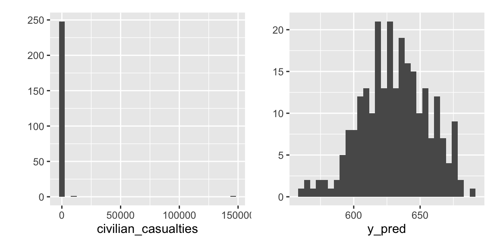
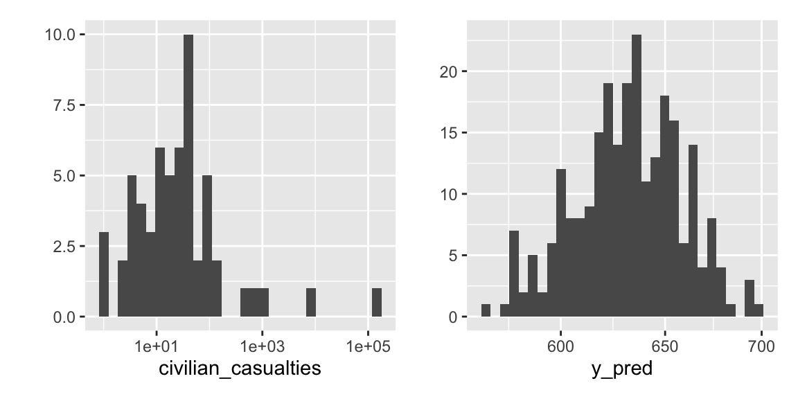
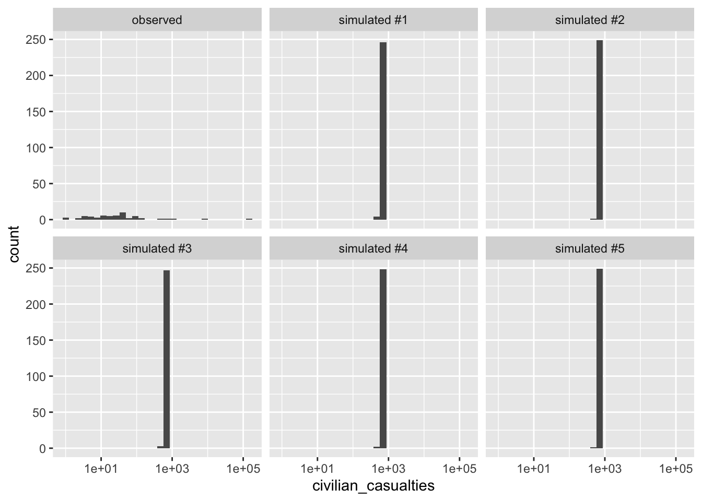
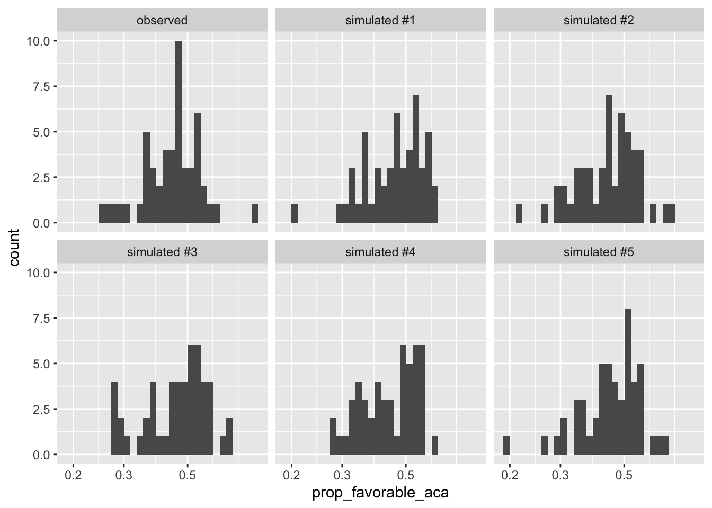

## Predictive Distribution

In Bayesian statistics, a popular tool for model evaluation is the posterior predictive distribution. But we might use an analogous approach for models fit with maximum likelihood. 

The predictive distribution is just the distribution given the ML estimates. Using our notation above, the predictive distribution is $f(y; \hat{\theta})$. 

When you perform a parametric bootstrap, you are resampling from this predictive distribution. Here, we're going to use it for a different purpose: to understand and evaluate our model.

In my view, the predictive distribution is the best way to (1) understand, (2) evaluate, and then (3) improve models.

You can use the predictive distribution as follows:

1. Fit your model with maximum likelihood.
1. Simulate a new outcome variable using the estimated model parameters (i.e., $f(y; \hat{theta})$). Perhaps simulate a handful for comparison.
1. Compare the simulated outcome variable(s) to the observed outcome variables.

### Example: Poisson Distribution

Earlier, we fit a Poisson distribution to a sample of data from Hultman, Kathman, and Shannon (2013).


```r
ml_est <- mean(civilian_casualties)
print(ml_est, digits = 3)
```

```
## [1] 630
```

```r
n <- length(civilian_casualties)
y_pred <- rpois(n, lambda = ml_est)
print(y_pred[1:30])
```

```
##  [1] 639 609 594 647 617 622 598 635 625 631 566 640 643 664 599 656 603 644 648
## [20] 625 588 634 577 632 645 637 641 622 642 664
```

```r
print(civilian_casualties[1:30])
```

```
##  [1]  0  0  0  0  0 13  0  0 61  0  0  0  0  0  0  0  0  0  0  0  0  1  0  0  0
## [26]  0  0  0  0 19
```
Simply printing a few results, we can immediately see a problem with data, when compared with the raw data

To see it even more clearly, we can create a histogram of the observed and simulated data.


```r
library(patchwork)

p1 <- qplot(civilian_casualties)
p2 <- qplot(y_pred)

p1 + p2
```


These data sets are so different that the plots are difficult to read, so we might put the x-axes on the log scale. Note, though, that the two plots have very different ranges on the axes.


```r
p1 <- qplot(civilian_casualties) + scale_x_log10()
p2 <- qplot(y_pred) + scale_x_log10()

p1 + p2
```



For a more accurate and complete comparison, let's simulate five fake data sets and use common axes


```r
observed_data <- tibble(civilian_casualties, type = "observed")

sim_list <- list()
for (i in 1:5) {
  y_pred <- rpois(n, lambda = ml_est)
  sim_list[[i]] <- tibble(civilian_casualties = y_pred, 
                          type = paste0("simulated #", i))
}
gg_data <- bind_rows(sim_list) %>%
  bind_rows(observed_data) %>%
  glimpse()
```

```
## Rows: 1,500
## Columns: 2
## $ civilian_casualties <dbl> 608, 623, 588, 637, 580, 639, 628, 633, 635, 666, …
## $ type                <chr> "simulated #1", "simulated #1", "simulated #1", "s…
```

```r
ggplot(gg_data, aes(x = civilian_casualties)) + 
  geom_histogram() + 
  facet_wrap(vars(type)) + 
  scale_x_log10()
```


The fit of this model is almost absurd.

### Example: Beta Distribution

Now let's return to our beta model of states' opinions toward the ACA in the `br` data frame we loaded earlier.


```r
# obtain ml estimates
log_lik_fn <- function(par = c(2, 2), y) {
  a <- par[1]  # pulling these out makes the code a bit easier to follow
  b <- par[2]
  log_lik_i <- dbeta(y, shape1 = a, shape2 = b, log = TRUE)
  log_lik <- sum(log_lik_i)
  return(log_lik)
}
opt <- optim(par = c(2, 2), fn = log_lik_fn, y = br$prop_favorable_aca,
             control = list(fnscale = -1))
ml_est <- opt$par
```

Now let's simulate some fake data from the predictive distribution and compare that to the observed data


```r
observed_data <- br %>%
  mutate(type = "observed")

n <- nrow(br)
sim_list <- list()
for (i in 1:5) {
  y_pred <- rbeta(n, shape1 = ml_est[1], shape2 = ml_est[2])
  sim_list[[i]] <- tibble(prop_favorable_aca = y_pred, 
                          type = paste0("simulated #", i))
}
gg_data <- bind_rows(sim_list) %>%
  bind_rows(observed_data) 

ggplot(gg_data, aes(x = prop_favorable_aca)) + 
  geom_histogram() + 
  facet_wrap(vars(type)) + 
  scale_x_log10()
```



On the whole, we see hear a fairly close correspondence between the observed and simulated data. That suggests that our model is a good description of the data.


