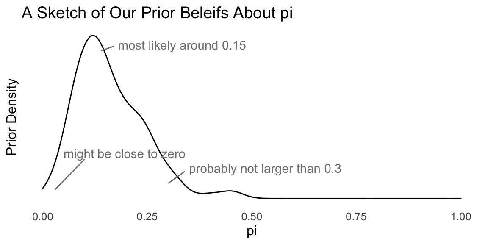

## MCMC

MCMC, or Markov chain Monte Carlo, is a generic algorithm to sample from posterior distributions. There are many variants, and the details are largely beyond the scope of the class. For most applied problems, there's a default approach that's standard for the situation. For most of our cases, it will be HMC using Stan, for example.

However, here is the key idea. 

1. You hand the sampler your likelihood and prior.
1. It explores the posterior in in a way such that subsequent draws are correlated.
1. But if you run the sampler long enough (say 10,000 iterations), then you can treat the serially correlated samples as independent draws from the posterior distribution.

These samplers allow us to skip the normalization step.

### Metropolis-Hastings

Consider the 


```r
n <- 3
y <- rnorm(n, 1, 3)

log_lik <- function(par) {
  log_lik <- sum(dnorm(y, mean = par, sd = 3), log = TRUE)
  return(log_lik)
}

log_prior <- function(par) {
  log_prior <- dcauchy(par, location = 10, scale = 1, log = TRUE)
  return(log_prior)
}

log_post <- function(par) {
  log_lik(par) + log_prior(par)
}


library(MCMCpack)
```

```
## Loading required package: coda
```

```
## Loading required package: MASS
```

```
## ##
## ## Markov Chain Monte Carlo Package (MCMCpack)
```

```
## ## Copyright (C) 2003-2022 Andrew D. Martin, Kevin M. Quinn, and Jong Hee Park
```

```
## ##
## ## Support provided by the U.S. National Science Foundation
```

```
## ## (Grants SES-0350646 and SES-0350613)
## ##
```

```r
s <- MCMCmetrop1R(theta.init = 0, fun = log_post)
```

```
## 
## 
## @@@@@@@@@@@@@@@@@@@@@@@@@@@@@@@@@@@@@@@@@@@@@@@@@@@@@@@@@
## The Metropolis acceptance rate was 0.82102
## @@@@@@@@@@@@@@@@@@@@@@@@@@@@@@@@@@@@@@@@@@@@@@@@@@@@@@@@@
```

```r
hist(s)
```


```r
plot(s)
```


### Mechanics

Suppose a random sample from a distribution $f(x; \theta)$ that depends on the unknown parameter $\theta$. 

Bayesian inference models our *beliefs* about the unknown parameter $\theta$ as a distribution. It answers the question: what should we believe about $\theta$, given the observed samples $x = \{x_1, x_2, ..., x_n\}$ from $f(x; \theta)$? These beliefs are simply the conditional distribution $f(\theta \mid x)$.

By Bayes' rule, $\displaystyle f(\theta \mid x) = \frac{f(x \mid \theta)f(\theta)}{f(x)} = \frac{f(x \mid \theta)f(\theta)}{\displaystyle \int_{-\infty}^\infty f(x \mid \theta)f(\theta) d\theta}$.

$$
\displaystyle \underbrace{f(\theta \mid x)}_{\text{posterior}} = \frac{\overbrace{f(x \mid \theta)}^{\text{likelihood}} \times \overbrace{f(\theta)}^{\text{prior}}}{\displaystyle \underbrace{\int_{-\infty}^\infty f(x \mid \theta)f(\theta) d\theta}_{\text{normalizing constant}}}
$$
There are four parts to a Bayesian analysis.

1. $f(\theta \mid x)$. "The posterior;" what we're trying to find. This distribution models our beliefs about parameter $\theta$ given the data $x$. 
1. $f(x \mid \theta)$. "The likelihood." This distribution model conditional density/probability of the data $x$ given the parameter $\theta$. We need to invert the conditioning in order to find the posterior.
1. $f(\theta)$. "The prior;" our beliefs about $\theta$ prior to observing the sample $x$. 
1. $f(x) =\int_{-\infty}^\infty f(x \mid \theta)f(\theta) d\theta$. A normalizing constant. Recall that the role of the normalizing constant is to force the distribution to integrate or sum to one. Therefore, we can safely ignore this constant until the end, and then find proper normalizing constant. 

It's convenient to choose a **conjugate** prior distribution that, when combined with the likelihood, produces a posterior from the same family. 

As a running example, we use the **toothpaste cap problem**:

> We have a toothpaste cap--one with a wide bottom and a narrow top. We're going to toss the toothpaste cap. It can either end up lying on its side, its (wide) bottom, or its (narrow) top. 

> We want to estimate the probability of the toothpaste cap landing on its top.

> We can model each toss as a Bernoulli trial, thinking of each toss as a random variable $X$ where $X \sim \text{Bernoulli}(\pi)$. If the cap lands on its top, we think of the outcome as 1. If not, as 0. 

> Suppose we toss the cap $N$ times and observe $k$ tops. What is the posterior distribution of $\pi$?

#### The Likelihood {#likelihood}

According to the model $f(x_i \mid \pi) = \pi^{x_i} (1 - \pi)^{(1 - x_i)}$. Because the samples are iid, we can find the *joint* distribution $f(x) = f(x_1) \times ... \times f(x_N) = \prod_{i = 1}^N f(x_i)$. We're just multiplying $k$ $\pi$s (i.e., each of the $k$ ones has probability $\pi$) and $(N - k)$ $(1 - \pi)$s (i.e., each of the $N - k$ zeros has probability $1 - \pi$), so that the $f(x | \pi) = \pi^{k} (1 - \pi)^{(N - k)}$.

$$
\text{the likelihood:  } f(x | \pi) = \pi^{k} (1 - \pi)^{(N - k)}, \text{where } k = \sum_{n = 1}^N x_n \\
$$

#### The Prior

The prior describes your beliefs about $\pi$ *before* observing the data.

Here are some questions that we might ask ourselves the following questions:

1. What's the most likely value of $\pi$? *Perhaps 0.15.*
1. Are our beliefs best summarizes by a distribution that's skewed to the left or right? *To the right.*
1. $\pi$ is about _____, give or take _____ or so. *Perhaps 0.17 and 0.10.*
1. There's a 25% chance that $\pi$ is less than ____. *Perhaps 0.05.*
1. There's a 25% chance that $\pi$ is greater than ____. *Perhaps 0.20*.

Given these answers, we can sketch the pdf of the prior distribution for $\pi$.



Now we need to find a density function that matches these prior beliefs. For this Bernoulli model, the *beta distribution* is the conjugate prior. While a conjugate prior is not crucial in general, it makes the math much more tractable. 

So then what beta distribution captures our prior beliefs?

There's a code snippet [here](https://gist.github.com/carlislerainey/45414e0d9f22e4e1960449402e6a8048) to help you explore different beta distributions (also in the appendix).

After some exploration, we find that setting the parameters $\alpha$ and $\beta$ of the beta distribution to 3 and 15, respectively, captures our prior beliefs about the probability of getting a top.


The pdf of the beta distribution is $f(x) = \frac{1}{B(\alpha, \beta)} x^{\alpha - 1}(1 - x)^{\beta - 1}$. Remember that $B()$ is the beta function, so $\frac{1}{B(\alpha, \beta)}$ is a constant.

Let's denote our chosen values of $\alpha = 3$ and $\beta = 15$ as $\alpha^*$ and $\beta^*$. As we see in a moment, it's convenient distinguish the parameters in the prior distribution from other parameters.

$$
\text{the prior:  }  f(\pi) = \frac{1}{B(\alpha^*, \beta^*)} \pi^{\alpha^* - 1}(1 - \pi)^{\beta^* - 1}
$$

#### The Posterior

Now we need to compute the posterior by multiplying the likelihood times the prior and then finding the normalizing constant.
$$
\text{the posterior: } \displaystyle \underbrace{f(\pi \mid x)}_{\text{posterior}} = \frac{\overbrace{f(x \mid \pi)}^{\text{likelihood}} \times \overbrace{f(\pi)}^{\text{prior}}}{\displaystyle \underbrace{\int_{-\infty}^\infty f(x \mid \pi)f(\pi) d\pi}_{\text{normalizing constant}}} \\
$$
Now we plug in the likelihood, plug in the prior, and denote the normalizing constant as $C_1$ to remind ourselves that it's just a constant.

$$
\text{the posterior: } \displaystyle \underbrace{f(\pi \mid x)}_{\text{posterior}} = \frac{\overbrace{\left[ \pi^{k} (1 - \pi)^{(N - k) }\right] }^{\text{likelihood}} \times \overbrace{ \left[ \frac{1}{B(\alpha^*, \beta^*)} \pi^{\alpha^* - 1}(1 - \pi)^{\beta^* - 1} \right] }^{\text{prior}}}{\displaystyle \underbrace{C_1}_{\text{normalizing constant}}} \\
$$

Now we need to simplify the right-hand side. 

First, notice that the term $\frac{1}{B(\alpha^*, \beta^*)}$ in the numerator is just a constant. We can incorporate that constant term with $C_1$ by multiplying top and bottom by $B(\alpha^*, \beta^*)$ and letting $C_2 = C_1 \times B(\alpha^*, \beta^*)$.

$$
\text{the posterior: } \displaystyle \underbrace{f(\pi \mid x)}_{\text{posterior}} = \frac{\overbrace{\left[ \pi^{k} (1 - \pi)^{(N - k) }\right] }^{\text{likelihood}} \times  \left[ \pi^{\alpha^* - 1}(1 - \pi)^{\beta^* - 1} \right] }{\displaystyle \underbrace{C_2}_{\text{new normalizing constant}}} \\
$$

Now we can collect the exponents with base $\pi$ and the exponents with base $(1 - \pi)$.

$$
\text{the posterior: } \displaystyle \underbrace{f(\pi \mid x)}_{\text{posterior}} = \frac{\left[ \pi^{k} \times \pi^{\alpha^* - 1} \right] \times  \left[ (1 - \pi)^{(N - k) } \times (1 - \pi)^{\beta^* - 1} \right] }{ C_2} \\
$$
Recalling that $x^a \times x^b = x^{a + b}$, we combine the powers.

$$
\text{the posterior: } \displaystyle \underbrace{f(\pi \mid x)}_{\text{posterior}} = \frac{\left[ \pi^{(\alpha^* + k) - 1} \right] \times  \left[ (1 - \pi)^{[\beta^* + (N - k)] - 1} \right] }{ C_2} \\
$$

Because we're clever, we notice that this is *almost* a beta distribution with $\alpha = (\alpha^* + k)$ and $\beta = [\beta^* + (N - k)]$. If $C_2 = B(\alpha^* + k, \beta^* + (N - k))$, then the posterior is *exactly* a $\text{beta}(\alpha^* + k, \beta^* + [N - k]))$ distribution. 

This is completely expected. We chose a beta distribution for the prior because it would give us a beta posterior distribution. For simplicity, we can denote the parameter for the beta posterior as $\alpha^\prime$ and $\beta^\prime$, so that $\alpha^\prime = \alpha^* + k$ and $\beta^\prime = \beta^* + [N - k]$

$$
\begin{aligned}
\text{the posterior: } \displaystyle \underbrace{f(\pi \mid x)}_{\text{posterior}} &= \frac{ \pi^{\overbrace{(\alpha^* + k)}^{\alpha^\prime} - 1}  \times  (1 - \pi)^{\overbrace{[\beta^* + (N - k)]}^{\beta^\prime} - 1}  }{ B(\alpha^* + k, \beta^* + [N - k])} \\
&= \frac{ \pi^{\alpha^\prime - 1}  \times  (1 - \pi)^{\beta^\prime - 1}  }{ B(\alpha^\prime, \beta^\prime)}, \text{where } \alpha^\prime = \alpha^* + k \text{ and } \beta^\prime = \beta^* + [N - k]
\end{aligned}
$$

This is an elegant, simple solution. To obtain the parameters for the beta posterior distribution, we just add the number of tops (Bernoulli successes) to the prior value for $\alpha$ and the number of not-tops (sides and bottoms; Bernoulli failures) to the prior value for $\beta$.

Suppose that I tossed the toothpaste cap 150 times and got 8 tops.


```r
# prior parameters
alpha_prior <- 3
beta_prior <- 15

# data 
k <- 8
N <- 150

# posterior parameters
alpha_posterior <- alpha_prior + k
beta_posterior <- beta_prior + N - k

# plot prior and posterior
gg_prior <- ggplot() + 
  stat_function(fun = dbeta, args = list(shape1 = alpha_prior, shape2 = beta_prior)) + 
  labs(title = "prior distribution", x = "pi", y = "prior density")
gg_posterior <- ggplot() + 
  stat_function(fun = dbeta, args = list(shape1 = alpha_posterior, shape2 = beta_posterior)) + 
  labs(title = "posterior distribution", x = "pi", y = "posterior density")

library(patchwork)
gg_prior + gg_posterior
```


#### Bayesian Point Estimates

In this section, we want *point estimates*---a best guess at the parameter---not a full posterior distribution. 

We have three options:

1. *The posterior mean*. The posterior mean minimizes a squared-error loss function. That is, the cost of guessing $a$ when the truth is $\alpha$ is $(a - \alpha)^2$. In the case of the beta posterior, it's just $\dfrac{\alpha^\prime}{\alpha^\prime + \beta^\prime}$. For our prior and data, we have $\dfrac{3 + 8}{(3 + k) + (15 + 150 - 8)} \approx 0.065$.
1. *The posterior median*: The posterior median minimizes an absolute loss function where the cost of guessing $a$ when the truth is $\alpha$ is $|a - \alpha|$. Intuitively, there's a 50% chance that $\pi$ falls above and below the posterior median. In the case of the beta posterior, it's just $\dfrac{\alpha^\prime - \frac{1}{3}}{\alpha^\prime + \beta^\prime - \frac{2}{3}}$ (for $\alpha^\prime, \beta^\prime > 1$). For our prior and data, we have $\dfrac{3 + 8 -\frac{1}{3}}{(3 + k) + (15 + 150 - 8) - \frac{2}{3}} \approx 0.064$.
1. *The posterior mode*: The posterior mode is the most likely value of $\pi$, so it minimizes a loss function that penalizes all misses equally. In the case of the beta posterior, it's just $\dfrac{\alpha^\prime - 1}{\alpha^\prime + \beta^\prime - 2}$ (for $\alpha^\prime, \beta^\prime > 1$). For our prior and data, we have $\dfrac{3 + 8 - 1}{(3 + k) + (15 + 150 - 8) - 2} \approx 0.060$.

### Example: Poisson Distribution

Suppose we collect $N$ random samples $x = \{x_1, x_2, ..., x_N\}$ and model each draw as a random variable $X \sim \text{Poisson}(\lambda)$. Find the posterior distribution of $\lambda$ for the gamma prior distribution. Hint: the gamma distribution is the conjugate prior for the Poisson likelihood.

$$
\begin{aligned}
\text{Poisson likelihood: } f(x \mid \lambda) &= \prod_{n = 1}^N \frac{\lambda^{x_n} e^{-\lambda}}{x_n!} \\
&= \displaystyle \left[ \frac{1}{\prod_{n = 1}^N x_n !} \right]e^{-N\lambda}\lambda^{\sum_{n = 1}^N x_n}
\end{aligned}
$$

$$
\text{Gamma prior: } f( \lambda; \alpha^*, \beta^*) = \frac{{\beta^*}^{\alpha^*}}{\Gamma(\alpha^*)} \lambda^{\alpha^* - 1} e^{-\beta^*\lambda}
$$
To find the posterior, we multiply the likelihood times the prior and normalize. Because the gamma prior distribution is the conjugate prior for the Poisson likelihood, we know that the posterior will be a gamma distribution.

$$
\begin{aligned}
\text{Gamma posterior: } f( \lambda  \mid x) &= \frac{\left( \displaystyle \left[ \frac{1}{\prod_{n = 1}^N x_n !} \right]e^{-N\lambda}\lambda^{\sum_{n = 1}^N x_n}\right) \times \left( \left[ \frac{{\beta^*}^{\alpha^*}}{\Gamma(\alpha^*)} \right] \lambda^{\alpha^* - 1} e^{-\beta^*\lambda}\right)}{C_1} \\
\end{aligned}
$$
Because $x$, $\alpha_*$, and $\beta$ are fixed, the terms in square brackets are constant, so we can safely consider those part of the normalizing constant.

$$
\begin{aligned}
&= \frac{\left( \displaystyle  e^{-N\lambda}\lambda^{\sum_{n = 1}^N x_n}\right) \times \left( \lambda^{\alpha^* - 1} e^{-\beta^*\lambda}\right)}{C_2} \\
\end{aligned}
$$
Now we can collect the exponents with the same base.

$$
\begin{aligned}
&= \frac{\left( \lambda^{\alpha^* - 1} \times \lambda^{\sum_{n = 1}^N x_n}\right) \times \left( \displaystyle  e^{-N\lambda} \times e^{-\beta^*\lambda} \right)}{C_2} \\
&= \frac{\lambda^{ \overbrace{\left[ \alpha^* + \sum_{n = 1}^N x_n \right]}^{\alpha^\prime} - 1}  e^{-\overbrace{[\beta^* + N]}^{\beta^\prime}\lambda} }{C_2} \\
\end{aligned}
$$

We recognize this as *almost* a Gamma distribution with parameters $\alpha^\prime = \alpha^* +  \sum_{n = 1}^N x_n$ and $\beta^\prime = \beta^* + N$. Indeed, if $\frac{1}{C_2} = \frac{{\beta^\prime}^{\alpha^\prime}}{\Gamma(\alpha^{\prime})}$, then we have exactly a gamma distribution. 

$$
\begin{aligned}
&= \frac{{\beta^\prime}^{\alpha^\prime}}{\Gamma(\alpha^{\prime})} \lambda^{ \alpha^\prime - 1}  e^{-\beta^\prime\lambda}, \text{where } \alpha^\prime = \alpha^* +  \sum_{n = 1}^N x_n \text{ and } \beta^\prime = \beta^* + N
\end{aligned}
$$

Like the Bernoulli likelihood with the beta prior, the Poisson likelihood withe the gamma prior gives a nice result. We start with values parameters of the gamma distribution $\alpha = \alpha^*$ and $\beta + \beta^*$ so that the gamma prior distribution describes our prior beliefs about the parameters $\lambda$ of the Poisson distribution. Then we add the sum of the data $x$ to $\alpha^*$ and the number of samples $N$ to $\beta^*$ to obtain the parameters of the gamma posterior distribution.

The code below shows the posterior distribution 


```r
# set see to make reproducible
set.seed(1234)

# prior parameters
alpha_prior <- 3
beta_prior <- 3

# create an "unknown" value of lambda to estimate
lambda <- 2

# generate a data set
N <- 5  # number of samples
x <- rpois(N, lambda = lambda)
print(x)  # print the data set
```

```
## [1] 0 2 2 2 4
```

```r
# posterior parameters
alpha_posterior <- alpha_prior + sum(x)
beta_posterior <- beta_prior + N

# plot prior and posterior
gg_prior <- ggplot() + xlim(0, 5) + 
  stat_function(fun = dgamma, args = list(shape = alpha_prior, rate = beta_prior)) + 
  labs(title = "prior distribution", x = "lambda", y = "prior density")
gg_posterior <- ggplot() + xlim(0, 5) + 
  stat_function(fun = dgamma, args = list(shape = alpha_posterior, rate = beta_posterior)) + 
  labs(title = "posterior distribution", x = "lambda", y = "posterior density")
gg_prior + gg_posterior  # uses patchwork package
```


```r
# posterior mean: alpha/beta
alpha_posterior/beta_posterior
```

```
## [1] 1.625
```

```r
# posterior median: no closed form, so simulate
post_sims <- rgamma(10000, alpha_posterior, beta_posterior)
median(post_sims)
```

```
## [1] 1.586689
```

```r
# posterior mode: (alpha - 1)/beta for alpha > 1
(alpha_posterior - 1)/beta_posterior
```

```
## [1] 1.5
```

### Remarks

Bayesian inference presents two difficulties. 

1. Choosing a prior. 
   a. It can be hard to actually construct a prior distribution. It's challenging when dealing with a single parameter. It becomes much more difficult when dealing with several or many parameters.
   a. Priors are subjective, so that one researcher's prior might not work for another. 
1. Computing the posterior. Especially for many-parameter problems and non-conjugate priors, computing the posterior can be nearly intractable.

However, there are several practical solutions to these difficulties.

1. Choosing a prior.
    a. We can use a "uninformative" or constant prior. Sometimes, we can use an improper prior that doesn't integrate to one, but places equal prior weight on all values. 
    a. We can use an extremely diffuse prior. For example, if we wanted to estimate the average height in a population in inches, we might use a normal distribution centered at zero with an SD of 10,000. This prior says: "The average height is about zero, give or take 10,000 inches or so."
    a. We can use an informative prior, but conduct careful robustness checks to assess whether the conclusions depend on the particular prior.
    a. We can use a weakly informative prior, that rules places meaningful prior weight on all the plausible values and little prior weight only on the most implausible values. As a guideline, you might create a weakly informative prior by doubling or tripling the SD of the informative prior.
1. Computing the posterior.
    a. While analytically deriving the posterior becomes intractable for most applied problems, it's relatively easy to *sample* from the posterior distribution for many models. 
    a. Algorithms like Gibbs samplers, MCMC, and HMC make this sampling procedure straightforward for a given model.
    a. Software such as Stan make sampling easy to set up and very fast. Post-processing R packages such as tidybayes make it each to work with the posterior simulations.
    
