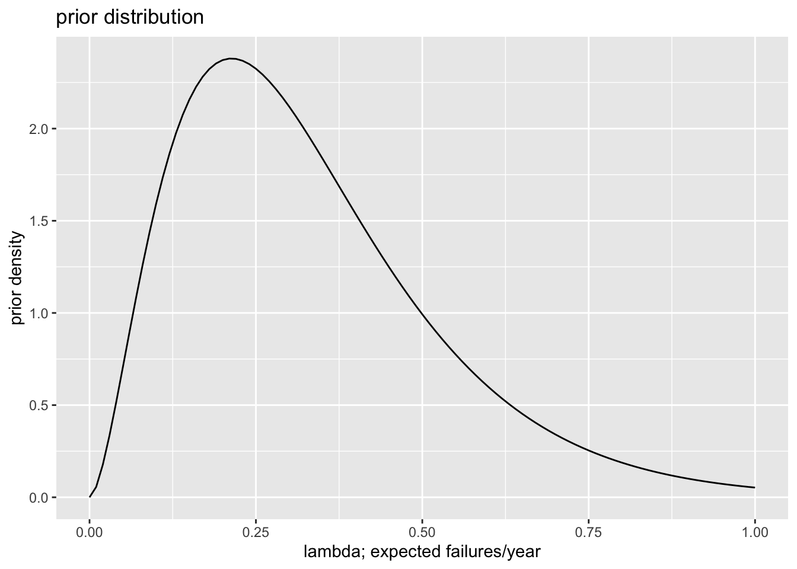
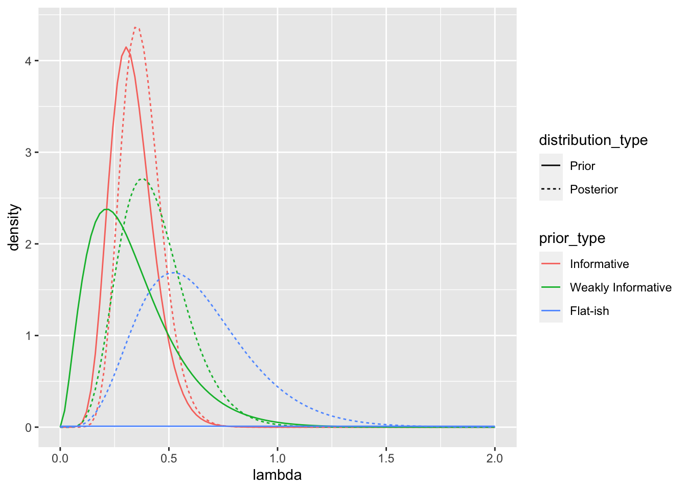

## Exercises 

::: {.exercise #bayes-exponential}
Suppose we collect $N$ random samples $x = \{x_1, x_2, ..., x_N\}$ and model each draw as a random variable $X \sim \text{exponential}(\lambda)$ with pdf $f(x_n | \lambda) = \lambda e^{-\lambda x_n}$. Find the posterior distribution of $\lambda$ for the gamma prior distribution. Hint: the gamma distribution is the conjugate prior for the exponential likelihood.
:::

<details><summary>Hint</summary>
Use the Poisson example from above. Because they share a prior, the math works quite similarly.
</details>


<details><summary>Solution</summary>

$$
\begin{aligned}
\text{exponential likelihood: } f(x \mid \lambda) &= \prod_{n = 1}^N \lambda e^{-\lambda x_n} \\
&= \lambda^N e^{-\lambda \sum_{n = 1}^N x_n}
\end{aligned}
$$
$$
\text{Gamma prior: } f( \lambda; \alpha^*, \beta^*) = \frac{{\beta^*}^{\alpha^*}}{\Gamma(\alpha^*)} \lambda^{\alpha^* - 1} e^{-\beta^*\lambda}
$$
$$
\begin{aligned}
\text{Gamma posterior: } f( \lambda  \mid x) &= \frac{\left(  \lambda^N e^{-\lambda \sum_{n = 1}^N x_n}\right) \times \left( \left[ \frac{{\beta^*}^{\alpha^*}}{\Gamma(\alpha^*)} \right] \lambda^{\alpha^* - 1} e^{-\beta^*\lambda}\right)}{C_1} \\
&= \frac{\left(  \lambda^N e^{-\lambda \sum_{n = 1}^N x_n}\right) \times \left(  \lambda^{\alpha^* - 1} e^{-\beta^*\lambda}\right)}{C_2} \\
&= \frac{ \lambda^{ \overbrace{\left[ \alpha^* + N \right]}^{\alpha^\prime} - 1} e^{- \overbrace{\left[ \beta^* + \sum_{n = 1}^N x_n \right]}^{\beta^\prime} \lambda}}{C_2} \\
& =  \frac{{\beta^\prime}^{\alpha^\prime}}{\Gamma(\alpha^\prime)}  \lambda^{\alpha^\prime - 1} e^{-\beta^\prime\lambda}\text{ where } \alpha^\prime = \alpha^* +  N \text{ and } \beta^\prime = \beta^* + \sum_{n = 1}^N x_n
\end{aligned}
$$

</details>

::: {.exercise #govt-duration-bayes}
You are a researcher interesting in government duration in parliamentary democracies. You decide to model duration as an exponential distribution. To estimate the parameter $\lambda$ of the exponential distribution, you collect data on the last five UK governments. 

- The first Johnson ministry lasted 142 days. 
- The second May ministry lasted 773 days.
- The first May ministry lasted 333 days.
- The second Cameron ministry lasted 432 days.
- The first Cameron ministry (Cameron-Clegg coalition) lasted 1,823 days.

1. Rescale the data to years--that helps with the interpretation.
1. Create three gamma prior distributions.
    a. One that describes your prior beliefs. 
    a. One that's weakly informative.
    a. One that's as uninformative as possible.
1. Use what you learned from Exercise \@ref(exr:bayes-exponential) to plot each prior and posterior.
1. For each posterior, compute the mean, median, and mode of $\lambda$. Interpret. Hint: $\lambda$ is a rate. If the durations are measured in years, then it's the failures per year. The expected duration in years is $\frac{1}{\lambda}$, but remember that $E \left( \frac{1}{\lambda}\right) \neq \frac{1} {E(\lambda)}$. If you want to find the posterior distribution of the expected duration (rather than the failures/year), then you can simulate many draws of $\lambda$ from the posterior and transform each draw into $\frac{1}{\lambda}$. The mean of the transformed draws is the posterior mean of the expected duration.
1. Assess the model. Do you think we have a good model? Hint: the exponential distribution is memoryless. Does that make sense in this appliation?
:::

<details><summary>Solutions</summary>


```r
# load packages
library(tidyverse)
library(stringr)
library(kableExtra)

# set seed for reproducibility
set.seed(1234)

# choose informative  prior distribution
# - I expect govts to last, on avg, 3 years, so fail at a 
#   rate of lambda = 1/3 per year, give-or-take about 1/10.
# - I know that the mean of the gamma is a/b and the sd is 
#   sqrt{a/(b^2)}, so I set a/b = 1/3 and sqrt{a/(b^2)} = 1/10
#   and solve. You could also just experiment with different 
#   values
alpha_inf <- 100/9
beta_inf <-  3*alpha_inf

# plot informative prior
ggplot() + xlim(0, 1) +
  stat_function(fun = dgamma, args = list(shape = alpha_inf, rate = beta_inf)) + 
  labs(title = "prior distribution", x = "lambda; expected failures/year", y = "prior density")
```


```r
# choose **weakly informative** prior distribution
# - For this, I repeated the same process, but doubled my
#   give-or-take from 1/10 to 1/5,
alpha_weak <- 25/9
beta_weak <- 3*alpha_weak

# plot weakly informative prior
ggplot() + xlim(0, 1) +
  stat_function(fun = dgamma, args = list(shape = alpha_weak, rate = beta_weak)) + 
  labs(title = "prior distribution", x = "lambda; expected failures/year", y = "prior density")
```



```r
# choose flattest prior distribution
# - I just want to make this prior as close to uniform as possible.
# - the failure rate (failures/year) is *surely* between 0 and 100
#   (lambda = 100 means that 100 governments are failing per year), 
#   so I plot the prior from zero to 100--it's basically flat   
alpha_flat <- 1
beta_flat <- 0.01

# plot flattish prior
ggplot() + xlim(0, 100) + ylim(0, NA) + 
  stat_function(fun = dgamma, args = list(shape = alpha_flat, rate = beta_flat)) + 
  labs(title = "prior distribution", x = "lambda; expected failures/year", y = "prior density")
```


```r
# data
x <- c(142, 773, 333, 432, 1823)/365  # rescale to years

# make a data frame with the posterior and prior parameters
posts <- data.frame(prior_type = c("Informative", 
                                   "Weakly Informative",
                                   "Flat-ish"),
                    alpha_prior = c(alpha_inf, 
                                    alpha_weak,
                                    alpha_flat),
                    beta_prior = c(beta_inf, 
                                    beta_weak,
                                    beta_flat)) %>%
  # add posterior parameters
  mutate(alpha_posterior = alpha_prior + length(x),
         beta_posterior = beta_prior + sum(x)) %>%
  # create one row per parameter
  pivot_longer(cols = alpha_prior:beta_posterior) %>%
  # separate parameter from distribution type
  separate(name, into = c("parameter", "distribution_type")) %>%
  # put parameters into separate columns
  pivot_wider(names_from = parameter, values_from = value) %>%
  mutate(distribution_type = str_to_title(distribution_type),
         distribution_type = factor(distribution_type, levels = c("Prior", "Posterior"))) %>%
  mutate(prior_type = factor(prior_type, levels = c("Informative", "Weakly Informative", "Flat-ish")))

# compute point estimates and make a table
point_estimates <- posts %>% 
  #filter(distribution_type == "posterior") %>%
  group_by(prior_type, distribution_type) %>%
  mutate(mean = alpha/beta,
         median = median(rgamma(100000, alpha, beta)),
         mode = (alpha - 1)/beta,
         mean_expected_duration = mean(1/rgamma(100000, shape = alpha, rate = beta))) 

point_estimates %>%
  select(-alpha, -beta) %>%
  arrange(distribution_type, prior_type) %>%
  rename(`Prior` = prior_type, 
         `Distribution` = distribution_type,
         `Mean of lambda` = mean,
         `Median of lambda` = median,
         `Mode of lambda` = mode,
         `Mean of 1/lambda` = mean_expected_duration) %>%
  kable(format = "markdown", digits = 2)
```


|Prior              |Distribution | Mean of lambda| Median of lambda| Mode of lambda| Mean of 1/lambda|
|:------------------|:------------|--------------:|----------------:|--------------:|----------------:|
|Informative        |Prior        |           0.33|             0.32|           0.30|             3.30|
|Weakly Informative |Prior        |           0.33|             0.29|           0.21|             4.70|
|Flat-ish           |Prior        |         100.00|            69.38|           0.00|             0.12|
|Informative        |Posterior    |           0.38|             0.37|           0.35|             2.84|
|Weakly Informative |Posterior    |           0.43|             0.42|           0.38|             2.65|
|Flat-ish           |Posterior    |           0.62|             0.59|           0.52|             1.92|

```r
# plot distributions
gg_posts <- posts %>%
  # add in lambda values for which to compute the prior and posterior density
  full_join(data_frame(lambda = seq(0, 2, length.out = 100)), 
            by = character()) %>%
  # compute the posterior and prior density for each lambda
  mutate(density = dgamma(lambda, shape = alpha, rate = beta))

ggplot(gg_posts, aes(x = lambda, y = density, 
                  color = prior_type, 
                  linetype = distribution_type)) + 
  geom_line()
```



</details>
