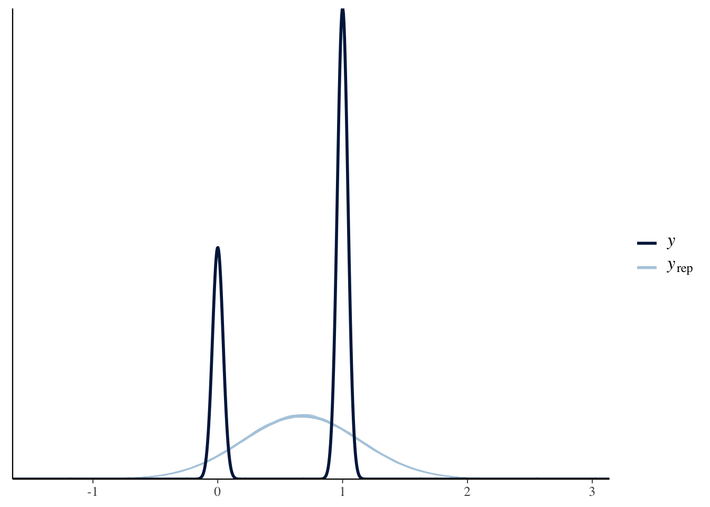

## Bernoulli Model

In the case of the normal model, we used $y_i \sim N(\mu_i, \sigma^2)$, where $\mu_i = X_i\beta$. The normal model does a great job with roughly continuous outcomes like ENEP.

But sometimes we care about **binary outcomes**.

- Binary outcomes are categorical outcome variables with exactly two categories, such as whether or not someone voted, whether two countries are at war, and so on.
- These variables are usually coded as $y_i \in \{0, 1\}$, with one representing "an event" and zero representing "a non-event."
- In generic language, we’ll say that $y_i = 1$ means that "an event has occurred" and $y_i = 0$ means that "an event has not occurred."
- This allows us to talk about the "probability of an event" (e.g., the probability of war, etc)

The normal model cannot describe a binary outcome well.  But it doesn't make much conceptual sense to model 0s and 1s as following a normal distribution. 

### The Linear Probability Model 

We can use the linear model (i.e., OLS) with binary outcome variables.

- Recall that we the linear model is represented by the equation $E(y_i) = X_i\beta$.
- It is important to note that a probability is just a particular kind of expected value---a probability is an expected value of a binary variable.
- Since $y_i$ is binary, the $E(y_i) = \Pr(y_i = 1) = \Pr(y_i)$, giving us $\Pr(y_i) = X_i\beta$.

The LPM has two advantages:

1. It's is *very* easy to estimate (i.e., OLS; $\hat{\beta} = (X'X)^{-1}X'y$).
1. It is easy to interpret (i.e., a one unit change in $x_j$ leads to a $\hat{\beta_j}$ unit increase in $\Pr(y)$).

The LPM has several disadvantages

1. **Unbounded Predictions** Because the potential values for the explanatory variables are unbounded, you can obtain predicted probabilities above one and below zero. Of course, these predictions make no sense.
1. **Conditional Heteroskedasticity** The normal-linear model assumes a constant variance $\sigma^2$. However, it is impossible to have homoskedastic residuals of a binary outcome if the probability of an event varies. Specifically, if $y_i$ is binary, then $\text{Var}(y_i) = \Pr(y_i)[1 - \Pr(y_i)]$, which, for the LPM, equals $X_i\beta(1 - X_i\beta)$. (Non-zero coefficients imply heteroskedasticity.)
1. **Non-Normal Errors** Normal errors implies that the residuals can take on any value along the real line, with values closer to zero being more likely and errors outside three standard deviations being quite unlikely. However, if $y_i$ is binary, then the residual can take on only two values: $-Pr(y_i)$ or $1 - Pr(y_i)$.
1. **Functional Form** Theoretically, you'd probably expect explanatory variables to have smaller effects as $Pr(y_i)$ approaches zero or one (called "compression"). The LPM assumes that the effects are constant.

Let's fit the normal model to data from Wolfinger and Rosenstone (1993), Nagler (1994, the "Scobit" paper), and Berry, DeMeritt, and Esarey (2010).


```r
scobit <- haven::read_dta("data/scobit.dta") %>%
  filter(newvote != -1) %>%  # weird -1s in data; unsure if sufficient
  glimpse()
```

```
## Rows: 99,676
## Columns: 16
## $ state    <dbl> 93, 93, 93, 93, 93, 93, 93, 93, 93, 93, 93, 93, 93, 93, 93, 9…
## $ vote     <dbl> 1, 1, 2, 1, 1, 1, 2, 1, 1, 1, 1, 1, 1, 1, 1, 1, 1, 1, 1, 2, 2…
## $ age      <dbl> 60, 80, 32, 25, 55, 63, 20, 53, 49, 27, 58, 56, 34, 34, 35, 3…
## $ educ     <dbl> 13, 13, 13, 13, 11, 14, 11, 11, 13, 13, 11, 13, 19, 19, 15, 1…
## $ citizen  <dbl> 1, 1, 1, 1, 1, 1, 1, 1, 1, 1, 1, 1, 1, 1, 1, 1, 1, 1, 1, 1, 1…
## $ rweight  <dbl> 207134, 215836, 184639, 184883, 168557, 179148, 181510, 19285…
## $ south    <dbl> 0, 0, 0, 0, 0, 0, 0, 0, 0, 0, 0, 0, 0, 0, 0, 0, 0, 0, 0, 0, 0…
## $ gov      <dbl> 0, 0, 0, 0, 0, 0, 0, 0, 0, 0, 0, 0, 0, 0, 0, 0, 0, 0, 0, 0, 0…
## $ closing  <dbl> 29, 29, 29, 29, 29, 29, 29, 29, 29, 29, 29, 29, 29, 29, 29, 2…
## $ age2     <dbl> 3600, 6400, 1024, 625, 3025, 3969, 400, 2809, 2401, 729, 3364…
## $ educ2    <dbl> 25, 25, 25, 25, 16, 36, 16, 16, 25, 25, 16, 25, 64, 64, 36, 2…
## $ cloeduc  <dbl> 145, 145, 145, 145, 116, 174, 116, 116, 145, 145, 116, 145, 2…
## $ cloeduc2 <dbl> 725, 725, 725, 725, 464, 1044, 464, 464, 725, 725, 464, 725, …
## $ newvote  <dbl> 1, 1, 0, 1, 1, 1, 0, 1, 1, 1, 1, 1, 1, 1, 1, 1, 1, 1, 1, 0, 0…
## $ newage   <dbl> 0, 0, 0, 0, 0, 0, 0, 0, 0, 0, 0, 0, 0, 0, 0, 0, 0, 0, 0, 0, 0…
## $ neweduc  <dbl> 5, 5, 5, 5, 4, 6, 4, 4, 5, 5, 4, 5, 8, 8, 6, 5, 5, 3, 5, 1, 6…
```

```r
f <- newvote ~ poly(neweduc, 2, raw = TRUE) + closing + poly(age, 2, raw = TRUE) + south + gov
fit <- lm(f, data = scobit)

mu_hat <- predict(fit)  # the linear predictor for each row of data frame
sigma_hat <- sqrt(sum(residuals(fit)^2))
y_tilde <- rnorm(nrow(scobit), mu_hat, sigma_hat)

# note: the code below uses variables NOT in the data frame; this is sloppy
library(patchwork)
gg1 <- ggplot(scobit, aes(x = mu_hat, y = newvote)) + 
  geom_jitter(height = 0.05, alpha = 0.1, shape = 21, size = 0.3)
gg2 <- ggplot(scobit, aes(x = mu_hat, y = y_tilde)) + 
  geom_point(alpha = 0.1, shape = 21, size = 0.3)
gg1 + gg2
```


rstanarm has a convenient `pp_check()` function that allows you to compare the posterior predictive distribution to the observed distribution.


```r
library(rstanarm); options(mc.cores = parallel::detectCores())

stan_fit <- stan_glm(f, data = scobit, family = "gaussian", chains = 1)
```


```r
pp_check(stan_fit)
```



### The Logit Model

As an initial effort to handle the "non-normal" distribution of the data, we might then use the Bernoulli model $y_i \sim \text{Bernoulli}(\pi_i)$, where $\pi_i = X_i\beta$. However, this has a *big* problem that can make the approach unworkable: $X_i\beta$ might be less than zero or greater than one. 

To address bounds of $\pi_i$ and $X_i\beta$, we are going to introduce a new concept called the "inverse link function." Many of the "disadvantages" of the LPM above follow from the fact that the linear predictor is unbounded. For the normal model, the inverse link function is **not necessary** because the parameter of interest $\mu$ is unbounded and maps to the entire real line. But for other models, the key parameter has a restricted domain. In the case of the Bernoulli distribution, $\pi_i \in [0, 1] \subset \mathbb{R}$.

The idea of the inverse link function is to wrap around the linear predictor and force its values into the desired domain. 

For the Bernoulli distribution, we might use the inverse link function $g^{-1}(x) = \frac{e^x}{1 + e^x}$. This is called the "inverse logit" and it has an "S"-shape. It's job is to map $X\beta$ into $[0, 1]$. (It's also the cdf of the standard logistic distribution.)


```r
inv_logit <- function(x) {
  (exp(x))/(1 + exp(x))
}

ggplot() + 
  xlim(-10, 10) + 
  stat_function(fun = inv_logit)
```


Hint: The inverse-logit function is the cdf of the standard logistic distribution, so you can just use `plogis()` in R, rather than hard-coding the `inv_logit()` function I create above.

Swapping the normal distribution for the Bernoulli and adding the inverse-logit inverse-link function gives us the logit model (or "logistic regression").

$$
y_i \sim \text{Bernoulli}(\pi_i)\text{, where } \pi_i = \text{logit}^{-1}(X_i\beta).
$$

We can fit this model using maximum likelihood or posterior simulation. 

### Fitting a Logit Model

#### With `optim()`

To develop the log-likelihood of the logit model, we start with the Bernoulli likelihood from Week 1. 

$$
f(y; \beta) = L(\beta) = \prod_{i = 1}^{N}\pi_i^{y_i} (1 - \pi_i)^{(1 - y_i)}\text{, where } \pi_i = \text{logit}^{-1}(X_i\beta)
$$
Taking the log, we have 

$$
\log L(\beta) = \sum_{i = 1}^{N} y_i \log \pi_i +  \sum_{i = 1}^{N}(1 - y_i) \log(1 - \pi_i)\text{, where } \pi_i = \text{logit}^{-1}(X_i\beta)
$$
We can program this into R for use in `optim()`.


```r
logit_ll <- function(beta, y, X) {
  p <- plogis(X%*%beta)  # pi is special in R, so I use p
  ll <- sum(y*log(p)) + sum((1 - y)*log(1 - p))
  return(ll)
}

# alternatively
logit_ll2 <- function(beta, y, X) {
  ll <- sum(dbinom(y, size = 1, prob = plogis(X%*%beta), log = TRUE))  # easier to use R's d*() functions
  return(ll)
}
```

The tricky part about using `optim()` here is not the log-likelihood function, but setting up `X` and `y`. The code below creates the outcome vector $y$ and the matrix $X$ of explanatory variables (with a leading columns of 1s).


```r
# create formula
f <- newvote ~ poly(neweduc, 2, raw = TRUE) + closing + poly(age, 2, raw = TRUE) + south + gov

# obtain the model matrix X
mf <- model.frame(f, data = scobit)  # model frame
X <- model.matrix(f, mf)         # model matrix X

# obtain the outcome variable y
y <- model.response(mf)
```

Then we can use `optim()`.


```r
# for some reason, this isn't converging
par_start <- c(-3, rep(0, ncol(X) - 1))
opt <- optim(par_start, fn = logit_ll, y = y, X = X, 
      control = list(fnscale = -1))
opt$par
```

```
## [1] -3.0546169207  0.2735676715  0.0209478540 -0.0216067192  0.0807472482
## [6] -0.0004976604 -0.0467922614 -0.0362716220
```

```r
# test w/ same X and y; works
coef(glm.fit(X, y, family = binomial()))
```

```
##                   (Intercept) poly(neweduc, 2, raw = TRUE)1 
##                 -4.0727861365                  0.2426335636 
## poly(neweduc, 2, raw = TRUE)2                       closing 
##                  0.0282045522                 -0.0132046240 
##     poly(age, 2, raw = TRUE)1     poly(age, 2, raw = TRUE)2 
##                  0.1142218082                 -0.0008222347 
##                         south                           gov 
##                 -0.1904026537                  0.0052717028
```

#### With `glm()`


```r
fit <- glm(f, data = scobit, family = "binomial")
coef(fit)
```

```
##                   (Intercept) poly(neweduc, 2, raw = TRUE)1 
##                 -4.0727861365                  0.2426335636 
## poly(neweduc, 2, raw = TRUE)2                       closing 
##                  0.0282045522                 -0.0132046240 
##     poly(age, 2, raw = TRUE)1     poly(age, 2, raw = TRUE)2 
##                  0.1142218082                 -0.0008222347 
##                         south                           gov 
##                 -0.1904026537                  0.0052717028
```


#### With Stan


```r
small_scobit <- sample_n(scobit, 1000)
stan_fit <- stan_glm(f, data = small_scobit, family = "binomial")
```


```r
summary(stan_fit)
```

```
## 
## Model Info:
##  function:     stan_glm
##  family:       binomial [logit]
##  formula:      newvote ~ poly(neweduc, 2, raw = TRUE) + closing + poly(age, 
## 	   2, raw = TRUE) + south + gov
##  algorithm:    sampling
##  sample:       4000 (posterior sample size)
##  priors:       see help('prior_summary')
##  observations: 1000
##  predictors:   8
## 
## Estimates:
##                                 mean   sd   10%   50%   90%
## (Intercept)                   -4.7    0.8 -5.7  -4.7  -3.7 
## poly(neweduc, 2, raw = TRUE)1  0.6    0.3  0.2   0.6   0.9 
## poly(neweduc, 2, raw = TRUE)2  0.0    0.0  0.0   0.0   0.0 
## closing                        0.0    0.0  0.0   0.0   0.0 
## poly(age, 2, raw = TRUE)1      0.1    0.0  0.1   0.1   0.1 
## poly(age, 2, raw = TRUE)2      0.0    0.0  0.0   0.0   0.0 
## south                         -0.2    0.2 -0.5  -0.2   0.0 
## gov                            0.1    0.2 -0.2   0.1   0.3 
## 
## Fit Diagnostics:
##            mean   sd   10%   50%   90%
## mean_PPD 0.7    0.0  0.7   0.7   0.7  
## 
## The mean_ppd is the sample average posterior predictive distribution of the outcome variable (for details see help('summary.stanreg')).
## 
## MCMC diagnostics
##                               mcse Rhat n_eff
## (Intercept)                   0.0  1.0  2512 
## poly(neweduc, 2, raw = TRUE)1 0.0  1.0  2283 
## poly(neweduc, 2, raw = TRUE)2 0.0  1.0  2261 
## closing                       0.0  1.0  4103 
## poly(age, 2, raw = TRUE)1     0.0  1.0  2185 
## poly(age, 2, raw = TRUE)2     0.0  1.0  2177 
## south                         0.0  1.0  3628 
## gov                           0.0  1.0  3843 
## mean_PPD                      0.0  1.0  4002 
## log-posterior                 0.0  1.0  1930 
## 
## For each parameter, mcse is Monte Carlo standard error, n_eff is a crude measure of effective sample size, and Rhat is the potential scale reduction factor on split chains (at convergence Rhat=1).
```
