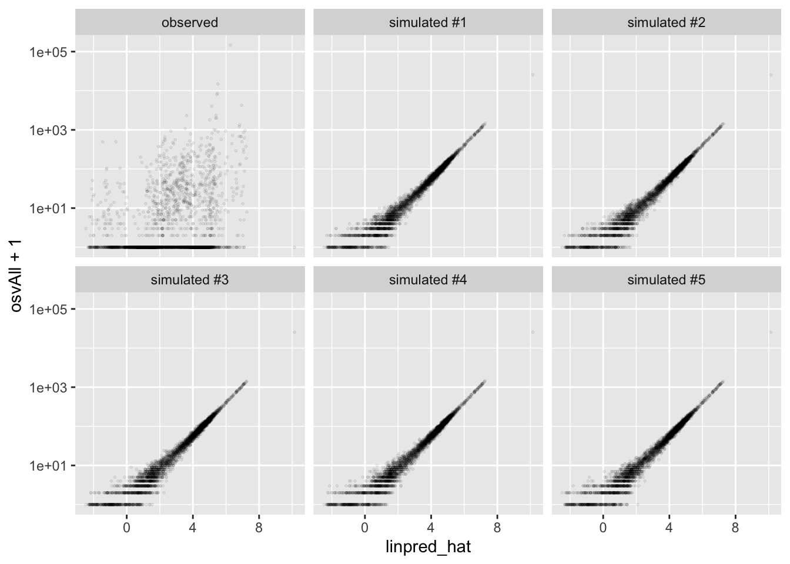

## Poisson Model

We've now got two models:

$$
y_i \sim N(\mu_i, \sigma^2)\text{, where } \mu_i = X_i\beta
$$ 

and
$$
y_i \sim \text{Bernoulli}(\pi_i)\text{, where } \pi_i = \text{logit}^{-1}(X_i\beta).
$$
We can extend this in many ways by modifying the distribution $f$ and the inverse-link function $g^{-1}$ appropriately.

$$
y_i \sim f(\theta_i)\text{, where } \theta_i = g^{-1}(X_i\beta).
$$

In the case of the normal model, $f$ and $g^{-1}$ are the normal distribution and the identity function. In the case of the logit model, they are the Bernoulli distribution and the inverse logit function. 

To build a Poisson regression model, we can use the Poisson distribution for $f$. We just need to identify an appropriate inverse-link function.

The Poisson distribution has a mean parameter $\lambda$ that must be positive. Therefore, we need a function that maps the real line to the positive (or non-negative) reals. The exponential function $g^{-1}(x) = e^x$ does this.

$$
y_i \sim \text{Poisson}(\lambda_i)\text{, where } \lambda_i = e^{X_i\beta}.
$$

We can program the log-likelihood function into R for use in `optim()`.


```r
# create log-likelihood
poisson_ll <- function(beta, y, X) {
  lambda <- exp(X%*%beta)
  ll <- sum(dpois(y, lambda = lambda, log = TRUE))
  return(ll)
}

# load hks data
hks <- read_csv("data/hks.csv") %>%
  na.omit()
```

```
## Rows: 3972 Columns: 10
## ── Column specification ────────────────────────────────────────────────────────
## Delimiter: ","
## dbl (10): osvAll, troopLag, policeLag, militaryobserversLag, brv_AllLag, osv...
## 
## ℹ Use `spec()` to retrieve the full column specification for this data.
## ℹ Specify the column types or set `show_col_types = FALSE` to quiet this message.
```

```r
# create X and y
f <- osvAll ~ troopLag + policeLag + militaryobserversLag + 
  brv_AllLag + osvAllLagDum + incomp + epduration + 
  lntpop
mf <- model.frame(f, data = hks)  # model frame
X <- model.matrix(f, mf)          # model matrix X
y <- model.response(mf)           # outcome variable y

par_start <- rep(0, ncol(X))
# this poisson model is so bad that optim has a bit of trouble 
# intutitively, there's a single outlier that basically makes
# all poissons nearly impossible.
opt <- optim(par_start, fn = poisson_ll, y = y, X = X, 
             control = list(fnscale = -1))

opt$par
```

```
## [1] -2.032493946  0.056296852 -1.000415138 -0.629900495 -0.002084798
## [6] -0.015359471  1.949812320 -0.009831003  0.357133706
```

Or we can use the `glm()` function.


```r
fit <- glm(f, data = hks, family = poisson)
coef(fit)
```

```
##          (Intercept)             troopLag            policeLag 
##         -3.579287811         -0.169658063         -3.272474092 
## militaryobserversLag           brv_AllLag         osvAllLagDum 
##          8.099848984          0.000560565          0.291144441 
##               incomp           epduration               lntpop 
##          3.486201819         -0.022230231          0.189391395
```

We could also use `stan_glm()` to obtain simulations from the posterior distribution.

### Predictive Distribution


```r
observed_data <- hks %>%
  mutate(type = "observed", 
         linpred_hat = predict(fit, type = "link"))

sim_list <- list()
for (i in 1:5) {
  sim_list[[i]] <- observed_data %>%
    mutate(osvAll = rpois(nrow(observed_data), 
                          lambda = exp(observed_data$linpred_hat)),
           type = paste0("simulated #", i))
}
gg_data <- bind_rows(sim_list) %>%
  bind_rows(observed_data) %>%
  glimpse()
```

```
## Rows: 22,476
## Columns: 12
## $ osvAll               <dbl> 320, 345, 1122, 267, 437, 199, 206, 198, 195, 177…
## $ troopLag             <dbl> 0, 0, 0, 0, 0, 0, 0, 0, 0, 0, 0, 0, 0, 0, 0, 0, 0…
## $ policeLag            <dbl> 0, 0, 0, 0, 0, 0, 0, 0, 0, 0, 0, 0, 0, 0, 0, 0, 0…
## $ militaryobserversLag <dbl> 0, 0, 0, 0, 0, 0, 0, 0, 0, 0, 0, 0, 0, 0, 0, 0, 0…
## $ brv_AllLag           <dbl> 0, 138, 2428, 30, 850, 0, 0, 0, 0, 0, 0, 0, 0, 0,…
## $ osvAllLagDum         <dbl> 1, 1, 1, 1, 1, 0, 0, 0, 0, 0, 0, 0, 0, 0, 0, 0, 0…
## $ incomp               <dbl> 2, 2, 2, 2, 2, 2, 2, 2, 2, 2, 2, 2, 2, 2, 2, 2, 2…
## $ epduration           <dbl> 2, 3, 4, 5, 6, 7, 8, 9, 10, 11, 12, 13, 14, 15, 1…
## $ lntpop               <dbl> 10.88525, 10.88525, 10.88525, 10.88525, 10.88525,…
## $ conflict_id          <dbl> 70, 70, 70, 70, 70, 70, 70, 70, 70, 70, 70, 70, 7…
## $ type                 <chr> "simulated #1", "simulated #1", "simulated #1", "…
## $ linpred_hat          <dbl> 5.701372, 5.756500, 7.017963, 5.651498, 6.088931,…
```

```r
ggplot(gg_data, aes(x = linpred_hat, y = osvAll + 1)) + 
  geom_point(alpha = 0.1, shape = 21, size = 0.3) + 
  facet_wrap(vars(type)) + 
  scale_y_log10()
```



```r
ggplot(gg_data, aes(x = troopLag, y = osvAll + 1)) + 
  geom_point(alpha = 0.3, shape = 21, size = 0.3) + 
  facet_wrap(vars(type)) + 
  scale_y_log10() + 
  geom_smooth(se = FALSE)
```

```
## `geom_smooth()` using method = 'gam' and formula 'y ~ s(x, bs = "cs")'
```


### Posterior Predictive Distribution 


```r
library(rstanarm); options(mc.cores = parallel::detectCores())
```

```
## Loading required package: Rcpp
```

```
## This is rstanarm version 2.21.1
```

```
## - See https://mc-stan.org/rstanarm/articles/priors for changes to default priors!
```

```
## - Default priors may change, so it's safest to specify priors, even if equivalent to the defaults.
```

```
## - For execution on a local, multicore CPU with excess RAM we recommend calling
```

```
##   options(mc.cores = parallel::detectCores())
```

```r
stan_fit <- stan_glm(f, data = hks, family = "poisson")

library(tidybayes)
ppd <- hks %>%
  add_predicted_draws(stan_fit, ndraws = 8) %>% 
  mutate(.draw = paste0("Draw #", .draw)) %>% 
  pivot_wider(names_from = .draw, values_from = .prediction) %>%
  mutate(`Observed` = osvAll) %>% 
  pivot_longer(`Draw #1`:`Observed`, names_to = "type", values_to = "osvAll2") %>%
  glimpse()
```

```
## Rows: 33,714
## Columns: 15
## Groups: osvAll, troopLag, policeLag, militaryobserversLag, brv_AllLag, osvAllLagDum, incomp, epduration, lntpop, conflict_id, .row [3,746]
## $ osvAll               <dbl> 4, 4, 4, 4, 4, 4, 4, 4, 4, 1, 1, 1, 1, 1, 1, 1, 1…
## $ troopLag             <dbl> 0, 0, 0, 0, 0, 0, 0, 0, 0, 0, 0, 0, 0, 0, 0, 0, 0…
## $ policeLag            <dbl> 0, 0, 0, 0, 0, 0, 0, 0, 0, 0, 0, 0, 0, 0, 0, 0, 0…
## $ militaryobserversLag <dbl> 0, 0, 0, 0, 0, 0, 0, 0, 0, 0, 0, 0, 0, 0, 0, 0, 0…
## $ brv_AllLag           <dbl> 0, 0, 0, 0, 0, 0, 0, 0, 0, 138, 138, 138, 138, 13…
## $ osvAllLagDum         <dbl> 1, 1, 1, 1, 1, 1, 1, 1, 1, 1, 1, 1, 1, 1, 1, 1, 1…
## $ incomp               <dbl> 2, 2, 2, 2, 2, 2, 2, 2, 2, 2, 2, 2, 2, 2, 2, 2, 2…
## $ epduration           <dbl> 2, 2, 2, 2, 2, 2, 2, 2, 2, 3, 3, 3, 3, 3, 3, 3, 3…
## $ lntpop               <dbl> 10.88525, 10.88525, 10.88525, 10.88525, 10.88525,…
## $ conflict_id          <dbl> 70, 70, 70, 70, 70, 70, 70, 70, 70, 70, 70, 70, 7…
## $ .row                 <int> 1, 1, 1, 1, 1, 1, 1, 1, 1, 2, 2, 2, 2, 2, 2, 2, 2…
## $ .chain               <int> NA, NA, NA, NA, NA, NA, NA, NA, NA, NA, NA, NA, N…
## $ .iteration           <int> NA, NA, NA, NA, NA, NA, NA, NA, NA, NA, NA, NA, N…
## $ type                 <chr> "Draw #1", "Draw #2", "Draw #3", "Draw #4", "Draw…
## $ osvAll2              <dbl> 326, 263, 298, 295, 276, 308, 280, 278, 4, 288, 2…
```

```r
ggplot(ppd, aes(x = troopLag, y = osvAll2 + 1)) + 
  geom_point(alpha = 0.2, shape = 21, size = 0.3) + 
  facet_wrap(vars(type)) + 
  geom_smooth(se = FALSE) + 
  scale_y_log10()
```

```
## `geom_smooth()` using method = 'gam' and formula 'y ~ s(x, bs = "cs")'
```


