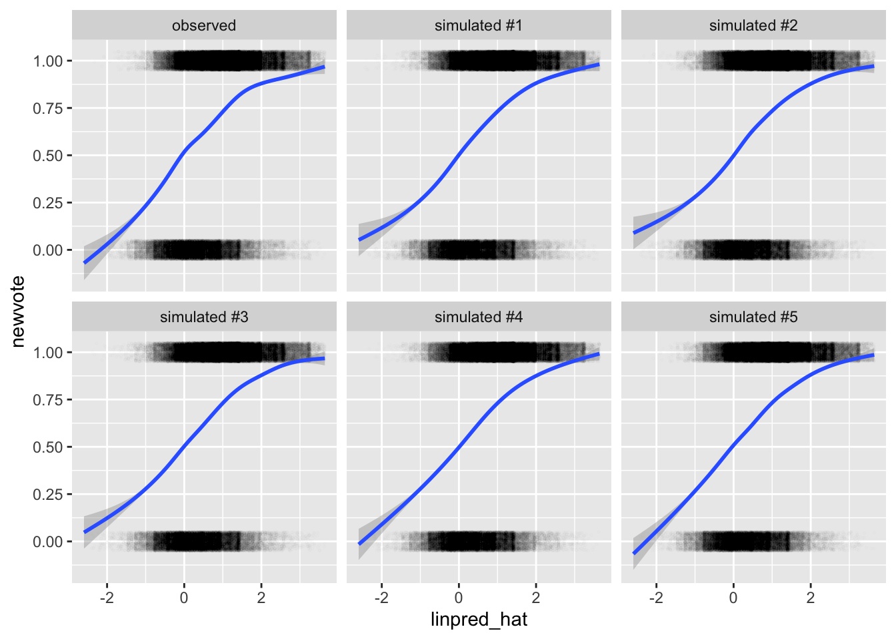
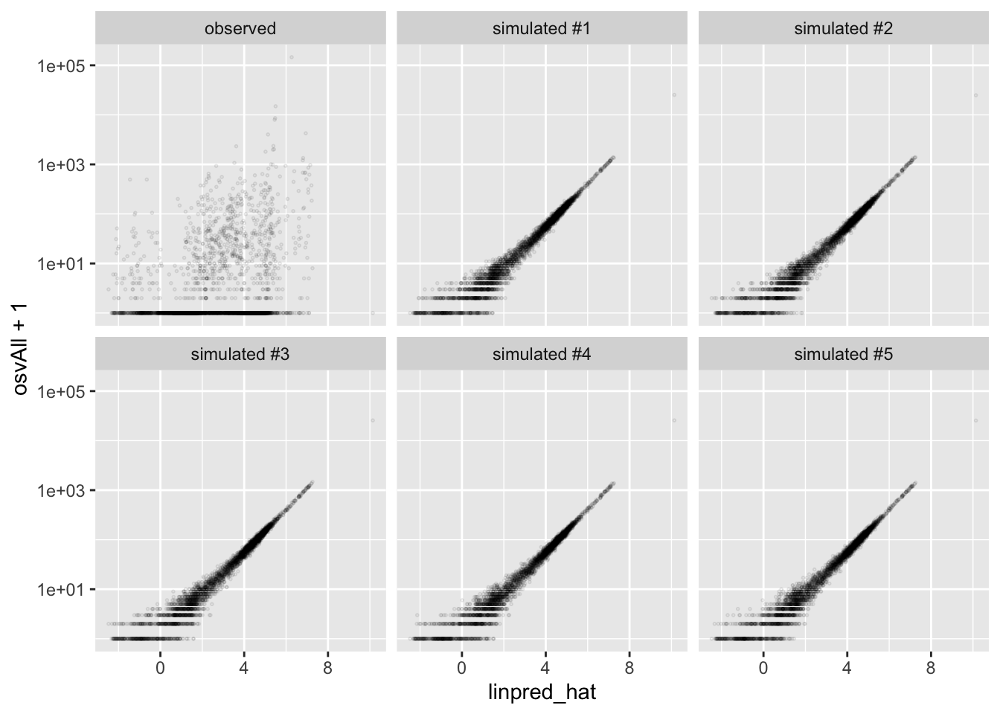
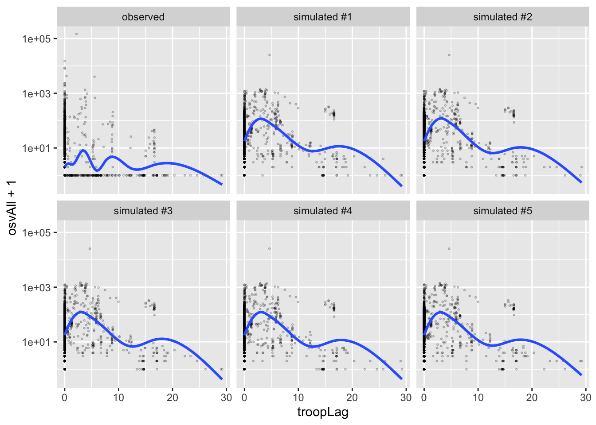

## [Posterior] Predictive Distribution

As with simple models without covariates, we can use the predictive distribution and the posterior predictive distribution to understand models *with* covariate. In fact, these tools become more valuable as the complexity of the model increases.

### ... for the logit model


```r
scobit <- haven::read_dta("data/scobit.dta") %>%
  filter(newvote != -1) %>%  # weird -1s in data; unsure if sufficient
  glimpse()
```

```
## Rows: 99,676
## Columns: 16
## $ state    <dbl> 93, 93, 93, 93, 93, 93, 93, 93, 93, 93, 93, 93, 93, 93, 93, 9…
## $ vote     <dbl> 1, 1, 2, 1, 1, 1, 2, 1, 1, 1, 1, 1, 1, 1, 1, 1, 1, 1, 1, 2, 2…
## $ age      <dbl> 60, 80, 32, 25, 55, 63, 20, 53, 49, 27, 58, 56, 34, 34, 35, 3…
## $ educ     <dbl> 13, 13, 13, 13, 11, 14, 11, 11, 13, 13, 11, 13, 19, 19, 15, 1…
## $ citizen  <dbl> 1, 1, 1, 1, 1, 1, 1, 1, 1, 1, 1, 1, 1, 1, 1, 1, 1, 1, 1, 1, 1…
## $ rweight  <dbl> 207134, 215836, 184639, 184883, 168557, 179148, 181510, 19285…
## $ south    <dbl> 0, 0, 0, 0, 0, 0, 0, 0, 0, 0, 0, 0, 0, 0, 0, 0, 0, 0, 0, 0, 0…
## $ gov      <dbl> 0, 0, 0, 0, 0, 0, 0, 0, 0, 0, 0, 0, 0, 0, 0, 0, 0, 0, 0, 0, 0…
## $ closing  <dbl> 29, 29, 29, 29, 29, 29, 29, 29, 29, 29, 29, 29, 29, 29, 29, 2…
## $ age2     <dbl> 3600, 6400, 1024, 625, 3025, 3969, 400, 2809, 2401, 729, 3364…
## $ educ2    <dbl> 25, 25, 25, 25, 16, 36, 16, 16, 25, 25, 16, 25, 64, 64, 36, 2…
## $ cloeduc  <dbl> 145, 145, 145, 145, 116, 174, 116, 116, 145, 145, 116, 145, 2…
## $ cloeduc2 <dbl> 725, 725, 725, 725, 464, 1044, 464, 464, 725, 725, 464, 725, …
## $ newvote  <dbl> 1, 1, 0, 1, 1, 1, 0, 1, 1, 1, 1, 1, 1, 1, 1, 1, 1, 1, 1, 0, 0…
## $ newage   <dbl> 0, 0, 0, 0, 0, 0, 0, 0, 0, 0, 0, 0, 0, 0, 0, 0, 0, 0, 0, 0, 0…
## $ neweduc  <dbl> 5, 5, 5, 5, 4, 6, 4, 4, 5, 5, 4, 5, 8, 8, 6, 5, 5, 3, 5, 1, 6…
```

```r
f <- newvote ~ poly(neweduc, 2, raw = TRUE) + closing + poly(age, 2, raw = TRUE) + south + gov

fit <- glm(f, data = scobit, family = "binomial")

# compute estimates of linear predictor and pi
linpred_hat <- predict(fit, type = "link")  # on scale of linear predictor
pi_hat <- predict(fit, type = "response")   # on probability scale

# put observed data into a data frame with linpred and pi ests
observed_data <- scobit %>%
  mutate(type = "observed", 
         linpred_hat = linpred_hat, 
         pi_hat = pi_hat)

# create data frames with simulated data from predictive distribution
sim_list <- list()
for (i in 1:5) {
  y_tilde <- rbinom(nrow(observed_data), size = 1, prob = pi_hat)
  sim_list[[i]] <- observed_data %>%
    mutate(newvote = y_tilde, 
           type = paste0("simulated #", i))
}

# bind data together
gg_data <- bind_rows(sim_list) %>%
  bind_rows(observed_data) %>%
  glimpse()
```

```
## Rows: 598,056
## Columns: 19
## $ state       <dbl> 93, 93, 93, 93, 93, 93, 93, 93, 93, 93, 93, 93, 93, 93, 93…
## $ vote        <dbl> 1, 1, 2, 1, 1, 1, 2, 1, 1, 1, 1, 1, 1, 1, 1, 1, 1, 1, 1, 2…
## $ age         <dbl> 60, 80, 32, 25, 55, 63, 20, 53, 49, 27, 58, 56, 34, 34, 35…
## $ educ        <dbl> 13, 13, 13, 13, 11, 14, 11, 11, 13, 13, 11, 13, 19, 19, 15…
## $ citizen     <dbl> 1, 1, 1, 1, 1, 1, 1, 1, 1, 1, 1, 1, 1, 1, 1, 1, 1, 1, 1, 1…
## $ rweight     <dbl> 207134, 215836, 184639, 184883, 168557, 179148, 181510, 19…
## $ south       <dbl> 0, 0, 0, 0, 0, 0, 0, 0, 0, 0, 0, 0, 0, 0, 0, 0, 0, 0, 0, 0…
## $ gov         <dbl> 0, 0, 0, 0, 0, 0, 0, 0, 0, 0, 0, 0, 0, 0, 0, 0, 0, 0, 0, 0…
## $ closing     <dbl> 29, 29, 29, 29, 29, 29, 29, 29, 29, 29, 29, 29, 29, 29, 29…
## $ age2        <dbl> 3600, 6400, 1024, 625, 3025, 3969, 400, 2809, 2401, 729, 3…
## $ educ2       <dbl> 25, 25, 25, 25, 16, 36, 16, 16, 25, 25, 16, 25, 64, 64, 36…
## $ cloeduc     <dbl> 145, 145, 145, 145, 116, 174, 116, 116, 145, 145, 116, 145…
## $ cloeduc2    <dbl> 725, 725, 725, 725, 464, 1044, 464, 464, 725, 725, 464, 72…
## $ newvote     <dbl> 1, 1, 1, 1, 1, 1, 0, 1, 1, 1, 1, 1, 1, 1, 1, 1, 0, 1, 1, 0…
## $ newage      <dbl> 0, 0, 0, 0, 0, 0, 0, 0, 0, 0, 0, 0, 0, 0, 0, 0, 0, 0, 0, 0…
## $ neweduc     <dbl> 5, 5, 5, 5, 4, 6, 4, 4, 5, 5, 4, 5, 8, 8, 6, 5, 5, 3, 5, 1…
## $ type        <chr> "simulated #1", "simulated #1", "simulated #1", "simulated…
## $ linpred_hat <dbl> 1.35582513, 1.33800426, 0.27569097, -0.19579006, 0.7610264…
## $ pi_hat      <dbl> 0.7950803, 0.7921616, 0.5684895, 0.4512082, 0.6815766, 0.8…
```

```r
# plot fake and obs data against linear predictor.
ggplot(gg_data, aes(x = linpred_hat, y = newvote)) + 
  geom_jitter(height = 0.05, alpha = 0.01, shape = 21, size = 0.3) + 
  facet_wrap(vars(type)) + 
  geom_smooth()
```

```
## `geom_smooth()` using method = 'gam' and formula 'y ~ s(x, bs = "cs")'
```



```r
# plot fake and obs data against age.
ggplot(gg_data, aes(x = age, y = newvote)) + 
  geom_jitter(height = 0.05, alpha = 0.01, shape = 21, size = 0.3) + 
  facet_wrap(vars(type)) + 
  geom_smooth(se = FALSE)
```

```
## `geom_smooth()` using method = 'gam' and formula 'y ~ s(x, bs = "cs")'
```


This model, because we included a second-order polynomial for `age`, does a great job of picking up the nonlinear relationship between age and voting. If we replace the polynomial with a simple linear term, then the observed and predictive distributions show a stark dissimilarity.


```r
f <- newvote ~ poly(neweduc, 2, raw = TRUE) + closing + age + south + gov
fit <- glm(f, data = scobit, family = "binomial")

observed_data <- scobit %>%
  mutate(type = "observed", 
         linpred_hat = predict(fit, type = "link"))

sim_list <- list()
for (i in 1:5) {
  y_tilde <- rbinom(nrow(observed_data), size = 1, prob = plogis(observed_data$linpred_hat))
  sim_list[[i]] <- observed_data %>%
    mutate(newvote = y_tilde, 
           type = paste0("simulated #", i))
}
gg_data <- bind_rows(sim_list) %>%
  bind_rows(observed_data) %>%
  glimpse()
```

```
## Rows: 598,056
## Columns: 18
## $ state       <dbl> 93, 93, 93, 93, 93, 93, 93, 93, 93, 93, 93, 93, 93, 93, 93…
## $ vote        <dbl> 1, 1, 2, 1, 1, 1, 2, 1, 1, 1, 1, 1, 1, 1, 1, 1, 1, 1, 1, 2…
## $ age         <dbl> 60, 80, 32, 25, 55, 63, 20, 53, 49, 27, 58, 56, 34, 34, 35…
## $ educ        <dbl> 13, 13, 13, 13, 11, 14, 11, 11, 13, 13, 11, 13, 19, 19, 15…
## $ citizen     <dbl> 1, 1, 1, 1, 1, 1, 1, 1, 1, 1, 1, 1, 1, 1, 1, 1, 1, 1, 1, 1…
## $ rweight     <dbl> 207134, 215836, 184639, 184883, 168557, 179148, 181510, 19…
## $ south       <dbl> 0, 0, 0, 0, 0, 0, 0, 0, 0, 0, 0, 0, 0, 0, 0, 0, 0, 0, 0, 0…
## $ gov         <dbl> 0, 0, 0, 0, 0, 0, 0, 0, 0, 0, 0, 0, 0, 0, 0, 0, 0, 0, 0, 0…
## $ closing     <dbl> 29, 29, 29, 29, 29, 29, 29, 29, 29, 29, 29, 29, 29, 29, 29…
## $ age2        <dbl> 3600, 6400, 1024, 625, 3025, 3969, 400, 2809, 2401, 729, 3…
## $ educ2       <dbl> 25, 25, 25, 25, 16, 36, 16, 16, 25, 25, 16, 25, 64, 64, 36…
## $ cloeduc     <dbl> 145, 145, 145, 145, 116, 174, 116, 116, 145, 145, 116, 145…
## $ cloeduc2    <dbl> 725, 725, 725, 725, 464, 1044, 464, 464, 725, 725, 464, 72…
## $ newvote     <dbl> 1, 0, 0, 0, 0, 0, 0, 0, 1, 1, 1, 1, 1, 1, 1, 1, 0, 1, 1, 0…
## $ newage      <dbl> 0, 0, 0, 0, 0, 0, 0, 0, 0, 0, 0, 0, 0, 0, 0, 0, 0, 0, 0, 0…
## $ neweduc     <dbl> 5, 5, 5, 5, 4, 6, 4, 4, 5, 5, 4, 5, 8, 8, 6, 5, 5, 3, 5, 1…
## $ type        <chr> "simulated #1", "simulated #1", "simulated #1", "simulated…
## $ linpred_hat <dbl> 1.227725576, 1.973989420, 0.182956194, -0.078236152, 0.510…
```

```r
ggplot(gg_data, aes(x = age, y = newvote)) + 
  geom_jitter(height = 0.05, alpha = 0.01, shape = 21, size = 0.3) + 
  facet_wrap(vars(type)) + 
  geom_smooth(se = FALSE)
```

```
## `geom_smooth()` using method = 'gam' and formula 'y ~ s(x, bs = "cs")'
```


We can do this same thing with Stan. However, working with the posterior simulations can be tricky. I use tidybayes `add_predicted_draws()` function along with some clever pivoting to get the data ready for `ggplot()`.


```r
library(rstanarm); options(mc.cores = parallel::detectCores())
```

```
## Loading required package: Rcpp
```

```
## This is rstanarm version 2.21.1
```

```
## - See https://mc-stan.org/rstanarm/articles/priors for changes to default priors!
```

```
## - Default priors may change, so it's safest to specify priors, even if equivalent to the defaults.
```

```
## - For execution on a local, multicore CPU with excess RAM we recommend calling
```

```
##   options(mc.cores = parallel::detectCores())
```

```r
small_scobit <- sample_n(scobit, 1000)  # subsample b/c model is slow
stan_fit <- stan_glm(f, data = small_scobit, family = "binomial")
```


```r
library(tidybayes)

ppd <- small_scobit %>%
  add_predicted_draws(stan_fit, ndraws = 8) %>%
  mutate(.draw = paste0("Draw #", .draw)) %>% 
  pivot_wider(names_from = .draw, values_from = .prediction) %>%
  mutate(`Observed` = newvote) %>% 
  pivot_longer(`Draw #1`:`Observed`, names_to = "type", values_to = "newvote2") %>%
  glimpse()
```

```
## Rows: 9,000
## Columns: 21
## Groups: state, vote, age, educ, citizen, rweight, south, gov, closing, age2, educ2, cloeduc, cloeduc2, newvote, newage, neweduc, .row [1,000]
## $ state      <dbl> 14, 14, 14, 14, 14, 14, 14, 14, 14, 71, 71, 71, 71, 71, 71,…
## $ vote       <dbl> 2, 2, 2, 2, 2, 2, 2, 2, 2, 1, 1, 1, 1, 1, 1, 1, 1, 1, 1, 1,…
## $ age        <dbl> 52, 52, 52, 52, 52, 52, 52, 52, 52, 27, 27, 27, 27, 27, 27,…
## $ educ       <dbl> 12, 12, 12, 12, 12, 12, 12, 12, 12, 15, 15, 15, 15, 15, 15,…
## $ citizen    <dbl> 1, 1, 1, 1, 1, 1, 1, 1, 1, 1, 1, 1, 1, 1, 1, 1, 1, 1, 1, 1,…
## $ rweight    <dbl> 95264, 95264, 95264, 95264, 95264, 95264, 95264, 95264, 952…
## $ south      <dbl> 0, 0, 0, 0, 0, 0, 0, 0, 0, 0, 0, 0, 0, 0, 0, 0, 0, 0, 1, 1,…
## $ gov        <dbl> 0, 0, 0, 0, 0, 0, 0, 0, 0, 1, 1, 1, 1, 1, 1, 1, 1, 1, 0, 0,…
## $ closing    <dbl> 28, 28, 28, 28, 28, 28, 28, 28, 28, 20, 20, 20, 20, 20, 20,…
## $ age2       <dbl> 2704, 2704, 2704, 2704, 2704, 2704, 2704, 2704, 2704, 729, …
## $ educ2      <dbl> 16, 16, 16, 16, 16, 16, 16, 16, 16, 36, 36, 36, 36, 36, 36,…
## $ cloeduc    <dbl> 112, 112, 112, 112, 112, 112, 112, 112, 112, 120, 120, 120,…
## $ cloeduc2   <dbl> 448, 448, 448, 448, 448, 448, 448, 448, 448, 720, 720, 720,…
## $ newvote    <dbl> 0, 0, 0, 0, 0, 0, 0, 0, 0, 1, 1, 1, 1, 1, 1, 1, 1, 1, 1, 1,…
## $ newage     <dbl> 0, 0, 0, 0, 0, 0, 0, 0, 0, 0, 0, 0, 0, 0, 0, 0, 0, 0, 0, 0,…
## $ neweduc    <dbl> 4, 4, 4, 4, 4, 4, 4, 4, 4, 6, 6, 6, 6, 6, 6, 6, 6, 6, 5, 5,…
## $ .row       <int> 1, 1, 1, 1, 1, 1, 1, 1, 1, 2, 2, 2, 2, 2, 2, 2, 2, 2, 3, 3,…
## $ .chain     <int> NA, NA, NA, NA, NA, NA, NA, NA, NA, NA, NA, NA, NA, NA, NA,…
## $ .iteration <int> NA, NA, NA, NA, NA, NA, NA, NA, NA, NA, NA, NA, NA, NA, NA,…
## $ type       <chr> "Draw #1", "Draw #2", "Draw #3", "Draw #4", "Draw #5", "Dra…
## $ newvote2   <dbl> 0, 0, 1, 0, 1, 0, 1, 1, 0, 0, 0, 0, 0, 1, 1, 0, 0, 1, 1, 0,…
```

```r
ggplot(ppd, aes(x = age, y = newvote2)) + 
  geom_jitter(height = 0.15, alpha = 0.2, shape = 21, size = 0.3) + 
  facet_wrap(vars(type)) + 
  geom_smooth(se = FALSE)
```

```
## `geom_smooth()` using method = 'gam' and formula 'y ~ s(x, bs = "cs")'
```


### ... for the Poisson model

The code below repeated this exercise for the Poisson model using the HKS data.


```r
# load hks data
hks <- read_csv("data/hks.csv") %>%
  na.omit()
```

```
## Rows: 3972 Columns: 10
## ── Column specification ────────────────────────────────────────────────────────
## Delimiter: ","
## dbl (10): osvAll, troopLag, policeLag, militaryobserversLag, brv_AllLag, osv...
## 
## ℹ Use `spec()` to retrieve the full column specification for this data.
## ℹ Specify the column types or set `show_col_types = FALSE` to quiet this message.
```

```r
# fit poisson model
f <- osvAll ~ troopLag + policeLag + militaryobserversLag + 
  brv_AllLag + osvAllLagDum + incomp + epduration + 
  lntpop
fit <- glm(f, data = hks, family = poisson)

# simulate fake data from predictive distribution
observed_data <- hks %>%
  mutate(type = "observed", 
         linpred_hat = predict(fit, type = "link"))
sim_list <- list()
for (i in 1:5) {
  sim_list[[i]] <- observed_data %>%
    mutate(osvAll = rpois(nrow(observed_data), 
                          lambda = exp(observed_data$linpred_hat)),
           type = paste0("simulated #", i))
}
gg_data <- bind_rows(sim_list) %>%
  bind_rows(observed_data) %>%
  glimpse()
```

```
## Rows: 22,476
## Columns: 12
## $ osvAll               <dbl> 298, 337, 1068, 284, 411, 215, 207, 190, 182, 211…
## $ troopLag             <dbl> 0, 0, 0, 0, 0, 0, 0, 0, 0, 0, 0, 0, 0, 0, 0, 0, 0…
## $ policeLag            <dbl> 0, 0, 0, 0, 0, 0, 0, 0, 0, 0, 0, 0, 0, 0, 0, 0, 0…
## $ militaryobserversLag <dbl> 0, 0, 0, 0, 0, 0, 0, 0, 0, 0, 0, 0, 0, 0, 0, 0, 0…
## $ brv_AllLag           <dbl> 0, 138, 2428, 30, 850, 0, 0, 0, 0, 0, 0, 0, 0, 0,…
## $ osvAllLagDum         <dbl> 1, 1, 1, 1, 1, 0, 0, 0, 0, 0, 0, 0, 0, 0, 0, 0, 0…
## $ incomp               <dbl> 2, 2, 2, 2, 2, 2, 2, 2, 2, 2, 2, 2, 2, 2, 2, 2, 2…
## $ epduration           <dbl> 2, 3, 4, 5, 6, 7, 8, 9, 10, 11, 12, 13, 14, 15, 1…
## $ lntpop               <dbl> 10.88525, 10.88525, 10.88525, 10.88525, 10.88525,…
## $ conflict_id          <dbl> 70, 70, 70, 70, 70, 70, 70, 70, 70, 70, 70, 70, 7…
## $ type                 <chr> "simulated #1", "simulated #1", "simulated #1", "…
## $ linpred_hat          <dbl> 5.701372, 5.756500, 7.017963, 5.651498, 6.088931,…
```

```r
# plot fake and observed data against linear predictor
ggplot(gg_data, aes(x = linpred_hat, y = osvAll + 1)) + 
  geom_point(alpha = 0.1, shape = 21, size = 0.3) + 
  facet_wrap(vars(type)) + 
  scale_y_log10()
```



```r
# plot fake and observed data against number of troops
ggplot(gg_data, aes(x = troopLag, y = osvAll + 1)) + 
  geom_point(alpha = 0.3, shape = 21, size = 0.3) + 
  facet_wrap(vars(type)) + 
  scale_y_log10() + 
  geom_smooth(se = FALSE)
```

```
## `geom_smooth()` using method = 'gam' and formula 'y ~ s(x, bs = "cs")'
```



And below is code to work with the posterior predictive distribution.


```r
stan_fit <- stan_glm(f, data = hks, family = "poisson", chains = 1)
```


```r
ppd <- hks %>%
  add_predicted_draws(stan_fit, ndraws = 8) %>% 
  mutate(.draw = paste0("Draw #", .draw)) %>% 
  pivot_wider(names_from = .draw, values_from = .prediction) %>%
  mutate(`Observed` = osvAll) %>% 
  pivot_longer(`Draw #1`:`Observed`, names_to = "type", values_to = "osvAll2") %>%
  glimpse()
```

```
## Rows: 33,714
## Columns: 15
## Groups: osvAll, troopLag, policeLag, militaryobserversLag, brv_AllLag, osvAllLagDum, incomp, epduration, lntpop, conflict_id, .row [3,746]
## $ osvAll               <dbl> 4, 4, 4, 4, 4, 4, 4, 4, 4, 1, 1, 1, 1, 1, 1, 1, 1…
## $ troopLag             <dbl> 0, 0, 0, 0, 0, 0, 0, 0, 0, 0, 0, 0, 0, 0, 0, 0, 0…
## $ policeLag            <dbl> 0, 0, 0, 0, 0, 0, 0, 0, 0, 0, 0, 0, 0, 0, 0, 0, 0…
## $ militaryobserversLag <dbl> 0, 0, 0, 0, 0, 0, 0, 0, 0, 0, 0, 0, 0, 0, 0, 0, 0…
## $ brv_AllLag           <dbl> 0, 0, 0, 0, 0, 0, 0, 0, 0, 138, 138, 138, 138, 13…
## $ osvAllLagDum         <dbl> 1, 1, 1, 1, 1, 1, 1, 1, 1, 1, 1, 1, 1, 1, 1, 1, 1…
## $ incomp               <dbl> 2, 2, 2, 2, 2, 2, 2, 2, 2, 2, 2, 2, 2, 2, 2, 2, 2…
## $ epduration           <dbl> 2, 2, 2, 2, 2, 2, 2, 2, 2, 3, 3, 3, 3, 3, 3, 3, 3…
## $ lntpop               <dbl> 10.88525, 10.88525, 10.88525, 10.88525, 10.88525,…
## $ conflict_id          <dbl> 70, 70, 70, 70, 70, 70, 70, 70, 70, 70, 70, 70, 7…
## $ .row                 <int> 1, 1, 1, 1, 1, 1, 1, 1, 1, 2, 2, 2, 2, 2, 2, 2, 2…
## $ .chain               <int> NA, NA, NA, NA, NA, NA, NA, NA, NA, NA, NA, NA, N…
## $ .iteration           <int> NA, NA, NA, NA, NA, NA, NA, NA, NA, NA, NA, NA, N…
## $ type                 <chr> "Draw #1", "Draw #2", "Draw #3", "Draw #4", "Draw…
## $ osvAll2              <dbl> 285, 306, 328, 311, 314, 300, 302, 301, 4, 313, 3…
```

```r
ggplot(ppd, aes(x = troopLag, y = osvAll2 + 1)) + 
  geom_point(alpha = 0.2, shape = 21, size = 0.3) + 
  facet_wrap(vars(type)) + 
  geom_smooth(se = FALSE) + 
  scale_y_log10()
```

```
## `geom_smooth()` using method = 'gam' and formula 'y ~ s(x, bs = "cs")'
```


