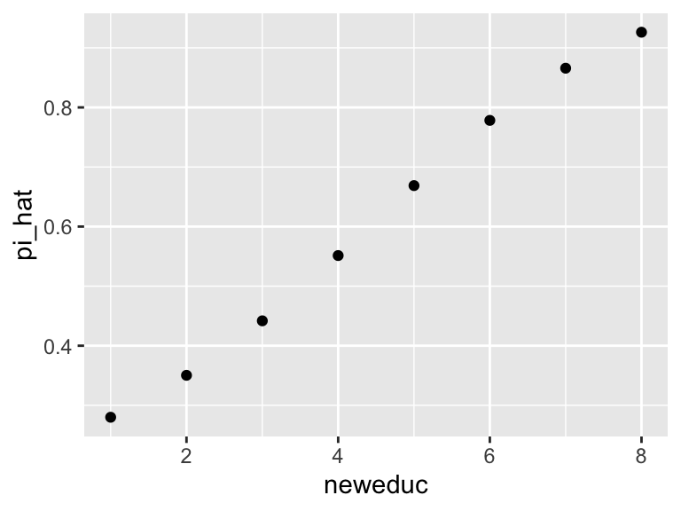

## Quantities of Interest

We've now got three models:

1. the normal model
1. the logit model
1. the Poisson model

In only the case of the normal distribution are the parameters directly interpretable. The meaning of the coefficients in the case of the logit and Poisson model is especially unclear.

Thus, we are interested not in the coefficients themselves, but in other "quantities of interest."

### Expected Value

The first quantity of interest is the **expected value** $E(y \mid X_s)$. 

Imagine a particular scenario of interest $X_s$. For the logit model, we can compute the expected value of $y$ for that scenario using $\hat{E}(y \mid X_p) = \hat{\pi}_s = \text{logit}^{-1}(X_s\hat{\beta})$. For the Poisson model, it's $\hat{E}(y \mid X_p) = \hat{\lambda}_s = e^{X_s\hat{\beta}}$. 

Let's see how this would work with the scobit data.


```r
scobit <- haven::read_dta("data/scobit.dta") %>%
  filter(newvote != -1) 

f <- newvote ~ poly(neweduc, 2, raw = TRUE) + closing + poly(age, 2, raw = TRUE) + south + gov
fit <- glm(f, data = scobit, family = binomial)
```

First, let's create the scenario of interest.


```r
# create the scenario of interest X_s (but a data frame)

scenario <- tibble(
  neweduc = median(scobit$neweduc),
  closing = median(scobit$closing),
  age = median(scobit$age),
  south = median(scobit$south),
  gov = median(scobit$gov)) %>%
  glimpse()
```

```
## Rows: 1
## Columns: 5
## $ neweduc <dbl> 5
## $ closing <dbl> 30
## $ age     <dbl> 40
## $ south   <dbl> 0
## $ gov     <dbl> 0
```

```r
# now use the predict() function to get pi_hat
pi_hat <- predict(fit, newdata = scenario, type = "response")
```

So when all the $x$s are set to their median, the estimated probability of voting is `pi_hat`.

We could all compute the expected value for all values of a single variable with other variables set to their median.


```r
scenarios <- tibble(
  neweduc = sort(unique(scobit$neweduc)),
  closing = median(scobit$closing),
  age = median(scobit$age),
  south = median(scobit$south),
  gov = median(scobit$gov)) %>%
  glimpse()
```

```
## Rows: 8
## Columns: 5
## $ neweduc <dbl> 1, 2, 3, 4, 5, 6, 7, 8
## $ closing <dbl> 30, 30, 30, 30, 30, 30, 30, 30
## $ age     <dbl> 40, 40, 40, 40, 40, 40, 40, 40
## $ south   <dbl> 0, 0, 0, 0, 0, 0, 0, 0
## $ gov     <dbl> 0, 0, 0, 0, 0, 0, 0, 0
```

```r
scenarios$pi_hat <- predict(fit, newdata = scenarios, type = "response")

ggplot(scenarios, aes(x = neweduc, y = pi_hat))+
  geom_point()
```



### First Difference

Perhaps the most important quantity of interest, though, is the **first difference**. Imagine *two* scenario of interest $X_{lo}$ and $X_{hi}$. We then compute the *difference* $\Delta$ between the expected values $X_{lo}$ and $X_{hi}$, so that $\hat{\Delta} = \hat{E}(y \mid X_{hi}) -  \hat{E}(y \mid X_{lo})$. This works for (almost?) all models we'll see in this course.


```r
lo_scenario <- tibble(
  neweduc = quantile(scobit$neweduc, 0.10), # 25th percentile
  closing = median(scobit$closing),
  age = median(scobit$age),
  south = median(scobit$south),
  gov = median(scobit$gov)) %>%
  glimpse()
```

```
## Rows: 1
## Columns: 5
## $ neweduc <dbl> 3
## $ closing <dbl> 30
## $ age     <dbl> 40
## $ south   <dbl> 0
## $ gov     <dbl> 0
```

```r
hi_scenario <- tibble(
  neweduc = quantile(scobit$neweduc, 0.90), # 75th percentile
  closing = median(scobit$closing),
  age = median(scobit$age),
  south = median(scobit$south),
  gov = median(scobit$gov)) %>%
  glimpse()
```

```
## Rows: 1
## Columns: 5
## $ neweduc <dbl> 7
## $ closing <dbl> 30
## $ age     <dbl> 40
## $ south   <dbl> 0
## $ gov     <dbl> 0
```

```r
fd_hat <- predict(fit, newdata = hi_scenario, type = "response") - 
  predict(fit, newdata = lo_scenario, type = "response")
print(fd_hat)
```

```
##         1 
## 0.4240654
```

This shows that if we move education from it minimum value (1) to its maximum value (8), the expected value goes up by 0.70. Since the expected value here is a probability, we can say that the chance of voting goes up by 42 percentage points (from 44% to 87%).
